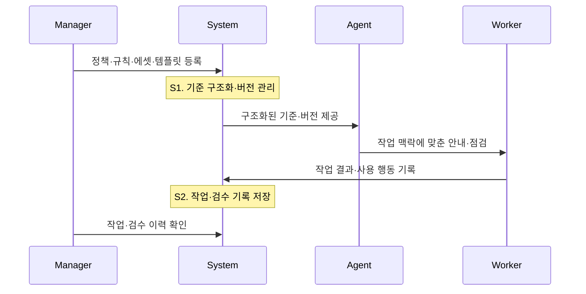
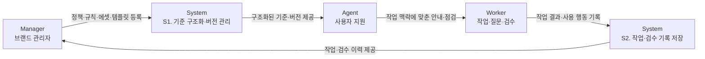

# 01. 제품

## 1. 제품 정의

이 제품의 목표는 작업 과정에서 필요한 기준을 적시에 안내하고, 사용 기록과 검수 기록을 운영자가 확인할 수 있는 디지털 가이드라인을 만드는 것입니다.

정책과 규칙은 문서에서 끝나지 않고, 실제 작업 과정에서 Agent를 통해 활용되며, 작업 기록과 검수 기록으로 관리됩니다.

이 문서에서 기준은 정책과 규칙을 함께 가리키는 말입니다.
정책은 브랜드가 지켜야 하는 상위 원칙이고, 규칙은 정책을 실제 작업에서 확인할 수 있게 낮춘 판단 단위입니다.

## 2. 현 상황의 문제점

문제는 가이드라인이 디지털 운영 체계로 작동하지 않는다는 점입니다.
가이드라인은 존재하지만 구조화되어 있지 않고, 실제 작업 과정과 검수 이력에 연결되지 않습니다.

### 구조화되지 않은 가이드라인 자산 관리

현재 브랜드 가이드라인은 PDF, PPT, 문서와 같은 정적 파일로 관리됩니다.

이 방식에서는 가이드라인을 운영 가능한 데이터로 활용하기 어렵습니다.

- 최신 버전을 확인하기 어렵습니다.
- 변경 이력과 의사결정 과정이 체계적으로 관리되지 않습니다.
- 정책과 규칙의 추가·수정 이유를 추적하기 어렵습니다.
- 문서가 사람 중심으로 작성되어 System이나 Agent가 바로 활용하기 어렵습니다.
- 디지털 서비스에 적용하려면 별도의 해석 과정이 필요합니다.

가이드라인은 운영 자산이 아니라 관리 대상 문서로 인식되고 있습니다.

### 실제 운영 과정과의 단절

브랜드 가이드라인은 제작 단계에서 정의되지만, 실제 운영 과정과는 충분히 연결되지 않습니다.

실제 서비스는 일정과 실행 속도를 우선하기 때문에 가이드라인 확인과 검수 기록 관리가 뒤로 밀리는 경우가 많습니다.

- 어떤 규칙이 위반되었는지 작업 맥락과 함께 확인하기 어렵습니다.
- 예외 상황과 검수 결과가 체계적으로 기록되지 않습니다.
- 실제 산출물에서 발생한 문제를 기준과 연결해 보기 어렵습니다.
- 운영 기준이 바뀌어도 가이드라인 반영은 늦어집니다.

결과적으로 가이드라인은 실제 운영을 따라가지 못하고 시간이 지날수록 활용도가 낮아집니다.

### 공급자와 사용자를 연결하는 운영 구조 부재

브랜드 디자이너는 가이드라인을 설계하고, 현업 디자이너와 마케터는 이를 사용합니다.

하지만 두 집단 사이에는 기준 사용과 검수 상태를 함께 확인할 운영 구조가 부족합니다.

- 브랜드 디자이너는 사용자가 어디에서 어려움을 겪는지 파악하기 어렵습니다.
- 사용자는 규칙의 의도나 적용 방법을 확인하기 어렵습니다.
- 작업 질문과 검수 결과가 기준과 함께 관리되지 않습니다.
- 현장의 작업 기록을 운영자가 확인하기 어렵습니다.

가이드라인은 일방향 전달에 머물고, 실제 사용 과정과 함께 운영되기 어려운 상황입니다.

## 3. 서비스 흐름

서비스 목표는 가이드라인이 실제 작업에 자주 쓰이고, 작업 기록과 검수 기록이 운영자가 확인할 수 있는 상태로 남는 구조를 만드는 것입니다.

### 참여자 흐름

서비스 흐름은 네 참여자의 흐름으로 봅니다.
Manager, System, Agent, Worker가 각각 하나의 축이 되고, 시간은 위에서 아래로 흐릅니다.

S1과 S2는 같은 System의 서로 다른 역할입니다.
S1은 발행된 기준을 사용자에게 제공하기 위한 역할이고, S2는 사용자가 남긴 작업과 검수 기록을 보관하는 역할입니다.
Agent는 작업 상황에 맞는 안내와 점검을 제공하는 제품 기능입니다.

### 운영 구조

같은 흐름을 운영 구조로 보면 다음과 같습니다.
이 다이어그램은 발행된 가이드라인이 작업 지원과 검수 기록으로 이어지는 구조를 보여줍니다.

### 참여자 역할

| 참여자 | 역할 |
| --- | --- |
| Manager | 정책, 규칙, 에셋, 템플릿을 관리하고 최종 의사결정을 담당합니다. |
| System | 기준을 구조화하고, 버전과 사용 기록을 관리합니다. |
| Agent | 작업 상황에 맞는 가이드와 점검을 제공합니다. |
| Worker | 가이드를 활용해 작업하고, 질문과 검수 결과를 남깁니다. |

### 흐름별 기록

| 흐름 | 액터 | 남는 기록 | 다음 액터가 하는 일 |
| --- | --- | --- | --- |
| Manager -> System | Manager | 정책, 규칙, 에셋, 템플릿, 버전 | System은 기준을 구조화하고 적용 범위를 연결합니다. |
| System -> Agent | System | 구조화된 기준, 어플리케이션 타입, 버전 참조 | Agent는 작업 맥락에 맞는 안내와 점검 기준을 만듭니다. |
| Agent -> Worker | Agent | 실행 가이드, 점검 결과, 수정 지시 | Worker는 안내를 보고 작업하고 검수합니다. |
| Worker -> System | Worker | 작업 결과, 질문, 검수 결과, 화면 행동 기록 | System은 작업과 검수 이력을 저장합니다. |
| Manager -> System | Manager | 작업 이력 조회 조건, 검수 이력 조회 조건 | System은 운영자가 확인할 기록을 제공합니다. |

### 사용자 지원

Agent는 구조화된 가이드라인을 사용자의 현재 작업에 필요한 안내로 변환합니다.

| 구분 | Agent가 전달하는 정보 |
| --- | --- |
| 작업 기준 | 선택한 어플리케이션 타입에 필요한 정책, 규칙, 에셋, 템플릿 |
| 실행 안내 | 지금 작업에서 지켜야 할 필수 조건과 금지 조건 |
| 점검 결과 | 통과, 주의, 실패, 사람 검토 필요 여부 |
| 수정 지시 | 어디를 어떻게 고쳐야 하는지에 대한 구체적인 안내 |
| 근거 | Agent가 참고한 정책, 규칙, 버전 |

### 사용 기록 조회

System은 검수 결과뿐 아니라 사용자가 가이드라인을 탐색하고 이해하는 과정도 함께 기록합니다.

| 구분 | System에 남는 기록 | 운영자가 확인하는 정보 |
| --- | --- | --- |
| 작업 결과 | 정책/규칙 위반 사항, 산출물 점검 결과, 검수 실패 사유, 수정 이력, 질문 사항 | 작업 흐름과 검수 이력 |
| 사용 행동 | 조회한 항목, 체류한 구간, 다운로드한 에셋 | 화면 행동과 자원 사용 기록 |

이 정보가 쌓이면 Manager는 작업 흐름과 검수 이력을 운영 조회 화면에서 확인할 수 있습니다.

## 4. 사용자 문제 정의

이 제품의 핵심 사용자는 브랜드 기준을 지키고 싶지만, 기준을 찾고 적용하는 과정에서 어려움을 겪는 사람입니다.

### 주요 사용자

| 항목 | 내용 |
| --- | --- |
| 사용자 | 현장 작업자 |
| 역할 | 매장, 행사장, 현장 운영에 필요한 안내물과 홍보물을 제작합니다. |
| 업무 환경 | 제한된 시간 안에 결과물을 만들어야 합니다. |
| 현재 한계 | 작업에 필요한 기준을 찾고 적용하기 어렵습니다. |
| 주요 손실 | 검수 실패, 재작업, Manager와의 반복 커뮤니케이션 |

이 사용자는 브랜드 기준을 무시하려는 것이 아닙니다.
필요한 기준을 빠르게 찾기 어렵고, 현재 작업에 어떻게 적용해야 하는지 판단하기 어렵습니다.

### 사용자가 겪는 문제

| 문제 | 실제 상황 |
| --- | --- |
| 기준 적용의 어려움 | 추상적인 표현을 실제 작업 지시로 바꾸기 어렵습니다. |
| 필요한 기준 탐색의 어려움 | 전체 가이드라인에서 현재 작업에 필요한 내용만 골라내야 합니다. |
| 선택 부담 | 어떤 색상, 이미지, 레이아웃을 선택해야 하는지 판단해야 합니다. |
| 검수 전 불확실성 | 현재 결과물이 기준에 맞는지 알기 어렵습니다. |
| 수정 안내 적용의 어려움 | 수정 권장을 보고도 무엇을 수정해야 하는지 모를 수 있습니다. |

사용자가 실제로 궁금한 것은 가이드라인 자체가 아닙니다.

- 이 템플릿을 사용해도 되는가?
- 이 이미지를 사용해도 되는가?
- 이 로고 위치가 맞는가?
- 지금 검수해도 되는가?
- 수정해야 한다면 무엇을 고쳐야 하는가?

사용자는 가이드라인을 더 많이 읽고 싶은 것이 아닙니다.
현재 작업에서 무엇을 해야 하는지 알고 싶어 합니다.

## 5. 핵심 가설

사용자는 가이드라인을 읽고 해석하는 방식보다, 현재 작업에 필요한 기준을 바로 안내받고 점검받는 방식을 선호할 것입니다.

이를 검증하기 위해 다음 가설을 확인합니다.

### 구체적인 작업 지시와 수행률

추상적인 설명보다 바로 적용할 수 있는 작업 지시가 사용자의 수행률을 높일 것입니다.

주요 지표

- 검수 실패율
- 재작업 횟수
- 자가 수행 가능성 응답

### 선택지 축소와 오류 감소

사용자가 직접 판단해야 하는 선택지가 줄어들수록 오류와 위반이 감소할 것입니다.

주요 지표

- 규칙 위반 항목 수
- 템플릿 이탈률
- 검수 통과율
- 작업 완료 시간

### 검수 전 점검과 재작업 비용

사용자는 가이드라인 설명보다 검수 통과 가능성을 확인받는 것에 더 큰 가치를 느낄 것입니다.

주요 지표

- 검수 전 수정 완료율
- 재검수 통과율
- Manager 개입 감소율

### 수정 안내 적용 비용 감소

검수 실패 사유와 수정 방법을 함께 제공하면 작업자가 수정 안내를 적용하는 비용이 줄어들 것입니다.

주요 지표

- 같은 오류 재발률
- 작업자 재질문 수
- 수정 소요 시간

## 6. 제공 서비스

이 제품은 현장 작업자가 정책과 규칙을 직접 해석하지 않아도 작업을 완료할 수 있게 돕습니다.

| Service | Description |
| --- | --- |
| 어플리케이션 타입 선택 | 사용자가 만들 산출물 유형을 먼저 고릅니다. |
| 템플릿 추천 | 선택한 어플리케이션 타입에 허용된 템플릿만 보여줍니다. |
| 제한된 입력 폼 | 템플릿에 필요한 텍스트, 이미지, 선택값만 입력하게 합니다. |
| 검수 전 점검 | 입력값과 작업물이 규칙을 충족하는지 확인합니다. |
| 쉬운 수정 지시 | 사용자가 어디를 어떻게 고쳐야 하는지 알려줍니다. |
| 운영 기록 조회 | 작업, 답변, 검수, 화면 행동 기록을 운영자가 확인합니다. |

## 7. 제공되는 가치

### Worker 가치

- 어떤 템플릿을 사용해야 할지 빠르게 판단할 수 있습니다.
- 검수 전에 문제를 확인하고 수정할 수 있습니다.
- 수정 안내만 보고도 스스로 수정할 수 있습니다.
- 디자인 용어나 브랜드 규칙을 잘 몰라도 기준에 맞는 결과물을 만들 수 있습니다.

### Manager 가치

- 같은 수정 안내를 반복해서 작성하는 시간을 줄일 수 있습니다.
- 검수 실패 사유를 정책과 규칙에 연결해 관리할 수 있습니다.
- 검수 실패 사유를 기준과 함께 확인할 수 있습니다.
- 가이드라인을 문서가 아닌 운영 체계로 관리할 수 있습니다.

### 제품 가치

- 사용자가 가이드라인을 직접 해석하지 않아도 작업을 수행할 수 있습니다.
- 질문, 점검 결과, 검수 실패 사유를 운영 기록으로 남길 수 있습니다.
- 실제 사용 데이터를 바탕으로 작업 흐름과 검수 상태를 확인할 수 있습니다.
- 가이드라인이 작성 후 방치되는 문서가 아니라 운영 과정에서 조회되는 시스템이 됩니다.

## 8. 다음 문서에서 정의할 것

이 문서는 제품의 문제, 사용자, 서비스 흐름, 기대가치를 정의합니다.
다음 문서에서는 이 내용을 바탕으로 실행 단위를 구체화합니다.

| 문서 | 이어서 정의할 내용 |
| --- | --- |
| 유즈케이스 | Manager, System, Agent, Worker가 어떤 입력을 만들고 어떤 결과를 받는지 정의합니다. |
| 데이터 생명주기 | 정책, 규칙, 작업물, 점검 결과, 사용 기록이 어떤 상태로 변하는지 정의합니다. |
| 도메인 모델 | 정책, 규칙, 템플릿, 작업, 점검, 수정 안내의 개념과 관계를 정의합니다. |
| 아키텍처 | System, Agent, Payload, 사용 기록 저장 구조를 정의합니다. |
