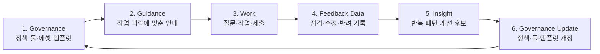

# Product (제품)

## 1. 제품 정의

이 제품의 목표는 작업 과정에서 필요한 규칙을 적시에 안내하고, 실제 사용 데이터를 바탕으로 지속적으로 개선되는 디지털 가이드라인을 만드는 것입니다.

정책과 규칙은 문서에서 끝나지 않고, 실제 작업 과정에서 AI를 통해 활용되며, 사용자 피드백과 운영 데이터를 바탕으로 계속 개선됩니다.

## 2. 현 상황의 문제점

문제는 가이드라인이 디지털 운영 체계로 작동하지 않는다는 점입니다.
가이드라인은 존재하지만 구조화되어 있지 않고, 실제 작업 과정과 연결되지 않으며, 사용자 피드백을 바탕으로 개선되지 않습니다.

### 1. 구조화되지 않은 가이드라인 자산 관리

현재 브랜드 가이드라인은 PDF, PPT, 문서와 같은 정적 파일로 관리됩니다.

이 방식에서는 가이드라인을 운영 가능한 데이터로 활용하기 어렵습니다.

* 최신 버전을 확인하기 어렵습니다.
* 변경 이력과 의사결정 과정이 체계적으로 관리되지 않습니다.
* 정책과 규칙의 추가·수정 이유를 추적하기 어렵습니다.
* 문서가 사람 중심으로 작성되어 시스템이나 AI가 바로 활용하기 어렵습니다.
* 디지털 서비스에 적용하려면 별도의 해석 과정이 필요합니다.

가이드라인은 운영 자산이 아니라 관리 대상 문서로 인식되고 있습니다.

### 2. 실제 운영 과정과의 단절

브랜드 가이드라인은 제작 단계에서 정의되지만, 실제 운영 과정과는 충분히 연결되지 않습니다.

실제 서비스는 일정과 실행 속도를 우선하기 때문에 가이드라인 확인 또는 개선 요청이 뒤로 밀리는 경우가 많습니다.

* 어떤 규칙이 자주 위반되는지 파악하기 어렵습니다.
* 반복되는 예외 상황이 체계적으로 수집되지 않습니다.
* 실제 산출물에서 발생한 문제가 가이드라인 개선으로 이어지지 않습니다.
* 운영 정책이 바뀌어도 가이드라인 반영은 늦어집니다.

결과적으로 가이드라인은 실제 운영을 따라가지 못하고 시간이 지날수록 활용도가 낮아집니다.

### 3. 공급자와 사용자를 연결하는 피드백 구조 부재

브랜드 디자이너는 가이드라인을 설계하고, 현업 디자이너와 마케터는 이를 사용합니다.

하지만 두 집단 사이에는 지속적인 피드백 구조가 부족합니다.

* 브랜드 디자이너는 사용자가 어디에서 어려움을 겪는지 파악하기 어렵습니다.
* 사용자는 규칙의 의도나 적용 방법을 확인하기 어렵습니다.
* 반복되는 오류와 개선 요구가 체계적으로 수집되지 않습니다.
* 현장의 경험이 가이드라인 개선에 반영되지 않습니다.

가이드라인은 일방향 전달에 머물고, 실제 사용 경험을 통해 발전하기 어려운 상황입니다.

## 3. 서비스 플라이휠

이 제품은 가이드라인을 일방향 문서로 배포하지 않는다.

브랜드 디자이너가 만든 정책과 룰은 시스템 안에서 실행 가능한 가이드가 된다.
소비자는 그 가이드를 바탕으로 작업하고, 질문과 점검 결과와 반려 사유를 남긴다.
시스템과 AI는 이 데이터를 인사이트로 정리하고, 브랜드 디자이너는 이를 다시 정책과 룰 개선에 반영한다.

즉, 플라이휠의 핵심은 "배포"가 아니라 "순환"이다.

| 단계 | 주체 | 남는 데이터 | 다음 단계 |
| --- | --- | --- | --- |
| Governance | 브랜드 디자이너 | 정책, 룰, 에셋, 템플릿, 버전 | 실행 가능한 안내로 변환한다. |
| Guidance | 시스템, AI | 어플리케이션 타입별 실행 가이드, 점검 기준, 수정 지시 후보 | 소비자의 작업 화면에 제공한다. |
| Work | 소비자 | 질문, 입력값, 작업물, 제출물 | 점검과 피드백의 대상이 된다. |
| Feedback Data | 시스템 | 점검 결과, 위반 항목, 반려 사유, 피드백 반응 | 반복 패턴을 찾는 재료가 된다. |
| Insight | AI | 반복 질문, 반복 위반, 템플릿 문제, 개선 후보 | 브랜드 디자이너의 검토 대상으로 전달된다. |
| Governance Update | 브랜드 디자이너 | 개정 정책, 개정 룰, 템플릿 개선, 예외 정책 | 다음 작업에 적용되는 새 기준이 된다. |

AI가 Governance를 직접 바꾸지는 않는다.
AI는 반복 패턴을 개선 후보로 정리한다.
브랜드 디자이너가 채택 여부를 결정하고, 시스템이 변경 이력과 적용 버전을 기록한다.

이 플라이휠이 돌아가면 가이드라인은 정적 문서에 머물지 않는다.
실제 사용 데이터를 바탕으로 계속 개선되는 운영 체계가 된다.

## 4. 사용자 페르소나

| 항목 | 내용 |
| --- | --- |
| 사용자 | 50대 남성 현장 작업자 |
| 역할 | 매장, 행사장, 현장 운영에 필요한 안내물이나 홍보물을 만든다 |
| 디자인 이해도 | 낮음. 디자인 용어와 브랜드 표현 기준에 익숙하지 않다 |
| 의지 | 브랜드 가이드라인에 맞추고 싶은 의지는 있다 |
| 현재 한계 | 무엇을 어떻게 고쳐야 통과 가능한지 판단하기 어렵다 |
| 주요 손실 | 작업물 반려, 재작업, Manager와의 반복 커뮤니케이션 |

이 사용자는 가이드라인을 일부러 무시하지 않는다.

문제는 의지가 아니라 실행 방법이다.

## 5. 사용자 페인포인트

| Pain Point | Description |
| --- | --- |
| 기준 해석이 어렵다 | "브랜드답게", "균형 있게" 같은 표현을 실제 작업으로 바꾸기 어렵다. |
| 필요한 룰을 찾기 어렵다 | 전체 가이드라인에서 내 작업에 필요한 부분만 골라내야 한다. |
| 선택지가 많다 | 색상, 이미지, 레이아웃을 직접 고를수록 실수할 가능성이 커진다. |
| 제출 전 확신이 없다 | 지금 만든 작업물이 통과 가능한지 제출 전에는 알기 어렵다. |
| 피드백을 이해하기 어렵다 | 반려 코멘트가 추상적이면 어디를 어떻게 고쳐야 하는지 알기 어렵다. |
| 같은 실수가 반복된다 | 반복되는 반려 사유가 템플릿이나 룰 개선으로 연결되지 않는다. |

사용자가 실제로 묻는 질문은 다음에 가깝다.

- 이 템플릿을 써도 되나?
- 이 사진을 넣어도 되나?
- 글자가 너무 작지는 않나?
- 로고 위치가 맞나?
- 이 색을 써도 되나?
- 제출하면 반려되지 않을까?
- 틀렸다면 어디를 어떻게 고쳐야 하나?

## 6. 가설

### H1. 사용자는 설명보다 바로 따라 할 수 있는 룰이 필요하다.

현장 작업자는 "균형 있게 배치"보다 "제목은 상단에 크게", "로고 주변은 비워두기" 같은 지시를 더 잘 수행한다.

주요 지표:

- 작업물 반려율
- 재작업 횟수
- 사용자의 자가 수행 가능성 응답

### H2. 선택지를 줄이면 실패가 줄어든다.

디자인 감수성이 낮은 사용자는 자유도가 높을수록 잘못된 선택을 할 가능성이 커진다.

주요 지표:

- 완성 시간
- 룰 위반 항목 수
- 템플릿 이탈률
- 검토 통과율

### H3. 사용자는 가이드라인을 읽기보다 통과 가능성을 확인받고 싶다.

사용자의 실제 질문은 "룰이 무엇인가"보다 "이거 제출해도 되는가"에 가깝다.

주요 지표:

- 제출 전 수정 완료율
- Manager 개입 감소율
- 재제출 성공률
- 점검 결과 이해도

### H4. 쉬운 작업 지시가 수행률을 높인다.

전문 용어를 현장 언어로 바꾸면 사용자가 피드백을 더 빨리 이해하고 수정할 수 있다.

주요 지표:

- 안내 문구 이해도
- 작업 행동 일치율
- 추가 질문 수
- 도움 없이 완료한 비율

### H5. 피드백이 룰과 연결되면 반복 코멘트가 줄어든다.

Manager가 같은 코멘트를 반복해서 쓰지 않으려면 피드백이 룰, 위반 항목, 수정 지시와 연결되어야 한다.

주요 지표:

- 검토 소요 시간
- 반복 코멘트 수
- 작업자 재질문 수
- 같은 오류 재발률

## 7. 제공 서비스

이 제품은 현장 작업자가 정책과 룰을 직접 해석하지 않아도 작업을 완료할 수 있게 돕는다.

| Service | Description |
| --- | --- |
| 어플리케이션 타입 선택 | 사용자가 만들 산출물 유형을 먼저 고른다. |
| 템플릿 추천 | 선택한 어플리케이션 타입에 허용된 템플릿만 보여준다. |
| 제한된 입력 폼 | 템플릿에 필요한 텍스트, 이미지, 선택값만 입력하게 한다. |
| 제출 전 점검 | 입력값과 작업물이 룰을 충족하는지 확인한다. |
| 쉬운 수정 지시 | 사용자가 어디를 어떻게 고쳐야 하는지 알려준다. |
| Manager 피드백 연결 | 검토 코멘트를 룰과 위반 항목에 연결한다. |
| 인사이트 리포트 | 반복 질문, 반복 위반, 반복 반려 사유를 모아 개선 후보로 만든다. |

## 8. 제공되는 가치

### Consumer 가치

- 어떤 템플릿을 써야 하는지 덜 고민한다.
- 제출 전에 잘못된 부분을 확인한다.
- 피드백을 보고 혼자 수정할 수 있다.
- 디자인 용어를 몰라도 통과 가능한 작업물을 만들 수 있다.

### Manager 가치

- 같은 피드백을 반복해서 쓰는 시간을 줄인다.
- 반려 사유를 룰과 연결해 기록한다.
- 반복 문제를 보고 정책, 룰, 템플릿을 개선한다.
- 가이드라인을 문서가 아니라 운영 시스템으로 관리한다.

### 제품 가치

- PDF 가이드라인보다 실제 작업 성공률을 높인다.
- 사용자 질문과 반려 데이터를 제품 개선 데이터로 바꾼다.
- Governance -> Guidance -> User Data -> Insight -> Governance Update의 플라이휠을 만든다.
