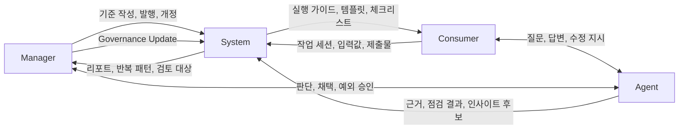

# 02. 유즈케이스

## 1. 목적

이 문서는 가이드라인 성숙도 L1~L5의 유즈케이스를 단일 문서로 정리한다.

유즈케이스는 기능 목록이 아니라 제품 플라이휠을 설명하는 실행 시나리오다. 핵심 흐름은 다음과 같다.

```text
Governance
-> Guidance Report
-> User Data
-> Insight Report
-> Governance Update
```

각 유즈케이스는 어떤 입력이 들어오고, 시스템이 무엇을 처리하며, 어떤 결과와 데이터가 남는지를 기준으로 작성한다.

## 2. 가이드라인 성숙도

| Level | Name | Focus | 사용자 가치 |
| --- | --- | --- | --- |
| L1 | Static Guideline | 정적 문서 작성, 배포, 열람 | 기준 존재 |
| L2 | Digital Guideline | 구조화 등록, 검색, 최신본 관리 | 접근성, 최신성 |
| L3 | Contextual Guideline | 어플리케이션 타입별 기준 제공 | 내 작업에 맞는 기준 |
| L4 | Interactive Guideline | 질문, 자가 점검, 제출, 검토 | 적용 확신 |
| L5 | Adaptive Governance Guideline | 사용 데이터 기반 기준 개선 | 지속적 품질 개선 |

성숙도는 누적된다. L5는 L1~L4 유즈케이스를 포함하고, 그 위에 데이터 기반 개선 루프를 추가한다.

## 3. 유즈케이스 세그먼트

이전의 "도메인" 표현은 사용하지 않는다. 유즈케이스의 흐름을 설명할 때는 "세그먼트"를 사용한다.

| Segment | Main Flow | Meaning |
| --- | --- | --- |
| Governance Segment | Manager -> System | 기준, 에셋, 버전, 승인 상태를 만든다. |
| Guidance Segment | System -> Consumer | 발행된 기준을 실행 가능한 안내로 바꿔 제공한다. |
| Consumer Work Segment | Consumer -> System | 작업 세션, 입력값, 제출물, 검수 상태가 생긴다. |
| Agent Interaction Segment | Consumer <-> Agent -> System | 질문, 답변, 점검, 수정 지시가 생긴다. |
| Evaluation Segment | System <- Manager <-> Agent | 제출물 검토와 사람 판단을 기록한다. |
| Insight Segment | System -> Manager | 반복 질문, 실패, 반려 사유를 인사이트로 묶는다. |
| Governance Update Segment | Manager -> System | 채택된 인사이트를 기준 개선으로 반영한다. |

Agent는 제안하고, Manager가 결정하며, System이 기록한다. Agent는 Governance를 직접 변경하지 않는다.

## 4. 전체 흐름



## 5. 유즈케이스 목록

| ID | Level | Segment | Use Case | Input | Output |
| --- | --- | --- | --- | --- | --- |
| L1-UC-01 | L1 | Governance | Manager가 가이드라인 문서를 작성한다 | 브랜드 원칙, 시각 규칙, 콘텐츠 규칙, 예시 자료, 에셋 파일 | 배포 가능한 정적 가이드라인 문서 |
| L1-UC-02 | L1 | Governance | Manager가 가이드라인 문서를 배포한다 | 가이드라인 문서, 배포 채널, 대상자 목록 | 사용자에게 전달된 문서와 배포 안내 |
| L1-UC-03 | L1 | Guidance | Consumer가 가이드라인 문서를 열람한다 | 작업 목적, 가이드라인 문서, 검색 키워드 | 사용자가 직접 해석한 기준과 작업 시도 |
| L1-UC-04 | L1 | Governance | Manager가 새 버전 문서를 재배포한다 | 기존 문서, 변경 기준, 변경 사유 | 새 버전 문서와 이전본 혼선 위험 |
| L2-UC-01 | L2 | Governance | Manager가 가이드라인 섹션을 등록한다 | 브랜드 규칙, 카테고리, 설명 콘텐츠, 예시, 적용일 | 구조화된 가이드라인 섹션과 발행 기준 |
| L2-UC-02 | L2 | Governance | Manager가 공식 에셋을 등록한다 | 에셋 파일, 메타데이터, 관련 기준, 사용 가능 상태 | 공식 에셋과 다운로드 가능한 파일 |
| L2-UC-03 | L2 | Guidance | Consumer가 기준을 검색한다 | 검색어, 카테고리, 필터 | 검색 결과, 최신 기준, 관련 에셋 |
| L2-UC-04 | L2 | Guidance | Consumer가 공식 에셋을 다운로드한다 | 에셋 검색 결과, 사용 조건 | 다운로드된 공식 에셋과 사용 안내 |
| L2-UC-05 | L2 | Governance | Manager가 변경 이력을 관리한다 | 기존 기준, 변경 내용, 변경 사유, 적용 시작일 | 버전 이력, 예약 발행, 폐기 기준 |
| L3-UC-01 | L3 | Governance | Manager가 어플리케이션 타입별 기준을 구성한다 | 발행 기준, 어플리케이션 타입, 템플릿, 체크리스트, 필수/금지 문구 | 어플리케이션 타입별 기준 묶음 |
| L3-UC-02 | L3 | Guidance | Manager가 어플리케이션 타입별 실행 가이드를 발행한다 | 발행 기준, 어플리케이션 타입, 허용 템플릿, 쉬운 말 안내, 예시 | Guidance Report와 작업자 체크리스트 |
| L3-UC-03 | L3 | Consumer Work | Consumer가 어플리케이션 타입과 템플릿을 선택한다 | 작업 목적, 사용 위치, 어플리케이션 타입 목록, 허용 템플릿 | 작업 세션과 적용 기준 버전 |
| L3-UC-04 | L3 | Consumer Work | Consumer가 작업물을 작성한다 | 선택 템플릿, 텍스트, 이미지, 필수 입력 조건 | 작업물 초안과 미리보기 |
| L3-UC-05 | L3 | Guidance | 시스템이 어플리케이션 타입별 실행 가이드를 보여준다 | 선택 어플리케이션 타입, 적용 기준 버전, Guidance Report | 어플리케이션 타입에 맞는 기준과 제한된 선택지 |
| L4-UC-01 | L4 | Agent Interaction | Consumer가 제출 전 자가 점검을 실행한다 | 작업물 초안, 체크리스트, 적용 기준 버전, 입력값 | pass/warning/fail/human review와 수정 지시 |
| L4-UC-02 | L4 | Agent Interaction | Consumer가 Agent에게 상황형 질문을 한다 | 질문 원문, 작업 맥락, 발행 기준 | 쉬운 말 답변, 인용 기준, 다음 행동 |
| L4-UC-03 | L4 | Consumer Work | Consumer가 작업물을 제출한다 | 작업물 초안, 자가 점검 결과, 작업 세션, 제출자 정보 | 공식 제출물과 검수 요청 |
| L4-UC-04 | L4 | Evaluation | Manager가 제출물을 검토하고 피드백한다 | 제출물, 기준 스냅샷, 점검 결과, 검수 기준, 코멘트 템플릿 | 승인/수정 요청/반려와 규칙 연결 피드백 |
| L4-UC-05 | L4 | Agent Interaction | 시스템이 수정 지시를 제공한다 | 점검 결과, 검수 코멘트, 관련 기준, 작업물 | 구체적 수정 지시와 다음 행동 |
| L5-UC-01 | L5 | Insight | 시스템이 반복 질문과 반려 사유를 집계한다 | 질문 로그, 체크 결과, 검수 코멘트, 제출 상태, 어플리케이션 타입 데이터 | 반복 질문 그룹, 반복 반려 사유, 인사이트 후보 |
| L5-UC-02 | L5 | Insight | Manager가 Insight Report를 확인한다 | 인사이트 후보, 집계 지표, 반복 피드백, 관련 기준 | 채택/제외된 인사이트와 개선 판단 |
| L5-UC-03 | L5 | Governance Update | Manager가 인사이트를 기준 개선으로 전환한다 | 채택된 인사이트, 관련 규칙, 템플릿, 체크리스트, 반복 사례 | Governance Draft와 업데이트된 기준 |
| L5-UC-04 | L5 | Guidance | 변경된 기준이 다음 실행 가이드에 반영된다 | 발행된 기준 변경, 적용 시작일, 관련 어플리케이션 타입, 관련 템플릿 | 갱신된 Guidance Report와 새 기준 스냅샷 |
| L5-UC-05 | L5 | Insight | 시스템이 개선 효과를 추적한다 | 변경 전후 기준, User Data, 비교 기간 | Impact Report와 후속 인사이트 |

## 6. MVP 유즈케이스

초기 MVP는 모든 유즈케이스를 완성하지 않아도 된다. 플라이휠의 최소 순환을 만들기 위해 다음 5개를 우선한다.

| Priority | Use Case | Reason |
| --- | --- | --- |
| 1 | L3-UC-01. Manager가 어플리케이션 타입별 기준을 구성한다 | Governance가 있어야 이후 흐름이 가능하다. |
| 2 | L3-UC-02. Manager가 어플리케이션 타입별 실행 가이드를 발행한다 | Consumer가 기준을 사용할 수 있는 형태가 필요하다. |
| 3 | L4-UC-01. Consumer가 제출 전 자가 점검을 실행한다 | 반려 예방이라는 직접 가치가 생긴다. |
| 4 | L4-UC-04. Manager가 제출물을 검토하고 피드백한다 | 실제 반려 사유 데이터가 생긴다. |
| 5 | L5-UC-02. Manager가 Insight Report를 확인한다 | 데이터가 Governance 개선으로 돌아갈 수 있다. |

## 7. 상세 유즈케이스

### L1-UC-01. Manager가 가이드라인 문서를 작성한다

목적: 브랜드 기준을 PDF, 문서, 브랜드북 같은 정적 파일로 만든다.

| Field | Content |
| --- | --- |
| Actors | Manager |
| Input | 브랜드 원칙, 시각 규칙, 콘텐츠 규칙, 예시 자료, 에셋 파일 |
| Process | 기준 내용을 문서로 정리하고, 이미지와 에셋 링크를 포함한 뒤, 내용 오류를 확인하고 배포 가능한 파일로 내보낸다. |
| Output | Guideline Document, Asset Package |
| Generated Data | 문서 파일, 작성일, 작성자, 수동 버전명 |
| Next Maturity Condition | 문서를 섹션, 규칙, 에셋 단위로 쪼개서 관리해야 한다. |

### L1-UC-02. Manager가 가이드라인 문서를 배포한다

목적: 완성된 가이드라인 문서를 Consumer에게 전달한다.

| Field | Content |
| --- | --- |
| Actors | Manager, Consumer |
| Input | Guideline Document, 배포 채널, 대상자 목록 |
| Process | Manager가 배포 채널에 문서를 업로드하고, 대상자에게 문서 위치와 에셋 파일을 안내한다. |
| Output | Distributed Guideline, Distribution Notice |
| Generated Data | 배포 일시, 배포 대상, 배포 채널 |
| Next Maturity Condition | 누가 최신본을 봤는지 확인하고, 시스템에서 항상 최신 기준을 보여줘야 한다. |

### L1-UC-03. Consumer가 가이드라인 문서를 열람한다

목적: Consumer가 필요한 기준을 문서 안에서 직접 찾아본다.

| Field | Content |
| --- | --- |
| Actors | Consumer |
| Input | 작업 목적, Guideline Document, 검색 키워드 |
| Process | Consumer가 문서를 열고, 목차나 검색 기능으로 필요한 기준을 찾은 뒤, 내용을 직접 해석해 작업에 적용한다. |
| Output | Manual Interpretation, Work Attempt |
| Generated Data | 대부분 남지 않음. 문서 플랫폼에 따라 조회 로그만 남을 수 있음 |
| Next Maturity Condition | 사용자가 어떤 기준을 찾았는지 알고, 어플리케이션 타입별로 필요한 기준만 보여줘야 한다. |

### L1-UC-04. Manager가 새 버전 문서를 재배포한다

목적: 변경된 기준을 새 문서로 다시 배포한다.

| Field | Content |
| --- | --- |
| Actors | Manager, Consumer |
| Input | 기존 문서, 변경 기준, 변경 사유 |
| Process | Manager가 기존 문서를 수정하고, 새 버전명을 붙이고, 이전 배포 채널에 다시 업로드한다. |
| Output | Replaced Guideline, Outdated Guideline Risk |
| Generated Data | 새 문서 파일, 수동 변경 이력, 배포 안내 |
| Next Maturity Condition | 이전본과 최신본을 시스템에서 구분하고, 변경 이력과 적용 시작일을 데이터로 관리해야 한다. |

### L2-UC-01. Manager가 가이드라인 섹션을 등록한다

목적: 정적 문서의 내용을 섹션과 규칙 단위로 나눠 시스템에서 관리한다.

| Field | Content |
| --- | --- |
| Actors | Manager |
| Input | 브랜드 규칙, 카테고리, 설명 콘텐츠, OK/NG 예시, 적용일 |
| Process | Manager가 가이드라인 섹션을 draft 상태로 등록하고, 카테고리와 태그, 예시, 에셋을 연결한 뒤 published 또는 scheduled 상태로 변경한다. |
| Output | Guideline Section, Published Rule, Versioned Content |
| Generated Data | Manager 데이터, 섹션 상태, 카테고리, 태그, 기준 버전, 적용 시작일 |
| Next Maturity Condition | 섹션을 어플리케이션 타입과 연결하고, 사용자가 자기 작업에 맞는 기준을 받아야 한다. |

### L2-UC-02. Manager가 공식 에셋을 등록한다

목적: Consumer가 임의 파일이 아니라 공식 에셋을 사용하게 한다.

| Field | Content |
| --- | --- |
| Actors | Manager, Consumer |
| Input | 에셋 파일, 에셋 메타데이터, 관련 기준, 사용 가능 상태 |
| Process | Manager가 공식 에셋을 업로드하고, 사용 조건과 관련 기준을 연결한 뒤 사용할 수 있는 에셋만 published 상태로 발행한다. |
| Output | Official Asset, Asset Metadata, Downloadable File |
| Generated Data | 에셋 파일, 에셋 상태, 다운로드 가능 여부, 관련 기준 참조 |
| Next Maturity Condition | 어플리케이션 타입별로 사용할 수 있는 에셋만 노출하고, 템플릿과 에셋 사용 조건을 연결해야 한다. |

### L2-UC-03. Consumer가 기준을 검색한다

목적: Consumer가 필요한 기준을 빠르게 찾고 최신본을 확인한다.

| Field | Content |
| --- | --- |
| Actors | Consumer |
| Input | 검색어, 카테고리, 필터 |
| Process | Consumer가 검색어를 입력하면 시스템이 발행된 기준만 검색하고, 관련 섹션, 예시, 에셋, 버전, 적용일을 보여준다. |
| Output | Search Results, Latest Guideline, Related Assets |
| Generated Data | 검색 로그, 조회한 기준, 클릭한 결과 |
| Next Maturity Condition | 검색어에만 의존하지 않고, 어플리케이션 타입을 먼저 선택하게 해야 한다. |

### L2-UC-04. Consumer가 공식 에셋을 다운로드한다

목적: Consumer가 최신 공식 에셋을 사용하게 한다.

| Field | Content |
| --- | --- |
| Actors | Consumer |
| Input | 에셋 검색 결과, 에셋 사용 조건 |
| Process | Consumer가 에셋을 선택하면 시스템이 사용 조건을 보여주고 다운로드를 제공한다. |
| Output | Downloaded Asset, Usage Notice |
| Generated Data | 다운로드 이력, 다운로드한 에셋, 사용자 또는 현장 정보 |
| Next Maturity Condition | 다운로드 이후 실제 작업물에서 어떻게 사용됐는지 추적해야 한다. |

### L2-UC-05. Manager가 변경 이력을 관리한다

목적: 가이드라인 변경 사항과 적용 시점을 명확히 관리한다.

| Field | Content |
| --- | --- |
| Actors | Manager |
| Input | 기존 기준, 변경 내용, 변경 사유, 적용 시작일 |
| Process | Manager가 기존 기준을 수정하고, 변경 사유와 적용일을 입력한 뒤 새 버전을 발행하거나 예약한다. |
| Output | Version History, Scheduled Update, Deprecated Rule |
| Generated Data | 버전 이력, 변경 사유, 적용 시작일, 이전 기준과 새 기준의 연결 |
| Next Maturity Condition | 변경된 기준이 어플리케이션 타입별 실행 가이드에 반영되어야 한다. |

### L3-UC-01. Manager가 어플리케이션 타입별 기준을 구성한다

목적: 발행된 기준을 어플리케이션 타입별로 묶어 Consumer가 바로 사용할 수 있는 구조를 만든다.

| Field | Content |
| --- | --- |
| Actors | Manager |
| Input | Published Governance, 어플리케이션 타입, 템플릿, 체크리스트, 필수 문구, 금지 표현 |
| Process | Manager가 어플리케이션 타입을 정의하고, 관련 규칙, 템플릿, 예시, 체크리스트, 쉬운 말 안내, 적용 기준 버전을 연결한다. |
| Output | Application Type Guideline, Template Set, Checklist Set |
| Generated Data | 어플리케이션 타입, 규칙 연결 정보, 템플릿 연결 정보, 체크리스트 연결 정보 |
| Next Maturity Condition | Consumer 입력값과 작업물 상태를 기준 점검에 사용할 수 있어야 한다. |

### L3-UC-02. Manager가 어플리케이션 타입별 실행 가이드를 발행한다

목적: 공식 기준을 Consumer가 실제 작업에서 따라 할 수 있는 실행형 가이드로 바꾼다.

| Field | Content |
| --- | --- |
| Actors | Manager, System, Consumer |
| Input | Published Governance, 어플리케이션 타입, 허용 템플릿, 체크리스트, 쉬운 말 안내, 예시 |
| Process | 시스템이 어플리케이션 타입에 연결된 발행 기준을 불러오고, Consumer에게 필요한 항목만 묶어 published 상태로 노출한다. |
| Output | Guidance Report, Worker Checklist, Template Recommendation, Required Copy List, Forbidden Copy List |
| Generated Data | Manager 데이터 참조, 실행 가이드 버전, 어플리케이션 타입별 노출 기준 |
| Next Maturity Condition | 실행 가이드를 읽는 데서 끝나지 않고, 입력값을 받아 점검해야 한다. |

### L3-UC-03. Consumer가 어플리케이션 타입과 템플릿을 선택한다

목적: Consumer가 전체 가이드라인을 읽지 않고도 올바른 작업 출발점을 고른다.

| Field | Content |
| --- | --- |
| Actors | Consumer, System |
| Input | 작업 목적, 사용 위치, 어플리케이션 타입 목록, 허용 템플릿 목록 |
| Process | Consumer가 어플리케이션 타입을 선택하면 시스템이 허용 템플릿만 보여주고, 선택된 기준 버전을 작업 세션에 고정한다. |
| Output | Work Session, Selected Application Type, Selected Template, Applicable Rule Version |
| Generated Data | 작업 시작 이벤트, 템플릿 선택 이벤트, 적용 기준 버전 스냅샷 |
| Next Maturity Condition | 선택된 템플릿과 입력값을 기준으로 제출 전 점검을 실행해야 한다. |

### L3-UC-04. Consumer가 작업물을 작성한다

목적: Consumer가 정해진 템플릿 안에서 필요한 텍스트와 이미지를 입력한다.

| Field | Content |
| --- | --- |
| Actors | Consumer, System |
| Input | 선택된 템플릿, 텍스트 입력값, 이미지 입력값, 필수 입력 조건 |
| Process | 시스템이 템플릿 입력 필드를 보여주고, Consumer 입력을 받아 필수 누락 여부를 확인하며 미리보기를 생성한다. |
| Output | Draft Output, Preview, Missing Input Warning |
| Generated Data | Consumer 입력값, 업로드 자산, 작업물 초안 상태, 미리보기 생성 이력 |
| Next Maturity Condition | 작성된 작업물에 대해 자동 또는 반자동 점검을 제공해야 한다. |

### L3-UC-05. 시스템이 어플리케이션 타입별 실행 가이드를 보여준다

목적: Consumer가 선택한 어플리케이션 타입에 맞는 기준만 확인하게 한다.

| Field | Content |
| --- | --- |
| Actors | Consumer, System |
| Input | Selected Application Type, Applicable Rule Version, Guidance Report |
| Process | 시스템이 선택된 어플리케이션 타입의 실행 가이드를 조회하고, 허용 템플릿, 필수 문구, 금지 표현, OK/NG 예시를 보여준다. |
| Output | Presented Guidance, Reduced Choice Set, Worker Instruction |
| Generated Data | 가이드 조회 이력, 노출된 기준 버전, 사용자가 본 어플리케이션 타입 |
| Next Maturity Condition | 사용자가 질문하거나 작업물 상태를 점검받을 수 있어야 한다. |

### L4-UC-01. Consumer가 제출 전 자가 점검을 실행한다

목적: 제출 전에 단순 오류와 명확한 가이드 위반을 줄인다.

| Field | Content |
| --- | --- |
| Actors | Consumer, Agent, System |
| Input | Draft Output, Worker Checklist, Applicable Rule Version, 텍스트/이미지/템플릿 선택 정보 |
| Process | Consumer가 자가 점검을 실행하면 시스템이 필수 입력, 필수 문구, 금지 표현, 템플릿 조건을 확인하고 Agent 또는 rule check가 쉬운 말 결과를 생성한다. |
| Output | Passed, Warning, Failed, Human Review Required, Fix Instruction |
| Generated Data | 체크 실행 이력, 체크 결과, 실패 항목, 수정 지시, 사람 검토 필요 여부 |
| Next Maturity Condition | 실패 항목과 수정 지시가 반복 패턴으로 집계되어야 한다. |

### L4-UC-02. Consumer가 Agent에게 상황형 질문을 한다

목적: Consumer가 디자인 용어를 몰라도 자신의 상황에 맞는 답을 받는다.

| Field | Content |
| --- | --- |
| Actors | Consumer, Agent, System |
| Input | 질문 원문, 작업 맥락, Published Governance |
| Process | Agent가 질문 의도를 분류하고, 시스템이 관련 기준을 검색하며, Agent가 근거와 버전을 연결한 쉬운 말 답변을 생성한다. |
| Output | Answer, Cited Rules, Suggested Next Action, Low Confidence, Escalation |
| Generated Data | Agent Query 로그, 질문 의도, 검색된 기준, 인용 규칙, 답변 신뢰도, 사용자 피드백 |
| Next Maturity Condition | 반복 질문과 낮은 신뢰도 질문이 인사이트 후보로 묶여야 한다. |

### L4-UC-03. Consumer가 작업물을 제출한다

목적: 자가 점검을 통과했거나 사람 검토가 필요한 작업물을 공식 검수 대상으로 전환한다.

| Field | Content |
| --- | --- |
| Actors | Consumer, System, Manager |
| Input | Draft Output, Self Check Result, 작업 세션 정보, 제출자 정보 |
| Process | 시스템이 제출 가능 상태를 확인하고, 제출 데이터와 기준 버전 스냅샷을 고정한 뒤 제출 상태를 submitted로 변경한다. |
| Output | Submission, Submitted Status, Review Request, Rule Snapshot |
| Generated Data | Consumer 제출 데이터, 제출 상태, 제출 시점 기준 버전, 검수 요청 이벤트 |
| Next Maturity Condition | 제출 결과와 검수 결과가 어플리케이션 타입, 템플릿, 기준 버전별로 집계되어야 한다. |

### L4-UC-04. Manager가 제출물을 검토하고 피드백한다

목적: 제출물을 공식 기준에 따라 승인하거나 수정 요청한다.

| Field | Content |
| --- | --- |
| Actors | Manager, Consumer, System |
| Input | Submission, Rule Snapshot, Self Check Result, Review Criteria, Comment Templates |
| Process | Manager가 제출물을 확인하고 기준 위반 여부를 판단한 뒤, 필요한 경우 규칙 기반 코멘트와 수정 지시를 남긴다. |
| Output | Approved Submission, Needs Changes, Rejected Submission, Rule-linked Feedback, Suggested Fix |
| Generated Data | 검수 결과, 반려 사유, 규칙 연결 코멘트, 수정 요청 이력, Manager 판단 이력 |
| Next Maturity Condition | 검수 코멘트와 반려 사유가 반복 이슈로 분석되어야 한다. |

### L4-UC-05. 시스템이 수정 지시를 제공한다

목적: Consumer가 피드백을 보고 혼자 수정할 수 있게 한다.

| Field | Content |
| --- | --- |
| Actors | Consumer, Agent, System, Manager |
| Input | Check Result, Review Comment, Related Rule, Draft Output |
| Process | 시스템이 문제 항목과 관련 기준을 연결하고, Agent가 쉬운 말 수정 지시를 생성해 Consumer에게 다음 행동을 보여준다. |
| Output | Fix Instruction, Related Rule Link, Next Action |
| Generated Data | 수정 지시, 관련 기준 참조, 사용자 반응, 재점검 여부 |
| Next Maturity Condition | 같은 수정 지시가 반복되는지 집계하고 기준 개선 후보로 전환해야 한다. |

### L5-UC-01. 시스템이 반복 질문과 반려 사유를 집계한다

목적: 개별 질문, 체크 실패, 반려 사유를 운영 인사이트 후보로 만든다.

| Field | Content |
| --- | --- |
| Actors | System, Agent, Manager |
| Input | Agent Query Logs, Check Results, Review Comments, Submission Statuses, Application Type Data |
| Process | 시스템이 유사 질문, 반복 체크 실패, 반복 반려 사유를 묶고 어플리케이션 타입별, 템플릿별 문제 비율을 계산한다. |
| Output | Repeated Question Group, Repeated Rejection Reason, Template Issue Pattern, Application Type Risk, Insight Candidate |
| Generated Data | Agent Insight 데이터, 반복 패턴 그룹, 통계 집계, 인사이트 후보 상태 |
| Next Maturity Condition | Governance Update로 플라이휠을 계속 돌려야 한다. |

### L5-UC-02. Manager가 Insight Report를 확인한다

목적: Manager가 현장에서 반복되는 문제를 보고 기준 개선 여부를 판단한다.

| Field | Content |
| --- | --- |
| Actors | Manager, System |
| Input | Insight Candidates, Aggregated Metrics, Repeated Feedback, Rule References |
| Process | Manager가 반복 문제의 심각도와 빈도를 보고, 기준 문제인지 템플릿 문제인지 교육 문제인지 분류한 뒤 개선 후보를 채택하거나 제외한다. |
| Output | Accepted Insight, Dismissed Insight, Improvement Decision, Priority |
| Generated Data | Manager 검토 이력, 인사이트 상태 변경, 개선 우선순위, 개선 유형 분류 |
| Next Maturity Condition | 채택된 인사이트가 기준 개선 초안으로 전환되어야 한다. |

### L5-UC-03. Manager가 인사이트를 기준 개선으로 전환한다

목적: Insight Report를 실제 Governance Update로 연결한다.

| Field | Content |
| --- | --- |
| Actors | Manager, System |
| Input | Accepted Insight, Related Rule, Related Template, Related Checklist, 반복 사례 |
| Process | Manager가 개선 유형을 선택하고, 기준 문구, OK/NG 예시, 체크리스트, 템플릿 제한을 수정한 뒤 draft 상태로 만든다. |
| Output | Governance Draft, Updated Rule, Updated Template, Updated Checklist, New FAQ |
| Generated Data | Manager 데이터 새 버전, 변경 사유, 인사이트 연결 정보, 개정 초안 상태, 승인 이력 |
| Next Maturity Condition | 발행된 개선안이 다음 실행 가이드와 작업 세션에 반영되어야 한다. |

### L5-UC-04. 변경된 기준이 다음 실행 가이드에 반영된다

목적: 개선된 기준을 다음 Consumer 작업에 적용해 플라이휠을 완성한다.

| Field | Content |
| --- | --- |
| Actors | Manager, System, Consumer |
| Input | Published Governance Update, 적용 시작일, 관련 어플리케이션 타입, 관련 템플릿 |
| Process | 시스템이 새 기준의 적용일을 확인하고 관련 Guidance Report를 갱신하며, 새 작업 세션에는 새 기준 버전을 적용한다. |
| Output | Updated Guidance Report, Updated Worker Checklist, Change Notice, New Rule Snapshot |
| Generated Data | 실행 가이드 새 버전, 변경 안내 이력, 새 기준 적용 이벤트, 이전 기준과 새 기준의 연결 |
| Next Maturity Condition | 변경 전후 반려율, 질문 수, 체크 실패율을 비교해야 한다. |

### L5-UC-05. 시스템이 개선 효과를 추적한다

목적: 기준 개선이 실제로 Consumer 실패와 Manager 반복 비용을 줄였는지 확인한다.

| Field | Content |
| --- | --- |
| Actors | System, Manager |
| Input | Previous Rule Version, New Rule Version, User Data, 기간 조건 |
| Process | 시스템이 변경 전후 데이터를 분리하고, 반복 질문 수, 반려율, 수정 요청 수를 비교해 성공 신호나 후속 인사이트를 만든다. |
| Output | Impact Report, Success Signal, Follow-up Insight |
| Generated Data | 변경 전후 비교 데이터, 개선 효과 지표, 후속 인사이트 후보, Governance 개선 이력의 성과 메타데이터 |
| Next Maturity Condition | 측정 결과가 다음 Governance Update 판단에 사용되어야 한다. |

## 8. 유즈케이스 항목 구조

단일 유즈케이스 항목은 다음 구조를 따른다.

| Field | Meaning |
| --- | --- |
| ID | 성숙도와 번호를 포함한 식별자 |
| Level | L1~L5 성숙도 |
| Segment | 유즈케이스 세그먼트 |
| Purpose | 사용자가 달성하려는 목적 |
| Actors | 참여 주체 |
| Input | 유즈케이스를 시작하는 입력 |
| Process | 시스템과 사용자가 수행하는 주요 처리 |
| Output | 사용자 또는 시스템이 받는 결과 |
| Generated Data | 이후 리포트, 추적, 개선에 사용되는 데이터 |
| Next Maturity Condition | 다음 성숙도로 넘어가기 위해 필요한 조건 |
