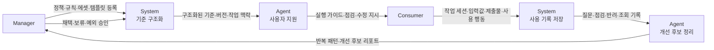

# 02. 유즈케이스

## 1. 목적

이 문서는 01번 제품 문서에서 정의한 제품 방향을 실행 단위로 바꿉니다.

유즈케이스는 기능 목록이 아닙니다.
각 유즈케이스는 현장 작업자가 기준을 찾고, 적용하고, 점검받고, 피드백을 다시 기준 개선으로 돌려보내는 실행 시나리오입니다.

01번 제품 문서의 핵심 흐름은 다음과 같습니다.

```text
Manager -> System -> Agent -> Consumer -> System -> Agent -> Manager
```

이 문서는 각 흐름에서 다음을 정의합니다.

- 누가 어떤 입력을 만듭니다.
- System과 Agent가 무엇을 처리합니다.
- Consumer와 Manager가 어떤 결과를 받습니다.
- 어떤 사용 기록이 남고, 그 기록이 어떻게 정책 개선으로 돌아갑니다.

## 2. 01번 제품 문서와의 연결

02번 문서의 유즈케이스는 01번 문서의 문제, 가설, 제공 서비스를 기준으로 정렬합니다.

| 01번 제품 문서의 기준 | 02번 유즈케이스에서 다루는 실행 단위 |
| --- | --- |
| 기준 적용의 어려움 | 실행 가이드, 쉬운 말 안내, 상황형 질문, 수정 지시 |
| 필요한 기준 탐색의 어려움 | 어플리케이션 타입 선택, 기준 검색, 관련 에셋 노출 |
| 선택 부담 | 허용 템플릿, 제한된 입력 폼, 필수/금지 조건 |
| 제출 전 불확실성 | 자가 점검, pass/warning/fail/human review |
| 피드백 적용의 어려움 | 규칙 연결 피드백, 수정 지시, 재점검 |
| 반복 오류 개선 | 반복 질문, 반복 위반, 반려 사유, 사용 행동 분석 |

01번 문서의 핵심 가설은 다음 유즈케이스로 검증합니다.

| 핵심 가설 | 관련 유즈케이스 | 검증 신호 |
| --- | --- | --- |
| 구체적인 작업 지시가 수행률을 높입니다. | L3-UC-02, L3-UC-05, L4-UC-05 | 자가 수행 가능성 응답, 재질문 수, 작업 완료율 |
| 선택지가 줄어들수록 오류가 줄어듭니다. | L3-UC-01, L3-UC-03, L3-UC-04 | 템플릿 이탈률, 규칙 위반 항목 수 |
| 제출 전 점검이 검토 비용을 줄입니다. | L4-UC-01, L4-UC-03, L4-UC-04 | 제출 전 수정 완료율, 재제출 성공률, Manager 개입 감소율 |
| 피드백과 수정 방법을 함께 주면 반복 오류가 줄어듭니다. | L4-UC-04, L4-UC-05, L5-UC-01, L5-UC-02 | 같은 오류 재발률, 반복 코멘트 수, 검토 소요 시간 |

## 3. 기능 단위

L1~L5는 제품 이름이나 성숙도 설명이 아니라 기능 범위를 구분하는 식별자로 사용합니다.
각 행은 해당 범위에서 필요한 기능과 그 기능이 남기는 데이터를 정리합니다.

| 범위 | 기능 | 남기는 데이터 |
| --- | --- | --- |
| L1 | 가이드라인 문서 작성, 배포, 열람, 재배포 | 문서 파일, 배포 이력, 수동 버전명, 문서 열람 기록 |
| L2 | 가이드라인 섹션 등록, 공식 에셋 등록, 기준 검색, 에셋 다운로드, 변경 이력 관리 | 섹션, 규칙, 에셋, 버전, 적용일, 조회/다운로드 기록 |
| L3 | 어플리케이션 타입별 기준 구성, 실행 가이드 발행, 템플릿 선택, 작업물 작성, 실행 가이드 노출 | 어플리케이션 타입, 템플릿 선택, 입력값, 작업물 초안, 기준 스냅샷 |
| L4 | 제출 전 자가 점검, 상황형 질문, 작업물 제출, Manager 검토, 수정 지시 제공 | 질문, 답변, 점검 결과, 제출 상태, 규칙 연결 피드백, 수정 지시 |
| L5 | 반복 질문과 반려 사유 집계, Insight Report 확인, 기준 개선 전환, 실행 가이드 반영, 개선 효과 추적 | 반복 패턴, 인사이트 후보, 개선안, 새 기준 스냅샷, Impact Report |

## 4. 유즈케이스 세그먼트

유즈케이스는 01번 제품 문서의 플라이휠을 따라 세그먼트로 묶습니다.

| Segment | Main Flow | Meaning | 남는 기록 |
| --- | --- | --- | --- |
| Policy Segment | Manager -> System | 정책, 규칙, 에셋, 템플릿, 버전, 승인 상태를 만듭니다. | 기준 버전, 변경 사유, 적용일 |
| Guidance Segment | System -> Agent -> Consumer | 발행된 기준을 Consumer가 실행할 수 있는 안내로 바꿉니다. | 노출된 기준, 실행 가이드, 조회 기록 |
| Consumer Work Segment | Consumer -> System | 작업 세션, 입력값, 작업물, 제출물을 남깁니다. | 작업 목적, 선택 템플릿, 입력값, 제출 상태 |
| Agent Interaction Segment | Consumer <-> Agent -> System | 질문, 답변, 점검, 수정 지시를 남깁니다. | 질문 의도, 인용 기준, 점검 결과, 수정 지시 |
| Evaluation Segment | Manager <-> System | 제출물 검토와 사람 판단을 기록합니다. | 승인, 반려, 수정 요청, 규칙 연결 코멘트 |
| Insight Segment | System -> Agent -> Manager | 반복 질문, 실패, 반려 사유, 사용 행동을 개선 후보로 묶습니다. | 반복 패턴, 인사이트 후보, 우선순위 |
| Policy Update Segment | Manager -> System | 채택된 개선 후보를 기준 개선으로 반영합니다. | 개정 초안, 승인 이력, 개선 효과 |

Agent는 제안하고, Manager가 결정하며, System이 기록합니다.
Agent는 정책을 직접 변경하지 않습니다.

## 5. 전체 흐름



## 6. 유즈케이스 목록

기준 문서 관리와 기준 데이터 관리는 운영 가능한 기준을 만들기 위한 기반입니다.
제품의 직접 가치는 작업 맥락 구성, 작업 점검과 피드백, 개선 루프가 연결될 때 발생합니다.

| ID | 기능 단위 | Segment | Use Case | 01 연결 | Output |
| --- | --- | --- | --- | --- | --- |
| L1-UC-01 | 기준 문서 관리 | Policy | Manager가 가이드라인 문서를 작성합니다 | 기준 존재 | 정적 가이드라인 문서 |
| L1-UC-02 | 기준 문서 관리 | Policy | Manager가 가이드라인 문서를 배포합니다 | 기준 전달 | 배포 안내 |
| L1-UC-03 | 기준 문서 관리 | Guidance | Consumer가 가이드라인 문서를 열람합니다 | 필요한 기준 탐색의 어려움 | 직접 해석한 기준 |
| L1-UC-04 | 기준 문서 관리 | Policy | Manager가 새 버전 문서를 재배포합니다 | 최신본 확인 어려움 | 새 문서와 혼선 위험 |
| L2-UC-01 | 기준 데이터 관리 | Policy | Manager가 가이드라인 섹션을 등록합니다 | 구조화되지 않은 기준 | 구조화된 섹션과 규칙 |
| L2-UC-02 | 기준 데이터 관리 | Policy | Manager가 공식 에셋을 등록합니다 | 임의 에셋 사용 위험 | 공식 에셋 |
| L2-UC-03 | 기준 데이터 관리 | Guidance | Consumer가 기준을 검색합니다 | 필요한 기준 탐색의 어려움 | 검색 결과와 최신 기준 |
| L2-UC-04 | 기준 데이터 관리 | Guidance | Consumer가 공식 에셋을 다운로드합니다 | 선택 부담 | 다운로드된 공식 에셋 |
| L2-UC-05 | 기준 데이터 관리 | Policy | Manager가 변경 이력을 관리합니다 | 변경 추적 어려움 | 버전 이력 |
| L3-UC-01 | 작업 맥락 구성 | Policy | Manager가 어플리케이션 타입별 기준을 구성합니다 | 선택지 축소 | 타입별 기준 묶음 |
| L3-UC-02 | 작업 맥락 구성 | Guidance | Manager가 어플리케이션 타입별 실행 가이드를 발행합니다 | 구체적인 작업 지시 | Guidance Report |
| L3-UC-03 | 작업 맥락 구성 | Consumer Work | Consumer가 어플리케이션 타입과 템플릿을 선택합니다 | 필요한 기준 탐색, 선택 부담 | 작업 세션과 기준 스냅샷 |
| L3-UC-04 | 작업 맥락 구성 | Consumer Work | Consumer가 작업물을 작성합니다 | 제한된 입력 폼 | 작업물 초안과 미리보기 |
| L3-UC-05 | 작업 맥락 구성 | Guidance | System이 어플리케이션 타입별 실행 가이드를 보여줍니다 | 현재 작업에 맞는 기준 | 제한된 선택지와 작업 지시 |
| L4-UC-01 | 작업 점검과 피드백 | Agent Interaction | Consumer가 제출 전 자가 점검을 실행합니다 | 제출 전 불확실성 | 점검 결과와 수정 지시 |
| L4-UC-02 | 작업 점검과 피드백 | Agent Interaction | Consumer가 Agent에게 상황형 질문을 합니다 | 기준 적용의 어려움 | 근거 있는 쉬운 답변 |
| L4-UC-03 | 작업 점검과 피드백 | Consumer Work | Consumer가 작업물을 제출합니다 | 검토 흐름 연결 | 공식 제출물 |
| L4-UC-04 | 작업 점검과 피드백 | Evaluation | Manager가 제출물을 검토하고 피드백합니다 | 피드백 적용의 어려움 | 규칙 연결 피드백 |
| L4-UC-05 | 작업 점검과 피드백 | Agent Interaction | System이 수정 지시를 제공합니다 | 쉬운 수정 지시 | 다음 행동 |
| L5-UC-01 | 개선 루프 | Insight | System이 반복 질문과 반려 사유를 집계합니다 | 반복 오류 개선 | 반복 패턴 |
| L5-UC-02 | 개선 루프 | Insight | Manager가 Insight Report를 확인합니다 | 개선 우선순위 판단 | 채택/제외된 인사이트 |
| L5-UC-03 | 개선 루프 | Policy Update | Manager가 인사이트를 기준 개선으로 전환합니다 | 기준 개선 루프 | Policy Draft |
| L5-UC-04 | 개선 루프 | Guidance | 변경된 기준이 다음 실행 가이드에 반영됩니다 | 개선된 기준 재사용 | 갱신된 Guidance Report |
| L5-UC-05 | 개선 루프 | Insight | System이 개선 효과를 추적합니다 | 개선 효과 검증 | Impact Report |

## 7. MVP 유즈케이스

MVP는 모든 유즈케이스를 구현하지 않습니다.
01번 제품 문서의 핵심 가설을 가장 적은 흐름으로 검증하는 유즈케이스만 우선합니다.

| Priority | Use Case | 선택 이유 | 검증 신호 |
| --- | --- | --- | --- |
| 1 | L3-UC-01. Manager가 어플리케이션 타입별 기준을 구성합니다. | Consumer에게 필요한 기준만 제공하려면 먼저 기준을 작업 맥락에 연결해야 합니다. | 타입별 연결된 규칙 수, 템플릿 이탈률 |
| 2 | L3-UC-02. Manager가 어플리케이션 타입별 실행 가이드를 발행합니다. | 정적 문서를 실행 가능한 작업 지시로 바꿔야 합니다. | 실행 가이드 조회율, 자가 수행 가능성 응답 |
| 3 | L4-UC-01. Consumer가 제출 전 자가 점검을 실행합니다. | 제출 전 불확실성을 줄이는 직접 가치입니다. | 제출 전 수정 완료율, 점검 후 반려율 |
| 4 | L4-UC-04. Manager가 제출물을 검토하고 피드백합니다. | 실제 반려 사유와 Manager 판단 기록이 생깁니다. | 반복 코멘트 수, 검토 소요 시간 |
| 5 | L5-UC-02. Manager가 Insight Report를 확인합니다. | 사용 기록이 기준 개선으로 돌아가는지 확인합니다. | 채택된 인사이트 수, 같은 오류 재발률 |

MVP에서 L1/L2를 별도 우선순위로 두지 않는 이유는 간단합니다.
L1/L2는 기반이고, 제품 가설은 L3~L5의 작업 흐름에서 검증됩니다.
다만 구현 시에는 L3~L5를 만들기 위해 필요한 L2 수준의 구조화 데이터가 함께 필요합니다.

## 8. 상세 유즈케이스

### L1-UC-01. Manager가 가이드라인 문서를 작성합니다

목적: 브랜드 기준을 PDF, 문서, 브랜드북 같은 정적 파일로 만듭니다.

| Field | Content |
| --- | --- |
| 01 연결 | 기준 존재 |
| Actors | Manager |
| Input | 브랜드 원칙, 시각 규칙, 콘텐츠 규칙, 예시 자료, 에셋 파일 |
| Process | Manager가 기준 내용을 문서로 정리하고, 이미지와 에셋 링크를 포함한 뒤, 배포 가능한 파일로 내보냅니다. |
| Output | Guideline Document, Asset Package |
| Generated Data | 문서 파일, 작성일, 작성자, 수동 버전명 |
| 검증 신호 | 기준 문서 완성 여부, 배포 가능한 에셋 포함 여부 |
| Next Maturity Condition | 문서를 섹션, 규칙, 에셋 단위로 쪼개서 관리해야 합니다. |

### L1-UC-02. Manager가 가이드라인 문서를 배포합니다

목적: 완성된 가이드라인 문서를 Consumer에게 전달합니다.

| Field | Content |
| --- | --- |
| 01 연결 | 기준 전달 |
| Actors | Manager, Consumer |
| Input | Guideline Document, 배포 채널, 대상자 목록 |
| Process | Manager가 배포 채널에 문서를 업로드하고, 대상자에게 문서 위치와 에셋 파일을 안내합니다. |
| Output | Distributed Guideline, Distribution Notice |
| Generated Data | 배포 일시, 배포 대상, 배포 채널 |
| 검증 신호 | 배포 대상 도달 여부, 최신 문서 위치 안내 여부 |
| Next Maturity Condition | 누가 최신본을 봤는지 확인하고, System에서 항상 최신 기준을 보여줘야 합니다. |

### L1-UC-03. Consumer가 가이드라인 문서를 열람합니다

목적: Consumer가 필요한 기준을 문서 안에서 직접 찾아봅니다.

| Field | Content |
| --- | --- |
| 01 연결 | 필요한 기준 탐색의 어려움 |
| Actors | Consumer |
| Input | 작업 목적, Guideline Document, 검색 키워드 |
| Process | Consumer가 문서를 열고, 목차나 검색 기능으로 필요한 기준을 찾은 뒤, 내용을 직접 해석해 작업에 적용합니다. |
| Output | Manual Interpretation, Work Attempt |
| Generated Data | 대부분 남지 않습니다. 문서 플랫폼에 따라 조회 로그만 남을 수 있습니다. |
| 검증 신호 | 기준 탐색 시간, 검색 실패율, 작업자 재질문 수 |
| Next Maturity Condition | 사용자가 어떤 기준을 찾았는지 알고, 어플리케이션 타입별로 필요한 기준만 보여줘야 합니다. |

### L1-UC-04. Manager가 새 버전 문서를 재배포합니다

목적: 변경된 기준을 새 문서로 다시 배포합니다.

| Field | Content |
| --- | --- |
| 01 연결 | 최신본 확인 어려움 |
| Actors | Manager, Consumer |
| Input | 기존 문서, 변경 기준, 변경 사유 |
| Process | Manager가 기존 문서를 수정하고, 새 버전명을 붙이고, 이전 배포 채널에 다시 업로드합니다. |
| Output | Replaced Guideline, Outdated Guideline Risk |
| Generated Data | 새 문서 파일, 수동 변경 이력, 배포 안내 |
| 검증 신호 | 이전본 사용 건수, 최신본 확인 실패 건수 |
| Next Maturity Condition | 이전본과 최신본을 System에서 구분하고, 변경 이력과 적용 시작일을 데이터로 관리해야 합니다. |

### L2-UC-01. Manager가 가이드라인 섹션을 등록합니다

목적: 정적 문서의 내용을 섹션과 규칙 단위로 나눠 System에서 관리합니다.

| Field | Content |
| --- | --- |
| 01 연결 | 구조화되지 않은 가이드라인 자산 관리 |
| Actors | Manager |
| Input | 브랜드 규칙, 카테고리, 설명 콘텐츠, OK/NG 예시, 적용일 |
| Process | Manager가 가이드라인 섹션을 draft 상태로 등록하고, 카테고리와 태그, 예시, 에셋을 연결한 뒤 published 또는 scheduled 상태로 변경합니다. |
| Output | Guideline Section, Published Rule, Versioned Content |
| Generated Data | 섹션 상태, 카테고리, 태그, 기준 버전, 적용 시작일 |
| 검증 신호 | 구조화된 규칙 수, 발행된 섹션 수, 적용일 누락 건수 |
| Next Maturity Condition | 섹션을 어플리케이션 타입과 연결하고, 사용자가 자기 작업에 맞는 기준을 받아야 합니다. |

### L2-UC-02. Manager가 공식 에셋을 등록합니다

목적: Consumer가 임의 파일이 아니라 공식 에셋을 사용하게 합니다.

| Field | Content |
| --- | --- |
| 01 연결 | 선택 부담, 임의 에셋 사용 위험 |
| Actors | Manager, Consumer |
| Input | 에셋 파일, 에셋 메타데이터, 관련 기준, 사용 가능 상태 |
| Process | Manager가 공식 에셋을 업로드하고, 사용 조건과 관련 기준을 연결한 뒤 사용할 수 있는 에셋만 published 상태로 발행합니다. |
| Output | Official Asset, Asset Metadata, Downloadable File |
| Generated Data | 에셋 상태, 다운로드 가능 여부, 관련 기준 참조 |
| 검증 신호 | 공식 에셋 다운로드율, 임의 에셋 사용으로 인한 반려율 |
| Next Maturity Condition | 어플리케이션 타입별로 사용할 수 있는 에셋만 노출하고, 템플릿과 에셋 사용 조건을 연결해야 합니다. |

### L2-UC-03. Consumer가 기준을 검색합니다

목적: Consumer가 필요한 기준을 빠르게 찾고 최신본을 확인합니다.

| Field | Content |
| --- | --- |
| 01 연결 | 필요한 기준 탐색의 어려움 |
| Actors | Consumer, System |
| Input | 검색어, 카테고리, 필터 |
| Process | Consumer가 검색어를 입력하면 System이 발행된 기준만 검색하고, 관련 섹션, 예시, 에셋, 버전, 적용일을 보여줍니다. |
| Output | Search Results, Latest Guideline, Related Assets |
| Generated Data | 검색 로그, 조회한 기준, 클릭한 결과, 체류 시간 |
| 검증 신호 | 검색 성공률, 검색 후 질문 발생률, 오래 체류한 기준 |
| Next Maturity Condition | 검색어에만 의존하지 않고, 어플리케이션 타입을 먼저 선택하게 해야 합니다. |

### L2-UC-04. Consumer가 공식 에셋을 다운로드합니다

목적: Consumer가 최신 공식 에셋을 사용하게 합니다.

| Field | Content |
| --- | --- |
| 01 연결 | 선택 부담 |
| Actors | Consumer, System |
| Input | 에셋 검색 결과, 에셋 사용 조건 |
| Process | Consumer가 에셋을 선택하면 System이 사용 조건을 보여주고 다운로드를 제공합니다. |
| Output | Downloaded Asset, Usage Notice |
| Generated Data | 다운로드 이력, 다운로드한 에셋, 사용자 또는 현장 정보 |
| 검증 신호 | 자주 다운로드한 에셋, 다운로드 후 작업물 사용 여부 |
| Next Maturity Condition | 다운로드 이후 실제 작업물에서 어떻게 사용됐는지 추적해야 합니다. |

### L2-UC-05. Manager가 변경 이력을 관리합니다

목적: 가이드라인 변경 사항과 적용 시점을 명확히 관리합니다.

| Field | Content |
| --- | --- |
| 01 연결 | 변경 이력과 의사결정 추적 어려움 |
| Actors | Manager, System |
| Input | 기존 기준, 변경 내용, 변경 사유, 적용 시작일 |
| Process | Manager가 기존 기준을 수정하고, 변경 사유와 적용일을 입력한 뒤 새 버전을 발행하거나 예약합니다. |
| Output | Version History, Scheduled Update, Deprecated Rule |
| Generated Data | 버전 이력, 변경 사유, 적용 시작일, 이전 기준과 새 기준의 연결 |
| 검증 신호 | 변경 사유 누락 건수, 이전 기준 참조 건수 |
| Next Maturity Condition | 변경된 기준이 어플리케이션 타입별 실행 가이드에 반영되어야 합니다. |

### L3-UC-01. Manager가 어플리케이션 타입별 기준을 구성합니다

목적: 발행된 기준을 어플리케이션 타입별로 묶어 Consumer가 바로 사용할 수 있는 구조를 만듭니다.

| Field | Content |
| --- | --- |
| 01 연결 | 선택지 축소와 오류 감소 |
| Actors | Manager, System |
| Input | Published Policy, 어플리케이션 타입, 템플릿, 체크리스트, 필수 문구, 금지 표현 |
| Process | Manager가 어플리케이션 타입을 정의하고, 관련 규칙, 템플릿, 예시, 체크리스트, 쉬운 말 안내, 적용 기준 버전을 연결합니다. |
| Output | Application Type Guideline, Template Set, Checklist Set |
| Generated Data | 어플리케이션 타입, 규칙 연결 정보, 템플릿 연결 정보, 체크리스트 연결 정보 |
| 검증 신호 | 타입별 연결 규칙 수, 허용 템플릿 사용률, 템플릿 이탈률 |
| Next Maturity Condition | Consumer 입력값과 작업물 상태를 기준 점검에 사용할 수 있어야 합니다. |

### L3-UC-02. Manager가 어플리케이션 타입별 실행 가이드를 발행합니다

목적: 공식 기준을 Consumer가 실제 작업에서 따라 할 수 있는 실행형 가이드로 바꿉니다.

| Field | Content |
| --- | --- |
| 01 연결 | 구체적인 작업 지시와 수행률 |
| Actors | Manager, System, Consumer |
| Input | Published Policy, 어플리케이션 타입, 허용 템플릿, 체크리스트, 쉬운 말 안내, 예시 |
| Process | System이 어플리케이션 타입에 연결된 발행 기준을 불러오고, Consumer에게 필요한 항목만 묶어 published 상태로 노출합니다. |
| Output | Guidance Report, Worker Checklist, Template Recommendation, Required Copy List, Forbidden Copy List |
| Generated Data | 실행 가이드 버전, 어플리케이션 타입별 노출 기준, 조회 이력 |
| 검증 신호 | 실행 가이드 조회율, 자가 수행 가능성 응답, 실행 가이드 조회 후 질문 수 |
| Next Maturity Condition | 실행 가이드를 읽는 데서 끝나지 않고, 입력값을 받아 점검해야 합니다. |

### L3-UC-03. Consumer가 어플리케이션 타입과 템플릿을 선택합니다

목적: Consumer가 전체 가이드라인을 읽지 않고도 올바른 작업 출발점을 고릅니다.

| Field | Content |
| --- | --- |
| 01 연결 | 필요한 기준 탐색의 어려움, 선택 부담 |
| Actors | Consumer, System |
| Input | 작업 목적, 사용 위치, 어플리케이션 타입 목록, 허용 템플릿 목록 |
| Process | Consumer가 어플리케이션 타입을 선택하면 System이 허용 템플릿만 보여주고, 선택된 기준 버전을 작업 세션에 고정합니다. |
| Output | Work Session, Selected Application Type, Selected Template, Applicable Rule Version |
| Generated Data | 작업 시작 이벤트, 템플릿 선택 이벤트, 적용 기준 버전 스냅샷 |
| 검증 신호 | 타입 선택 완료율, 템플릿 선택 시간, 템플릿 이탈률 |
| Next Maturity Condition | 선택된 템플릿과 입력값을 기준으로 제출 전 점검을 실행해야 합니다. |

### L3-UC-04. Consumer가 작업물을 작성합니다

목적: Consumer가 정해진 템플릿 안에서 필요한 텍스트와 이미지를 입력합니다.

| Field | Content |
| --- | --- |
| 01 연결 | 제한된 입력 폼, 선택지 축소 |
| Actors | Consumer, System |
| Input | 선택된 템플릿, 텍스트 입력값, 이미지 입력값, 필수 입력 조건 |
| Process | System이 템플릿 입력 필드를 보여주고, Consumer 입력을 받아 필수 누락 여부를 확인하며 미리보기를 생성합니다. |
| Output | Draft Output, Preview, Missing Input Warning |
| Generated Data | Consumer 입력값, 업로드 자산, 작업물 초안 상태, 미리보기 생성 이력 |
| 검증 신호 | 필수 입력 누락률, 작업 완료 시간, 미리보기 후 수정 횟수 |
| Next Maturity Condition | 작성된 작업물에 대해 자동 또는 반자동 점검을 제공해야 합니다. |

### L3-UC-05. System이 어플리케이션 타입별 실행 가이드를 보여줍니다

목적: Consumer가 선택한 어플리케이션 타입에 맞는 기준만 확인하게 합니다.

| Field | Content |
| --- | --- |
| 01 연결 | 현재 작업에 맞는 기준 |
| Actors | Consumer, System |
| Input | Selected Application Type, Applicable Rule Version, Guidance Report |
| Process | System이 선택된 어플리케이션 타입의 실행 가이드를 조회하고, 허용 템플릿, 필수 문구, 금지 표현, OK/NG 예시를 보여줍니다. |
| Output | Presented Guidance, Reduced Choice Set, Worker Instruction |
| Generated Data | 가이드 조회 이력, 노출된 기준 버전, 사용자가 본 어플리케이션 타입, 체류 시간 |
| 검증 신호 | 오래 체류한 항목, 같은 항목 관련 질문 수, 작업자 재질문 수 |
| Next Maturity Condition | 사용자가 질문하거나 작업물 상태를 점검받을 수 있어야 합니다. |

### L4-UC-01. Consumer가 제출 전 자가 점검을 실행합니다

목적: 제출 전에 단순 오류와 명확한 가이드 위반을 줄입니다.

| Field | Content |
| --- | --- |
| 01 연결 | 제출 전 점검과 검토 비용 |
| Actors | Consumer, Agent, System |
| Input | Draft Output, Worker Checklist, Applicable Rule Version, 텍스트/이미지/템플릿 선택 정보 |
| Process | Consumer가 자가 점검을 실행하면 System이 필수 입력, 필수 문구, 금지 표현, 템플릿 조건을 확인하고 Agent 또는 rule check가 쉬운 말 결과를 생성합니다. |
| Output | Passed, Warning, Failed, Human Review Required, Fix Instruction |
| Generated Data | 체크 실행 이력, 체크 결과, 실패 항목, 수정 지시, 사람 검토 필요 여부 |
| 검증 신호 | 제출 전 수정 완료율, 점검 후 반려율, Manager 개입 감소율 |
| Next Maturity Condition | 실패 항목과 수정 지시가 반복 패턴으로 집계되어야 합니다. |

### L4-UC-02. Consumer가 Agent에게 상황형 질문을 합니다

목적: Consumer가 디자인 용어를 몰라도 자신의 상황에 맞는 답을 받습니다.

| Field | Content |
| --- | --- |
| 01 연결 | 기준 적용의 어려움 |
| Actors | Consumer, Agent, System |
| Input | 질문 원문, 작업 맥락, Published Policy |
| Process | Agent가 질문 의도를 분류하고, System이 관련 기준을 검색하며, Agent가 근거와 버전을 연결한 쉬운 말 답변을 생성합니다. |
| Output | Answer, Cited Rules, Suggested Next Action, Low Confidence, Escalation |
| Generated Data | 질문 의도, 검색된 기준, 인용 규칙, 답변 신뢰도, 사용자 피드백 |
| 검증 신호 | 답변 후 후속 질문 수, 낮은 신뢰도 질문 수, Manager 확인 필요 건수 |
| Next Maturity Condition | 반복 질문과 낮은 신뢰도 질문이 인사이트 후보로 묶여야 합니다. |

### L4-UC-03. Consumer가 작업물을 제출합니다

목적: 자가 점검을 통과했거나 사람 검토가 필요한 작업물을 공식 검수 대상으로 전환합니다.

| Field | Content |
| --- | --- |
| 01 연결 | 제출 전 불확실성 해소 이후 검토 연결 |
| Actors | Consumer, System, Manager |
| Input | Draft Output, Self Check Result, 작업 세션 정보, 제출자 정보 |
| Process | System이 제출 가능 상태를 확인하고, 제출 데이터와 기준 버전 스냅샷을 고정한 뒤 제출 상태를 submitted로 변경합니다. |
| Output | Submission, Submitted Status, Review Request, Rule Snapshot |
| Generated Data | 제출 데이터, 제출 상태, 제출 시점 기준 버전, 검수 요청 이벤트 |
| 검증 신호 | 자가 점검 후 제출률, 재제출 성공률, 기준 버전 누락 건수 |
| Next Maturity Condition | 제출 결과와 검수 결과가 어플리케이션 타입, 템플릿, 기준 버전별로 집계되어야 합니다. |

### L4-UC-04. Manager가 제출물을 검토하고 피드백합니다

목적: 제출물을 공식 기준에 따라 승인하거나 수정 요청합니다.

| Field | Content |
| --- | --- |
| 01 연결 | 피드백과 반복 오류 감소 |
| Actors | Manager, Consumer, System |
| Input | Submission, Rule Snapshot, Self Check Result, Review Criteria, Comment Templates |
| Process | Manager가 제출물을 확인하고 기준 위반 여부를 판단한 뒤, 필요한 경우 규칙 기반 코멘트와 수정 지시를 남깁니다. |
| Output | Approved Submission, Needs Changes, Rejected Submission, Rule-linked Feedback, Suggested Fix |
| Generated Data | 검수 결과, 반려 사유, 규칙 연결 코멘트, 수정 요청 이력, Manager 판단 이력 |
| 검증 신호 | 반복 코멘트 수, 검토 소요 시간, 규칙 연결 없는 피드백 수 |
| Next Maturity Condition | 검수 코멘트와 반려 사유가 반복 이슈로 분석되어야 합니다. |

### L4-UC-05. System이 수정 지시를 제공합니다

목적: Consumer가 피드백을 보고 혼자 수정할 수 있게 합니다.

| Field | Content |
| --- | --- |
| 01 연결 | 피드백 적용의 어려움 |
| Actors | Consumer, Agent, System, Manager |
| Input | Check Result, Review Comment, Related Rule, Draft Output |
| Process | System이 문제 항목과 관련 기준을 연결하고, Agent가 쉬운 말 수정 지시를 생성해 Consumer에게 다음 행동을 보여줍니다. |
| Output | Fix Instruction, Related Rule Link, Next Action |
| Generated Data | 수정 지시, 관련 기준 참조, 사용자 반응, 재점검 여부 |
| 검증 신호 | 수정 지시 후 재점검 성공률, 같은 오류 재발률, 작업자 재질문 수 |
| Next Maturity Condition | 같은 수정 지시가 반복되는지 집계하고 기준 개선 후보로 전환해야 합니다. |

### L5-UC-01. System이 반복 질문과 반려 사유를 집계합니다

목적: 개별 질문, 체크 실패, 반려 사유, 사용 행동을 운영 인사이트 후보로 만듭니다.

| Field | Content |
| --- | --- |
| 01 연결 | 반복 오류 개선, 사용 기록 분석 |
| Actors | System, Agent, Manager |
| Input | Agent Query Logs, Check Results, Review Comments, Submission Statuses, Usage Records, Application Type Data |
| Process | System이 유사 질문, 반복 체크 실패, 반복 반려 사유, 오래 체류한 기준, 자주 다운로드한 에셋을 묶고 어플리케이션 타입별 문제 비율을 계산합니다. |
| Output | Repeated Question Group, Repeated Rejection Reason, Template Issue Pattern, Application Type Risk, Insight Candidate |
| Generated Data | 반복 패턴 그룹, 통계 집계, 인사이트 후보 상태, 사용 행동 요약 |
| 검증 신호 | 반복 질문 수, 반복 반려율, 오래 체류한 항목, 자주 찾는 에셋 |
| Next Maturity Condition | Policy Update로 플라이휠을 계속 돌려야 합니다. |

### L5-UC-02. Manager가 Insight Report를 확인합니다

목적: Manager가 현장에서 반복되는 문제를 보고 기준 개선 여부를 판단합니다.

| Field | Content |
| --- | --- |
| 01 연결 | Manager 가치, 개선 우선순위 판단 |
| Actors | Manager, System, Agent |
| Input | Insight Candidates, Aggregated Metrics, Repeated Feedback, Rule References, Usage Records |
| Process | Manager가 반복 문제의 심각도와 빈도를 보고, 기준 문제인지 템플릿 문제인지 교육 문제인지 분류한 뒤 개선 후보를 채택하거나 제외합니다. |
| Output | Accepted Insight, Dismissed Insight, Improvement Decision, Priority |
| Generated Data | Manager 검토 이력, 인사이트 상태 변경, 개선 우선순위, 개선 유형 분류 |
| 검증 신호 | 채택된 인사이트 수, 제외 사유, 우선순위가 높은 반복 문제 |
| Next Maturity Condition | 채택된 인사이트가 기준 개선 초안으로 전환되어야 합니다. |

### L5-UC-03. Manager가 인사이트를 기준 개선으로 전환합니다

목적: Insight Report를 실제 Policy Update로 연결합니다.

| Field | Content |
| --- | --- |
| 01 연결 | 실제 사용 데이터를 바탕으로 한 기준 개선 |
| Actors | Manager, System |
| Input | Accepted Insight, Related Rule, Related Template, Related Checklist, 반복 사례 |
| Process | Manager가 개선 유형을 선택하고, 기준 문구, OK/NG 예시, 체크리스트, 템플릿 제한을 수정한 뒤 draft 상태로 만듭니다. |
| Output | Policy Draft, Updated Rule, Updated Template, Updated Checklist, New FAQ |
| Generated Data | Manager 데이터 새 버전, 변경 사유, 인사이트 연결 정보, 개정 초안 상태, 승인 이력 |
| 검증 신호 | 인사이트에서 생성된 개정 초안 수, 개선안 승인율 |
| Next Maturity Condition | 발행된 개선안이 다음 실행 가이드와 작업 세션에 반영되어야 합니다. |

### L5-UC-04. 변경된 기준이 다음 실행 가이드에 반영됩니다

목적: 개선된 기준을 다음 Consumer 작업에 적용해 플라이휠을 완성합니다.

| Field | Content |
| --- | --- |
| 01 연결 | 가이드라인이 운영 과정에서 발전하는 시스템 |
| Actors | Manager, System, Consumer |
| Input | Published Policy Update, 적용 시작일, 관련 어플리케이션 타입, 관련 템플릿 |
| Process | System이 새 기준의 적용일을 확인하고 관련 Guidance Report를 갱신하며, 새 작업 세션에는 새 기준 버전을 적용합니다. |
| Output | Updated Guidance Report, Updated Worker Checklist, Change Notice, New Rule Snapshot |
| Generated Data | 실행 가이드 새 버전, 변경 안내 이력, 새 기준 적용 이벤트, 이전 기준과 새 기준의 연결 |
| 검증 신호 | 새 기준 적용 세션 수, 이전 기준 참조 건수, 변경 안내 확인율 |
| Next Maturity Condition | 변경 전후 반려율, 질문 수, 체크 실패율을 비교해야 합니다. |

### L5-UC-05. System이 개선 효과를 추적합니다

목적: 기준 개선이 실제로 Consumer 실패와 Manager 반복 비용을 줄였는지 확인합니다.

| Field | Content |
| --- | --- |
| 01 연결 | 제품 가치 검증 |
| Actors | System, Manager |
| Input | Previous Rule Version, New Rule Version, Usage Record, 기간 조건 |
| Process | System이 변경 전후 데이터를 분리하고, 반복 질문 수, 반려율, 수정 요청 수를 비교해 성공 신호나 후속 인사이트를 만듭니다. |
| Output | Impact Report, Success Signal, Follow-up Insight |
| Generated Data | 변경 전후 비교 데이터, 개선 효과 지표, 후속 인사이트 후보, 정책 개선 이력의 성과 메타데이터 |
| 검증 신호 | 같은 오류 재발률, 반려율 변화, 질문 수 변화, 검토 소요 시간 변화 |
| Next Maturity Condition | 측정 결과가 다음 Policy Update 판단에 사용되어야 합니다. |

## 9. 유즈케이스 항목 구조

단일 유즈케이스 항목은 다음 구조를 따릅니다.

| Field | Meaning |
| --- | --- |
| 01 연결 | 01번 제품 문서의 문제, 가설, 제공 서비스 중 어떤 항목과 연결되는지 |
| Actors | 참여 주체 |
| Input | 유즈케이스를 시작하는 입력 |
| Process | System, Agent, Consumer, Manager가 수행하는 주요 처리 |
| Output | 사용자 또는 System이 받는 결과 |
| Generated Data | 이후 리포트, 추적, 개선에 사용되는 데이터 |
| 검증 신호 | 01번 제품 문서의 핵심 가설을 검증할 수 있는 관찰 지표 |
| Next Maturity Condition | 다음 기능 단위로 이어지기 위해 필요한 조건 |
