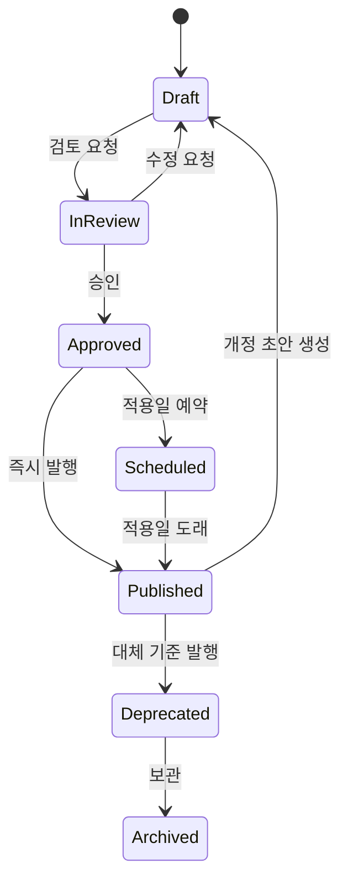
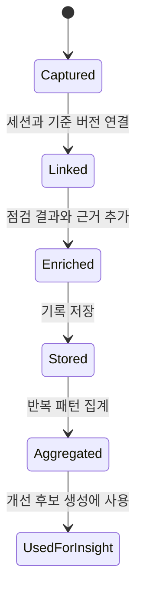
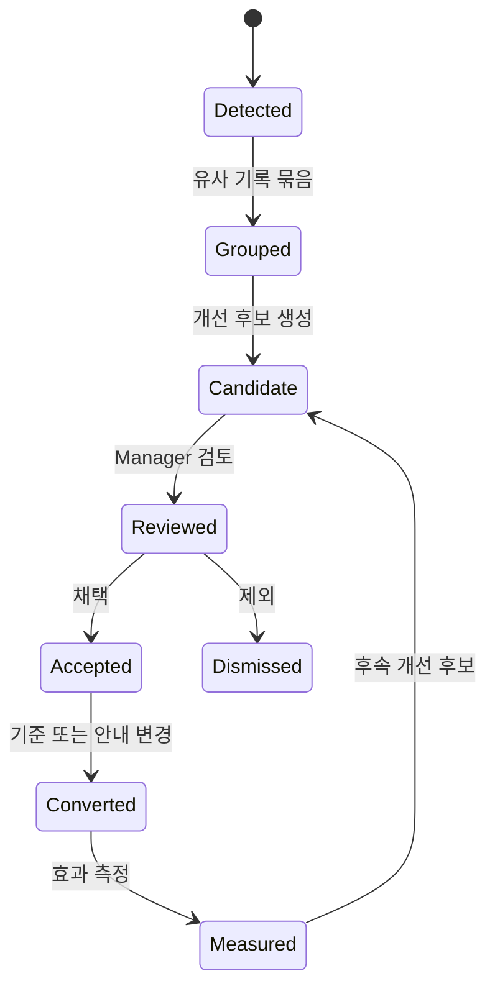

# 03. 데이터 생명주기

## 1. 목적

이 문서는 제품에서 다루는 데이터를 3가지 생명주기로 나눕니다.

```text
Guideline Data -> User Activity Data -> Insight Data -> Guideline Data
```

핵심은 원천 데이터와 파생 데이터를 섞지 않는 것입니다.

- Guideline Data는 Manager가 관리하는 공식 기준입니다.
- User Activity Data는 Consumer와 Agent가 남기는 원천 기록입니다.
- Insight Data는 User Activity Data를 해석해서 만든 개선 후보입니다.

Insight는 사용자 기록 그 자체가 아닙니다.
사용자 기록을 묶고 해석한 결과입니다.

## 2. 데이터 영역

| Domain | Core Question | Representative Data |
| --- | --- | --- |
| Guideline Data | 무엇이 공식 기준인가? | 정책, 규칙, 템플릿, 에셋, 버전, 발행 상태 |
| User Activity Data | 사용자가 무엇을 했고 어디서 막혔는가? | 질문, 검색, 조회, 클릭, 다운로드, 작업 세션, 제출, 점검, 피드백 |
| Insight Data | 어떤 반복 문제를 기준 개선으로 바꿀 것인가? | 반복 패턴, 개선 후보, Manager 검토, 채택/제외, 반영 결과, 효과 측정 |

## 3. Guideline Data

Guideline Data는 제품의 원천 데이터입니다.
Consumer와 Agent는 발행된 Guideline Data만 기준으로 사용합니다.

### 포함 데이터

| Data | Meaning |
| --- | --- |
| Policy | 브랜드가 지향하거나 지켜야 하는 상위 기준 |
| Rule | Policy를 실제 작업에 적용할 수 있게 낮춘 판단 단위 |
| Template | Consumer가 작업을 시작할 때 사용하는 제한된 형식 |
| Asset | 정책과 규칙을 적용할 때 사용하는 공식 파일 또는 참고 자료 |
| Version | 특정 시점에 공식으로 적용되는 기준 묶음 |
| Exception | 일반 정책이나 규칙을 그대로 적용하기 어려울 때 허용되는 별도 판단 |

### 상태

| State | Meaning | Exposure |
| --- | --- | --- |
| Draft | 작성 중인 기준 | Manager |
| In Review | 검토 중인 기준 | Manager |
| Approved | 승인되었지만 아직 적용 전인 기준 | Manager |
| Published | 현장에 적용 중인 공식 기준 | Consumer, Agent |
| Scheduled | 특정 일자부터 적용될 기준 | Manager, 필요 시 Consumer |
| Deprecated | 더 이상 권장하지 않는 기준 | Manager |
| Archived | 운영 종료된 기준 | Manager |

### 흐름



### 저장해야 하는 메타데이터

- 작성자
- 검토자
- 승인자
- 적용 시작일
- 적용 종료일
- 버전
- 변경 사유
- 대체 기준
- 관련 어플리케이션 타입
- 관련 템플릿

## 4. User Activity Data

User Activity Data는 사용자가 제품 안에서 남기는 원천 기록입니다.
질문 데이터만 의미하지 않습니다.

User Activity Data에는 검색, 조회, 작업 세션, 제출, 자가 점검, Manager 피드백까지 포함됩니다.
이 데이터는 Insight의 재료가 되지만, 그 자체가 Insight는 아닙니다.

### 포함 데이터

| Data | Meaning |
| --- | --- |
| Query | Consumer가 입력한 질문, 검색어, 상황 설명 |
| View Event | 기준, 규칙, 에셋, 템플릿, FAQ를 본 기록 |
| Click Event | 버튼, 기준 링크, 추천 항목, 필터를 선택한 기록 |
| Download Event | 공식 에셋이나 템플릿을 내려받은 기록 |
| Work Session | 어플리케이션 타입, 템플릿, 입력값, 업로드 자산이 연결된 작업 단위 |
| Check Result | 제출 전 점검 결과와 위반 항목 |
| Submission | Manager 검토를 위해 제출된 작업물 |
| Review Feedback | 승인, 반려, 수정 요청, 규칙 연결 코멘트 |
| Agent Response | Agent가 제공한 답변, 근거, 신뢰도, 후속 행동 |

### 상태

| State | Meaning |
| --- | --- |
| Captured | 사용자의 행동이나 작업 결과가 기록됨 |
| Linked | 사용자, 세션, 어플리케이션 타입, 기준 버전과 연결됨 |
| Enriched | Agent 근거, 점검 결과, 피드백 같은 해석 정보가 추가됨 |
| Stored | 분석 가능한 형태로 저장됨 |
| Aggregated | 반복 질문, 반복 위반, 자주 본 기준처럼 집계됨 |
| Used for Insight | Insight 후보 생성에 사용됨 |

### 흐름



### 저장해야 하는 메타데이터

- 사용자 또는 익명 세션
- 작업 세션
- 어플리케이션 타입
- 기준 버전
- 관련 정책 또는 규칙
- 관련 템플릿 또는 에셋
- 질문 원문
- Agent 답변과 근거
- 점검 결과
- 제출 상태
- Manager 피드백
- 이벤트 발생 시각

## 5. Insight Data

Insight Data는 User Activity Data를 해석해서 만든 파생 데이터입니다.
반복 질문, 반복 위반, 반려 사유, 조회 행동을 묶어 Manager가 판단할 수 있는 개선 후보로 만듭니다.

Insight는 자동으로 정책이나 규칙을 바꾸지 않습니다.
Agent와 System은 후보를 만들고, Manager가 채택 여부를 결정합니다.

### 포함 데이터

| Data | Meaning |
| --- | --- |
| Pattern | 여러 기록에서 반복되는 질문, 위반, 반려, 탐색 행동 |
| Candidate | 기준 개선으로 검토할 수 있는 후보 |
| Evidence | 후보를 뒷받침하는 질문, 점검 결과, 제출, 피드백, 조회 기록 |
| Decision | Manager의 채택, 보류, 제외 판단 |
| Converted Change | 정책, 규칙, 템플릿, FAQ, 실행 가이드에 반영된 변경 |
| Impact Result | 변경 이후 질문 수, 반려율, 재작업 횟수 같은 효과 측정 |

### 상태

| State | Meaning |
| --- | --- |
| Detected | 반복 패턴이 감지됨 |
| Grouped | 유사 기록이 하나의 이슈로 묶임 |
| Candidate | 개선 후보로 생성됨 |
| Reviewed | Manager가 검토함 |
| Accepted | 개선 대상으로 채택됨 |
| Dismissed | 의미 없는 패턴으로 제외됨 |
| Converted | 정책, 규칙, 템플릿, FAQ, 실행 가이드 변경으로 전환됨 |
| Measured | 변경 이후 효과가 측정됨 |

### 흐름



### 저장해야 하는 메타데이터

- 관련 User Activity Data
- 반복 횟수
- 영향을 받은 어플리케이션 타입
- 영향을 받은 정책 또는 규칙
- 대표 질문 또는 대표 반려 사유
- Agent 요약
- Manager 결정
- 반영된 변경 ID
- 변경 전후 지표
- 후속 개선 필요 여부

## 6. 데이터 연결 규칙

3가지 데이터는 다음 규칙으로 연결합니다.

| Link | Rule |
| --- | --- |
| Guideline -> User Activity | 사용 기록에는 당시 적용된 정책, 규칙, 버전 스냅샷을 남깁니다. |
| User Activity -> Insight | Insight는 단일 이벤트가 아니라 반복되거나 의미 있는 기록 묶음에서 만듭니다. |
| Insight -> Guideline | 채택된 Insight만 정책, 규칙, 템플릿, FAQ, 실행 가이드 변경으로 전환합니다. |
| Guideline -> Insight | 기준 변경 후에는 이전 User Activity와 비교해 효과를 측정합니다. |

## 7. 설계 원칙

- Agent는 정책과 규칙을 직접 변경하지 않습니다.
- User Activity Data는 Insight 생성을 위해 저장하지만, 불필요한 개인정보는 남기지 않습니다.
- Insight는 근거 기록 없이 생성하지 않습니다.
- 제출물과 점검 결과에는 당시 적용된 기준 버전을 보존합니다.
- Published 상태가 아닌 Guideline Data는 Consumer 화면과 Agent 답변 근거에서 제외합니다.
