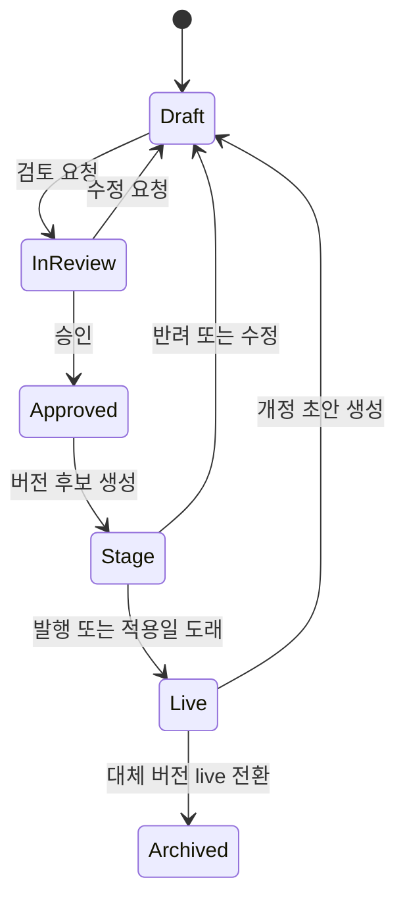
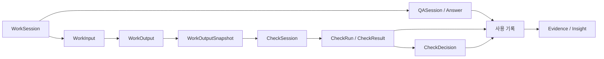
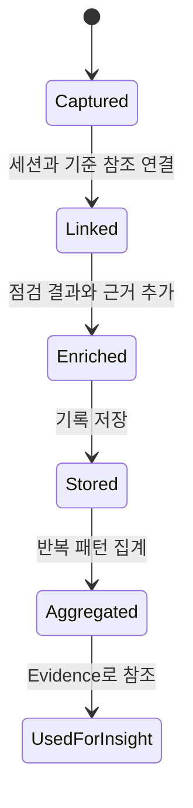
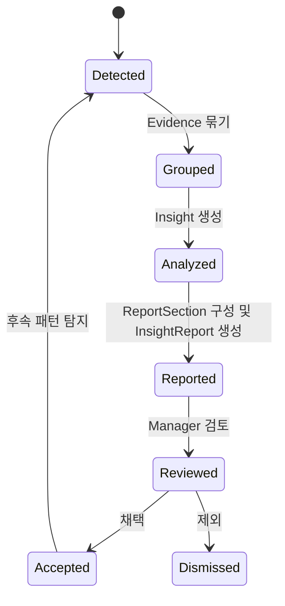

# 03. 데이터 생명주기

## 1. 목적

이 문서는 브랜드 운영 시스템에서 데이터가 생성되고, 기록되고, 인사이트와 공식 버전 발행으로 이어지는 흐름을 정리합니다.
기준은 [02. 유즈케이스](02-usecases.md), [04. 도메인 모델](04-domain-model.md), [05. 시스템 아키텍처](05-system-architecture.md)의 최신 구조입니다.

핵심은 원천 기준, 실행 기록, 파생 인사이트를 섞지 않는 것입니다.

```text
가이드라인 기준
  -> 제작과 품질 검수 기록
  -> 사용 기록과 도메인 이벤트
  -> Evidence와 Insight
  -> InsightReport
  -> Version(stage/live/archived)
  -> 가이드라인 기준
```

## 2. 데이터 영역

| 영역 | 핵심 질문 | 대표 데이터 | 소유 도메인 |
| --- | --- | --- | --- |
| 가이드라인 기준 | 무엇이 공식 기준인가? | BrandGuideline, GuidelinePage, PagePolicy, Rule, RuleException, Payload revision records | 가이드라인 관리 |
| 브랜드 자원 | 어떤 공식 자원을 사용할 수 있는가? | BrandAsset, Template, Plugin, 각 Version | 가이드라인 관리 |
| 제작 기록 | Worker가 무엇을 만들었는가? | WorkSession, WorkInput, WorkOutput, GuidelineVersionRef | 제작 관리 |
| 품질 검수 기록 | 산출물이 기준에 맞는가? | QASession, Answer, CheckSession, CheckRun, CheckResult, CheckDecision | 품질 검수 |
| 사용 기록 | 사용자가 무엇을 했고 어디서 막혔는가? | SessionEventLog, SessionEvent, BehaviorEventLog, PageViewEvent, ClickEvent, AssetDownloadEvent, SectionDwellEvent | 사용 기록 |
| 운영 인사이트 | 어떤 반복 문제를 기준 개선으로 바꿀 것인가? | Evidence, Pattern, Insight, InsightReport | 운영 인사이트 |
| 공식 버전 | 어떤 기준과 자원이 stage/live/archived 상태인가? | BrandGuidelineVersion, RuleVersion, BrandAssetVersion, TemplateVersion, PluginVersion | 가이드라인 관리 |

사용 기록은 세션 이벤트와 화면 행동 기록을 저장하는 지원 서브도메인입니다.
운영 인사이트는 사용 기록과 도메인 이벤트를 Evidence로 참조합니다.

## 3. 가이드라인 기준 생명주기

가이드라인 기준은 Manager가 관리하는 공식 기준입니다.
Worker와 Agent는 발행된 기준만 사용합니다.

### 3.1 포함 데이터

| 데이터 | 의미 |
| --- | --- |
| BrandGuideline | 브랜드 가이드라인 전체 구조 |
| GuidelineSection | 가이드라인의 상위 장 |
| GuidelinePage | Worker와 Manager가 읽는 페이지 단위 |
| PagePolicy | GuidelinePage가 1:1로 소유하는 정책 설명 |
| Rule | 여러 페이지, 답변, 검수, 인사이트에서 재사용되는 판단 기준 |
| RuleException | Rule 아래에서 관리하는 예외 조건 |
| BrandAsset | 공식 이미지, 로고, 아이콘, 참고 파일 |
| Template | Worker가 산출물을 만들 때 사용하는 공식 형식 |
| Plugin | Worker가 산출물을 만들 때 사용하는 공식 제작 기능 |
| BrandGuidelineVersion | Worker와 Agent가 참조하는 공식 가이드라인 버전 |
| RuleVersion | 판단 기준으로 사용하는 공식 규칙 버전 |
| BrandAssetVersion | 공식으로 사용할 수 있는 브랜드 자원 버전 |
| TemplateVersion | 제작에 사용할 수 있는 공식 템플릿 버전 |
| PluginVersion | 제작에 사용할 수 있는 공식 플러그인 버전 |
| Payload revision record | Payload가 기록한 CMS 내부 수정 이력 |

### 3.2 상태

| 상태 | 의미 | 노출 대상 |
| --- | --- | --- |
| Draft | 작성 중인 기준 또는 자원 | Manager |
| In Review | 검토 중인 기준 또는 자원 | Manager |
| Approved | 승인되었지만 아직 공식 버전이 되지 않은 기준 또는 자원 | Manager |
| stage | 발행 후보 또는 예약된 공식 Version | Manager |
| live | 현장에 적용 중인 공식 Version | Worker, Agent |
| archived | 운영 종료된 공식 Version | Manager |

Version은 `stage`, `live`, `archived` 상태를 가집니다.
Payload revision은 CMS 내부 저장 이력이고, Version은 Worker와 Agent가 사용하는 공식 단위입니다.

### 3.3 흐름



### 3.4 저장해야 하는 메타데이터

- 작성자
- 검토자
- 승인자
- 편집 상태
- 적용 시작일
- 적용 종료일
- 버전
- 버전 사유
- 대체 기준
- 관련 TemplateVersionRef
- 관련 PluginVersionRef
- 관련 Insight 또는 InsightReport

## 4. 제작과 품질 검수 기록 생명주기

제작 관리는 WorkSession과 WorkOutput을 만들고, 품질 검수는 검수 시점의 WorkOutputSnapshot을 참조합니다.
품질 검수는 CheckSession 단위로 요청, 실행, 결과, 최종 판정을 관리합니다.

### 4.1 포함 데이터

| 데이터 | 의미 |
| --- | --- |
| WorkSession | Worker가 산출물을 만들기 시작한 작업 단위 |
| WorkInput | 템플릿 또는 플러그인 실행에 사용한 입력값 |
| WorkOutput | 제작 결과물 |
| WorkOutputSnapshot | 검수나 분석에 사용할 수 있도록 특정 시점의 산출물을 고정한 기록 |
| GuidelineVersionRef | 작업이나 검수에 적용된 BrandGuideline 버전 참조 |
| TemplateVersionRef | 작업에 사용한 Template 버전 참조 |
| PluginVersionRef | 작업에 사용한 Plugin 버전 참조 |
| QASession | WorkSession 맥락에서 발생한 질문과 답변 묶음 |
| CheckSession | 특정 WorkOutputSnapshot에 대한 검수 흐름 |
| CheckTarget | CheckSession이 소유하는 검수 대상 값 |
| CheckRun | CheckSession 안에서 실행된 점검 1회 |
| CheckResult | Rule 기준으로 확인한 위반, 결과, 추천 |
| CheckDecision | System 또는 Agent가 내린 최종 검수 판정 |
| AgentRunRef | Agent 실행 이력 참조 |

### 4.2 흐름



### 4.3 저장해야 하는 메타데이터

- 사용자 또는 익명 세션
- WorkSession
- ApplicationTypeRef
- GuidelineVersionRef
- TemplateVersionRef
- PluginVersionRef
- WorkOutputSnapshot
- 관련 Rule
- Answer, Recommendation, AnswerCitation
- CheckOutcome, Violation
- CheckDecision
- AgentRunRef
- 이벤트 발생 시각

## 5. 사용 기록 생명주기

사용 기록은 사용자가 제품 안에서 남긴 행동과 각 도메인에서 발생한 이벤트를 조회 가능한 형태로 저장합니다.
WorkSession, QASession, CheckSession에서 발생한 이벤트는 SessionEventLog에 저장합니다.
페이지 조회와 클릭 같은 화면 행동은 BehaviorEventLog에 저장합니다.
운영자는 사용 기록으로 작업 흐름, Agent 실행, 검수 세션과 점검 실행 이력을 확인할 수 있습니다.

### 5.1 이벤트 유형

| 이벤트 | 의미 |
| --- | --- |
| SessionEvent | WorkSession, QASession, CheckSession에서 발생한 세션 이벤트 |
| WorkEvent | 작업 시작, 입력 변경, 미리보기 생성, 산출물 생성, 작업 완료 기록 |
| QAEvent | 질문, 답변, 답변 근거 생성 기록 |
| CheckEvent | 검수 세션 시작, 점검 실행, 점검 결과, 최종 판정 기록 |
| AgentRunEvent | Agent 답변, 점검, 추천, 요약 생성 실행 기록 |
| PageViewEvent | 페이지 조회 기록 |
| ClickEvent | 가이드라인 화면 클릭 기록 |
| AssetDownloadEvent | 가이드라인 화면에서 에셋을 다운로드한 기록 |
| SectionDwellEvent | 가이드라인 화면의 특정 구간 체류 기록 |
| CustomEvent | 화면별 추가 분석 이벤트 |
| SessionData | 사용자, 조직, 플랜 같은 공통 이벤트 속성 |

BehaviorEventLog는 화면 행동 기록 조회와 인사이트 근거 수집에 사용합니다.
구현은 Umami `track`, `identify`를 사용합니다.
WorkSession, QASession, CheckSession처럼 감사 추적이 필요한 도메인 이벤트는 제품 DB의 SessionEventLog에 남깁니다.

### 5.2 운영 조회 화면

| 화면 | 목적 |
| --- | --- |
| 세션 이벤트 탐색 | 사용자 행동과 작업 흐름을 시간순으로 확인합니다. |
| 화면 행동 기록 보기 | 가이드라인 화면 조회, 클릭, 에셋 다운로드, 특정 구간 체류 흐름을 확인합니다. |
| WorkSession Event Log | WorkSession의 시작, 입력 변경, 산출물 생성, 완료 기록을 확인합니다. |
| Agent Run Log | Agent 실행 결과, 신뢰도, 참조 근거를 확인합니다. |
| Check History | WorkOutputSnapshot별 CheckSession과 CheckRun 이력을 확인합니다. |

### 5.3 상태

| 상태 | 의미 |
| --- | --- |
| Captured | 세션 이벤트와 화면 행동 기록이 기록됨 |
| Linked | 사용자, 세션, WorkSession, GuidelineVersionRef와 연결됨 |
| Enriched | Agent 근거, 점검 결과, 추천 같은 해석 정보가 추가됨 |
| Stored | 조회와 분석이 가능한 형태로 저장됨 |
| Aggregated | 반복 질문, 반복 위반, 자주 본 기준처럼 집계됨 |
| UsedForInsight | Evidence로 묶여 인사이트 생성에 사용됨 |

### 5.4 흐름



저장 위치는 초기에는 Payload collection과 Umami를 함께 사용할 수 있습니다.
로그가 많아져 Admin 목록 성능, 보관 기간, 검색 조건이 문제가 될 때 별도 사용 기록 저장소로 분리합니다.

## 6. 운영 인사이트 생명주기

운영 인사이트는 사용 기록과 도메인 이벤트를 해석해서 만든 파생 데이터입니다.
Insight는 자동으로 기준을 바꾸지 않습니다.
Manager는 InsightReport에서 Insight와 개선 방향을 검토하고 채택 여부를 기록합니다.

### 6.1 포함 데이터

| 데이터 | 의미 |
| --- | --- |
| Evidence | 질문, 점검 결과, 산출물 스냅샷, 추천, 조회 기록 같은 근거 |
| Pattern | 여러 기록에서 반복되는 질문, 위반, 검수 실패, 탐색 행동 |
| Insight | Manager가 판단할 수 있게 정리된 반복 문제 |
| ReportSection | Insight를 반복 질문, 반복 위반, 자원 사용 같은 관점으로 묶은 보고서 섹션 |
| InsightReport | 여러 ReportSection과 개선 방향을 기간과 독자 기준으로 묶은 보고서 |

### 6.2 상태

| 상태 | 의미 |
| --- | --- |
| Detected | 반복 패턴이 감지됨 |
| Grouped | 유사 기록이 하나의 문제 단위로 묶임 |
| Analyzed | Pattern이 Manager가 판단할 수 있는 Insight로 전환됨 |
| Reported | ReportSection과 개선 방향이 InsightReport로 제공됨 |
| Reviewed | Manager가 InsightReport에서 Insight와 개선 방향을 검토함 |
| Accepted | InsightReport에서 Insight가 유효한 개선 근거로 채택됨 |
| Dismissed | 의미 없는 패턴으로 제외됨 |

### 6.3 흐름



### 6.4 저장해야 하는 메타데이터

- Evidence 참조
- 반복 횟수
- 영향을 받은 ApplicationTypeRef
- 영향을 받은 Rule
- 영향을 받은 TemplateVersionRef 또는 PluginVersionRef
- 대표 질문 또는 대표 검수 실패 사유
- Agent 요약과 AgentRunRef
- ExpectedImpact
- ReportSection 참조
- InsightReport 참조
- Manager 결정
- 후속 관찰 지표

## 7. 데이터 연결 규칙

| 연결 | 규칙 |
| --- | --- |
| BrandGuideline Version -> WorkSession | WorkSession에는 당시 적용된 GuidelineVersionRef를 남깁니다. |
| Template / Plugin -> WorkSession | WorkSession에는 사용한 TemplateVersionRef와 PluginVersionRef를 남깁니다. |
| WorkSession -> Quality Check | 품질 검수는 WorkOutputSnapshot을 CheckTarget으로 참조하고 CheckSession에서 관리합니다. |
| Quality Check -> Rule | CheckResult와 Recommendation은 가능한 경우 Rule을 참조합니다. |
| 도메인 이벤트 -> 사용 기록 | 주요 행동과 도메인 이벤트는 사용 기록에 조회 가능한 형태로 저장합니다. |
| 사용 기록 -> Insight | Insight는 단일 이벤트가 아니라 반복되거나 의미 있는 Evidence 묶음에서 만듭니다. |
| Insight -> ReportSection | Insight는 보고서 섹션에 배치됩니다. |
| ReportSection -> InsightReport | ReportSection은 보고서로 묶인 뒤 Manager에게 제공됩니다. |

## 8. 설계 원칙

- live Version이 아닌 기준은 Worker 화면과 Agent 답변 근거에서 제외합니다.
- Agent는 정책과 규칙을 직접 변경하지 않습니다.
- 사용 기록은 지원 서브도메인이며, 운영 인사이트는 필요한 기록을 Evidence로 참조합니다.
- Insight는 Evidence 없이 생성하지 않습니다.
- CheckSession에는 당시 적용된 GuidelineVersionRef를 보존합니다.
- Insight는 ReportSection과 InsightReport를 거쳐 Manager가 검토할 수 있는 개선 근거로 제공됩니다.
- 불필요한 개인정보는 사용 기록에 남기지 않습니다.
