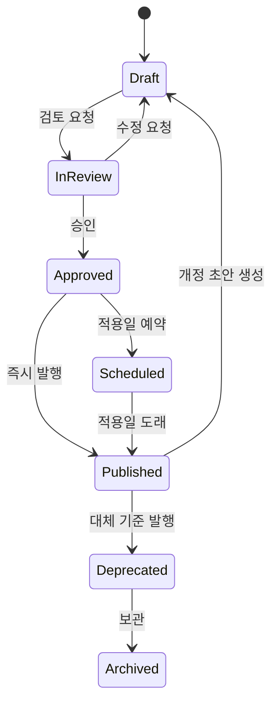
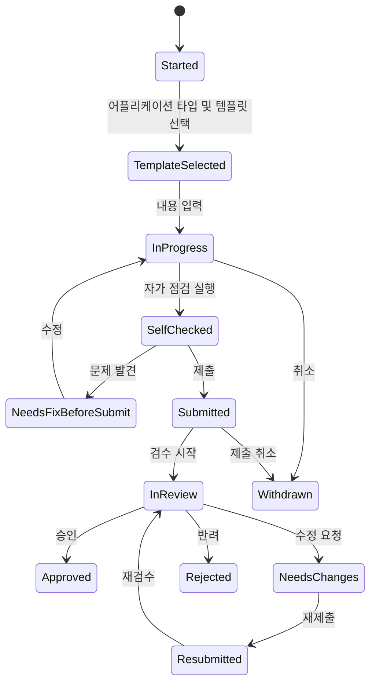
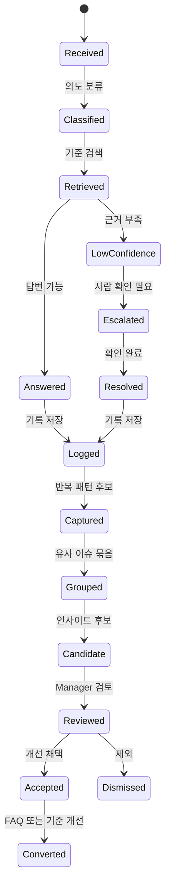

# 03. 데이터 생명주기

## 1. 목적

Manager, Consumer, Agent 데이터의 상태와 전이를 정리합니다.

01번 제품 문서의 S2는 사용 기록 저장 영역입니다.
이 문서에서는 S2에 남는 기록을 작업 결과 기록과 사용 행동 기록으로 나누어 봅니다.

상태 설계의 핵심은 다음과 같습니다.

- Manager 데이터는 발행 상태가 중요합니다.
- Consumer 데이터는 제출과 검수 상태가 중요합니다.
- Agent 데이터는 근거, 신뢰도, 사람 검토 필요 여부가 중요합니다.
- 사용 행동 데이터는 무엇을 자주 보고 오래 머물렀는지가 중요합니다.

## 2. 데이터 영역

| Domain | Core Question | Representative Data |
| --- | --- | --- |
| Manager Data | 무엇이 공식 기준인가? | 브랜드 가이드라인, 정책, 규칙, 템플릿, 승인 상태, 버전 |
| Consumer Data | 사용자가 무엇을 만들고 있는가? | 작업물, 입력값, 선택한 템플릿, 업로드 이미지, 제출 상태 |
| Agent Data | 무엇을 물었고 어떤 근거로 답했는가? | 질문, 답변, 검색 근거, 체크 결과, 피드백, 인사이트 |
| Usage Data | 사용자가 무엇을 자주 참고하고 어디서 머물렀는가? | 조회 항목, 체류 시간, 다운로드한 에셋, 클릭한 기준 |

## 3. Manager 데이터 생명주기

Manager 데이터는 공식 기준입니다. 작성 중인 기준과 현장에 적용 가능한 기준을 명확히 분리해야 합니다.

### 상태

| State | Meaning | Exposure |
| --- | --- | --- |
| Draft | 작성 중인 기준 | Manager만 |
| In Review | 검토 중인 기준 | Manager |
| Approved | 승인되었지만 아직 적용 전인 기준 | Manager |
| Published | 현장에 적용 중인 공식 기준 | Consumer, Agent |
| Scheduled | 특정 일자부터 적용될 기준 | Manager, 필요 시 Consumer에게 예고 |
| Deprecated | 더 이상 권장하지 않는 기준 | Manager, 필요 시 Agent 근거에서 제외 |
| Archived | 운영 종료된 기준 | Manager만 |

### 흐름

### 메타데이터

- 작성자
- 검토 담당 Manager
- 승인 담당 Manager
- 적용 시작일
- 적용 종료일
- 버전
- 변경 사유
- 대체 기준
- 관련 어플리케이션 타입
- 관련 템플릿

## 4. Consumer 데이터 생명주기

Consumer 데이터는 실제 작업물의 상태를 추적합니다. 핵심은 사용자가 어디서 막혔는지와 어떤 기준 때문에 반려되었는지를 남기는 것입니다.

### 상태

| State | Meaning | Actors |
| --- | --- | --- |
| Started | 작업 시작 | Consumer |
| Template Selected | 템플릿 선택 완료 | Consumer |
| In Progress | 입력 또는 편집 중 | Consumer |
| Self Checked | 제출 전 자가 점검 완료 | Consumer, Agent |
| Needs Fix Before Submit | 제출 전 수정 필요 | Consumer, Agent |
| Submitted | 검수 요청됨 | Consumer, Manager |
| In Review | 검수 중 | Manager |
| Needs Changes | 수정 요청됨 | Manager, Consumer |
| Resubmitted | 수정 후 재제출됨 | Consumer, Manager |
| Approved | 승인됨 | Manager |
| Rejected | 사용 불가로 반려됨 | Manager |
| Withdrawn | 사용자가 제출을 취소함 | Consumer |

### 흐름

### 메타데이터

- 작업자
- 어플리케이션 타입
- 선택한 템플릿
- 입력값
- 업로드 자산
- 기준이 된 Manager 데이터 버전
- 자가 점검 결과
- 검수 상태
- 반려 사유
- 재작업 횟수
- 승인자
- 최종 승인일

## 5. 사용 행동 데이터 생명주기

사용 행동 데이터는 Consumer가 가이드라인을 탐색하고 이해하는 과정에서 생깁니다.
핵심은 단순 조회 수가 아니라 기준 개선에 도움이 되는 행동을 남기는 것입니다.

### 상태

| State | Meaning |
| --- | --- |
| Captured | 조회, 클릭, 다운로드, 체류 시간이 기록됨 |
| Linked | 어플리케이션 타입, 기준, 규칙, 에셋, 작업 세션과 연결됨 |
| Aggregated | 자주 본 항목, 오래 머문 항목, 자주 다운로드한 에셋으로 집계됨 |
| Interpreted | Agent가 이해하기 어려운 기준이나 보강이 필요한 에셋으로 해석함 |
| Reported | Manager가 볼 수 있는 개선 후보 리포트에 포함됨 |

### 메타데이터

- 사용자 또는 익명 세션
- 작업 세션
- 어플리케이션 타입
- 조회한 기준 또는 규칙
- 조회한 에셋
- 체류 시간
- 다운로드 횟수
- 이벤트 발생 시각
- 기준 버전

## 6. Agent 데이터 생명주기

Agent 데이터는 기준 데이터, 작업 데이터, 사용 행동 데이터를 연결하는 과정에서 생깁니다.

### 질문 상태

| State | Meaning |
| --- | --- |
| Received | 질문 접수 |
| Classified | 질문 의도 분류 |
| Retrieved | 관련 기준 검색 완료 |
| Answered | 답변 생성 완료 |
| Low Confidence | 근거 부족 또는 신뢰도 낮음 |
| Escalated | Manager 확인 필요 |
| Resolved | 사용자 또는 운영자가 해결 확인 |
| Logged | 분석 가능한 기록으로 저장 |

### 점검 상태

| State | Meaning |
| --- | --- |
| Requested | 작업물 점검 요청 |
| Context Attached | 작업물, 템플릿, 규칙 버전 연결 |
| Rules Evaluated | 적용 가능한 규칙 평가 |
| Passed | 문제 없음 |
| Warning | 주의 필요 |
| Failed | 수정 필요 |
| Human Review Required | 자동 판단 불가 |
| Feedback Generated | 수정 지시 생성 |
| Stored | 결과 저장 |

### 인사이트 상태

| State | Meaning |
| --- | --- |
| Captured | 질문, 실패, 반려 패턴 감지 |
| Grouped | 유사 이슈 묶음 |
| Candidate | 인사이트 후보 생성 |
| Reviewed | Manager 검토 완료 |
| Accepted | 개선 과제로 채택 |
| Dismissed | 의미 없는 패턴으로 제외 |
| Converted | FAQ, 규칙 개정, 템플릿 개선으로 전환 |

### 흐름

## 7. 데이터 연결 이벤트

| Link | Meaning | Example |
| --- | --- | --- |
| Manager -> Consumer | 공식 기준이 작업에 적용됨 | 특정 템플릿과 체크리스트가 어플리케이션 타입에 노출됨 |
| Consumer -> Agent | 실제 작업 맥락이 질문과 점검에 연결됨 | 작업물이 어떤 기준을 위반했는지 점검 |
| Agent -> Consumer | 쉬운 답변 또는 수정 지시 제공 | "로고를 오른쪽으로 옮기세요" |
| Agent -> Manager | 반복 문제를 운영 인사이트로 전환 | 같은 반려 사유가 많아 규칙 설명을 개선 |
| Consumer -> Manager | 작업 결과가 기준 개선 근거가 됨 | 특정 템플릿에서 반복 오류가 발생 |
| Consumer -> System | 사용 행동이 개선 근거로 저장됨 | 특정 규칙 페이지 체류 시간이 길고 같은 질문이 반복됨 |
