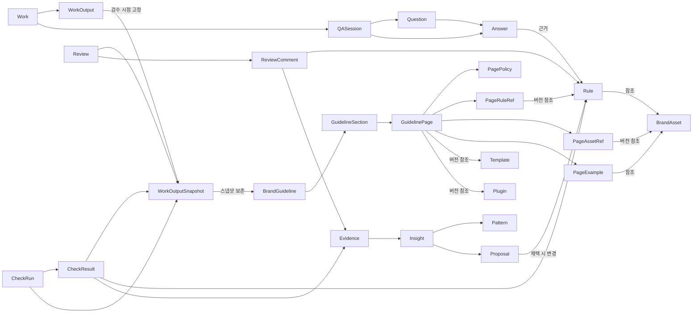

# 04. 도메인 모델

## 1. 목적

이 문서는 브랜드 운영 시스템의 도메인, 서브도메인, 바운디드 컨텍스트, 도메인 모델을 정의합니다.
목표는 개발자가 Payload collection과 관계를 설계하기 전에 모델 경계를 먼저 합의할 수 있게 만드는 것입니다.

## 2. 용어

| Term | Meaning |
| --- | --- |
| 도메인 | 제품이 해결하려는 가장 큰 업무 영역 |
| 서브도메인 | 도메인을 책임과 문제 기준으로 나눈 하위 영역 |
| 바운디드 컨텍스트 | 같은 용어와 규칙이 일관되게 쓰이는 경계 |
| 애그리거트(관리 단위) | 함께 생성, 수정, 삭제되어야 하는 도메인 객체 묶음 |
| 엔티티 | 고유한 식별자와 생명주기를 갖는 객체 |
| 값 객체 | 식별자보다 값 자체가 중요한 객체 |
| 도메인 서비스 | 특정 객체 하나에 넣기 어려운 도메인 규칙 |
| 도메인 이벤트 | 도메인에서 이미 일어난 중요한 사건 |

## 3. 도메인 구성

```text
[도메인] 브랜드 운영 시스템
 ├── [서브도메인] 가이드라인 관리
 ├── [서브도메인] 제작 관리
 ├── [서브도메인] 품질 검수
 └── [서브도메인] 운영 인사이트
```

브랜드 운영 시스템은 가이드라인을 문서로 보관하는 시스템이 아니라, 기준을 구조화하고, 산출물 제작과 품질 검수를 거쳐, 사용 기록을 다시 개선 근거로 연결하는 시스템입니다.

## 4. 가이드라인 관리

가이드라인 관리는 브랜드 가이드라인, 공식 자원, 변경 이력을 관리하는 서브도메인입니다.
GuidelinePage는 단순 텍스트 묶음이 아니라 PagePolicy, Rule 참조, BrandAsset 참조, Template 참조, Plugin 참조, 화면 구성을 묶은 발행 단위입니다.
Rule은 여러 페이지에서 재사용될 수 있으므로 GuidelinePage 내부 엔티티가 아니라 독립 애그리거트(관리 단위)입니다.

```text
[도메인] 브랜드 운영 시스템
 └── [서브도메인] 가이드라인 관리
      ├── [바운디드 컨텍스트] 브랜드 가이드라인 편집 및 발행
      │    └── [도메인 모델]
      │         ├── 애그리거트(관리 단위): BrandGuideline
      │         │    ├── 엔티티: GuidelineSection
      │         │    ├── 엔티티: GuidelinePage
      │         │    │    ├── 엔티티: PagePolicy
      │         │    │    ├── 엔티티: PageRuleRef
      │         │    │    ├── 엔티티: PageAssetRef
      │         │    │    ├── 엔티티: PageExample
      │         │    │    └── 값 객체: PageComposition, DisplayOrder
      │         │    └── 값 객체: GuidelineVersion, PublishStatus, EffectivePeriod
      │         ├── 애그리거트(관리 단위): Rule
      │         │    ├── 엔티티: RuleException
      │         │    └── 값 객체: RuleType, Severity, RuleScope, RuleCondition, RequiredCopy, ForbiddenCopy, ExceptionReason
      │         ├── 도메인 서비스: GuidelinePublishService, RuleConflictCheckService
      │         └── 도메인 이벤트
      │              ├── GuidelineDraftCreated, GuidelineSubmittedForReview, GuidelineApproved
      │              ├── GuidelinePublished, GuidelineScheduled, GuidelineDeprecated
      │              ├── GuidelinePageUpdated, PagePolicyUpdated, PageRuleLinked, PageAssetLinked
      │              └── RuleChanged, RuleExceptionAdded
      ├── [바운디드 컨텍스트] 브랜드 자원 관리
      │    └── [도메인 모델]
      │         ├── 애그리거트(관리 단위): BrandAsset
      │         │    ├── 엔티티: AssetFile
      │         │    └── 값 객체: AssetType, AssetVersion, UsageCondition, DownloadStatus
      │         ├── 애그리거트(관리 단위): Template
      │         │    ├── 엔티티: TemplateFile, TemplateField
      │         │    └── 값 객체: TemplateVersion, TemplateUsageCondition
      │         ├── 애그리거트(관리 단위): Plugin
      │         │    ├── 엔티티: PluginEntry, PluginCapability
      │         │    └── 값 객체: PluginType, PluginVersion, PluginUsageCondition
      │         ├── 도메인 서비스: AssetPublishService, TemplatePublishService, PluginPublishService
      │         └── 도메인 이벤트
      │              ├── BrandAssetRegistered, BrandAssetPublished, BrandAssetDeprecated
      │              ├── TemplateRegistered, TemplatePublished, TemplateDeprecated
      │              ├── PluginRegistered, PluginPublished, PluginDeprecated
      │              └── ResourceLinkedToGuideline
      └── [바운디드 컨텍스트] 변경 이력 추적
           └── [도메인 모델]
                ├── 애그리거트(관리 단위): GuidelineChange
                │    └── 값 객체: ChangeReason, ChangedField, ChangeSource, ChangeSummary, PreviousReference, NextReference, RelatedInsight
                ├── 도메인 서비스: GuidelineChangeRecordService, GuidelineVersionDiffService
                └── 도메인 이벤트
                     ├── GuidelineChangeRecorded, GuidelineVersionLinked
                     └── GuidelineChangeApplied, GuidelineChangeImpactRequested
```

BrandGuideline은 사용자가 읽는 가이드라인 구조를 관리합니다.
GuidelineSection은 BrandGuideline의 상위 장이고, GuidelinePage는 실제 화면이나 문서에서 읽는 단위입니다.

GuidelinePage는 PagePolicy를 1:1로 소유하고, Rule, BrandAssetVersion, TemplateVersion, PluginVersion은 참조합니다.
PageRuleRef와 PageAssetRef는 페이지 안에서의 표시 순서, 강조, 캡션, 예시 역할을 함께 기록합니다.

Rule은 점검, 검토 코멘트, Agent 답변, 운영 인사이트에서 직접 참조하는 판단 기준입니다.
RuleException은 Rule 안에서 관리하고, 예외가 여러 규칙에 재사용되거나 별도 승인 워크플로우를 가질 때만 독립 애그리거트(관리 단위)로 분리합니다.

브랜드 가이드라인 편집 및 발행은 현재 가이드라인 내용과 발행 상태를 관리하고, 변경 이력 추적은 변경 사유, 적용일, 이전 버전과의 연결을 기록합니다.

BrandAsset은 로고, 이미지, 아이콘처럼 공식으로 배포되는 브랜드 자산입니다.
Template은 Worker가 작업을 시작할 때 사용하는 공식 형식입니다.
Plugin은 Worker가 산출물을 만들 때 사용할 수 있는 공식 제작 기능입니다.
PluginEntry는 제품에서 호출할 수 있는 Plugin 실행 단위이고, PluginCapability는 Plugin이 제공하는 제작 기능입니다.
GuidelinePage와 Rule은 BrandAsset, Template, Plugin을 참조할 수 있지만, 파일 또는 버전 교체와 배포 상태는 브랜드 자원 관리가 담당합니다.

## 5. 제작 관리

제작 관리는 Worker가 내장 기능, Plugin, Template을 활용해 산출물을 만드는 서브도메인입니다.
검수 요청과 승인/반려 판단은 품질 검수에서 관리합니다.

```text
[도메인] 브랜드 운영 시스템
 └── [서브도메인] 제작 관리
      └── [바운디드 컨텍스트] 산출물 제작
           └── [도메인 모델]
                ├── 애그리거트(관리 단위): Work
                │    ├── 엔티티: Work, WorkInput, WorkOutput
                │    └── 값 객체: WorkPurpose, ApplicationTypeRef, TemplateVersionRef, PluginVersionRef, GuidelineSnapshotRef, WorkStatus
                ├── 도메인 서비스: WorkStartService, WorkRenderService
                └── 도메인 이벤트: WorkStarted, WorkInputChanged, WorkPreviewGenerated, WorkOutputCreated, WorkCompleted
```

Work는 Worker가 산출물을 만들기 시작한 작업 단위입니다.
WorkOutput은 제작 결과물이고, 품질 검수는 필요한 시점의 WorkOutputSnapshot을 검수 대상으로 참조합니다.

## 6. 품질 검수

품질 검수는 WorkOutputSnapshot이 기준에 맞는지 점검하고, 질문과 검토 피드백을 기준에 연결하는 서브도메인입니다.

```text
[도메인] 브랜드 운영 시스템
 └── [서브도메인] 품질 검수
      ├── [바운디드 컨텍스트] 질의응답
      │    └── [도메인 모델]
      │         ├── 애그리거트(관리 단위): QASession
      │         │    ├── 엔티티: Question, Answer
      │         │    └── 값 객체: AnswerCitation, AnswerConfidence, AgentRunRef
      │         ├── 도메인 서비스: AnswerGenerationService
      │         └── 도메인 이벤트: QuestionAsked, AnswerProvided
      └── [바운디드 컨텍스트] 산출물 검수
           └── [도메인 모델]
                ├── 애그리거트(관리 단위): CheckRun
                │    ├── 엔티티: CheckRun, CheckResult
                │    └── 값 객체: ReviewTarget, GuidelineSnapshotRef, CheckOutcome, Violation, Recommendation, AgentRunRef
                ├── 애그리거트(관리 단위): Review
                │    ├── 엔티티: Review, ReviewComment
                │    └── 값 객체: ReviewTarget, GuidelineSnapshotRef, ReviewDecision, RejectionReason
                ├── 도메인 서비스: QualityCheckService, ReviewRecommendationService
                └── 도메인 이벤트: CheckCompleted, ReviewCompleted
```

Question과 Answer는 각각 독립 애그리거트(관리 단위)로 보지 않습니다.
질문 삭제, 질문 수정, 질문 종료는 Answer와 함께 움직일 가능성이 높으므로 QASession 애그리거트(관리 단위) 안에서 관리합니다.

CheckResult와 ReviewComment는 가능하면 Rule을 참조합니다.
Agent와 System은 점검과 설명을 보조할 수 있지만, 승인, 반려, 수정 요청의 최종 결정은 Manager가 합니다.
Agent 자체는 도메인 애그리거트(관리 단위)로 두지 않고, Answer, CheckResult, Recommendation에 AgentRunRef를 남겨 실행 이력만 추적합니다.

## 7. 운영 인사이트

운영 인사이트는 질문, 점검 실패, 반려 사유, 사용 행동을 분석해 개선 근거를 만들고 Manager에게 제공하는 서브도메인입니다.
사용 행동과 로그 이벤트는 운영 인사이트가 소유하지 않고, UsageEventLog와 각 도메인 이벤트를 Evidence로 참조합니다.

```text
[도메인] 브랜드 운영 시스템
 └── [서브도메인] 운영 인사이트
      ├── [바운디드 컨텍스트] 인사이트 도출
      │    └── [도메인 모델]
      │         ├── 애그리거트(관리 단위): Insight
      │         │    ├── 엔티티: Insight, Evidence, Pattern, Proposal
      │         │    └── 값 객체: InsightStatus, PatternType, ExpectedImpact
      │         ├── 도메인 서비스: InsightDiscoveryService
      │         └── 도메인 이벤트: InsightDiscovered, ProposalAccepted
      └── [바운디드 컨텍스트] 인사이트 제공
           └── [도메인 모델]
                ├── 애그리거트(관리 단위): InsightReport
                │    ├── 엔티티: ReportSection, InsightSummary
                │    └── 값 객체: ReportPeriod, ReportAudience
                ├── 도메인 서비스: InsightReportService
                └── 도메인 이벤트: InsightReportPublished, InsightReviewed
```

Insight는 반복 패턴, 근거, 개선 제안을 하나의 흐름으로 묶은 분석 결과물입니다.
인사이트 보고서(InsightReport)는 Manager가 인사이트를 검토하고 우선순위를 판단할 수 있게 제공하는 읽기 단위입니다.
Proposal은 채택되어야 가이드라인 관리에서 실제 BrandGuideline 또는 Rule 변경으로 반영됩니다.

## 8. 핵심 관계



## 9. 설계 원칙

- GuidelinePage는 PagePolicy를 소유하고, Rule, BrandAssetVersion, TemplateVersion, PluginVersion을 참조하는 읽기 단위입니다.
- Rule은 여러 GuidelinePage에서 재사용할 수 있는 독립 애그리거트(관리 단위)입니다.
- QASession은 Question과 Answer를 함께 관리하는 애그리거트(관리 단위)입니다.
- Answer, CheckResult, ReviewComment는 Rule을 근거로 참조할 수 있어야 합니다.
- Agent는 도메인 애그리거트(관리 단위)가 아니며, AgentRunRef로 실행 이력만 남깁니다.
- 품질 검수는 Work를 직접 소유하지 않고, 검수 시점의 WorkOutputSnapshot과 GuidelineSnapshotRef를 참조합니다.
- Review는 Manager의 최종 판단 기록입니다.
- Insight는 Evidence, Pattern, Proposal을 함께 관리하는 분석 결과물입니다.
- Proposal은 자동으로 기준을 바꾸지 않습니다.
- Published 상태가 아닌 기준은 Worker 화면과 점검 기준에서 제외합니다.
