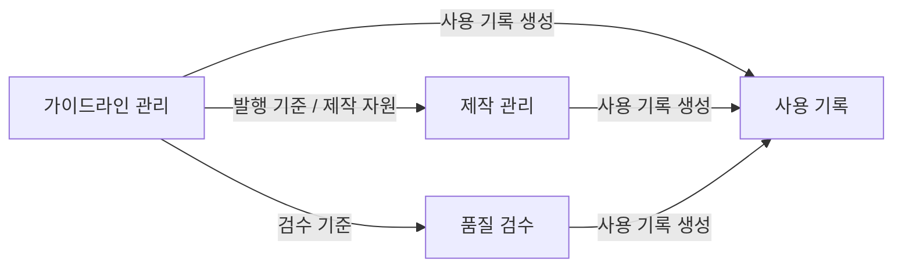
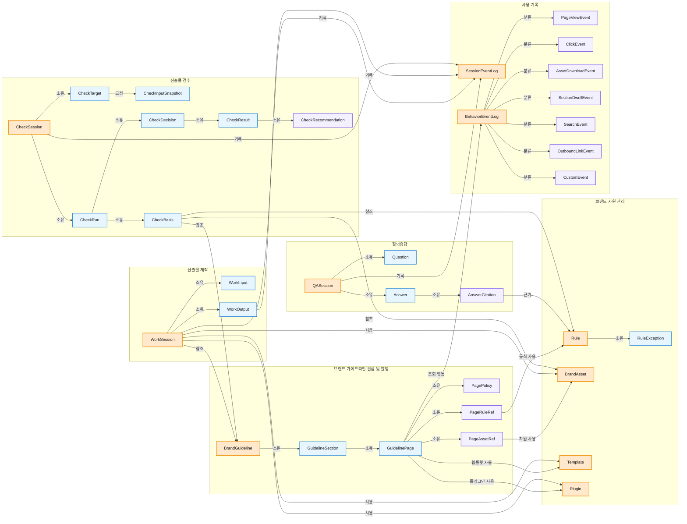
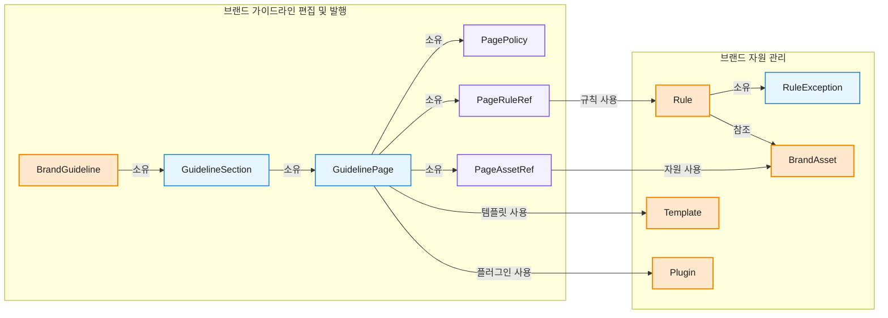
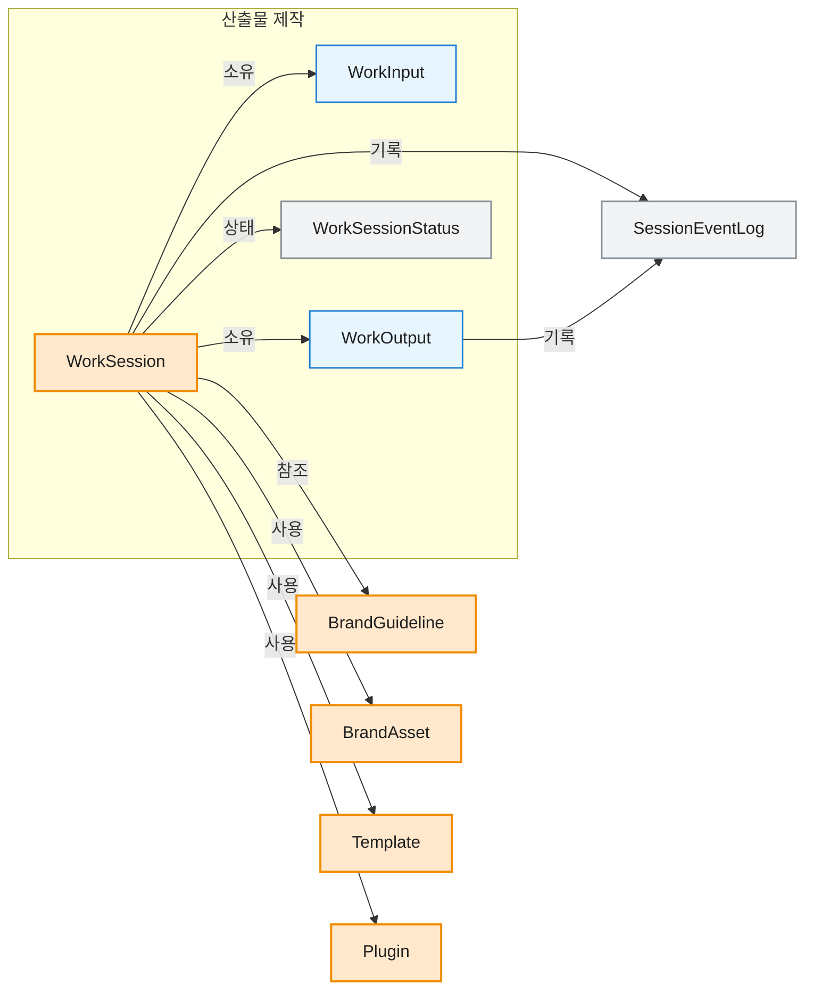
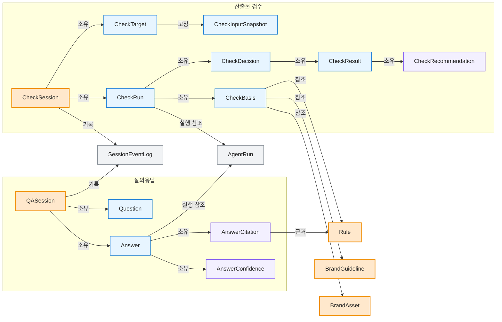

# 04. 도메인 모델

## 1. 목적

이 문서는 브랜드 운영 시스템의 도메인, 서브도메인, 바운디드 컨텍스트, 도메인 모델을 정의합니다.
목표는 개발자가 Payload collection과 관계를 설계하기 전에 모델 경계를 먼저 합의할 수 있게 만드는 것입니다.

## 2. 용어

| Term | Meaning |
| --- | --- |
| 도메인 | 제품이 해결하려는 가장 큰 업무 영역 |
| 서브도메인 | 도메인을 책임과 문제 기준으로 나눈 하위 영역 |
| 바운디드 컨텍스트 | 같은 용어와 규칙이 일관되게 쓰이는 경계 |
| 애그리거트(관리 단위) | 함께 생성, 수정, 삭제되어야 하는 도메인 객체 묶음 |
| 엔티티 | 고유한 식별자와 생명주기를 갖는 객체 |
| 값 객체 | 식별자보다 값 자체가 중요한 객체 |
| 도메인 서비스 | 특정 객체 하나에 넣기 어려운 도메인 규칙 |
| 도메인 이벤트 | 도메인에서 이미 일어난 중요한 사건 |

## 3. 도메인 구성

```text
[도메인] 브랜드 운영 시스템
 ├── [핵심 서브도메인] 가이드라인 관리
 ├── [핵심 서브도메인] 제작 관리
 ├── [핵심 서브도메인] 품질 검수
 └── [지원 서브도메인] 사용 기록
```

브랜드 운영 시스템은 가이드라인을 문서로 보관하는 시스템이 아니라, 기준을 구조화하고, 산출물 제작과 품질 검수를 거쳐, 사용 기록을 남기는 시스템입니다.

### 상위 도메인 관계도

상위 관계도는 서비스 호출이나 세부 이벤트 흐름이 아니라 도메인 간 계약을 보여줍니다.
엣지는 도메인 간에 전달되거나 참조되는 대표 산출물, 기준, 근거 단위로 표현합니다.



| 관계 | 엣지 의미 | 대표 데이터 |
| --- | --- | --- |
| 가이드라인 관리 -> 제작 관리 | 제작이 발행된 기준과 자원을 참조합니다. | GuidelineVersionRef, BrandAssetVersionRef, TemplateVersionRef, PluginVersionRef |
| 가이드라인 관리 -> 품질 검수 | 검수가 live 기준, 규칙, 에셋 버전을 참조합니다. | GuidelineVersionRef, RuleVersionRef, BrandAssetVersionRef |
| 가이드라인 관리 -> 사용 기록 | 가이드라인 화면 행동과 공식 버전 발행 결과를 기록합니다. | BehaviorEventLog, 발행 Version |
| 제작 관리 -> 사용 기록 | 제작 과정에서 감사 가능한 세션 이벤트를 남깁니다. | SessionEventLog |
| 품질 검수 -> 사용 기록 | 질의, 검수 세션, 점검 결과를 세션 이벤트로 남깁니다. | SessionEventLog |

### 하위 도메인 관계도

이 관계도는 바운디드 컨텍스트와 핵심 객체의 참조 방향을 함께 보여줍니다.
제작 관리는 산출물을 만들고 사용 기록을 남깁니다.
품질 검수는 CheckTarget에 검수 입력을 고정하고, CheckRun의 CheckBasis에서 발행된 Guideline, Rule, BrandAsset 버전을 참조합니다.
하위 관계도의 엣지는 소유, 참조, 포함, 기록 같은 관계 동사로 표현합니다.
`GuidelineVersionRef`, `RuleVersionRef`, `BrandAssetVersionRef`, `TemplateVersionRef`, `PluginVersionRef`, `AgentRunRef`처럼 별도 생명주기가 없는 참조 값은 객체 노드로 표현하지 않습니다.
단, `PageRuleRef`와 `PageAssetRef`는 페이지 안 표시 순서, 강조, 캡션, 예시 역할을 함께 담으므로 객체로 표현합니다.
세부 도메인 이벤트명은 각 도메인 모델 목록에만 둡니다.



| 관계 | 의미 |
| --- | --- |
| GuidelinePage -> PagePolicy | 페이지는 정책 설명을 1:1로 소유합니다. |
| GuidelinePage -> RuleVersion / BrandAssetVersion / TemplateVersion / PluginVersion | 페이지는 재사용 가능한 규칙과 자원을 버전으로 참조합니다. |
| WorkSession -> BrandGuideline / BrandAsset / Template / Plugin | 제작은 발행 기준, 에셋, 템플릿, 플러그인을 사용하고 해당 버전을 고정합니다. |
| WorkSession -> SessionEventLog | 제작 활동과 산출물 생성 결과는 사용 기록으로 남습니다. |
| QASession / CheckSession -> SessionEventLog | 질문, 답변, 검수 결과는 사용 기록으로 남습니다. |
| GuidelinePage -> BehaviorEventLog | 가이드라인 화면 조회, 클릭, 검색, 에셋 다운로드, 특정 구간 체류, 외부 링크 클릭 같은 화면 행동은 화면 행동 기록으로 남깁니다. |
| CheckSession -> CheckTarget | 품질 검수는 별도 실행될 때 검수 대상 값을 소유합니다. |
| CheckRun -> CheckBasis | 점검 실행은 검수 시점의 기준 묶음을 소유합니다. |
| CheckBasis -> BrandGuideline / RuleVersion / BrandAssetVersion | 기준 묶음은 검수 시점의 가이드라인, 규칙, 에셋 버전을 참조합니다. |
| CheckDecision -> CheckResult | 최종 판정은 여러 점검 결과를 소유합니다. |
| CheckResult -> CheckRecommendation | 점검 결과는 필요한 수정 권장 사항을 소유합니다. |
| BrandGuideline / Rule / BrandAsset / Template / Plugin -> Version | 발행 대상은 공식 Version을 만들고, Version은 이전 버전과 Payload revision 참조를 보존합니다. |

## 4. 가이드라인 관리

가이드라인 관리는 브랜드 가이드라인, 공식 자원, 공식 버전을 관리하는 서브도메인입니다.
GuidelinePage는 단순 텍스트 묶음이 아니라 PagePolicy, RuleVersion 참조, BrandAsset 참조, Template 참조, Plugin 참조, 화면 구성을 묶은 발행 단위입니다.
Rule은 여러 페이지, 템플릿, 플러그인, 검수에서 재사용되는 브랜드 자원 관리의 독립 애그리거트(관리 단위)입니다.

```text
[도메인] 브랜드 운영 시스템
 └── [서브도메인] 가이드라인 관리
      ├── [바운디드 컨텍스트] 브랜드 가이드라인 편집 및 발행
      │    └── [도메인 모델]
      │         ├── 애그리거트(관리 단위): BrandGuideline
      │         │    ├── 엔티티: BrandGuidelineVersion
      │         │    ├── 엔티티: GuidelineSection
      │         │    ├── 엔티티: GuidelinePage
      │         │    │    ├── 엔티티: PagePolicy
      │         │    │    ├── 엔티티: PageRuleRef
      │         │    │    ├── 엔티티: PageAssetRef
      │         │    │    ├── 엔티티: PageExample
      │         │    │    └── 값 객체: PageComposition, DisplayOrder
      │         │    └── 값 객체: GuidelineStatus, EffectivePeriod
      │         ├── 도메인 서비스: GuidelinePublishService, VersionPublishService, VersionCompareService
      │         └── 도메인 이벤트
      │              ├── GuidelineDraftCreated, GuidelineSubmittedForReview, GuidelineApproved
      │              ├── GuidelinePublished, GuidelineScheduled, GuidelineDeprecated
      │              ├── GuidelinePageUpdated, PagePolicyUpdated, PageRuleLinked, PageAssetLinked
      │              └── GuidelineVersionStaged, GuidelineVersionPublished, GuidelineVersionArchived
      ├── [바운디드 컨텍스트] 브랜드 자원 관리
      │    └── [도메인 모델]
      │         ├── 애그리거트(관리 단위): Rule
      │         │    ├── 엔티티: RuleVersion
      │         │    ├── 엔티티: RuleException
      │         │    └── 값 객체: RuleType, Severity, RuleScope, RuleCondition, RequiredCopy, ForbiddenCopy, ExceptionReason
      │         ├── 애그리거트(관리 단위): BrandAsset
      │         │    ├── 엔티티: AssetFile
      │         │    ├── 엔티티: BrandAssetVersion
      │         │    └── 값 객체: AssetType, UsageCondition, DownloadStatus
      │         ├── 애그리거트(관리 단위): Template
      │         │    ├── 엔티티: TemplateVersion
      │         │    └── 값 객체: TemplateSourceRef, LayoutSpec, TextStyleSpec, EditableBlockSpec, TemplateUsageCondition
      │         ├── 애그리거트(관리 단위): Plugin
      │         │    ├── 엔티티: PluginEntry, PluginCapability, PluginVersion
      │         │    └── 값 객체: PluginType, PluginUsageCondition
      │         ├── 도메인 서비스: RuleConflictCheckService, AssetPublishService, TemplatePublishService, PluginPublishService, VersionPublishService, VersionCompareService
      │         └── 도메인 이벤트
      │              ├── RuleUpdated, RuleExceptionAdded
      │              ├── BrandAssetRegistered, BrandAssetPublished, BrandAssetDeprecated
      │              ├── TemplateRegistered, TemplatePublished, TemplateDeprecated
      │              ├── PluginRegistered, PluginPublished, PluginDeprecated
      │              ├── ResourceLinkedToGuideline
      │              ├── RuleVersionStaged, RuleVersionPublished, RuleVersionArchived
      │              ├── BrandAssetVersionStaged, BrandAssetVersionPublished, BrandAssetVersionArchived
      │              ├── TemplateVersionStaged, TemplateVersionPublished, TemplateVersionArchived
      │              └── PluginVersionStaged, PluginVersionPublished, PluginVersionArchived
      └── [공통 값 객체]
           ├── VersionNumber, VersionStatus(stage/live/archived), PayloadRevisionRef
           └── PreviousVersionRef, VersionReason, VersionResourceType
```

### 가이드라인 관리 하위 도메인 관계도



BrandGuideline은 사용자가 읽는 가이드라인 구조를 관리합니다.
GuidelineSection은 BrandGuideline의 상위 장이고, GuidelinePage는 실제 화면이나 문서에서 읽는 단위입니다.
GuidelineVersionRef는 BrandGuideline이 소유한 공식 Version을 WorkSession과 CheckBasis가 참조하기 위해 저장하는 값 객체입니다.

GuidelinePage는 PagePolicy를 1:1로 소유하고, RuleVersion, BrandAssetVersion, TemplateVersion, PluginVersion은 참조합니다.
PageRuleRef와 PageAssetRef는 페이지 안에서의 표시 순서, 강조, 캡션, 예시 역할을 함께 기록합니다.

Rule은 CheckBasis와 Agent 답변에서 참조하는 판단 기준입니다.
RuleException은 Rule 안에서 관리하고, 예외가 여러 규칙에 재사용되거나 별도 승인 워크플로우를 가질 때만 독립 애그리거트(관리 단위)로 분리합니다.

공식 버전 전환은 별도 애그리거트를 만들지 않고, 각 원본 애그리거트가 소유한 Version 엔티티의 stage/live/archived 상태를 바꾸는 서비스 흐름으로 둡니다.
Version 이벤트는 공통 이름만 쓰지 않고, producer 또는 resource type을 식별할 수 있게 기록합니다.
예를 들어 가이드라인은 GuidelineVersionPublished, 브랜드 에셋은 BrandAssetVersionPublished처럼 구분합니다.

BrandAsset은 로고, 이미지, 아이콘처럼 공식으로 배포되는 브랜드 자산입니다.
Template은 Worker가 작업을 시작할 때 사용하는 공식 형식입니다.
TemplateSourceRef는 Figma node 또는 업로드 파일 원본을 가리키고, LayoutSpec, TextStyleSpec, EditableBlockSpec은 제작 가능한 편집 구조를 정의합니다.
Plugin은 Worker가 산출물을 만들 때 사용할 수 있는 공식 제작 기능입니다.
PluginEntry는 제품에서 호출할 수 있는 Plugin 실행 단위이고, PluginCapability는 Plugin이 제공하는 제작 기능입니다.
GuidelinePage와 Rule은 BrandAsset, Template, Plugin을 참조할 수 있지만, 파일 또는 버전 교체와 배포 상태는 브랜드 자원 관리가 담당합니다.

## 5. 제작 관리

제작 관리는 Worker가 내장 기능, Plugin, Template을 활용해 브랜드 에셋 산출물을 만들고 Work records를 남기는 서브도메인입니다.
검수 요청과 Agent/System 판정은 품질 검수에서 관리합니다.
제작 관리는 WorkSession, WorkInput, WorkOutput을 소유하고, 가이드라인과 브랜드 자원은 Production resource lookup을 통해 참조합니다.

```text
[도메인] 브랜드 운영 시스템
 └── [서브도메인] 제작 관리
      └── [바운디드 컨텍스트] 산출물 제작
           └── [도메인 모델]
                ├── 애그리거트(관리 단위): WorkSession
                │    ├── 엔티티: WorkSession, WorkInput, WorkOutput
                │    └── 값 객체: WorkPurpose, ApplicationTypeRef, GuidelineVersionRef, BrandAssetVersionRef, TemplateVersionRef, PluginVersionRef, WorkSessionStatus
                ├── 도메인 서비스: Brand asset generation service
                └── 도메인 이벤트: WorkSessionStarted, WorkInputChanged, WorkPreviewGenerated, WorkOutputCreated, WorkSessionCompleted
```

### 제작 관리 하위 도메인 관계도



WorkSession은 Worker가 산출물을 만들기 시작한 작업 단위입니다.
WorkOutput은 제작 결과물이고, 품질 검수는 필요한 시점의 검수 입력을 CheckInputSnapshot으로 고정합니다.
WorkSession, WorkInput, WorkOutput은 Work records로 저장하고, BrandGuideline, BrandAsset, Template, Plugin은 제작에 필요한 참조 자원으로 조회합니다.
가이드라인 화면의 조회, 클릭, 검색, 에셋 다운로드, 구간 체류, 외부 링크 클릭은 제작 관리가 아니라 화면 행동 기록으로 수집합니다.

## 6. 품질 검수

품질 검수는 CheckInputSnapshot에 고정된 입력이 기준에 맞는지 점검하고, 질문과 검수 결과를 기준에 연결하는 서브도메인입니다.

```text
[도메인] 브랜드 운영 시스템
 └── [서브도메인] 품질 검수
      ├── [바운디드 컨텍스트] 질의응답
      │    └── [도메인 모델]
      │         ├── 애그리거트(관리 단위): QASession
      │         │    ├── 엔티티: Question, Answer
      │         │    └── 값 객체: AnswerCitation, AnswerConfidence, AgentRunRef
      │         ├── 도메인 서비스: Answer generation service
      │         └── 도메인 이벤트: QuestionAsked, AnswerProvided
      ├── [바운디드 컨텍스트] 산출물 검수
      │    └── [도메인 모델]
      │         ├── 애그리거트(관리 단위): CheckSession
      │         │    ├── 엔티티: CheckTarget
      │         │    ├── 엔티티: CheckInputSnapshot
      │         │    ├── 엔티티: CheckRun
      │         │    │    ├── 엔티티: CheckBasis
      │         │    │    │    └── 값 객체: GuidelineVersionRef, RuleVersionRef, BrandAssetVersionRef
      │         │    │    └── 엔티티: CheckDecision
      │         │    │         └── 엔티티: CheckResult
      │         │    │              └── 엔티티: CheckRecommendation
      │         │    └── 값 객체: CheckOutcome, Violation, AgentRunRef
      │         ├── 도메인 서비스: Quality check service
      │         └── 도메인 이벤트: CheckSessionStarted, CheckRunCompleted, CheckCompleted
      └── [실행 기록 카탈로그]
           └── AgentRunStarted, AgentRunCompleted, AgentRunFailed
```

### 품질 검수 하위 도메인 관계도



Question과 Answer는 각각 독립 애그리거트(관리 단위)로 보지 않습니다.
질문 삭제, 질문 수정, 질문 종료는 Answer와 함께 움직일 가능성이 높으므로 QASession 애그리거트(관리 단위) 안에서 관리합니다.
품질 검수 화면에서 발생한 질문, 답변, 검수 세션, 점검 실행은 사용 기록으로 남깁니다.
가이드라인 화면의 조회, 클릭, 검색, 에셋 다운로드, 구간 체류, 외부 링크 클릭은 품질 검수가 아니라 화면 행동 기록으로 수집합니다.

CheckRun은 CheckBasis를 소유하고, CheckBasis는 검수 시점의 Guideline, Rule, BrandAsset 버전을 참조합니다.
CheckInputSnapshot은 검수 입력을 재현하기 위한 ID를 가진 불변 엔티티입니다.
CheckDecision은 CheckRun 안에서 최종 판정을 표현하고, 여러 CheckResult를 소유합니다.
Agent와 System은 점검, 설명, 최종 검수 판정을 수행합니다.
Agent 자체는 도메인 애그리거트(관리 단위)로 두지 않고, Answer, CheckResult, CheckRecommendation에 AgentRunRef를 남겨 실행 이력만 추적합니다.
AgentRunStarted, AgentRunCompleted, AgentRunFailed는 업무 도메인 이벤트가 아니라 Agent 실행 기록 이벤트입니다.

## 7. 사용 기록

사용 기록은 WorkSession, QASession, CheckSession이 발행한 세션 이벤트와 가이드라인 화면 행동을 저장하는 지원 서브도메인입니다.

```text
[도메인] 브랜드 운영 시스템
 └── [서브도메인] 사용 기록
      ├── [바운디드 컨텍스트] 세션 이벤트 기록
      │    └── [도메인 모델]
      │         ├── 애그리거트(관리 단위): SessionEventLog
      │         │    ├── 엔티티: SessionEvent
      │         │    └── 값 객체: EventType, ActorRef, SourceRef, OccurredAt, EventPayload
      │         ├── 도메인 서비스: Session event service
      │         └── 도메인 이벤트: SessionEventCaptured
      └── [바운디드 컨텍스트] 화면 행동 기록
           └── [도메인 모델]
                ├── 애그리거트(관리 단위): BehaviorEventLog
                │    ├── 엔티티: PageViewEvent, ClickEvent, SearchEvent, AssetDownloadEvent, SectionDwellEvent, OutboundLinkEvent, CustomEvent
                │    └── 값 객체: PageRef, ElementRef, Duration, SessionData
                ├── 도메인 서비스: Behavior event service
                └── 도메인 이벤트: BehaviorEventCaptured
```

| 기록 | 적용 도메인 | 역할 |
| --- | --- | --- |
| SessionEventLog | 제작 관리, 품질 검수 | 감사 가능한 세션 이벤트를 저장합니다. |
| BehaviorEventLog | 가이드라인 관리 | 화면 조회, 클릭, 검색, 에셋 다운로드, 구간 체류, 외부 링크 클릭을 저장합니다. |
