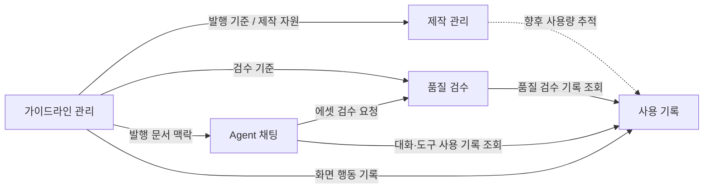
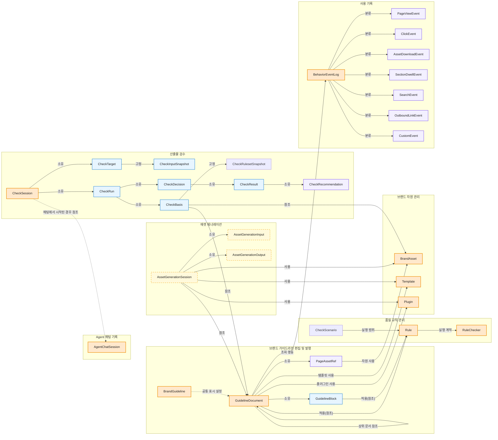
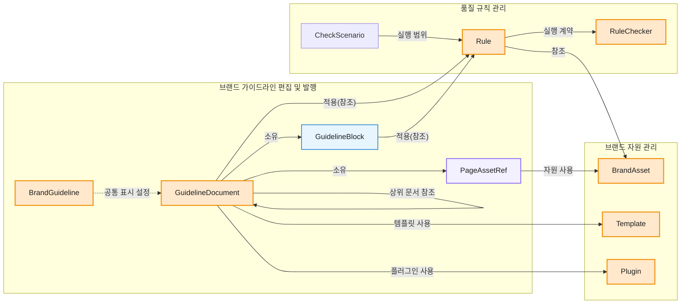
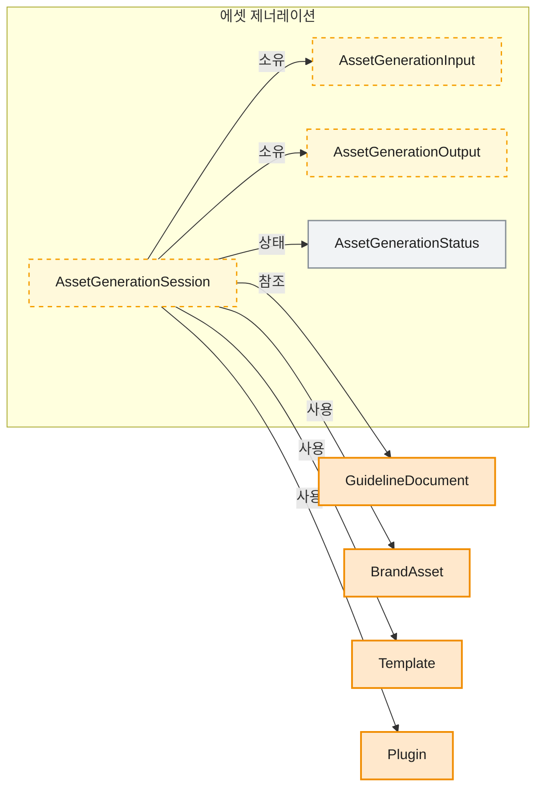
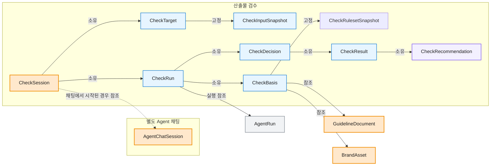

# 04. 도메인 모델

## 1. 목적

이 문서는 브랜드 운영 시스템의 도메인, 서브도메인, 바운디드 컨텍스트, 도메인 모델을 정의합니다.
목표는 개발자가 Payload collection과 관계를 설계하기 전에 모델 경계를 먼저 합의할 수 있게 만드는 것입니다.

## 2. 용어

| Term | Meaning |
| --- | --- |
| 도메인 | 제품이 해결하려는 가장 큰 업무 영역 |
| 서브도메인 | 도메인을 책임과 문제 기준으로 나눈 하위 영역 |
| 바운디드 컨텍스트 | 같은 용어와 규칙이 일관되게 쓰이는 경계 |
| 애그리거트(관리 단위) | 함께 생성, 수정, 삭제되어야 하는 도메인 객체 묶음 |
| 엔티티 | 고유한 식별자와 생명주기를 갖는 객체 |
| 값 객체 | 식별자보다 값 자체가 중요한 객체 |
| 도메인 서비스 | 특정 객체 하나에 넣기 어려운 도메인 규칙 |
| 도메인 이벤트 | 도메인에서 이미 일어난 중요한 사건 |

## 3. 도메인 구성

```text
[도메인] 브랜드 운영 시스템
 ├── [핵심 서브도메인] 가이드라인 관리
 ├── [핵심 서브도메인] 제작 관리
 ├── [핵심 서브도메인] 품질 검수
 ├── [지원 서브도메인] Agent 채팅
 └── [지원 서브도메인] 사용 기록
```

브랜드 운영 시스템은 가이드라인을 문서로 보관하는 시스템이 아니라, 기준을 구조화하고, 산출물 제작과 품질 검수를 거쳐, 사용 기록을 남기는 시스템입니다.

### 구현 상태 기준

| 상태 | 모델 |
| --- | --- |
| 현재 구현 | `GuidelineDocument`, `Rule`, `GeneratedImage`, `CheckSession`, `AgentChatSession`, `BehaviorEventLog` |
| 계획 | `AssetGenerationSession`, `AssetGenerationInput`, `AssetGenerationOutput` |

`CheckSession`은 업로드 이미지와 생성 이미지를 검사하는 품질 검수 애그리거트입니다.
`AgentChatSession`은 대화, 도구 호출, 사용량을 기록하는 별도 운영 애그리거트이며 품질 검수 세션을 대신하지 않습니다.
`AssetGenerationSession`은 향후 제작 사용량 추적에 필요할 때 도입합니다. 현재 프로파일 기반 이미지 파일은 `GeneratedImage`로 저장하지만 제작 세션이나 범용 `AssetGenerationOutput`은 저장하지 않습니다.

### 상위 도메인 관계도

상위 관계도는 서비스 호출이나 세부 이벤트 흐름이 아니라 도메인 간 계약을 보여줍니다.
엣지는 도메인 간에 전달되거나 참조되는 대표 산출물, 기준, 근거 단위로 표현합니다.



| 관계 | 엣지 의미 | 대표 데이터 |
| --- | --- | --- |
| 가이드라인 관리 -> 제작 관리 | 제작이 발행된 기준과 자원을 참조합니다. | ResourceRef |
| 가이드라인 관리 -> 품질 검수 | 검수가 live 상태의 Official Version과 그 안의 Check를 참조합니다. | GuidelineVersionRef, CheckRulesetSnapshot, BrandAssetVersionRef |
| 가이드라인 관리 -> Agent 채팅 | 채팅이 발행 문서를 답변과 도구 실행 맥락으로 읽습니다. | GuidelineDocument read model |
| 가이드라인 관리 -> 사용 기록 | 가이드라인 화면 행동을 기록합니다. | BehaviorEventLog |
| Agent 채팅 -> 품질 검수 | 채팅 도구가 에셋 검수를 요청합니다. 검수 결과와 생명주기는 CheckSession이 소유합니다. | CheckSessionRef |
| Agent 채팅 -> 사용 기록 | 운영 조회에서 대화, 도구·스킬 사용과 AI 사용량을 읽습니다. | AgentChatSession |
| 제작 관리 -> 사용 기록 | 사용량 추적을 도입하면 에셋 제너레이션 기록을 읽습니다. 현재는 저장하지 않습니다. | AssetGenerationSession, AssetGenerationOutput(계획) |
| 품질 검수 -> 사용 기록 | 운영 조회에서 에셋 검수 기록을 읽습니다. | CheckSession, CheckResult |

### 하위 도메인 관계도

이 관계도는 바운디드 컨텍스트와 핵심 객체의 참조 방향을 함께 보여줍니다.
제작 관리는 현재 요청 범위에서 산출물을 만듭니다. Brand asset generation records는 향후 사용량 추적을 위한 계획 모델입니다.
품질 검수는 CheckTarget에 검수 입력을 고정하고, CheckRun의 CheckBasis에서 Guideline, CheckRulesetSnapshot, BrandAsset의 VersionRef를 참조합니다.
하위 관계도의 엣지는 소유, 참조, 포함, 기록 같은 관계 동사로 표현합니다.
`GuidelineVersionRef`, `CheckKey`, `BrandAssetVersionRef`, `TemplateVersionRef`, `PluginVersionRef`, `AgentRunRef`처럼 별도 생명주기가 없는 참조 값은 객체 노드로 표현하지 않습니다.
단, `GuidelineBlock`과 `PageAssetRef`는 화면 구성, 표시 순서, 캡션, 예시 역할을 함께 담으므로 객체로 표현합니다.
세부 도메인 이벤트명은 각 도메인 모델 목록에만 둡니다.



| 관계 | 의미 |
| --- | --- |
| BrandGuideline -> GuidelineDocument | `BrandGuideline`은 공통 표시 설정만 제공합니다. 문서의 생성·발행·삭제 생명주기를 소유하지 않습니다. |
| GuidelineDocument -> GuidelineDocument | 장·섹션·페이지 계층은 상위 문서 관계로 연결합니다. 각 문서는 독립 애그리거트입니다. |
| GuidelineDocument -> GuidelineBlock | 문서는 Block을 임베디드 엔티티로 소유합니다. Block 식별자는 부모 문서 안에서만 유효합니다. |
| GuidelineDocument / GuidelineBlock -> Rule | 각 문서 단위는 적용할 Rule을 관계로 선택합니다. Rule 정의는 공유 가능하며 source는 참조하는 쪽의 위치가 결정합니다. |
| Rule -> RuleChecker | Rule은 실행 유형에 따라 결정론적 options 또는 AI 추가 판단 기준을 선언하고 RuleChecker 실행 계약을 참조합니다. |
| GuidelineDocument -> BrandAssetVersion / TemplateVersion / PluginVersion | 문서는 브랜드가 채택한 자원을 Official Version으로 참조합니다. |
| AssetGenerationSession -> GuidelineDocument / BrandAsset / Template / Plugin | 사용량 추적을 도입할 때 제작에 사용한 ResourceRef를 저장합니다. |
| 사용 기록 -> AgentChatSession / CheckSession / BehaviorEventLog | 운영 조회는 현재 저장되는 대화, 검수, 행동 레코드를 읽어 사용 이력을 구성합니다. |
| GuidelineDocument -> BehaviorEventLog | 가이드라인 화면 조회, 클릭, 검색, 에셋 다운로드, 특정 구간 체류, 외부 링크 클릭 같은 화면 행동은 화면 행동 기록으로 남깁니다. |
| CheckSession -> CheckTarget | 품질 검수는 별도 실행될 때 검수 대상 값을 소유합니다. |
| CheckSession -> AgentChatSession | 채팅 도구에서 검수를 시작한 경우에만 출처 세션을 선택적으로 참조합니다. 어느 쪽도 상대의 생명주기를 소유하지 않습니다. |
| CheckRun -> CheckBasis | 점검 실행은 검수 시점의 기준 묶음을 소유합니다. |
| CheckBasis -> GuidelineDocument / CheckRulesetSnapshot / BrandAsset | 기준 묶음은 검수 시점의 GuidelineVersionRef, CheckRulesetSnapshot, BrandAssetVersionRef를 참조합니다. |
| CheckDecision -> CheckResult | 최종 판정은 여러 점검 결과를 소유합니다. |
| CheckResult -> CheckRecommendation | 점검 결과는 필요한 수정 권장 사항을 소유합니다. |
| GuidelineDocument / Rule / RuleChecker / BrandAsset / Template / Plugin -> Version | 발행 대상은 Official Version을 만들고, Version은 PreviousVersionRef와 PayloadRevisionRef를 보존합니다. |

## 4. 기준 정의와 가이드라인 관리

품질 규칙 관리는 Rule, RuleChecker, CheckScenario의 정의와 생명주기를 소유하는 독립 바운디드 컨텍스트입니다.
가이드라인 관리는 브랜드 가이드라인, 공식 자원, Official Version을 관리하며 Rule을 배치하고 문서 근거를 제공합니다.
현재 구현의 편집·발행 애그리거트는 `GuidelineDocument`입니다. 문서 깊이와 상위 문서 관계로 장·섹션·페이지를 표현하며, 각 문서는 독립적으로 초안·발행·버전 생명주기를 가집니다.
`GuidelineBlock`은 `GuidelineDocument`가 소유한 임베디드 엔티티이며 식별자는 부모 문서 안에서만 유효합니다.
`BrandGuideline`은 회사명, 문서 제목, 테마 같은 단일 공통 설정입니다. 모든 `GuidelineDocument`를 소유하는 루트가 아닙니다.

Rule과 RuleChecker는 책임이 다릅니다.
Rule은 사용자가 정한 검수 규칙 정의이며 독립 컬렉션으로 관리합니다. 전역 고유 RuleKey, Title, Tier, Messages, Options, 휴리스틱 판정 기준과 RuleCheckerRef를 보유합니다. GuidelineDocument와 GuidelineBlock은 적용할 Rule을 관계로 선택하며 정의를 소유하지 않고, 하나의 Rule을 여러 문서 단위가 공유할 수 있습니다.
RuleChecker는 Rule을 실행할 도구 계약입니다. 하나의 RuleChecker는 하나의 ExecutorType과 결합합니다. deterministic은 CheckerKey를 사용하고, heuristic은 ModelRef와 PromptKey를 사용하며, manual은 자동 실행 binding을 갖지 않습니다.
RuleChecker 하나는 여러 Rule이 재사용합니다. 판정 기준값은 Rule이 소유하므로 배치 위치가 달라도 같은 기준이 적용되며, 기준이 다르면 별도 Rule로 분리합니다.
CheckScenario는 Rule 정의를 복제하지 않고 순서가 있는 RuleKey 목록만 소유합니다. Manager가 독립적으로 draft를 편집하고 발행하며, 검수 실행 시 해석된 Check 정의는 기존 CheckRulesetSnapshot에 고정합니다.
Rule은 자체 draft/publish 생명주기를 가지며 문서 발행과 독립적으로 수정될 수 있습니다. 검수 시점의 문서 근거·판정 기준·RuleChecker 계약은 CheckSession의 CheckRulesetSnapshot으로 고정합니다. 문서 근거는 `source.documentId`와 타입별 구조화 evidence로 저장하며 Block 식별자와 문서 제목은 중복 저장하지 않습니다. 휴리스틱 AI는 기준별 관찰만 담당하고 최종 상태는 품질 검수 Service가 결정합니다.

```text
[도메인] 브랜드 운영 시스템
 ├── [서브도메인] 품질 규칙 관리
 │    └── [바운디드 컨텍스트] Rule 정의 및 발행
 │         └── [도메인 모델]
 │              ├── 애그리거트(관리 단위): Rule
 │              │    └── 값 객체: RuleKey, Tier, Options, HeuristicCriteria, Messages
 │              ├── 애그리거트(관리 단위): RuleChecker
 │              │    └── 값 객체: RuleCheckerKey, ExecutorType, CheckerKey, ModelRef, PromptKey
 │              ├── 애그리거트(관리 단위): CheckScenario
 │              │    └── 값 객체: CheckScenarioKey, OrderedRuleKeyList
 │              └── 도메인 서비스: RuleReferenceIntegrityService, RuleOptionsValidationService
 └── [서브도메인] 가이드라인 관리
      ├── [바운디드 컨텍스트] 브랜드 가이드라인 편집 및 발행
      │    └── [도메인 모델]
      │         ├── 애그리거트(관리 단위): BrandGuideline
      │         │    └── 값 객체: CompanyName, DocumentTitle, Theme
      │         ├── 애그리거트(관리 단위): GuidelineDocument
      │         │    ├── 엔티티: GuidelineBlock, PageAssetRef
      │         │    └── 값 객체: DocumentDepth, ParentDocumentRef, PageBlockType, DisplayOrder
      │         ├── 도메인 서비스: GuidelinePublishService, VersionPublishService, VersionCompareService
      │         └── 도메인 이벤트
      │              ├── GuidelineDraftCreated, GuidelineSubmittedForReview, GuidelineApproved
      │              ├── GuidelinePublished, GuidelineScheduled, GuidelineDeprecated
      │              ├── GuidelinePageUpdated, GuidelineBlockUpdated, GuidelineCheckUpdated, PageAssetLinked
      │              └── GuidelineVersionStaged, GuidelineVersionPublished, GuidelineVersionArchived
      ├── [바운디드 컨텍스트] 브랜드 자원 관리
      │    └── [도메인 모델]
      │         ├── 애그리거트(관리 단위): BrandAsset
      │         │    ├── 엔티티: AssetFile
      │         │    ├── 엔티티: BrandAssetVersion
      │         │    └── 값 객체: AssetType, UsageCondition, DownloadStatus
      │         ├── 애그리거트(관리 단위): Template
      │         │    ├── 엔티티: TemplateVersion
      │         │    └── 값 객체: TemplateSourceRef, LayoutSpec, TextStyleSpec, EditableBlockSpec, TemplateUsageCondition
      │         ├── 애그리거트(관리 단위): Plugin
      │         │    ├── 엔티티: PluginEntry, PluginCapability, PluginVersion
      │         │    └── 값 객체: PluginType, PluginUsageCondition
      │         ├── 도메인 서비스: AssetPublishService, TemplatePublishService, PluginPublishService, VersionPublishService, VersionCompareService
      │         └── 도메인 이벤트
      │              ├── BrandAssetRegistered, BrandAssetPublished, BrandAssetDeprecated
      │              ├── TemplateRegistered, TemplatePublished, TemplateDeprecated
      │              ├── PluginRegistered, PluginPublished, PluginDeprecated
      │              ├── ResourceLinkedToGuideline
      │              ├── BrandAssetVersionStaged, BrandAssetVersionPublished, BrandAssetVersionArchived
      │              ├── TemplateVersionStaged, TemplateVersionPublished, TemplateVersionArchived
      │              └── PluginVersionStaged, PluginVersionPublished, PluginVersionArchived
      └── [공통 값 객체]
           ├── VersionNumber, VersionStatus(stage/live/archived), PayloadRevisionRef
           └── PreviousVersionRef, VersionReason, VersionResourceType
```

### 기준 정의와 가이드라인 관계도



BrandGuideline은 가이드라인 전체에 적용되는 표시 설정을 관리합니다.
GuidelineDocument는 문서 깊이와 상위 문서 관계로 장·섹션·페이지 구조를 만들며, GuidelineBlock을 임베디드 엔티티로 소유합니다.
GuidelineVersionRef는 발행된 GuidelineDocument revision을 CheckBasis가 참조하기 위해 저장하는 값 객체입니다.

GuidelineDocument는 GuidelineBlock 목록을 소유합니다. GuidelineBlock은 column unit, media showcase처럼 화면에 렌더링되는 최소 콘텐츠 단위입니다.
Document와 Block은 적용할 Rule을 관계로 선택합니다. Rule은 공유 가능한 독립 정의이고, 검수 근거(source)는 Rule을 참조하는 문서 단위의 위치가 결정합니다.
PageAssetRef는 페이지 안에서의 표시 순서, 캡션, 예시 역할을 기록합니다.

RuleChecker는 Rule을 실행할 도구 계약입니다. deterministic RuleChecker는 CheckerKey와, heuristic RuleChecker는 ModelRef 및 PromptKey와 결합합니다.
Rule은 전역 고유 RuleKey, Tier, Options, Messages를 보유하며 자체 draft/publish로 버전 관리합니다. 문서·블록·시나리오가 참조 중인 Rule은 삭제할 수 없고, 검수 실행 당시 값은 CheckSession에 snapshot으로 보관합니다.
CheckException과 options의 검사기별 상세 UI는 현재 범위에서 제외하고 추후 고도화합니다.

Official Version 전환은 별도 애그리거트를 만들지 않고, 각 원본 애그리거트가 소유한 Version 엔티티의 stage/live/archived 상태를 바꾸는 서비스 흐름으로 둡니다.
Version 이벤트는 공통 이름만 쓰지 않고, producer 또는 resource type을 식별할 수 있게 기록합니다.
예를 들어 가이드라인은 GuidelineVersionPublished, 브랜드 에셋은 BrandAssetVersionPublished처럼 구분합니다.

BrandAsset은 로고, 이미지, 아이콘처럼 공식으로 배포되는 브랜드 자산입니다.
Template은 Creator가 제작을 시작할 때 사용하는 공식 형식입니다.
TemplateSourceRef는 Figma node 또는 업로드 파일 원본을 가리키고, LayoutSpec, TextStyleSpec, EditableBlockSpec은 제작 가능한 편집 구조를 정의합니다.
Plugin은 Creator가 산출물을 만들 때 사용할 수 있는 공식 제작 기능입니다.
PluginEntry는 제품에서 호출할 수 있는 Plugin 실행 단위이고, PluginCapability는 Plugin이 제공하는 제작 기능입니다.
GuidelinePage와 Check는 BrandAsset, Template, Plugin을 참조할 수 있지만, 파일 또는 Official Version 교체와 배포 상태는 브랜드 자원 관리가 담당합니다.

## 5. 제작 관리

구현 상태: **계획**.

현재 제작 기능은 Creator 요청 안에서 내장 기능, Plugin, Template을 활용해 산출물을 만들며 세션이나 산출물 레코드를 저장하지 않습니다.
`AssetGenerationSession`은 향후 제작 사용량 추적에 필요한 조회·보관 요구가 정해질 때 도입할 계획 모델입니다.
검수 요청과 Agent/System 판정은 품질 검수에서 관리합니다.
도입할 때 제작 관리는 AssetGenerationSession, AssetGenerationInput, AssetGenerationOutput을 소유하고, 가이드라인과 브랜드 자원은 Production resource lookup을 통해 참조합니다.

```text
[도메인] 브랜드 운영 시스템
 └── [서브도메인] 제작 관리
      └── [바운디드 컨텍스트] 산출물 제작
           └── [도메인 모델]
                ├── 애그리거트(관리 단위): AssetGenerationSession
                │    ├── 엔티티: AssetGenerationSession, AssetGenerationInput, AssetGenerationOutput
                │    └── 값 객체: AssetGenerationPurpose, ApplicationTypeRef, ResourceRef, AssetGenerationStatus
                ├── 도메인 서비스: Brand asset generation service
                └── 도메인 이벤트: AssetGenerationSessionStarted, AssetGenerationInputChanged, AssetGenerationPreviewGenerated, AssetGenerationOutputCreated, AssetGenerationSessionCompleted
```

### 제작 관리 하위 도메인 관계도



AssetGenerationSession을 도입하면 Creator가 산출물을 만들기 시작한 단위를 사용량 기록으로 묶습니다.
AssetGenerationOutput은 그때 저장할 제작 결과물입니다. 현재 품질 검수는 생성 세션에 의존하지 않고 업로드된 이미지를 CheckInputSnapshot으로 고정합니다.
도입 시 AssetGenerationSession, AssetGenerationInput, AssetGenerationOutput을 Brand asset generation records로 저장하고, GuidelineDocument, BrandAsset, Template, Plugin은 제작에 필요한 참조 자원으로 조회합니다.
가이드라인 화면의 조회, 클릭, 검색, 에셋 다운로드, 구간 체류, 외부 링크 클릭은 제작 관리가 아니라 화면 행동 기록으로 수집합니다.

## 6. 품질 검수

품질 검수는 CheckInputSnapshot에 고정된 입력이 기준에 맞는지 점검하고 결과를 기준에 연결하는 서브도메인입니다.
현재 품질 검수 세션은 `CheckSession` 하나입니다.
`AgentChatSession`은 별도 Agent 채팅 애그리거트이며, 채팅에서 검수를 시작했을 때 `CheckSession`이 출처로 선택 참조할 수 있습니다.
아래 `CheckTarget`, `CheckRun`, `CheckBasis`, `CheckDecision`은 목표 도메인 구조입니다. 현재 저장 모델은 입력 지문, ruleset snapshot, pending Check key, 결과와 상태를 `CheckSession`에 평탄화합니다.

```text
[도메인] 브랜드 운영 시스템
 └── [서브도메인] 품질 검수
      ├── [바운디드 컨텍스트] 산출물 검수
      │    └── [도메인 모델]
      │         ├── 애그리거트(관리 단위): CheckSession
      │         │    ├── 엔티티: CheckTarget
      │         │    ├── 엔티티: CheckInputSnapshot
      │         │    ├── 엔티티: CheckRun
      │         │    │    ├── 엔티티: CheckBasis
      │         │    │    │    └── 값 객체: GuidelineVersionRef, CheckRulesetSnapshot, BrandAssetVersionRef
      │         │    │    └── 엔티티: CheckDecision
      │         │    │         └── 엔티티: CheckResult
      │         │    │              └── 엔티티: CheckRecommendation
      │         │    └── 값 객체: CheckOutcome, Violation, AgentRunRef
      │         ├── 도메인 서비스: Quality check service
      │         └── 도메인 이벤트: CheckSessionStarted, CheckRunCompleted, CheckCompleted
      └── [실행 기록 카탈로그]
           └── AgentRunStarted, AgentRunCompleted, AgentRunFailed
```

### 품질 검수 하위 도메인 관계도



품질 검수 화면과 Agent 채팅 도구에서 시작한 에셋 검수는 모두 CheckSession으로 저장합니다.
AgentChatSession은 대화 메시지, 도구·스킬 사용, AI 사용량과 반응을 관리합니다. CheckSession을 소유하지 않으며, CheckSession도 AgentChatSession의 상태를 바꾸지 않습니다.
기존 문서의 QASession 표기는 CheckSession으로 통일합니다. 별도 Question, Answer 애그리거트는 현재 모델에 두지 않습니다.
가이드라인 화면의 조회, 클릭, 검색, 에셋 다운로드, 구간 체류, 외부 링크 클릭은 품질 검수가 아니라 화면 행동 기록으로 수집합니다.

CheckRun은 CheckBasis를 소유하고, CheckBasis는 검수 시점의 GuidelineVersionRef, CheckRulesetSnapshot, BrandAssetVersionRef를 참조합니다.
CheckInputSnapshot은 검수 입력을 재현하기 위한 ID를 가진 불변 엔티티입니다.
CheckDecision은 CheckRun 안에서 최종 판정을 표현하고, 여러 CheckResult를 소유합니다.
Agent와 System은 점검, 설명, 최종 검수 판정을 수행합니다.
Agent 자체는 도메인 애그리거트(관리 단위)로 두지 않고, AgentChatSession과 검수 결과에 필요한 실행·사용량 정보만 남깁니다.
AgentSkill은 Agent 실행 지시 설정으로 관리하며, 답변이나 검수 결과의 도메인 기록으로 보지 않습니다.
AgentRunStarted, AgentRunCompleted, AgentRunFailed는 업무 도메인 이벤트가 아니라 Agent 실행 기록 이벤트입니다.

## 7. 사용 기록

사용 기록은 Agent 채팅 기록, 품질 검수 기록, 화면 행동 기록을 운영자가 조회하는 지원 서브도메인입니다.
업무 활동 기록은 현재 AgentChatSession, CheckSession 같은 기본 레코드를 우선 조회합니다.
AssetGenerationSession은 제작 사용량 추적을 도입한 뒤 조회 대상에 추가합니다.
화면 행동은 업무 레코드와 성격이 달라 BehaviorEventLog로 별도 저장합니다.

```text
[도메인] 브랜드 운영 시스템
 └── [서브도메인] 사용 기록
      ├── [바운디드 컨텍스트] 사용 이력 조회
      │    └── [도메인 모델]
      │         ├── 현재 조회 대상: AgentChatSession, CheckSession, BehaviorEventLog
      │         ├── 계획 조회 대상: AssetGenerationSession
      │         └── 도메인 서비스: Usage query service
      └── [바운디드 컨텍스트] 화면 행동 기록
           └── [도메인 모델]
                ├── 애그리거트(관리 단위): BehaviorEventLog
                │    ├── 엔티티: PageViewEvent, ClickEvent, SearchEvent, AssetDownloadEvent, SectionDwellEvent, OutboundLinkEvent, CustomEvent
                │    └── 값 객체: PageRef, ElementRef, Duration, SessionData
                ├── 도메인 서비스: Behavior event service
                └── 도메인 이벤트: BehaviorEventCaptured
```

| 기록 | 적용 도메인 | 역할 |
| --- | --- | --- |
| Usage history | 제작 관리, 품질 검수 | 기본 레코드를 조회해 운영 이력을 구성합니다. |
| BehaviorEventLog | 가이드라인 관리 | 화면 조회, 클릭, 검색, 에셋 다운로드, 구간 체류, 외부 링크 클릭을 저장합니다. |

### 화면 행동 기록 저장소 분리

화면 행동은 두 종류로 나눠 서로 다른 저장소가 소유합니다. 가르는 기준은 하나입니다.
도메인 엔티티(BrandGuideline, BrandAsset)에 조인되거나, 감사 대상이거나, 레코드 단위로 조회해야 하면 BehaviorEventLog(자체 저장소)가 소유합니다.
그렇지 않고 익명 집계 지표로 충분하면 외부 웹 애널리틱스(Vercel Analytics)가 소유합니다.

| 이벤트 | 소유 | 근거 |
| --- | --- | --- |
| PageViewEvent | Vercel Analytics | 어느 페이지가 조회되는지 익명 집계, 도메인 참조 불필요 |
| SectionDwellEvent | Vercel Analytics | 어느 구간이 오래 조회되는지 집계로 충분 (단, 사용자·브랜드와 엮어 분석하면 BehaviorEventLog로 이동) |
| OutboundLinkEvent | Vercel Analytics | 외부 링크 이탈 익명 집계 |
| ClickEvent | Vercel Analytics | 도메인에 엮이지 않은 일반 UI 클릭 집계 |
| AssetDownloadEvent | BehaviorEventLog | 어떤 BrandAsset을 누가 받았는지 조인 필요 |
| SearchEvent | BehaviorEventLog | 검색어와 매칭된 규칙·가이드라인 결과를 조인해 검색 품질을 분석 |
| CustomEvent (도메인) | BehaviorEventLog | 규칙 사용, 체크 같은 도메인 의미를 가진 행동 |

교차 관심사 소유권은 다음과 같이 나눕니다.

| 관심사 | Vercel Analytics | BehaviorEventLog |
| --- | --- | --- |
| 신원 | 익명 visitorId | 인증된 사용자 참조 |
| 조회 방식 | 대시보드와 집계 API | 관계형 레코드 단위 조회 |
| 보관과 삭제 | 플랫폼 관리 | `docs/03-data-lifecycle.md`의 수명주기 정책이 소유 |
| PII | 식별 정보를 보내지 않음 | `docs/07-security.md` 규칙 하에 통제 저장 |

다음은 하지 않습니다.

- 같은 이벤트를 두 저장소에 이중 기록하지 않습니다. 이벤트 하나는 소유자 한 곳만 기록합니다.
- 도메인 참조가 필요한 이벤트를 Vercel Analytics로 보내지 않습니다.
- 관리자 작업 감사 로그(`docs/07-security.md`)를 애널리틱스에 넣지 않습니다. 감사 기록은 별도 소유합니다.
- Vercel Analytics 커스텀 이벤트에 사용자 식별 정보를 넣지 않습니다.
