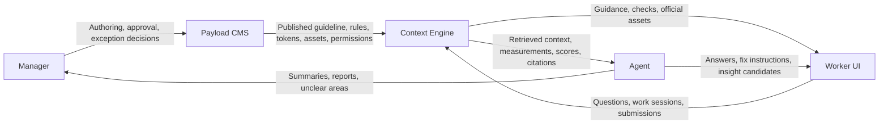

# 05. 아키텍처

## 1. 목적

Payload CMS 기반 구현 구조와 책임 경계를 정리한다.

## 2. 범위 결정

| Topic | Decision |
| --- | --- |
| Brand model | Multi-brand SaaS가 아닌 특정 브랜드 1개에 최적화 |
| Canonical guideline format | CMS-authored structured content |
| User audience | Internal users only |
| Asset examination coverage | Images, PDFs, documents, Figma references, technically feasible design assets |
| Admin experience | Payload Admin is the primary CMS UI |
| Worker experience | 별도 worker-facing UI 필요 |
| MVP priority | CMS + contextual guidance + pre-submit check |
| Expansion priority | Asset examination, RAG search, insight storage, governance update |

## 3. 기술 스택

현재 기술 스택은 구현 방향을 정하는 수준으로만 기록한다. 세부 버전과 인프라 구성은 구현 단계에서 확정한다.

| Area | Direction | Reason |
| --- | --- | --- |
| App Framework | Next.js | Payload와 같은 런타임에서 Admin, API, worker-facing UI를 구성하기 쉽다. |
| CMS | Payload CMS | 정책, 룰, 에셋, 버전, 발행 상태를 구조화해서 관리한다. |
| Admin UI | Payload Admin | Manager의 작성, 검토, 발행, 승인 워크플로우를 담당한다. |
| Worker UI | Next.js routes | Consumer 작업 흐름은 Payload Admin과 분리한다. |
| Database | Payload adapter decision pending | PostgreSQL 또는 MongoDB 중 구현 요구에 맞춰 결정한다. |
| File Storage | Object storage | 공식 에셋과 사용자 업로드 자산을 저장한다. |
| Search / Retrieval | Vector index + structured filters | 발행된 정책/룰 근거를 Agent 답변과 점검에 사용한다. |
| Background Jobs | Payload Jobs or external worker | 인덱싱, 리포트 생성, 반복 패턴 집계를 비동기로 처리한다. |
| AI / Agent | Agent service over retrieved context | Agent는 설명, 수정 지시, 인사이트 후보 생성을 담당한다. |

## 4. 역할과 권한

| Role | Description | Main Permissions |
| --- | --- | --- |
| Admin | Platform owner | Manage users, settings, all content, AI configuration |
| Manager | Brand governance and content operator | Create/edit drafts, approve, publish, manage guideline content |
| Consumer | Internal field worker or guideline user | Use published guidance, create work sessions, ask questions, submit output |

Access rules:

- 모든 사용자는 Payload `users` 컬렉션을 통해 인증한다.
- Draft content는 Admin과 Manager만 볼 수 있다.
- Published guidance는 허용된 내부 사용자에게 노출한다.
- AI search와 worker flow는 기본적으로 published content만 사용한다.
- AI settings, index settings, query log visibility는 Admin 중심으로 제한한다.

## 5. 시스템 경계

## 6. 책임 경계

| Responsibility | Owner | Notes |
| --- | --- | --- |
| Guideline authoring, rule storage, schema, validation, versioning | CMS | CMS remains the canonical source of truth. |
| Draft, publish, rollback, permissions, official assets, audit logs | CMS | Brand governance decisions stay in CMS workflow. |
| Worker task selection, template selection, checklist display, submission | Worker UI | Payload Admin is not the primary Consumer UI. |
| Search indexing, retrieval, ranking, permission filtering | Context Engine | Agent receives only allowed retrieved context. |
| Token matching, color distance, metadata checks, threshold checks | Context Engine | Deterministic checks should be reproducible and logged. |
| Scoring, pass/caution/fail status, confidence thresholds, review routing | Context Engine | Final status should not depend on prompt-only reasoning. |
| Natural-language question understanding | Agent | Agent maps intent to Context Engine queries. |
| Answer drafting, citation explanation, report writing | Agent | Answers must be grounded in retrieved CMS content. |
| Insight summarization and recurring pattern explanation | Agent | Agent summarizes calculated or grouped patterns. |
| Approval, rejection, exception handling, guideline changes | Manager | Human authority is required for governance decisions. |

## 7. MVP 아키텍처

The MVP should separate layers logically, not necessarily as separate services.

Recommended initial shape:

- Payload collections for structured governance data.
- Payload Admin for Manager governance and review workflows.
- Next.js worker-facing routes for field-worker flow.
- Service modules inside the same app for rule lookup, retrieval, and checklist generation.
- Payload Local API for internal reads and writes.
- Stored report objects for query/check/review outcomes.

## 8. 파이프라인

### 가이드라인 발행 파이프라인

1. Manager creates or updates structured guideline content in CMS.
2. Manager reviews and publishes approved content.
3. CMS stores the published governance version.
4. Context Engine indexes sections, rules, tokens, and asset references.
5. Worker UI uses only published content for guidance.

### 작업자 가이드 파이프라인

1. Consumer selects an application type.
2. System retrieves allowed templates, checklist items, examples, required copy, and forbidden copy.
3. Consumer fills text and image inputs.
4. System generates preview and pre-submit checks.
5. Submission is stored with the applied governance version.

### RAG 답변 파이프라인

1. User submits a question.
2. Context Engine resolves permissions, version, and query scope.
3. Context Engine retrieves and filters relevant published chunks.
4. Agent drafts an answer constrained to retrieved content.
5. System stores answer, citations, confidence, and feedback.

### 검토와 인사이트 파이프라인

1. Manager approves, rejects, or requests changes on a submission.
2. Review comments are linked to rules and application types.
3. System aggregates repeated questions, check failures, and rejection reasons.
4. Manager reviews insight candidates.
5. Accepted insights become Governance Update drafts.

## 9. 구현 원칙

- Do not make prompt-only compliance decisions.
- Keep deterministic checks auditable where possible.
- Keep field-worker language separate from internal brand-manager terminology.
- Preserve version metadata for rules that affect submitted work.
- Keep draft rules out of default worker flow and AI answers.
- Agent may explain, summarize, and recommend, but must not directly mutate Governance.

## 10. 구현 단계

### 1단계. CMS 기반

- Define roles.
- Add Governance collections.
- Configure draft and publish workflow.
- Configure relationships and access control.

### 2단계. 상황형 작업 흐름

- Add application types, templates, checklist items, examples.
- Build worker-facing task selection and template selection.
- Store work sessions and submissions.

### 3단계. 점검과 질문

- Add pre-submit checks.
- Add Agent Query over published guidance.
- Store query reports and check results.

### 4단계. 검토와 인사이트

- Add review comments and rule-linked feedback.
- Aggregate repeated questions, check failures, and rejection reasons.
- Produce Insight Reports.

### 5단계. 거버넌스 업데이트 루프

- Convert accepted insights into governance change drafts.
- Publish updated guidance.
- Measure before/after impact.
