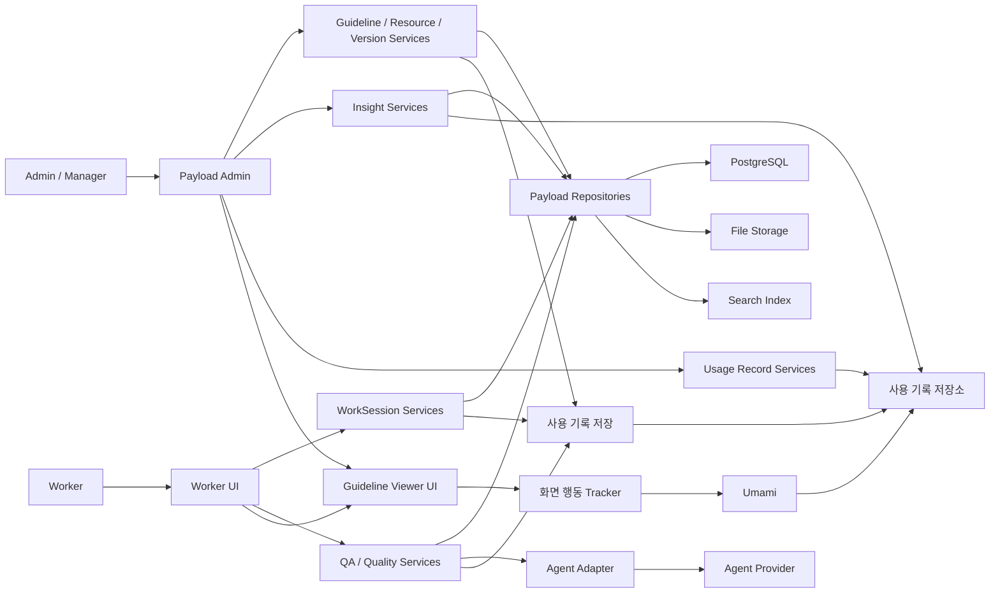

# 05. 시스템 아키텍처

이 문서는 [04. 도메인 모델](04-domain-model.md)을 실제 시스템 레이어에 배치하는 기준을 정리합니다.
도메인 간 통신 패턴은 이 문서에서 확정하지 않고, 레이어 경계와 데이터 연결 흐름까지만 정의합니다.
프로젝트의 실제 폴더 구조와 개발 규칙은 [06. 프로젝트 구조와 개발 규칙](06-project-structure.md), 보안 기준은 [07. 보안](07-security.md)을 기준으로 봅니다.

## 1. 시스템 구성

### 1.1 기술 구성

| 영역 | 기술 | 역할 |
| --- | --- | --- |
| App Framework | Next.js | Admin, API, 작업 UI, 검수 UI를 같은 런타임에서 제공합니다. |
| CMS | Payload CMS | 가이드라인, 규칙, 자원, 작업, 검수, 인사이트 데이터를 관리합니다. |
| Admin UI | Payload Admin | Manager의 가이드라인 관리, 자원 관리, 공식 버전 전환, 운영 인사이트, 로그 조회 화면을 제공합니다. |
| Worker UI | Next.js routes | Worker의 산출물 제작, 질의응답, 검수 결과 확인 흐름을 제공합니다. |
| Guideline Viewer UI | Next.js routes | 가이드라인 화면 조회, 클릭, 에셋 다운로드, 특정 구간 체류를 수집합니다. |
| Database | PostgreSQL | Payload collection의 핵심 도메인 데이터를 저장합니다. |
| File Storage | Object storage | BrandAsset, TemplateFile, WorkOutput 파일을 저장합니다. |
| Search Index | Vector index + structured filters | 발행된 가이드라인과 규칙을 Agent 답변, 검수, 검색에 사용합니다. |
| Agent | Agent SDK / Agent Provider | 답변 생성, 검수 보조, 추천, 패턴 요약을 수행합니다. |
| Background Jobs | Payload Jobs or worker | 색인, 대량 검수, 인사이트 집계, 보고서 생성을 비동기로 처리합니다. |
| 사용 기록 | Payload collection or log store, Umami | 세션 이벤트와 화면 행동 기록을 저장합니다. |

### 1.2 사용자와 화면

| 사용자 | 기본 화면 | 주요 작업 |
| --- | --- | --- |
| Admin | Payload Admin | 사용자, 권한, 시스템 설정, 전체 데이터 관리 |
| Manager | Payload Admin | 가이드라인 편집/발행, 자원 관리, 공식 버전 확인, 인사이트 검토 |
| Worker | Worker UI | 산출물 제작, 가이드라인 조회, 질문, 검수 결과 확인 |

Payload Admin은 관리성 화면의 기본값입니다.
작업 제작과 검수 확인처럼 Worker의 흐름이 중요한 화면만 별도 UI로 분리합니다.

## 2. 레이어 구조

### 2.1 레이어 정의

| 레이어 | 책임 | 예시 |
| --- | --- | --- |
| Presentation | 화면 표시, 사용자 입력 수집, 조회 결과 표시 | Payload Admin, Worker UI, 검수 UI |
| Service | 유즈케이스 실행, 도메인 규칙 조합, 트랜잭션 경계 관리 | GuidelinePublishService, WorkSessionRenderService, QualityCheckService |
| Repository / DTO | 저장소 접근, 외부 SDK 접근, 데이터 변환 | Payload repository, Agent adapter, 사용 기록 repository |
| DB / External | 영속 저장소와 외부 시스템 | PostgreSQL, File Storage, Search Index, Agent Provider, Umami, 사용 기록 저장소 |

### 2.2 기본 호출 흐름

```text
Presentation
  -> Service
  -> Repository / Adapter
  -> Payload Local API or External SDK
  -> DB / External System
```

Route Handler, Server Action, Payload hook은 진입점입니다.
진입점은 인증, 요청 검증, Service 호출만 담당하고, 도메인 판단은 Service에 둡니다.

### 2.3 Payload 기반 저장 흐름

```text
UI
  -> Service
  -> Payload Repository
  -> Payload Local API
  -> PostgreSQL / File Storage
```

Payload collection에 저장하는 데이터는 Payload Local API를 기본 접근 방식으로 사용합니다.
DB 직접 접근은 Payload로 표현하기 어려운 집계나 운영성 조회에만 사용합니다.

### 2.4 Agent 기반 실행 흐름

```text
UI
  -> Service
  -> Agent Adapter
  -> Agent SDK
  -> Agent Provider
  -> Result DTO
  -> Service
  -> Repository
  -> DB
```

Agent는 도메인 애그리거트가 아닙니다.
Agent는 DB에 직접 쓰지 않고, Service가 Agent 결과를 검증한 뒤 Answer, CheckResult, Recommendation, Insight 근거로 저장합니다.

### 2.5 Payload revision과 공식 Version 분리

가이드라인, 규칙, 자원처럼 수정 이력이 필요한 collection은 Payload `versions`를 사용합니다.
초안, 예약 발행, 자동 저장이 필요한 collection은 `drafts` 옵션을 함께 사용합니다.

```ts
versions: {
  drafts: {
    autosave: true,
    schedulePublish: true,
  },
  maxPerDoc: 100,
}
```

Payload는 버전 기능을 켜면 CMS 내부 수정 이력인 revision을 저장하고, Admin UI에서 revision 목록, diff, restore 흐름을 제공합니다.
도메인 모델의 Version은 Payload revision이 아니라 Worker와 Agent가 사용하는 공식 발행 단위입니다.
공식 Version은 `stage`, `live`, `archived` 상태를 가집니다.
공개 화면과 Agent 검색은 live Version만 대상으로 합니다.

`GuidelineVersionRef`는 최소한 공식 Version ID, 대상 document ID, Payload revision ID, 발행 시각을 저장합니다.
Payload revision 목록 조회와 복원은 Payload의 versions API와 `restoreVersion` Local API를 사용합니다.

## 3. 도메인별 레이어 매핑

| 도메인 | Presentation | Service | Repository / DTO | DB / External |
| --- | --- | --- | --- | --- |
| 가이드라인 관리 | Payload Admin | GuidelinePublishService, RuleConflictCheckService, AssetPublishService, TemplatePublishService, PluginPublishService, VersionPublishService | BrandGuidelineRepository, RuleRepository, BrandAssetRepository, TemplateRepository, PluginRepository | PostgreSQL, File Storage |
| 제작 관리 | Worker UI | WorkSessionStartService, WorkSessionRenderService | WorkSessionRepository, TemplateReadRepository, PluginReadRepository, BrandGuidelineRepository | PostgreSQL, File Storage |
| 품질 검수 | Worker UI, 검수 UI | AnswerGenerationService, QualityCheckService | QASessionRepository, CheckSessionRepository, RuleReadRepository, AgentAdapter | PostgreSQL, Search Index, Agent Provider |
| 사용 기록 | Payload Admin | SessionEventIngestService, BehaviorEventIngestService, LogQueryService | SessionEventLogRepository, BehaviorEventLogRepository, BehaviorEventAdapter | Payload PostgreSQL, Umami, 사용 기록 저장소 |
| 운영 인사이트 | Payload Admin | InsightDiscoveryService, InsightReportService | InsightRepository, InsightReportRepository, SessionEventLogReadRepository, BehaviorEventLogReadRepository | PostgreSQL, Umami, 사용 기록 저장소 |

DTO는 모든 collection마다 만들지 않습니다.
외부 SDK 응답, 화면 전용 조회 모델, 도메인 경계를 넘는 읽기 모델처럼 변환 경계가 있는 곳에만 둡니다.

## 4. 데이터 흐름 플로우맵

### 4.1 전체 흐름



### 4.2 도메인별 데이터 흐름 표

| 흐름 | 시작 | Service | Repository / Adapter | 저장 또는 호출 대상 | 생성 데이터 |
| --- | --- | --- | --- | --- | --- |
| 가이드라인 발행 | Payload Admin | GuidelinePublishService, VersionPublishService | BrandGuidelineRepository, RuleRepository | PostgreSQL, Search Index | GuidelinePublished, BrandGuidelineVersion |
| 규칙 버전 생성 | Payload Admin | RuleConflictCheckService, VersionPublishService | RuleRepository | PostgreSQL | RuleUpdated, RuleVersion |
| 자원 발행 | Payload Admin | AssetPublishService, TemplatePublishService, PluginPublishService | BrandAssetRepository, TemplateRepository, PluginRepository | PostgreSQL, File Storage | BrandAssetPublished, TemplatePublished, PluginPublished |
| 산출물 제작 | Worker UI | WorkSessionStartService, WorkSessionRenderService | WorkSessionRepository, TemplateReadRepository, PluginReadRepository | PostgreSQL, File Storage | WorkSessionStarted, WorkOutputCreated |
| 질의응답 | Worker UI | AnswerGenerationService | QASessionRepository, RuleReadRepository, AgentAdapter | PostgreSQL, Search Index, Agent Provider | QuestionAsked, AnswerProvided |
| 산출물 검수 | Worker UI | QualityCheckService | CheckSessionRepository, RuleReadRepository, AgentAdapter | PostgreSQL, Search Index, Agent Provider | CheckCompleted, CheckResult, CheckDecision |
| 인사이트 도출 | Payload Admin or Job | InsightDiscoveryService | SessionEventLogReadRepository, BehaviorEventLogReadRepository, InsightRepository | 사용 기록 저장소, PostgreSQL | InsightDiscovered |
| 가이드라인 화면 행동 기록 | Guideline Viewer UI | BehaviorEventIngestService | BehaviorEventAdapter, BehaviorEventLogRepository | Umami, 사용 기록 저장소 | BehaviorEventLog, PageViewEvent, ClickEvent, AssetDownloadEvent, SectionDwellEvent, CustomEvent |
| 인사이트 제공 | Payload Admin or Job | InsightReportService | InsightRepository, InsightReportRepository | PostgreSQL | InsightReportPublished |
| 로그 조회 | Payload Admin | LogQueryService | SessionEventLogRepository, BehaviorEventLogRepository | Payload PostgreSQL, Umami, 사용 기록 저장소 | 조회 결과 |
| 세션 이벤트 기록 | Service | SessionEventIngestService | SessionEventLogRepository | Payload PostgreSQL or 사용 기록 저장소 | SessionEventLog |

## 5. 도메인별 DB 연결 흐름

### 5.1 가이드라인 관리

```text
Payload Admin
  -> Guideline / Resource / Version Service
  -> Payload Repository
  -> Payload Local API
  -> PostgreSQL / File Storage
```

| 데이터 | 저장 위치 | 비고 |
| --- | --- | --- |
| BrandGuideline, GuidelineSection, GuidelinePage, PagePolicy | PostgreSQL | Payload collection으로 관리합니다. |
| Rule, RuleException | PostgreSQL | 여러 GuidelinePage에서 재사용합니다. |
| Payload revision records | PostgreSQL | Payload `versions`가 CMS 내부 수정 이력을 저장합니다. |
| BrandAsset, Template, Plugin | PostgreSQL + File Storage | 메타데이터는 DB, 파일은 Object storage에 둡니다. |
| BrandGuidelineVersion, RuleVersion | PostgreSQL | BrandGuideline과 Rule이 소유하는 Version 엔티티입니다. stage/live/archived 상태와 발행 사유, 이전 버전, Payload revision 참조를 기록합니다. |
| BrandAssetVersion, TemplateVersion, PluginVersion | PostgreSQL | BrandAsset, Template, Plugin이 소유하는 공식 자원 Version 엔티티입니다. |
| Search document | Search Index | live 상태의 BrandGuidelineVersion과 RuleVersion을 기준으로 색인합니다. |

### 5.2 제작 관리

```text
Worker UI
  -> WorkSessionStartService / WorkSessionRenderService
  -> WorkSessionRepository
  -> Payload Local API
  -> PostgreSQL / File Storage
```

| 데이터 | 저장 위치 | 비고 |
| --- | --- | --- |
| WorkSession, WorkInput | PostgreSQL | 산출물 제작 작업 단위입니다. |
| WorkOutput | PostgreSQL + File Storage | 결과 메타데이터는 DB, 파일은 Object storage에 둡니다. |
| TemplateVersionRef | PostgreSQL | 사용한 Template 버전을 참조합니다. |
| PluginVersionRef | PostgreSQL | 사용한 Plugin 버전을 참조합니다. |
| GuidelineVersionRef | PostgreSQL | 제작 시점의 BrandGuideline 버전을 참조합니다. |

제작 관리는 검수 요청을 소유하지 않습니다.
품질 검수는 필요한 시점의 WorkOutputSnapshot을 검수 대상으로 참조합니다.

### 5.3 품질 검수

```text
Worker UI / 검수 UI
  -> QA / Quality Service
  -> Agent Adapter or Payload Repository
  -> Agent Provider / PostgreSQL
```

| 데이터 | 저장 위치 | 비고 |
| --- | --- | --- |
| QASession, Question, Answer | PostgreSQL | 질문과 답변은 QASession 안에서 관리합니다. |
| CheckSession, CheckRun, CheckResult | PostgreSQL | WorkOutputSnapshot과 GuidelineVersionRef를 참조합니다. |
| CheckDecision, Recommendation | PostgreSQL | Agent/System의 최종 판정과 수정 권장 사항입니다. |
| AgentRunRef | PostgreSQL | Agent 실행 결과 원문이 아니라 실행 참조를 남깁니다. |
| Rule citation | PostgreSQL / Search Index | Answer, CheckResult, Recommendation의 근거로 사용합니다. |

검수 결과와 추천은 가능하면 Rule을 참조합니다.
최종 판정은 CheckSession 안에 CheckDecision으로 저장합니다.

### 5.4 운영 인사이트

```text
Payload Admin / Background Job
  -> InsightDiscoveryService / InsightReportService
  -> SessionEventLogReadRepository / BehaviorEventLogReadRepository / InsightRepository
  -> 사용 기록 저장소 / PostgreSQL
```

| 데이터 | 저장 위치 | 비고 |
| --- | --- | --- |
| SessionEventLog | Payload PostgreSQL or 사용 기록 저장소 | WorkSession, QASession, CheckSession에서 발생한 세션 이벤트를 저장합니다. |
| BehaviorEventLog | Umami or 사용 기록 저장소 | 가이드라인 화면 조회, 클릭, 에셋 다운로드, 특정 구간 체류를 수집합니다. |
| Insight, Evidence, Pattern | PostgreSQL | 반복 패턴과 인사이트를 저장합니다. |
| InsightReport, ReportSection, InsightSummary | PostgreSQL | Manager가 보는 인사이트 보고서와 개선 방향입니다. |

저/중간 볼륨 도메인 이벤트는 Payload collection으로 시작할 수 있습니다.
가이드라인 화면 조회, 클릭, 에셋 다운로드, 특정 구간 체류 같은 화면 행동은 BehaviorEventLog로 저장하고, 구현은 Umami로 시작합니다.
로그가 많아져 Admin 목록 성능, 보관 기간, 검색 조건이 문제가 될 때 별도 사용 기록 저장소로 분리합니다.

### 5.5 로그 조회

```text
Payload Admin
  -> LogQueryService
  -> SessionEventLogRepository / BehaviorEventLogRepository
  -> Payload PostgreSQL / Umami / 사용 기록 저장소
```

로그 조회는 운영 인사이트와 분리된 읽기 흐름입니다.
로그 자체는 도메인 판단의 결과물이 아니라 운영 관찰을 위한 원천 기록입니다.

## 6. 도메인 간 참조 원칙

| 상황 | 방식 | 이유 |
| --- | --- | --- |
| 제작이 가이드라인을 참조 | GuidelineVersionRef | 제작 시점의 기준을 보존합니다. |
| 제작이 템플릿을 참조 | TemplateVersionRef | 템플릿 변경 이후에도 당시 제작 근거를 유지합니다. |
| 제작이 플러그인을 참조 | PluginVersionRef | 실행한 제작 기능의 버전을 남깁니다. |
| 검수가 산출물을 참조 | WorkOutputSnapshot | 검수 시점의 결과물을 고정합니다. |
| 검수가 규칙을 참조 | Rule ID / Rule version | 위반과 코멘트의 근거를 추적합니다. |
| 인사이트가 로그를 참조 | Evidence | 로그 원본을 복제하지 않고 근거로 연결합니다. |

도메인은 다른 도메인의 DB 테이블을 직접 수정하지 않습니다.
다른 도메인 데이터는 Service가 Read Repository를 통해 조회하고, 장기 보존이 필요한 기준과 자원은 VersionRef로 저장합니다.

## 7. 외부 시스템 경계

### 7.1 Agent

- Agent SDK는 Agent Adapter 뒤에 둡니다.
- Agent는 live Version과 허용된 작업 맥락만 사용할 수 있습니다.
- Agent는 정책을 직접 변경하지 않습니다.
- Agent 결과는 Service가 검증한 뒤 저장합니다.
- Answer, CheckResult, Recommendation에는 AgentRunRef를 남깁니다.

### 7.2 Search Index

- live 상태의 BrandGuidelineVersion에 포함된 GuidelinePage와 RuleVersion만 색인합니다.
- 초안 상태의 기준은 기본 작업 흐름과 Agent 답변에서 제외합니다.
- 검색 결과는 답변과 검수의 근거로 사용하고, 원천 데이터는 Payload에 둡니다.

### 7.3 사용 기록 저장소

- 사용 기록 저장소는 SessionEventLog와 BehaviorEventLog의 저장 계층입니다.
- 운영 인사이트는 사용 기록을 소유하지 않고 읽기 모델로 참조합니다.
- Payload collection으로 시작하고, 대량 로그 요구가 생기면 별도 저장소로 분리합니다.

## 8. 아키텍처 원칙

- Payload Admin은 관리성 UI의 기본값입니다.
- Worker의 제작과 검수 흐름은 Payload Admin과 분리합니다.
- Service가 유즈케이스 흐름을 소유합니다.
- Repository는 Payload query, `depth`, `select`, access control 옵션을 숨깁니다.
- Payload Local API를 기본 DB 접근 방식으로 사용합니다.
- Payload hook은 얇은 진입점으로 유지합니다.
- 다른 도메인의 데이터는 직접 수정하지 않고 참조 또는 스냅샷으로 연결합니다.
- Agent는 설명, 추천, 요약을 수행하지만 정책을 변경하지 않습니다.
- 외부 분석 도구를 연결하더라도 제품 핵심 기록은 Payload 또는 제품 DB에 남깁니다.
