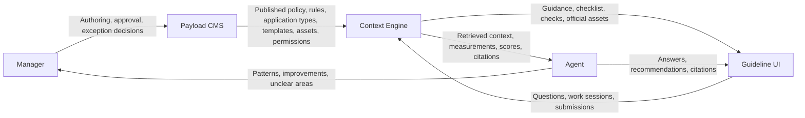

# 05. 시스템 아키텍처

이 문서는 Payload CMS 기반 시스템의 구성, 책임 경계, 개발 패턴을 정리합니다.
프로젝트의 실제 폴더 구조와 개발 규칙은 [06. 프로젝트 구조와 개발 규칙](06-project-structure.md), 보안 기준은 [07. 보안](07-security.md)을 기준으로 봅니다.

## 1. 시스템 구성

### 범위

| 항목 | 결정 |
| --- | --- |
| Brand model | Multi-brand SaaS가 아닌 특정 브랜드 1개에 최적화합니다. |
| Guideline format | CMS에서 작성한 구조화 콘텐츠를 기준 형식으로 사용합니다. |
| User audience | 내부 사용자만 대상으로 합니다. |
| Admin experience | Payload Admin을 기본 CMS UI로 사용합니다. |
| Guideline experience | Worker용 별도 작업 UI를 둡니다. |
| MVP priority | CMS, 상황형 가이드, 제출 전 점검을 우선합니다. |
| Expansion priority | 자산 점검, RAG 검색, Improvement 저장, Guideline Update로 확장합니다. |

### 기술 구성

| 영역 | 방향 | 역할 |
| --- | --- | --- |
| App Framework | Next.js | Admin, API, Worker UI를 같은 런타임에서 제공합니다. |
| CMS | Payload CMS | 정책, 규칙, 어플리케이션 타입, 템플릿, 에셋, 버전, 발행 상태를 관리합니다. |
| Admin UI | Payload Admin | Manager의 작성, 검토, 발행, 승인 워크플로우를 담당합니다. |
| Guideline UI | Next.js routes | Worker 작업 흐름을 Payload Admin과 분리합니다. |
| Database | PostgreSQL | Payload의 핵심 도메인 데이터를 저장합니다. |
| File Storage | Object storage | 공식 에셋과 사용자 업로드 자산을 저장합니다. |
| Search / Retrieval | Vector index + structured filters | 발행된 정책과 규칙을 Agent 답변과 점검에 사용합니다. |
| Background Jobs | Payload Jobs or external worker | 인덱싱, 리포트 생성, 반복 패턴 집계를 비동기로 처리합니다. |
| AI / Agent | Agent service over retrieved context | Answer, Recommendation, Pattern 요약을 담당합니다. |
| Product Analytics | Optional adapter | 클릭, 체류, 다운로드 같은 Usage Data를 필요 시 수집합니다. |

### 역할

| 역할 | 설명 | 주요 권한 |
| --- | --- | --- |
| Admin | 플랫폼 운영자 | 사용자, 설정, 전체 콘텐츠, Agent 설정을 관리합니다. |
| Manager | 브랜드 정책과 콘텐츠 운영 담당자 | 초안 작성, 승인, 발행, 가이드라인 콘텐츠 관리를 수행합니다. |
| Worker | 내부 현장 작업자 또는 가이드라인 사용자 | 발행된 기준을 사용하고, 작업 세션을 만들고, 질문과 제출을 수행합니다. |

### 시스템 역할

| 역할 | 설명 | 주요 권한 |
| --- | --- | --- |
| System | 기준 구조화, 버전 관리, 작업 기록 저장을 담당합니다. | 발행 기준 조회, 작업 세션 기록, Usage Data 저장 |
| Agent | 발행된 기준과 작업 맥락을 바탕으로 Answer, Recommendation, Pattern 요약을 생성합니다. | Published content 조회, 검색 컨텍스트 사용, 답변과 요약 생성 |

Agent는 인증 사용자 역할이 아니며, 정책을 직접 변경하지 않습니다.
Agent는 published content와 허용된 작업 맥락만 사용할 수 있습니다.

접근 규칙:

- 모든 사용자는 Payload `users` 컬렉션을 통해 인증합니다.
- Draft content는 Admin과 Manager만 볼 수 있습니다.
- Published Guideline은 허용된 내부 사용자에게 노출합니다.
- Agent search와 guideline flow는 기본적으로 published content만 사용합니다.
- Agent settings, index settings, query log visibility는 Admin 중심으로 제한합니다.

## 2. 시스템 구성도

## 3. 시스템 구조

PDF의 Spring 구조는 `UI -> Controller -> Service -> Data Access -> DB` 흐름을 기준으로 합니다.
이 프로젝트에서는 같은 책임 경계를 Next.js와 Payload CMS 구조로 바꿔 적용합니다.

| Spring 기준 | 이 프로젝트 기준 | 적용 방식 |
| --- | --- | --- |
| JSP/UI | Next.js App Router, ShadCN UI | 화면 표시와 사용자 입력 수집만 담당합니다. |
| Controller | Route Handler, Server Action, Payload hook | 요청 검증, 인증 확인, Service 호출만 담당합니다. |
| Service | 유즈케이스 service | 업무 규칙과 여러 데이터 접근 흐름을 조합합니다. |
| Data Access | Repository | Payload Local API, 검색 인덱스, 외부 저장소 접근을 감쌉니다. |
| SqlMap | Payload query, PostgreSQL query, vector search | 별도 SQL map 파일은 두지 않습니다. |

### Presentation Layer

- Payload Admin은 Manager의 CMS 작업 화면을 담당합니다.
- Guideline UI는 Worker의 작업 선택, 템플릿 선택, 체크리스트 확인, 제출 흐름을 담당합니다.
- Agent 답변과 점검 결과는 Guideline UI에서 사용자에게 보여줍니다.
- UI는 Service, Repository, Payload Local API를 직접 호출하지 않습니다.
- UI validation은 사용자 편의를 위한 1차 검증으로만 사용하고, 서버에서 같은 조건을 다시 검증합니다.

### Business Layer

- Context Engine은 규칙 조회, 검색, Worker Checklist 생성, 결정적 점검을 담당합니다.
- Agent는 질문 이해, Answer 작성, Recommendation 생성, Pattern 요약을 담당합니다.
- 정책 결정인 승인, 반려, 예외 처리, 기준 변경은 Manager가 수행합니다.
- Route Handler, Server Action, Payload hook은 얇게 유지하고 업무 규칙을 Service로 위임합니다.
- 하나의 Service는 하나의 유즈케이스를 기준으로 작성합니다.
- 여러 저장소 접근, 트랜잭션, Agent 호출, 후속 작업 예약은 Service에서 조합합니다.

### Data Access Layer

- 내부 읽기와 쓰기는 Payload Local API를 우선 사용합니다.
- 검색 인덱스 접근은 권한, 발행 상태, 버전 필터를 통과한 데이터만 대상으로 합니다.
- 분석 도구 연동은 adapter 뒤에 두고, 제품 핵심 기록과 분리합니다.
- Repository는 Payload query 조건, `depth`, `select`, access control 옵션을 숨깁니다.
- Repository는 기본적으로 현재 사용자와 권한 컨텍스트를 받아 조회합니다.
- `overrideAccess: true`는 관리성 작업이나 migration처럼 명확한 예외에서만 사용합니다.

### Data

- 정책, 규칙, 어플리케이션 타입, 템플릿, 작업 세션, 제출물, 점검 결과, Review, Improvement는 Payload에 저장합니다.
- Work Session, Submission, Check Result, Review에는 Guideline Snapshot을 보존합니다.
- Usage Data는 자체 이벤트 테이블을 기본값으로 두고, 필요하면 Umami 또는 PostHog self-host로 확장합니다.

## 4. 개발 패턴

### User Interface

- 화면은 사용자의 작업 흐름 단위로 구성합니다.
- Worker UI는 Payload Admin과 분리합니다.
- Worker에게 보여주는 용어와 Manager 내부 용어를 구분합니다.
- ShadCN 컴포넌트는 화면 조합에 사용하고, 도메인 판단을 컴포넌트 안에 넣지 않습니다.
- React Server Component는 읽기 중심으로 사용하고, 상태 변경은 Server Action이나 Route Handler로 분리합니다.

### Hooks (Controller)

- Payload hook은 collection 생명주기에 붙는 얇은 진입점으로 사용합니다.
- hook 안에서는 검증, 상태 전이, 후속 작업 호출만 처리합니다.
- 반복 호출이나 hook loop가 생길 수 있는 작업은 `req.context`로 제어합니다.
- hook에서 다른 collection을 변경할 때는 같은 `req`를 넘겨 트랜잭션과 권한 컨텍스트를 유지합니다.

### Service (Usecase)

- Service는 유즈케이스 단위의 업무 규칙을 담습니다.
- 제출 전 점검, Worker Checklist 생성, Improvement 생성처럼 여러 데이터 접근이 필요한 흐름을 조합합니다.
- 프롬프트 추론만으로 최종 준수 여부를 결정하지 않습니다.
- Service는 UI 응답 형식에 의존하지 않습니다.
- Service에서 업무상 실패를 감지하면 사용자에게 보여줄 안전한 메시지 코드나 오류 타입으로 변환합니다.

### Repository

- Repository는 Payload Local API 호출과 검색 인덱스 접근을 감쌉니다.
- 권한, 발행 상태, 버전 조건을 누락하지 않도록 조회 경계를 명확히 둡니다.
- 화면이나 Service가 Payload query 세부사항에 직접 의존하지 않게 합니다.
- Repository는 원칙적으로 하나의 도메인 데이터 묶음을 담당합니다.
- 여러 Repository를 조합하는 로직은 Repository가 아니라 Service에 둡니다.

### ORM

- 기본 데이터 접근은 Payload adapter와 Local API를 사용합니다.
- DB 직접 접근은 Payload로 표현하기 어려운 집계나 운영성 작업에 한정합니다.
- 직접 접근한 데이터도 제품 핵심 기록과 감사 가능성을 해치지 않아야 합니다.
- 직접 SQL을 사용해야 하는 경우에도 외부 입력을 문자열로 이어 붙이지 않습니다.

## 5. 아키텍처 원칙

- CMS가 기준 데이터의 원천입니다.
- Worker 작업 UI는 Payload Admin과 분리합니다.
- 가능한 점검은 결정적으로 수행하고 감사 가능하게 기록합니다.
- Agent는 설명, 요약, 추천을 할 수 있지만 정책을 직접 변경하지 않습니다.
- 초안 상태의 규칙은 기본 작업 흐름과 Agent 답변에서 제외합니다.
- Agent 답변은 CMS에서 검색된 발행 기준에 근거해야 합니다.
- 제출물에 영향을 준 Guideline Snapshot을 보존합니다.
- 외부 분석 도구를 연결하더라도 제품 핵심 기록은 Payload 또는 제품 DB에 남깁니다.
- 분석 도구 연동은 adapter를 통해 교체 가능하게 둡니다.
- MVP는 같은 애플리케이션 안에서 시작하되, 책임 경계는 모듈 단위로 분리합니다.
