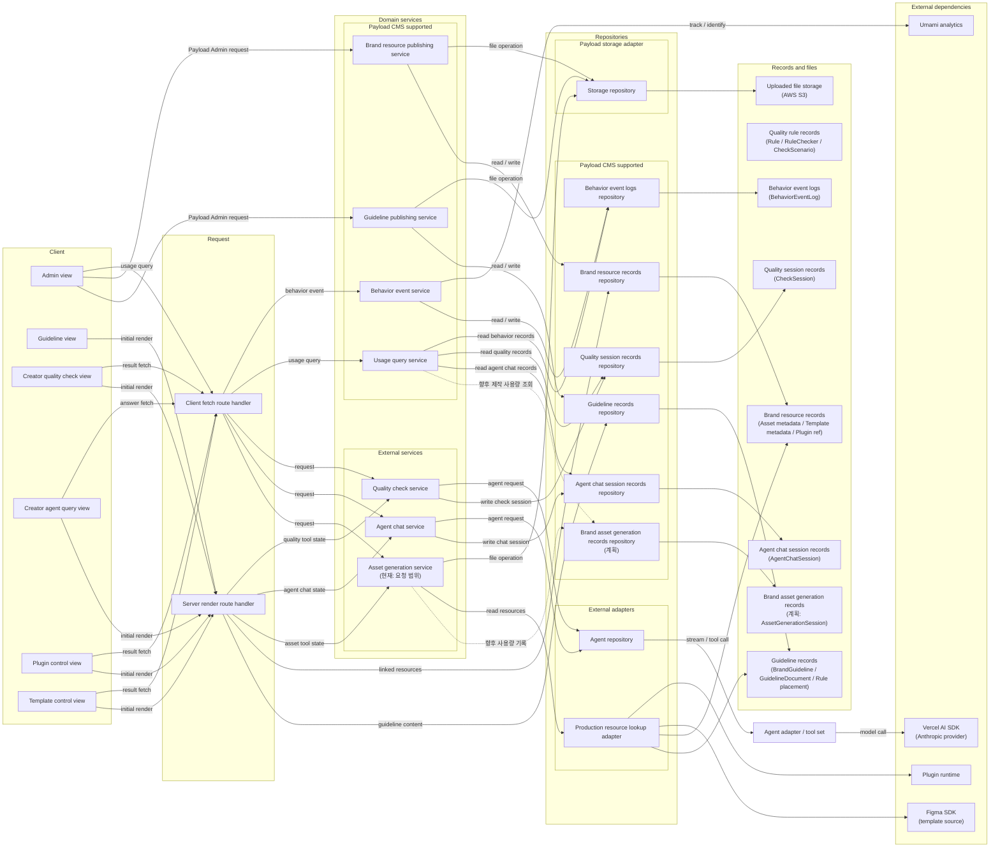
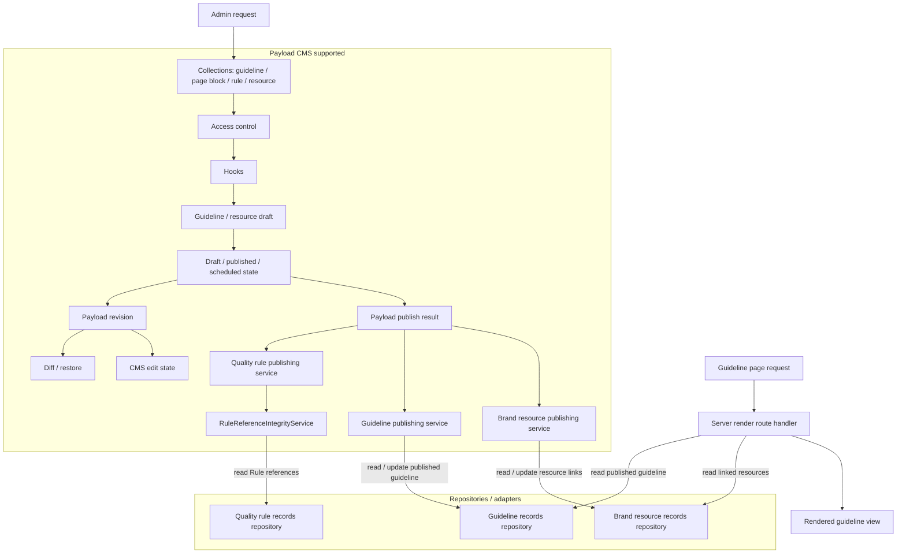
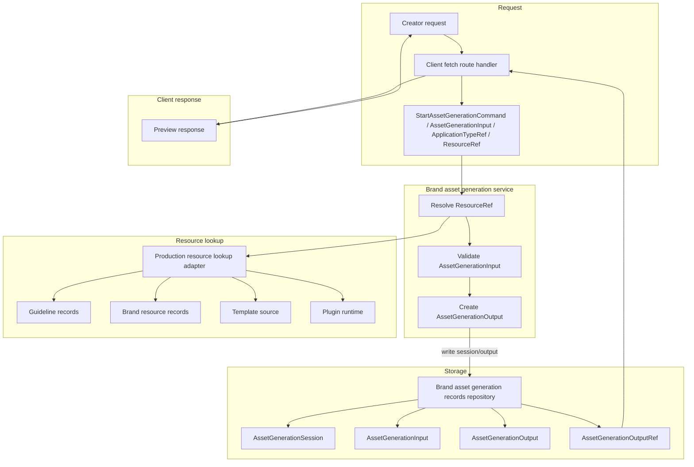
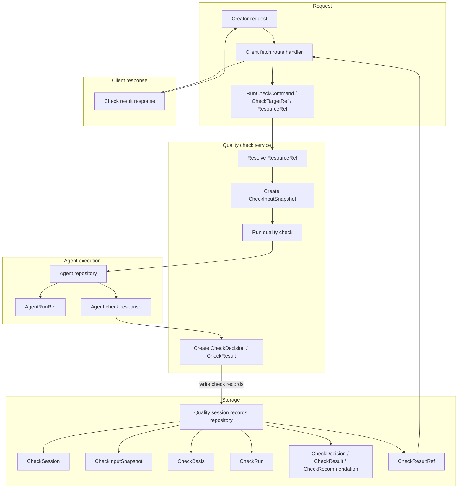
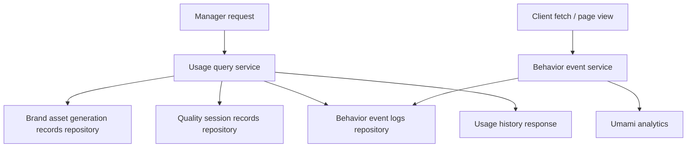
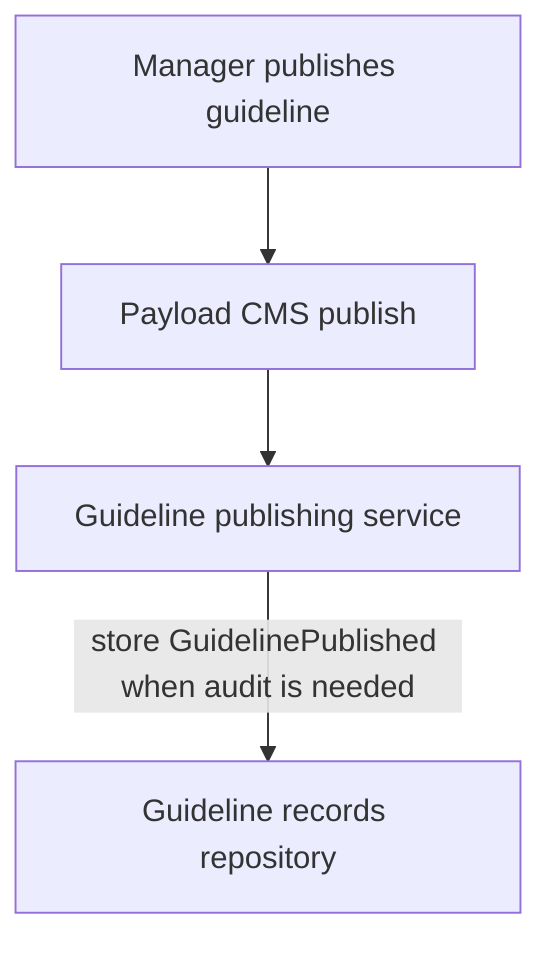
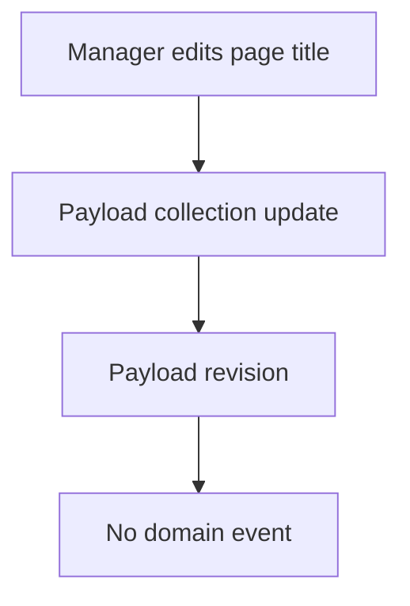
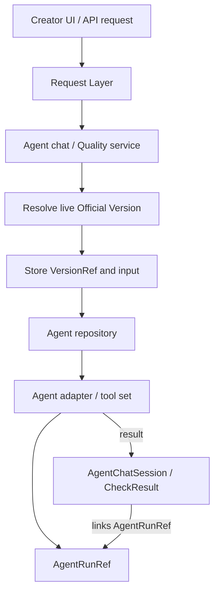

# 05. 시스템 아키텍처

이 문서는 [04. 도메인 모델](04-domain-model.md)의 바운디드 컨텍스트, 엔티티, 이벤트를 실제 시스템 구조에 배치하는 기준을 정리합니다.
초기 구조는 모듈러 모놀리스로 시작하고, 현재 상태, Official Version, Snapshot, Event, Log의 책임을 분리합니다.
프로젝트의 실제 폴더 구조와 개발 규칙은 [06. 프로젝트 구조와 개발 규칙](06-project-structure.md), 보안 기준은 [07. 보안](07-security.md)을 기준으로 봅니다.

## 1. 원칙

- 바운디드 컨텍스트마다 마이크로서비스를 만들지 않고 모듈러 모놀리스를 적용합니다.
- 바운디드 컨텍스트는 코드 경계와 데이터 소유권으로 분리합니다.
- 초기에는 하나의 애플리케이션과 하나의 PostgreSQL 인스턴스로 배포합니다.
- 현재 업무 상태와 과거 기준 재현 데이터를 분리합니다.
- 전체 Event Sourcing은 채택하지 않습니다.
- 이벤트는 반응, 전달, 감사, 운영 목적에 맞을 때만 기록합니다.

## 2. 구조

### 구조 원칙

초기 구조는 단일 애플리케이션으로 배포합니다.
마이크로서비스 분리는 배포 독립성, 장애 격리, 확장 요구가 실제로 생긴 뒤 검토합니다.

초기 요청 흐름은 하나의 Next.js + Payload 애플리케이션 안에서 다음 구조를 기준으로 합니다.
Payload CMS는 별도 배포 서비스가 아니라 Admin, route, Local API, collection, hook을 제공하는 애플리케이션 내부 실행 계층입니다.

```text
Presentation Layer
  -> Request Layer
  -> Application / Service Layer
  -> Repository Interface
  -> Repository Implementation
  -> Drizzle ORM / CMS SDK
  -> Storage Layer
```

이 문서의 Domain Service Layer는 Application / Service Layer와 같은 경계를 뜻합니다.
외부 전달이나 실패 재시도가 필요한 이벤트만 Outbox 도입을 검토합니다.

#### Route 계약

Client Route는 화면 이동과 URL 상태만 관리합니다.
Client Route는 비즈니스 로직, 데이터 저장, Payload CMS 접근, Repository 호출을 수행하지 않습니다.

Server Route Handler는 HTTP 요청을 Service 호출로 연결하는 adapter입니다.
Server Route Handler는 request parsing, Service Input 생성, 인증과 권한 확인, Service 호출, Output의 HTTP response 변환만 담당합니다.
비즈니스 로직, Repository 직접 호출, Payload CMS 직접 호출, Entity 생성과 수정은 Application / Service Layer에서 처리합니다.

#### Service 계약

Service는 UI나 API가 아니라 하나의 Use Case를 실행하는 계층입니다.
외부에서 호출하는 Use Case Service는 Input과 Output 모델로 계약을 정의하고, `execute(input)`을 진입점으로 사용합니다.
Presentation Layer는 Service의 Input / Output만 알고, 내부 저장 방식이나 Repository 구현체를 알면 안 됩니다.

#### Repository 경계

Service는 ORM, Payload Local API, 외부 SDK를 직접 호출하지 않습니다.
Service는 Repository Interface만 알고, 실제 데이터 접근은 Repository Implementation이 담당합니다.
Repository는 저장소 접근만 담당하고, 비즈니스 로직과 상태 전이 판단은 Service에 둡니다.

```text
Application / Service Layer
  ↓
--------------------------------
Repository Interface
  ↓
Repository Implementation
  ↓
Drizzle ORM / CMS SDK
--------------------------------
  ↓
DB
```

| 계층 | 책임 |
| --- | --- |
| Application / Service Layer | 유즈케이스 실행, 권한 확인, 상태 전이 판단 |
| Repository Interface | Service가 필요한 데이터 접근 계약 |
| Repository Implementation | Drizzle ORM, Payload Local API, CMS SDK 호출 |
| DB | PostgreSQL과 파일 참조 저장소 |

#### 모듈 기준

바운디드 컨텍스트는 다음 기준으로 나눕니다.

- 코드 소유 경계
- 데이터 소유 경계
- Domain Service Layer 경계
- 도메인 용어와 규칙 경계

컨텍스트 간 데이터 접근은 소유 모듈의 Domain Service Layer 또는 명시된 읽기 모델을 통해 수행합니다.
다른 컨텍스트의 테이블을 직접 수정하지 않습니다.

### 서비스 구조

#### 전체 서비스 구조

Frontend 요청은 같은 애플리케이션 내부의 Request Layer가 받습니다.
Request Layer는 화면 단위 요청을 Domain Service Layer 호출로 조합하고, 프론트엔드에 필요한 응답 형태로 변환합니다.
도메인 규칙과 상태 변경 판단은 Request Layer가 아니라 Domain Service Layer에 둡니다.
여기서 도메인은 별도 구현 레이어가 아니라 업무 개념과 규칙을 뜻합니다.
이 그림은 서브도메인 사이의 업무 관계가 아니라 서비스 레이어 배치를 보여줍니다.




Domain Service Layer는 records, event logs, Agent adapter, 외부 의존성에 직접 접근하지 않고 Repository Interface 또는 adapter를 통해 접근합니다.
Payload CMS supported 영역은 collection, hook, access control, version, upload로 처리 가능한 흐름입니다.
Guideline publishing service와 Brand resource publishing service는 Payload publish 결과를 기준으로 충돌 확인과 resource link 정리를 처리합니다.
External services 영역은 렌더링, 스냅샷 고정, Agent 실행처럼 별도 업무 로직이 필요한 흐름입니다.
Brand resource records는 메타데이터와 참조만 보관하고, 실제 파일과 실행물은 외부 저장소 또는 런타임에 둡니다.

#### 서비스 책임 매핑

이 표는 Domain Service Layer의 서비스가 어떤 유즈케이스 흐름을 묶고, 어떤 내부 도메인 서비스와 이벤트를 책임지는지 보여줍니다.
상세 유즈케이스 절차는 [02. 유즈케이스](02-usecases.md), 전체 도메인 이벤트 목록은 [04. 도메인 모델](04-domain-model.md)을 기준으로 합니다.

| 서비스 | 담당 유즈케이스 | 내부 도메인 서비스 | 주요 이벤트 |
| --- | --- | --- | --- |
| Guideline publishing service | GL-01~10 | GuidelinePublishService | GuidelinePublished |
| Quality rule publishing service | RULE-01~04 | RuleReferenceIntegrityService, RuleOptionsValidationService | Rule*, RuleChecker*, CheckScenario* |
| Brand resource publishing service | RES-01~26 | AssetPublishService, TemplatePublishService, PluginPublishService | BrandAsset*, Template*, Plugin*, ResourceLinkedToGuideline |
| Usage query service | LOG-01~05 | UsageQueryService | - |
| Behavior event service | LOG-06 | BehaviorEventIngestService, BehaviorEventQueryService | BehaviorEventCaptured |
| Asset generation service | Create, Image | 요청 범위 생성 서비스 | - |
| Agent chat service | Agent 채팅 | AgentChatService | - |
| Quality check service | QC-01~05 | QualityCheckService | CheckSessionStarted, CheckRunCompleted, CheckCompleted |

#### 서브도메인 구조

서브도메인별 상세 구조는 런타임에서 어떤 서비스가 어떤 객체를 받아 처리하고, 어떤 이벤트를 남기는지 기준으로 작성합니다.

##### 가이드라인 관리

가이드라인 관리는 Payload CMS supported 흐름으로 처리합니다.
가이드라인 본문, 챕터·토픽, 꼭지 블록, Rule 배치, 자원 연결의 편집, draft/publish 상태, 예약 발행, Payload revision, diff/restore는 Payload CMS가 맡습니다.
Rule 정의·Checker 계약·CheckScenario 발행은 Quality rule publishing service가 별도로 맡고, Guideline publishing service와 Brand resource publishing service는 가이드라인 및 자원 publish 결과 후처리를 담당합니다.
사용자에게 보여주는 화면은 별도 서브도메인이 아니라 Server render route handler가 published guideline과 linked resource를 읽어 만든 결과입니다.

| 흐름 | 담당 | 입력 | 결과 |
| --- | --- | --- | --- |
| Rule edit / publish | Rule·RuleChecker·CheckScenario collection, access control, hooks, drafts, QualityRuleService | Admin request | 독립 Rule 기준과 발행 상태 |
| Guideline / resource edit / publish | collection, access control, hooks, drafts, scheduled publish, Payload revision, diff/restore, GuidelinePublishService, AssetPublishService, TemplatePublishService, PluginPublishService | Admin request | CMS 편집 상태, publish 상태, Payload revision, ResourceLinkedToGuideline |
| Guideline render | Server render route handler | Guideline page request | Rendered guideline view |



##### 제작 관리

현재 제작 관리는 Creator 요청 안에서 ResourceRef를 조회하고 결과를 반환하며, 프로파일 기반 이미지 파일만 `GeneratedImage`로 저장합니다. `AssetGenerationSession`이나 범용 `AssetGenerationOutput`은 저장하지 않습니다.
아래 구조는 향후 제작 사용량 추적을 도입할 때 적용할 계획입니다.

| 흐름 | 담당 | 입력 | 결과 |
| --- | --- | --- | --- |
| Asset generation | Brand asset generation service | StartAssetGenerationCommand, AssetGenerationInput, ApplicationTypeRef, ResourceRef | AssetGenerationSession, AssetGenerationInput, AssetGenerationOutput, AssetGenerationOutputRef |
| Resource lookup | Production resource lookup adapter | ResourceRef | Guideline records, Brand resource records, Template source, Plugin runtime |
| Client response | Client fetch route handler | AssetGenerationOutputRef, preview data | Preview response, download/update target |



##### 품질 검수

품질 검수는 Creator 요청을 받아 ResourceRef와 검수 대상을 고정하고, Agent 실행 결과를 검수 기록으로 저장한 뒤 클라이언트에는 결과 응답만 돌려줍니다.
클라이언트는 검수 결과의 원본 저장 위치가 아니라 결과 화면과 수정 요청을 다루는 화면입니다.

| 흐름 | 담당 | 입력 | 결과 |
| --- | --- | --- | --- |
| Check request | Client fetch route handler | RunCheckCommand, CheckTargetRef, ResourceRef | Quality check service 호출 |
| Check preparation | Quality check service | CheckTargetRef, ResourceRef | CheckInputSnapshot, CheckBasis |
| Agent execution | Agent repository | CheckInputSnapshot, CheckBasis | AgentRunRef, Agent check response |
| Check storage | Quality session records repository | CheckSession, CheckRun, CheckDecision, CheckResult, CheckRecommendation | 저장된 검수 기록 |
| Client response | Client fetch route handler | CheckResultRef, summary | Check result response |



##### 사용 기록

사용 기록은 Brand asset generation records와 Quality session records만으로 부족한 운영 조회가 생길 때 별도로 둡니다.
업무 활동 기록은 기본 저장소의 상태와 타임스탬프를 우선 사용합니다.
화면 행동은 업무 레코드와 성격이 다르므로 BehaviorEventLog와 분석 도구로 전달합니다.

| 서비스 | 세부 도메인 서비스 | 입력 | 객체 흐름 | 이벤트 |
| --- | --- | --- | --- | --- |
| Usage query service | UsageQueryService | UsageQueryCommand | Brand asset generation records / Quality session records / BehaviorEventLog -> Usage history response | - |
| Behavior event service | BehaviorEventIngestService, BehaviorEventQueryService | BehaviorEventCommand | PageView / Click / Search / Download event -> BehaviorEventLog -> analytics adapter | BehaviorEventCaptured |



## 3. 객체 및 정의

### Payload collection / global 후보

초기 Payload collection은 Manager가 직접 관리하는 기준 데이터부터 둡니다.
루트 애그리거트 단위로만 고정하지 않고, 독립적으로 편집, 검색, 재사용, 권한 관리, 발행해야 하는 객체는 별도 collection 후보로 둡니다.
브랜드 자산은 BrandAsset을 단일 collection으로 고정하지 않고, 브랜드 코어 자산과 어플리케이션 자산으로 나누어 검토합니다.
사용 과정에서 자동 생성되는 작업, 질의, 검수, 로그 기록은 여기서 collection으로 확정하지 않습니다.
가이드라인 자체는 제품 안에서 하나만 운영하므로 Payload global로 둡니다.
Plugin은 collection으로 두지 않습니다 — 2026-08-18에 삭제했습니다. 이름·설명·유형 세 필드짜리 껍데기였고 어떤 코드도 읽지 않았으며 어느 환경에도 행이 없었습니다. 도메인 계획은 `docs/03`·`docs/04`가 계속 갖습니다.

| 후보 | 관리 단위 | 주요 관계 |
| --- | --- | --- |
| `guideline` global | BrandGuideline | 단일 가이드라인 설정 |
| `guideline-documents` | GuidelineDocument | 계층 깊이로 챕터·토픽을 표현하고 blocks(꼭지 `section` 포함)와 Rule 배치·근거를 소유 |
| `rules` | Rule | 문서와 독립된 검수 기준, 메시지, RuleChecker 관계를 관리 |
| `check-scenarios` | CheckScenario | 검수 목적별 이름, 설명과 순서가 있는 CheckKey 목록을 관리 |
| `rule-checkers` | RuleChecker | executor 유형과 checker 또는 model binding을 1:1로 관리하는 검사 도구 계약 |
| `brand-logos` | BrandLogo | guideline document와 check basis에서 참조. 향후 asset generation session에도 사용 가능 |
| `brand-colors` | BrandColor | guideline document, Check, template, plugin에서 참조 |
| `brand-typefaces` | BrandTypeface | guideline document, Check, template에서 참조 |
| `application-images` | ApplicationImage | page와 check basis에서 참조. 향후 asset generation session에도 사용 가능 |
| `image-profiles` | ImageProfile | 이미지 생성 Runtime Manifest에 적용할 published feature·Controller 제한·Export 정책을 관리 |
| `graphic-profiles` | GraphicProfile | 등록된 Graphic Runtime Manifest에 적용할 published Controller 제한·Export 정책을 관리 |
| `templates` | Template | 배경 정책(`backgroundPolicy`)·레이어별 `overrides[nodeId]`·Export 정책을 관리하고 page와 plugin에서 참조 |

### 런타임 객체

런타임 객체는 사용자 제작, Agent 채팅, 검수, 탐색 과정에서 System이 생성하는 기록입니다.
현재 저장되는 객체와 계획 객체를 구분합니다.

| 영역 | 상태 | 런타임 객체 |
| --- | --- | --- |
| Agent 채팅 기록 | 현재 | AgentChatSession |
| 품질 검수 기록 | 현재 | CheckSession(입력 지문, CheckRulesetSnapshot, pending Check key, 결과와 상태를 평탄화) |
| 화면 행동 기록 | 현재 | BehaviorEventLog, PageViewEvent, ClickEvent, AssetDownloadEvent, SectionDwellEvent, SearchEvent, OutboundLinkEvent, CustomEvent |
| 에셋 제너레이션 사용량 기록 | 계획 | AssetGenerationSession, AssetGenerationInput, AssetGenerationOutput |
| Agent 실행 기록 | 계획 | AgentRunRef, AgentRunStarted, AgentRunCompleted, AgentRunFailed |

### 버전 컨트롤

이 문서에서 Version은 Payload revision이 아니라 Official Version을 뜻합니다.
현재 구현의 `live` 기준은 Payload CMS에서 publish된 문서를 `draft: false`로 읽은 결과입니다.
별도 Official Version 엔티티는 CheckBasis, ResourceRef, Agent 실행 기록에서 독립 VersionRef가 필요해질 때 도입합니다.

| 표준 용어 | 의미 |
| --- | --- |
| Payload revision | Payload CMS가 남기는 편집 이력입니다. Admin diff와 restore에 사용합니다. |
| Official Version | Creator와 Agent가 참조하는 발행 기준입니다. GuidelineVersion, RuleVersion, RuleCheckerVersion, BrandAssetVersion, TemplateVersion, PluginVersion이 여기에 속합니다. Rule은 GuidelineVersion과 독립된 발행 생명주기를 가집니다. |
| VersionStatus | Official Version의 상태입니다. `stage`, `live`, `archived`를 사용합니다. |
| VersionRef | 실행 기록이 특정 Official Version을 가리키는 참조값입니다. |
| ResourceRef | 제작 요청이 사용하는 published guideline, Rule, asset, template, plugin 참조 묶음입니다. 향후 AssetGenerationSession을 도입하면 사용량 기록에 저장합니다. 품질 검수는 선택된 Rule을 CheckRulesetSnapshot으로 고정합니다. |
| Snapshot | 실행 당시 입력값 자체를 재현해야 할 때만 복사해 고정한 값입니다. |

Payload revision은 CMS 편집 이력과 draft/publish 흐름에 사용합니다.
Admin UI의 diff, restore, draft 상태 관리는 Payload revision을 우선 사용합니다.
새 제작 요청과 새 Agent 실행은 기본적으로 `live` 상태의 Official Version을 조회합니다.
현재 제작 요청은 ResourceRef를 저장하지 않습니다. 향후 AssetGenerationSession을 도입하면 사용한 ResourceRef를 기록하고, 품질 검수는 필요한 VersionRef를 CheckBasis로 고정합니다.
Agent 실행 기록에는 필요한 VersionRef를 저장합니다.
Snapshot은 검수 입력처럼 나중에 같은 조건으로 다시 봐야 하는 값이 있을 때만 만듭니다.

## 4. 전략

### 이벤트

모든 변경을 이벤트로 저장하지 않습니다.
Payload revision, Official Version, Snapshot으로 재현할 수 있는 변경은 별도 이벤트로 남기지 않습니다.

이벤트는 다음 경우에만 저장합니다.

- 발행처럼 감사가 필요한 작업
- 다른 도메인이 알아야 하는 확정된 결과
- 비동기 후속 작업을 시작해야 하는 결과

예를 들어 `GuidelinePublished`, `RuleCheckerVersionPublished`, `CheckCompleted`는 저장할 수 있습니다.
`AssetGenerationSessionCompleted`는 향후 제작 사용량 기록을 도입할 때만 추가합니다.
반면 단순 문구 수정, 내부 계산값, 장애 로그는 도메인 이벤트로 저장하지 않습니다.

#### 저장하는 이벤트 예시



#### 저장하지 않는 변경 예시



외부 시스템에 이벤트를 안정적으로 전달해야 하는 요구가 생기기 전까지 Outbox는 만들지 않습니다.

### 렌더링 캐시 무효화

콘텐츠의 정본은 DB이고 admin 편집이 곧 반영입니다. 그 약속이 성립하려면 캐시된 화면이 편집을 따라와야 합니다.

프런트엔드 경로는 두 종류로 갈립니다.

| 종류 | 예 | 동작 |
| --- | --- | --- |
| 동적 | 가이드라인 챕터·섹션·페이지 | 매 요청 렌더. 편집이 즉시 보입니다 |
| 정적 | 홈, `/guideline`, `/studio`, `/login` | 빌드 시점에 굳습니다. 무효화하지 않으면 재배포까지 그대로입니다 |

**모든 프런트엔드 라우트는 자기 렌더링 방식을 선언합니다**(`export const dynamic`). 선언이 없으면 Next가 추론하는데, 추론의 기준은 그 라우트가 쿠키·헤더를 읽는지 여부이고 결과는 프로덕션 빌드에서만 드러납니다. 그러면 미리보기나 권한 조회를 넣거나 빼는 무관한 수정 하나로 정적↔동적이 조용히 뒤집혀도 리뷰에서 보이지 않습니다. 선언을 강제하는 것은 `app/(frontend)/rendering-declaration.test.ts`이며, 선언은 페이지 자신이나 조상 layout 어디에 있어도 됩니다. 실제 결과는 빌드 출력의 `○`/`ƒ` 표시로 대조합니다.

정적 화면의 껍데기는 root layout이 그리고, 그 layout이 가이드라인 목차·문서명·파비콘·primary 색을 읽습니다. 그래서 콘텐츠를 고치면 그 캐시를 버려야 합니다.

#### 무효화 배선

무효화 훅은 컬렉션마다 손으로 달지 않고 `payload.config`에서 컬렉션 배열을 감싸 주입합니다(`collections/revalidate.ts`). 새 컬렉션이 자동으로 덮이고, 사람이 유지하는 목록이 생기지 않습니다. 실수의 결과가 비대칭이기 때문입니다 — 과하게 무효화하면 조회 한 번이 낭비되지만, 빠뜨리면 화면이 조용히 틀린 채 남습니다.

기록 컬렉션은 제외합니다. 화면에 나타나지 않으면서 쓰기가 잦아(채팅은 메시지마다 씁니다) 무효화가 낭비만 됩니다. 판별은 컬렉션이 이미 선언한 `admin.group`으로 하고, 그룹 라벨이 바뀌면 판별이 풀리지만 그 결과는 "과하게 무효화"라 안전한 방향입니다.

초안 저장은 건너뜁니다. 초안을 저장하는 동안에도 사이트는 옛 게시본을 계속 보므로 목차 출력이 바뀌지 않습니다. 다만 **autosave와 게시 해제는 훅에 같은 모양으로 도착하므로**(직전이 published, 지금이 draft) 상태값만으로는 가를 수 없습니다. 게시 목록에 아직 있는지로 판별하며, 이 조회는 그 애매한 전이에서만 실행하고 저장 트랜잭션을 타도록 `req`를 넘깁니다. 넘기지 않으면 커넥션을 하나 더 요구해 저장이 자기를 기다립니다.

#### 확인 방법

🔴 **이 결함은 `next dev`에서 재현되지 않습니다.** dev는 프리렌더와 라우트 캐시를 끄므로 훅이 돌든 안 돌든 화면이 같아 보입니다. 확인하려면 프로덕션 빌드가 필요합니다.

`pnpm preview:build`와 `pnpm preview:start`가 별도 디렉터리와 포트를 쓰므로 dev 서버를 끄지 않고 나란히 띄울 수 있습니다. 무효화가 실제로 캐시를 깨는지는 **실행 중인 서버 안에서 일어난 쓰기**로만 확인됩니다. CLI 스크립트는 별도 프로세스라 그 서버의 캐시를 깨지 못합니다.

### 에이전트 실행

Agent와 Creator는 도메인 상태를 직접 변경하지 않습니다.
외부 요청은 Request Layer로 들어오고, Domain Service Layer가 기준 VersionRef와 실행 입력을 정한 뒤 Agent 실행을 요청합니다.
Agent adapter는 실행 전에 enabled/default AgentSkill을 조회해 지시문을 구성할 수 있습니다.
Agent 실행 결과는 Domain Service Layer가 검증한 뒤 AgentChatSession 메시지 또는 CheckResult, CheckRecommendation에 저장합니다.

#### 호출 경로

Agent chat service와 Quality check service는 모델 SDK나 Agent tool을 직접 호출하지 않습니다.
두 서비스는 Agent repository를 통해 AI SDK 기반 adapter 실행을 요청합니다.



#### 저장 기준

- 새 Agent 실행은 기본적으로 `live` 상태의 Official Version을 조회합니다.
- 실행을 시작할 때 조회된 VersionRef를 저장하고 요청 입력을 고정합니다.
- 답변과 검수 결과에는 AgentRunRef를 연결합니다.
- AgentRunRef는 모델 실행 기록을 조회하기 위한 참조로만 사용합니다.

#### Asset generation 상태 변경

- 에셋 제너레이션 시작 시점의 ResourceRef를 저장합니다.
- 산출물과 검수 입력은 필요한 경우 Snapshot으로 고정합니다.
- 상태 변경은 Domain Service Layer를 통해 수행합니다.
