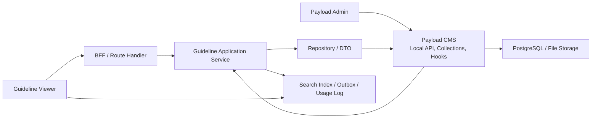

# 05. 시스템 아키텍처

이 문서는 [04. 도메인 모델](04-domain-model.md)의 바운디드 컨텍스트, 엔티티, 이벤트를 실제 시스템 구조에 배치하는 기준을 정리합니다.
초기 구조는 모듈러 모놀리스로 시작하고, 현재 상태, 공식 Version, Snapshot, Event, Log의 책임을 분리합니다.
프로젝트의 실제 폴더 구조와 개발 규칙은 [06. 프로젝트 구조와 개발 규칙](06-project-structure.md), 보안 기준은 [07. 보안](07-security.md)을 기준으로 봅니다.

## 1. 아키텍처 원칙

- 바운디드 컨텍스트마다 마이크로서비스를 만들지 않고 모듈러 모놀리스를 적용합니다.
- 바운디드 컨텍스트는 코드 경계와 데이터 소유권으로 분리합니다.
- 초기에는 하나의 애플리케이션과 하나의 PostgreSQL 인스턴스로 배포합니다.
- 현재 업무 상태와 과거 기준 재현 데이터를 분리합니다.
- 전체 Event Sourcing은 채택하지 않습니다.
- 이벤트는 반응, 전달, 감사, 분석, 운영 목적에 맞을 때만 기록합니다.

## 2. 전체 구조

초기 요청 흐름은 다음 구조를 기준으로 합니다.

```text
Frontend
  -> BFF / Route Handler
  -> Application Service
  -> Repository / Payload Collection
  -> PostgreSQL / Object Storage / External System
```

비동기 실행과 외부 전달은 다음 구조를 기준으로 합니다.

```text
Application Service
  -> Domain Event / Integration Event
  -> Outbox
  -> Worker / Queue / External Consumer
```

## 3. 모듈러 모놀리스와 바운디드 컨텍스트

초기 구조는 단일 애플리케이션으로 배포합니다.
마이크로서비스 분리는 배포 독립성, 장애 격리, 확장 요구가 실제로 생긴 뒤 검토합니다.

바운디드 컨텍스트는 다음 기준으로 나눕니다.

- 코드 소유 경계
- 데이터 소유 경계
- Application Service 경계
- 도메인 용어와 규칙 경계

컨텍스트 간 데이터 접근은 소유 모듈의 Application Service 또는 명시된 읽기 모델을 통해 수행합니다.
다른 컨텍스트의 테이블을 직접 수정하지 않습니다.

## 4. 요청 처리 흐름

Frontend 요청은 같은 애플리케이션 내부의 BFF / Route Handler가 받습니다.
BFF는 화면 단위 요청을 Application Service 호출로 조합하고, 프론트엔드에 필요한 응답 형태로 변환합니다.
도메인 규칙과 상태 변경 판단은 BFF가 아니라 Application Service에 둡니다.
여기서 도메인은 별도 구현 레이어가 아니라 업무 개념과 규칙을 뜻합니다.

```text
Frontend
  -> Request DTO
  -> BFF / Route Handler
  -> Command / Query DTO
  -> Application Service
  -> Repository
  -> Result DTO
  -> Response DTO
```

API Gateway는 초기 구조에 두지 않습니다.
여러 배포 단위, 외부 클라이언트, 공통 트래픽 정책이 필요해지는 시점에 도입합니다.

### 4.1 가이드라인 관리 컨텍스트



Guideline Viewer는 BFF를 통해 Application Service를 호출합니다.
Manager는 Payload Admin에서 가이드라인을 수정합니다.
Payload hook과 custom endpoint는 필요한 업무 처리를 Application Service로 위임합니다.
Application Service는 Repository / DTO를 통해 Payload에 접근합니다.
Payload는 collection schema를 기준으로 PostgreSQL과 File Storage에 저장합니다.
Search Index, Outbox, Usage Log는 후처리와 외부 연결입니다.

## 5. 기록 아키텍처

이 시스템은 상태 저장 + 불변 Version / Snapshot + 선택적 append-only 이벤트 로그 구조를 사용합니다.

| 기록 종류 | 목적 | 저장 위치 | 전달/보존 성격 |
| --- | --- | --- | --- |
| 도메인 상태 | 현재 업무 상태 | Payload / PostgreSQL | 트랜잭션 보장 |
| Payload revision | CMS 편집 이력, diff, restore | Payload versions / PostgreSQL | CMS 내부 이력 |
| 공식 Version | 발행 기준 고정, Worker / Agent 재현 | PostgreSQL | 불변 발행 단위 |
| Snapshot | 특정 시점의 입력과 판단 재현 | PostgreSQL / Object Storage | 불변 저장 |
| Domain Event | 같은 컨텍스트 내부 반응 | Memory + 필요 시 Outbox | 중요 이벤트만 보존 |
| Integration Event | 다른 컨텍스트나 외부 시스템에 사실 전달 | Outbox + Queue | durable, 재시도 |
| Session Event | 작업, 질문, 검수 감사 | SessionEventLog | 유실 방지 |
| Behavior Event | 조회, 클릭, 체류 분석 | BehaviorEventLog / Umami | 일부 유실 허용 |
| Agent Run | 모델 실행 재현, 품질 추적 | Agent Run 저장소 | AgentRunRef로 연결 |
| 운영 로그 | 장애 분석, 성능 측정 | Log / Trace / Metric 시스템 | 단기 보관 |

Domain Event는 전체 감사 로그가 아닙니다.
Behavior Event는 업무 사실의 원장이 아닙니다.
운영 로그는 도메인 데이터가 아닙니다.

## 6. Version / Snapshot 전략

Payload revision과 공식 Version은 분리합니다.

Payload revision은 CMS 편집 이력입니다.
Admin UI의 diff, restore, draft, autosave, scheduled publish를 위해 사용합니다.

공식 Version은 Worker, Agent, 공개 화면, 검색이 참조하는 발행 단위입니다.
공식 Version은 `stage`, `live`, `archived` 상태를 가집니다.
공개 화면과 Agent 검색은 `live` Version만 대상으로 합니다.

공식 Version은 생성 시점의 대상 document ID, Payload revision ID, 발행 시각을 참조합니다.
CMS 편집 이력 복원은 Payload revision으로 처리하고, 업무 기준 재현과 Agent 실행 기준 고정은 공식 Version으로 처리합니다.

Snapshot은 실행 당시 입력, 기준, 판단을 다시 재현해야 할 때 생성합니다.
Snapshot으로 충분히 재현되는 데이터는 런타임 이벤트로 중복 기록하지 않습니다.

## 7. 이벤트 전략

전체 Event Sourcing은 사용하지 않습니다.
모든 도메인 변화를 이벤트로 복제하지 않고, 필요한 이벤트만 기록합니다.

emit해야 하는 이벤트는 다음 기준 중 하나를 만족해야 합니다.

- 다른 컨텍스트가 알아야 하는 확정 사실
- 비동기 후속 작업을 시작하는 트리거
- 감사가 필요한 작업 단위

emit하지 않는 데이터는 다음과 같습니다.

- 단순 필드 변경
- 내부 계산 중간값
- Snapshot으로 충분히 재현되는 데이터
- 운영 로그로 충분한 장애 정보

도메인 내부 반응은 애플리케이션 내부 이벤트로 처리합니다.
다른 컨텍스트나 외부 시스템에 전달해야 하는 Integration Event만 Outbox에 저장합니다.
이후 메시지 브로커가 필요해지면 Outbox publisher를 교체합니다.

## 8. Agent / Worker 실행 아키텍처

Agent와 Worker는 도메인 상태를 직접 변경하지 않습니다.
Application Service가 실행 입력을 고정하고, Agent / Worker 결과를 검증한 뒤 저장합니다.

Agent 실행은 다음 기준을 따릅니다.

- 입력으로 사용한 공식 Version을 고정합니다.
- 실행 결과에는 AgentRunRef를 연결합니다.
- 모델 입력, 출력, 주요 설정은 Agent Run 저장소에 남깁니다.
- 공개 화면과 Agent 검색은 `live` Version만 사용합니다.

Worker 실행은 다음 기준을 따릅니다.

- 작업 시작 시점의 VersionRef를 저장합니다.
- 산출물과 검수 입력은 필요한 경우 Snapshot으로 고정합니다.
- 상태 변경은 Application Service를 통해 수행합니다.

## 9. 감사와 분석 로그

감사와 분석은 같은 로그로 처리하지 않습니다.

SessionEventLog는 작업, 질문, 검수 같은 감사 가능한 업무 활동을 기록합니다.
BehaviorEventLog는 조회, 클릭, 체류, 다운로드 같은 화면 행동 분석을 기록합니다.
운영 로그, trace, metric은 장애 분석과 성능 측정을 위해 단기 보관합니다.

유실 허용 기준은 다음과 같습니다.

| 기록 | 유실 허용 |
| --- | --- |
| SessionEventLog | 허용하지 않음 |
| BehaviorEventLog | 일부 허용 |
| Agent Run | 허용하지 않음 |
| 운영 로그 | 보관 기간 이후 삭제 가능 |

## 10. 데이터 접근 규칙

Payload collection에 저장하는 데이터는 Payload Local API를 기본 접근 방식으로 사용합니다.
Repository는 Payload query, `depth`, `select`, access control 옵션을 숨깁니다.

DB 직접 접근은 다음 경우에만 검토합니다.

- Payload로 표현하기 어려운 집계
- 운영성 조회
- 대량 로그 조회
- 성능 문제가 확인된 읽기 모델

트랜잭션 경계는 Application Service가 관리합니다.
Payload hook은 얇은 진입점으로 유지합니다.

## 11. 배포와 확장 기준

초기 배포 단위는 하나의 애플리케이션입니다.
다음 조건이 생기면 분리를 검토합니다.

| 대상 | 도입 기준 |
| --- | --- |
| Worker 분리 | 장시간 작업, 대량 처리, 실패 재시도가 웹 요청과 분리되어야 할 때 |
| Queue 도입 | Outbox polling만으로 처리량이나 재시도 요구를 감당하기 어려울 때 |
| API Gateway 도입 | 여러 배포 단위, 외부 클라이언트, 공통 트래픽 정책이 필요할 때 |
| 마이크로서비스 분리 | 컨텍스트별 배포 독립성과 장애 격리가 운영상 필요할 때 |
| 별도 로그 저장소 도입 | Payload Admin 목록 성능, 보관 기간, 검색 조건이 문제가 될 때 |

## 12. 설계 카탈로그와의 관계

[04. 도메인 모델](04-domain-model.md)의 엔티티와 이벤트는 설계 카탈로그에 포함합니다.
단, 카탈로그에 있다는 이유만으로 런타임 emit 대상이 되지는 않습니다.

설계상 이벤트와 실제 저장/전달 이벤트를 구분합니다.
구현 대상은 다음 기준으로 선정합니다.

- 현재 업무 상태를 바꾸는가
- 공식 Version 또는 Snapshot으로 재현해야 하는가
- 다른 컨텍스트가 알아야 하는 사실인가
- 감사 로그로 남겨야 하는 작업인가
- 분석 로그로 충분한 행동 기록인가
