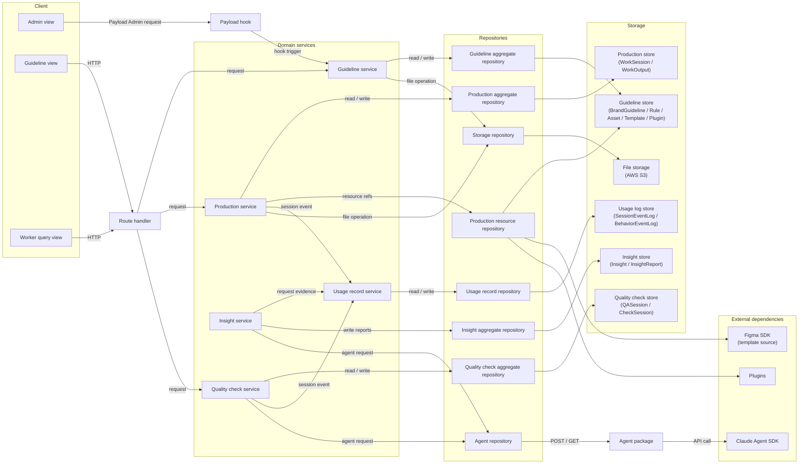
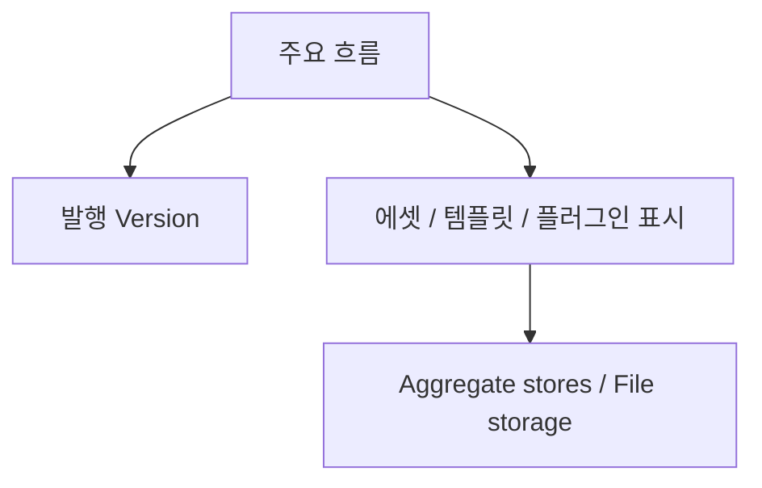
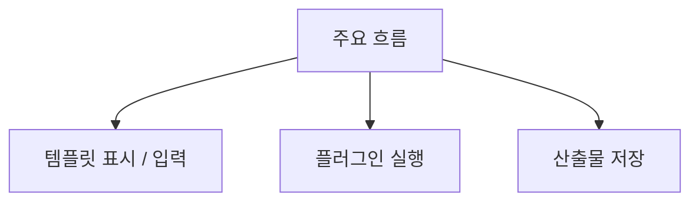
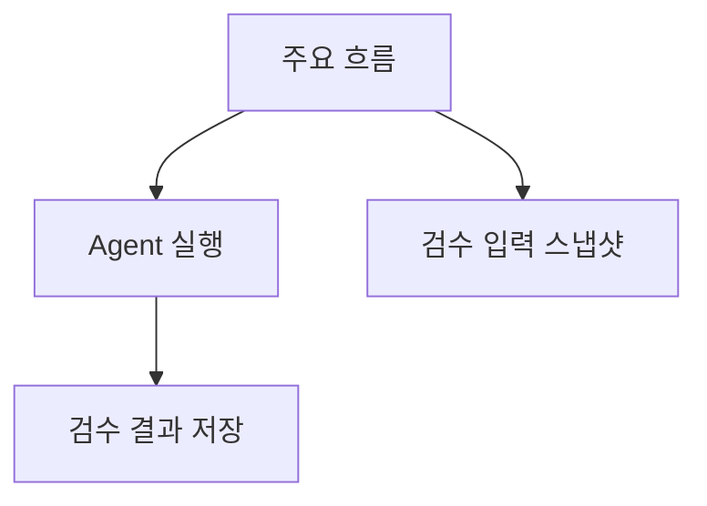
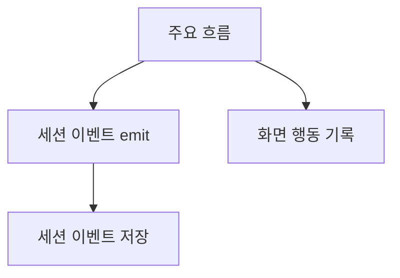
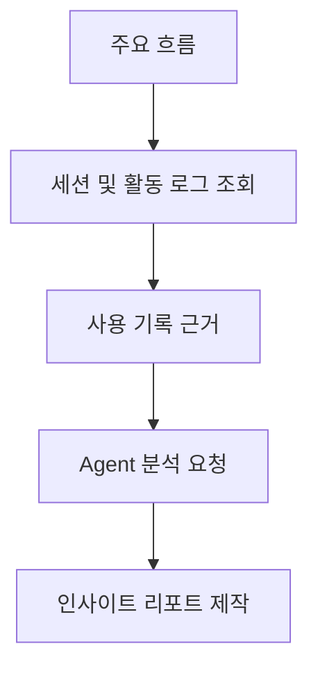

# 05. 시스템 아키텍처

이 문서는 [04. 도메인 모델](04-domain-model.md)의 바운디드 컨텍스트, 엔티티, 이벤트를 실제 시스템 구조에 배치하는 기준을 정리합니다.
초기 구조는 모듈러 모놀리스로 시작하고, 현재 상태, 공식 Version, Snapshot, Event, Log의 책임을 분리합니다.
프로젝트의 실제 폴더 구조와 개발 규칙은 [06. 프로젝트 구조와 개발 규칙](06-project-structure.md), 보안 기준은 [07. 보안](07-security.md)을 기준으로 봅니다.

## 1. 원칙

- 바운디드 컨텍스트마다 마이크로서비스를 만들지 않고 모듈러 모놀리스를 적용합니다.
- 바운디드 컨텍스트는 코드 경계와 데이터 소유권으로 분리합니다.
- 초기에는 하나의 애플리케이션과 하나의 PostgreSQL 인스턴스로 배포합니다.
- 현재 업무 상태와 과거 기준 재현 데이터를 분리합니다.
- 전체 Event Sourcing은 채택하지 않습니다.
- 이벤트는 반응, 전달, 감사, 분석, 운영 목적에 맞을 때만 기록합니다.

## 2. 구조

### 구조 원칙

초기 구조는 단일 애플리케이션으로 배포합니다.
마이크로서비스 분리는 배포 독립성, 장애 격리, 확장 요구가 실제로 생긴 뒤 검토합니다.

초기 요청 흐름은 하나의 Next.js + Payload 애플리케이션 안에서 다음 구조를 기준으로 합니다.
Payload CMS는 별도 배포 서비스가 아니라 Admin, route, Local API, collection, hook을 제공하는 애플리케이션 내부 실행 계층입니다.

```text
Presentation Layer
  -> Request Layer
  -> Domain Service Layer
  -> Data Transfer Layer
  -> Storage Layer
```

외부 전달이나 실패 재시도가 필요한 이벤트만 Outbox 도입을 검토합니다.

#### 모듈 기준

바운디드 컨텍스트는 다음 기준으로 나눕니다.

- 코드 소유 경계
- 데이터 소유 경계
- Domain Service Layer 경계
- 도메인 용어와 규칙 경계

컨텍스트 간 데이터 접근은 소유 모듈의 Domain Service Layer 또는 명시된 읽기 모델을 통해 수행합니다.
다른 컨텍스트의 테이블을 직접 수정하지 않습니다.

### 서비스 구조

#### 전체 서비스 구조

Frontend 요청은 같은 애플리케이션 내부의 Request Layer가 받습니다.
Request Layer는 화면 단위 요청을 Domain Service Layer 호출로 조합하고, 프론트엔드에 필요한 응답 형태로 변환합니다.
도메인 규칙과 상태 변경 판단은 Request Layer가 아니라 Domain Service Layer에 둡니다.
여기서 도메인은 별도 구현 레이어가 아니라 업무 개념과 규칙을 뜻합니다.
이 그림은 서브도메인 사이의 업무 관계가 아니라 서비스 레이어 배치를 보여줍니다.




Frontend / Worker UI는 Route Handler를 통해 업무 흐름을 요청합니다.
Payload Admin에서 발생한 저장, 발행, 검증 요청은 Payload hook을 통해 필요한 Domain Service Layer 흐름으로 위임합니다.
Production service는 Payload에 저장된 템플릿과 플러그인 참조를 사용해 에셋을 제작합니다.
Production resource repository는 제작에 필요한 템플릿, 플러그인, 에셋 참조 조회만 감쌉니다.
Production service와 Quality check service는 감사 가능한 활동을 Usage record service에 세션 이벤트로 전달합니다.
운영 인사이트 생성은 외부 화면 요청으로 직접 실행하지 않습니다.
Domain Service Layer는 애그리거트 저장소, Agent package, 외부 의존성에 직접 접근하지 않고 Repository를 통해 접근합니다.
Domain Service Layer는 [02. 유즈케이스](02-usecases.md)의 업무 흐름을 구현 단위로 삼습니다.
서브도메인 사이의 업무 관계는 [04. 도메인 모델](04-domain-model.md)의 하위 도메인 관계도를 기준으로 따로 작성합니다.
Infrastructure Layer는 내부 저장 경계와 외부 의존성을 함께 둡니다.
초기 Storage는 애그리거트 저장소와 파일 스토리지만 구분합니다.
Figma SDK, Claude Agent SDK, AWS S3, Plugins는 애플리케이션 밖의 의존성입니다.

#### 서브도메인 구조

서브도메인별 상세 구조는 실제 구현 책임이 갈리는 지점부터 작성합니다.

##### 가이드라인 관리



##### 제작 관리



##### 품질 검수



##### 사용 기록



##### 운영 인사이트



## 3. 기준

### 데이터 기록 기준

데이터는 실제 업무에서 다시 확인해야 하는 것만 남깁니다.
편집 중인 원본, 발행 기준, 검수 입력, 사용 기록을 구분해 저장합니다.
모든 변경 과정을 별도 이벤트로 복제하지 않습니다.

| 기록 명칭 | 남기는 이유 | 저장 위치 |
| --- | --- | --- |
| 원본 데이터 | Manager와 Worker가 지금 보고 수정하는 업무 데이터입니다. | Payload collection |
| 편집 이력 | CMS 편집 이력입니다. diff와 restore에 사용합니다. | Payload versions |
| 발행 버전 | 가이드라인, 규칙, 에셋, 템플릿, 플러그인이 발행된 기준과 자원을 고정합니다. | 각 원본 데이터의 Version |
| 실행 스냅샷 | 검수 입력처럼 나중에 같은 조건으로 다시 봐야 하는 값을 고정합니다. | 제품 DB / 파일 저장소 |
| 업무 활동 기록 | 작업, 질문, 검수처럼 감사가 필요한 업무 활동을 남깁니다. | SessionEventLog |
| 화면 행동 기록 | 조회, 클릭, 체류처럼 개선 근거가 되는 화면 행동을 남깁니다. | BehaviorEventLog |
| Agent 실행 참조 | Agent가 만든 답변, 점검, 요약 결과를 실행 기록과 연결합니다. | AgentRunRef |

### Payload 컬렉션 목록

초기 Payload collection은 실제 업무 관리 단위부터 만듭니다.
품질 검수 내부 객체는 별도 collection으로 먼저 나누지 않고 세션 collection 아래에서 관리합니다.

| Collection | 관리 단위 | 포함 대상 |
| --- | --- | --- |
| `qa-sessions` | QASession | Question, Answer, AnswerCitation, AnswerConfidence, AgentRunRef |
| `check-sessions` | CheckSession | CheckTarget, CheckInputSnapshot, CheckRun, CheckBasis, CheckDecision, CheckResult, CheckRecommendation, AgentRunRef |

### 버전 기준

가이드라인, 규칙, 에셋, 템플릿, 플러그인은 각자 발행 Version을 소유합니다.
각 Version은 `stage`, `live`, `archived` 상태를 가지고, 실행 기준은 `live` Version을 기본으로 합니다.
다른 흐름에서 발행 대상을 사용할 때는 원본 전체를 복사하지 않고 필요한 VersionRef를 넘깁니다.

Snapshot은 검수 입력처럼 나중에 같은 조건으로 다시 봐야 하는 값이 있을 때만 만듭니다.

### 설계 카탈로그 기준

[04. 도메인 모델](04-domain-model.md)의 엔티티와 이벤트는 설계 카탈로그에 포함합니다.
단, 카탈로그에 있다는 이유만으로 런타임 emit 대상이 되지는 않습니다.

설계상 이벤트와 실제 저장/전달 이벤트를 구분합니다.
구현 대상은 다음 기준으로 선정합니다.

- 현재 업무 상태를 바꾸는가
- 공식 Version 또는 Snapshot으로 재현해야 하는가
- 다른 컨텍스트가 알아야 하는 사실인가
- 감사 로그로 남겨야 하는 작업인가
- 분석 로그로 충분한 행동 기록인가

## 4. 전략

### 버전 컨트롤

Payload의 versions 기능을 CMS 편집 이력과 draft/publish 흐름에 사용합니다.
Admin UI의 diff, restore, draft 상태 관리는 Payload versions를 우선 사용합니다.

### 이벤트

전체 Event Sourcing은 사용하지 않습니다.
모든 도메인 변화를 이벤트로 복제하지 않고, 필요한 이벤트만 기록합니다.

emit해야 하는 이벤트는 다음 기준 중 하나를 만족해야 합니다.

- 다른 컨텍스트가 알아야 하는 확정 사실
- 비동기 후속 작업을 시작하는 트리거
- 감사가 필요한 작업 단위

emit하지 않는 데이터는 다음과 같습니다.

- 단순 필드 변경
- 내부 계산 중간값
- Snapshot으로 충분히 재현되는 데이터
- 운영 로그로 충분한 장애 정보

도메인 내부 반응은 애플리케이션 안에서 처리합니다.
다른 시스템에 전달해야 하고 실패 시 다시 보내야 하는 기록이 생길 때만 Outbox 같은 전달 구조를 검토합니다.

### 에이전트 실행

Agent와 Worker는 도메인 상태를 직접 변경하지 않습니다.
Domain Service Layer가 실행 입력을 고정하고, Agent / Worker 결과를 검증한 뒤 저장합니다.
Quality check service와 Insight service는 모델 SDK나 Agent package API를 직접 호출하지 않고 Agent repository를 통해 실행을 요청합니다.

Agent 실행은 다음 기준을 따릅니다.

- 입력으로 사용한 공식 Version을 고정합니다.
- 실행 결과에는 AgentRunRef를 연결합니다.
- AgentRunRef와 필요한 실행 기록을 남깁니다.
- 공개 화면과 Agent는 `live` Version만 사용합니다.

Worker 실행은 다음 기준을 따릅니다.

- 작업 시작 시점의 VersionRef를 저장합니다.
- 산출물과 검수 입력은 필요한 경우 Snapshot으로 고정합니다.
- 상태 변경은 Domain Service Layer를 통해 수행합니다.
