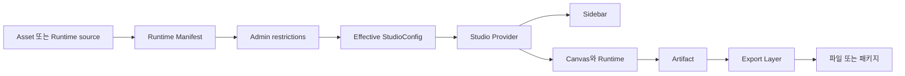

# Studio

이 문서는 Template·Graphic·Image Studio가 같은 계약으로 설정을 만들고, 화면을 조작하며, 파일을 내보내는 흐름을 설명합니다. 새 Runtime이나 출력 형식을 추가할 때 어느 레이어를 수정해야 하는지 판단하는 기준으로 사용합니다.

## 1. 목적

세 Studio는 만드는 대상이 다르지만 아래 원칙을 공유합니다.

- Runtime Manifest가 원본 capability를 정의합니다.
- Admin은 capability를 추가하지 않고 제한합니다.
- Studio UI는 계산이 끝난 Effective Config만 소비합니다.
- Runtime은 파일 형식이 아니라 Artifact를 만듭니다.
- Export Layer가 Artifact를 파일로 변환합니다.

이 구조는 Admin·Sidebar·Canvas·Exporter가 같은 규칙을 다시 구현하지 않게 합니다. 각 레이어는 바로 앞 레이어의 결과만 소비합니다.

## 2. 핵심 계약

### 전체 흐름



데이터는 왼쪽에서 오른쪽으로 흐릅니다. Sidebar와 Canvas는 서로를 import하거나 직접 호출하지 않습니다. 둘은 Studio Provider가 발행한 Context만 소비합니다.

### Runtime Manifest

`StudioRuntimeManifest`는 Admin 제한 전의 원본 계약입니다.

```ts
type StudioRuntimeManifest = {
	artifacts: StudioArtifactCapabilities
	controller: {
		groups: readonly ControllerGroupDefinition[]
	}
}
```

Manifest는 다음 두 가지를 정의합니다.

- Runtime이 만들 수 있는 `raster | vector | video | original` Artifact
- Controller가 표시할 그룹, 컨트롤 종류, 기본값과 허용 범위

Manifest는 파일 형식을 정의하지 않습니다. 같은 입력에서 항상 같은 결과를 내는 직렬화 가능한 값이어야 합니다.

세 Studio는 서로 다른 원본에서 Manifest를 만듭니다.

| Studio | Manifest 원본 | 파생 함수 |
| --- | --- | --- |
| Graphic | Drop-in Graphic Runtime definition | `defineGraphicRuntime()` |
| Image | Generation Model capability | `getImageRuntimeManifest()` |
| Template | published HTML과 `nodeConfigs` | `getTemplateRuntimeManifest()` |

### Admin restrictions

Admin은 Manifest를 읽고 다음 두 공통 정책을 저장합니다(Template은 첫 정책 대신 배경(`backgroundPolicy`)과 레이어별 `overrides[nodeId]`를 저장합니다).

- `controllerRestrictions`: availability, 기본값, 선택지, 길이와 범위를 좁힙니다.
- `exportPolicy`: 파일 형식, 원본 허용 여부, FPS, 크기와 길이 상한을 좁힙니다. 인쇄 해상도만 예외입니다 — `print.allowedPpi`는 범위를 좁히는 목록이 아니라 화면 드롭다운의 **프리셋 목록을 대신하는 값**이며(`narrowPrintPpi`), 프리셋 밖의 값도 담을 수 있습니다. 유효성은 `acceptsPrintPpi()`가 `isPrintPpi()` 범위(1~1200 정수)로 판정합니다.

Graphic Profile은 여기에 **제공 프리셋**(`presets`)을 더합니다. 매니저가 admin의 JSON 폼에 `[{ "presetId", "label", "values" }]`로 적어 둔 값 조합이고, 창작자에게는 컨트롤 목록 위의 「프리셋」 행 하나로 나갑니다. 전용 편집 화면은 두지 않습니다.

- 프리셋은 컨트롤이 아니라 **동작**입니다 — 고르면 값이 들어가고, 창작자가 컨트롤을 하나라도 만지면 선택이 즉시 풀립니다. 값을 손으로 되돌려도 다시 붙지 않습니다(같은 값 ≠ 같은 선택).
- 그래서 `controllerRestrictions`가 좁힌 범위 밖의 값은 적용 시점에 버립니다(`pickGraphicPresetValues`). 프리셋을 만든 뒤 제한이 바뀌어도 안 보이는 축이 몰래 움직이지 않습니다.
- 🔑 **기본 컨트롤(아래 「기본과 고급」)은 프리셋이 담고 있어도 버립니다.** 프리셋은 룩만 정하고, 판에 앉히는 축은 창작자 손에 남습니다 — 프리셋을 갈아 끼워도 맞춰 둔 위치가 튀지 않습니다.
- 항목의 형식 검사는 admin `validate`와 런타임 parse가 같은 규칙(`describeGraphicPresetError`)을 씁니다. `label`이 없거나 `values`가 객체가 아니면 저장 단계에서 막힙니다 — 통과한 값이 스튜디오에서 조용히 사라지지 않게 하기 위해서입니다.
- 🔴 런타임 자신의 「스타일」 컨트롤(`linear-fluted-glass` 등의 `definition.ts` 상수)과 다른 것입니다. 그쪽은 창작자에게 감춘 파라미터를 정하는 **런타임 입력**이라 값으로 저장되고, 제공 프리셋이 그 선택까지 담을 수 있습니다.

### 기본과 고급

Runtime Manifest는 `controller.basic`으로 **기본 화면에 남길 컨트롤 id**를 선언합니다. 나머지는 「고급 설정」 하나로 접히고, 그 안의 그룹은 모두 닫힌 채로 열립니다.

- 가르는 기준은 **판에 앉혀 보고 나서야 알 수 있는 축인가**입니다. 위치와 맞춤은 템플릿에 넣어 본 뒤 조정해야 하므로 기본이고, 색·광선·물성은 미리 고를 수 있으므로 프리셋에 맡깁니다.
- 🔴 **선언하지 않으면 전부 기본입니다.** 빈 배열은 「전부 고급」이라는 뜻이라 미선언과 다릅니다.
- 없는 control id를 적으면 설정 파싱이 거부합니다. 오타 하나가 「컨트롤이 이유 없이 사라진 것」으로만 보이지 않게 합니다.
- `controllerRestrictions`와 독립입니다. 제한은 **만질 수 있는지**를, 기본 선언은 **어디에 서는지**를 정합니다. 제한은 컨트롤을 없애지 않으므로(`availability`는 `readonly`·`disabled`뿐) 두 축이 서로를 무너뜨리지 않습니다.
- 🔴 한 그룹을 기본과 고급으로 쪼개면 **같은 제목이 양쪽에 뜹니다.** 그룹은 통째로 한쪽에 두는 편이 안전합니다.

컨트롤을 아무에게도 노출하지 않으려면 「고급」이 아니라 **선언 자체를 지웁니다.** 셰이더 변환기가 기본 입력을 깔고 컨트롤 값으로만 덮으므로, 선언이 사라진 축은 정본 기본값으로 고정되고 프리셋으로도 정할 수 없습니다.

Image Profile은 이 정책과 함께 Runtime Manifest의 `supportedFeatures`에서 사용할 feature를 선택합니다. Admin은 Manifest에 없는 control, feature, Artifact를 추가할 수 없습니다. 그룹 제목, `collapsible`, `defaultOpen`, label 같은 표현 정보도 바꾸지 않습니다.

```text
Effective capability = Runtime capability ∩ Admin restrictions
```

Draft는 작성 중인 불완전한 값을 허용할 수 있습니다. Publish 경계는 unknown field, 중복 ID, 지원 범위를 넓히는 값을 거부합니다.

### Effective StudioConfig

각 도메인의 derive 함수는 Manifest와 Admin 정책을 결합해 Effective Config를 만듭니다. 이 계산은 순수하고 멱등적이어야 합니다. 같은 입력을 반복해서 넣으면 같은 Config가 나와야 합니다.

```ts
type StudioControllerConfig = StudioRuntimeManifest & {
	studio: 'template' | 'image' | 'graphic'
	id: string | number
	version: 1
	name: string
}
```

각 Studio Config는 이 공통 envelope에 실행용 descriptor를 추가합니다. Template의 slot, Image의 profile feature, Graphic의 runtime ID처럼 도메인마다 다른 정보만 확장합니다. Payload 원본과 Admin policy는 Sidebar나 Canvas에 전달하지 않습니다.

### Provider와 UI

Studio Provider는 공통화하지 않습니다. 각 Provider는 도메인별 세션 값을 소유합니다.

| 레이어 | 소유하는 값 | 소유하지 않는 값 |
| --- | --- | --- |
| Provider | 현재 control 값, runtime binding, 실행 상태, 도메인 action과 결과 | Controller 표현 구조, 파일 인코딩 |
| Controller Renderer | Effective `controller.groups`를 primitive UI로 투영 | 도메인 정책, I/O, 현재 값 변경 |
| Domain Sidebar | Controller 조합과 도메인별 배치 | Admin 제한 해석 |
| Canvas | 현재 세션의 시각 결과와 직접 조작 | Sidebar 상태, 파일 형식, 다운로드 |
| Runtime | Effective 값을 실행해 Artifact 생성 | Admin 정책, 파일 형식 |

`ControllerRenderer`는 일반 그룹을 렌더합니다. Template slot이나 고정 footer처럼 별도 배치가 필요하면 `ControllerControlRenderer`로 같은 단일 control 투영을 재사용합니다.

### Artifact와 Export

Runtime과 Canvas는 파일 형식을 모르고 Artifact만 발행합니다.

| Artifact | 의미 | 현재 공통 변환 |
| --- | --- | --- |
| Raster | 크기를 지정해 canvas 또는 element surface를 제공 | PNG, JPEG, TIFF, PDF, 정지 MP4 |
| Vector | 구조화된 vector scene | SVG, PDF |
| Video | 시간에 따라 frame을 렌더하는 source | MP4 |
| Original | 변환하지 않을 원본 Blob loader | 원본 파일 |

`EXPORTER_ARTIFACT_COMPATIBILITY`가 Artifact와 파일 형식의 호환성을 한 곳에서 정의합니다. PDF는 Vector와 Raster 양쪽을 받으며, Vector Artifact가 있으면 판을 굽지 않고 도형·윤곽선을 그대로 싣는 벡터 PDF로 갑니다. `resolveStudioOutputCapability()`는 이 호환성과 Admin `exportPolicy`를 교차해 Effective `config.output`을 만듭니다.

현재 형식 선택과 실행 흐름은 다음과 같습니다.

```text
config.output
→ Studio별 Export hook이 만든 ExportRequest
→ useExport.canExport()
→ executeArtifactExport()
→ 형식별 adapter
→ download 또는 ZIP
```

`useExport.canExport()`는 Effective capability, Artifact 가용성, 요청값을 함께 확인합니다. UI는 이 결과만 사용해 버튼을 활성화합니다. `run()`은 클릭 시 같은 조건을 다시 확인해 우회 호출도 막습니다.

`original`은 파일 형식이 아니라 `OriginalArtifact` 요청입니다. ZIP도 파일 형식이 아니라 여러 결과를 묶는 전달 방식입니다.

### 출력 크기와 해상도

값의 정본은 언제나 px입니다. `px`와 `mm`는 대등한 두 모드이고 표시 설정이 아닙니다 — px 모드는 mm를 보여주지 않고, mm 모드는 px를 보여주지 않습니다. 해상도(ppi)는 두 모드를 잇는 값이라 mm 입력이 있는 컨트롤(`SizingControls`)에서만 묻습니다.

Template은 판형이 문서에 선언되어 있어 창작자가 바꿀 수 없습니다. `templates.canvasPpi`가 그 선언이고 물리 크기는 `width·height(px) ÷ canvasPpi × 25.4mm`로 파생합니다. 물리 크기를 정하는 값은 이 하나뿐입니다 — mm를 따로 저장하면 px와 종횡비가 어긋나 한 변이 조용히 버려집니다. 판형이 선언된 인쇄판은 사이드바가 mm만 보여 주고 배율도 해상도도 고르지 않습니다. `canvasPpi`가 비어 있으면 디지털판이라 물리 크기가 없고, 인쇄 형식을 낼 때만 창작자가 `exportPolicy.print.allowedPpi` 프리셋에서 해상도를 고릅니다. 🔴 Figma 재import는 `baseHtml`·`html`·`overrides`·`width`·`height`·`sourceUrl`을 덮으므로 판형 선언을 그 축에 얹으면 안 됩니다.

래스터 인쇄 요청이 싣는 크기 정보는 `scale` 하나뿐입니다(`createRasterExportRequest`) — 높이는 캔버스 비율에서 파생합니다. 그래서 판의 두 변을 따로 받는 크기 컨트롤을 Template 사이드바에 붙이면 높이 입력이 요청에 도달하지 못한 채 조용히 버려집니다(A size를 골라도 210×297mm가 아니라 210×262mm로 나갔습니다). Template 사이드바가 크기를 읽기 전용으로 두고 배율만 받는 이유가 이것입니다.

배율 상한은 형식마다 정체가 다릅니다. MP4는 H.264 인코더 예산(`resolveMaxExportScale`)이, 그 밖의 형식은 브라우저 캔버스 변 한도와 인쇄 총 픽셀(`maxPrintSize`)이 정합니다. 정지 이미지에 인코더 예산을 씌우면 1080px 판이 2배에서 막혀 A4 300ppi가 요구하는 픽셀을 만들 경로가 없어집니다. Graphic·Image는 판형 선언이 없어 창작자가 크기와 밀도를 모두 정합니다.

## 3. 표면

### Studio 메뉴

Studio는 사이드바 진입점 여섯 개로 노출됩니다. 목록과 순서의 정본은 `src/lib/routes.ts`의 `routes.studio`와 `src/components/studio/shared/studio-side-navigation.tsx`의 `navigation` 배열입니다.

| 메뉴 | 경로 | 성격 | 딥링크 | 화면 |
| --- | --- | --- | --- | --- |
| Template | `/studio/template` | 생성 Studio | `/studio/template/<templateSlug>` | 진입하면 첫 렌더 가능한 발행 템플릿으로 redirect하고, 없으면 빈 상태를 그립니다 |
| Image | `/studio/image` | 생성 Studio | `/studio/image/<profileSlug>` | 시작 Config 하나만 싣습니다. 프로파일 교체는 자산 브라우저가 담당합니다 |
| Graphic | `/studio/graphic` | 생성 Studio | `/studio/graphic/<profileSlug>` | 세그먼트 값은 runtime id입니다 — `GraphicProfiles.runtime`이 `unique`라 프로파일과 런타임이 1:1이고 runtime id가 그대로 slug 역할을 합니다 |
| Review | `/studio/review` | 검수 | 없음 | 업로드한 래스터를 CheckScenario로 검수하고 결과 테이블을 돌려줍니다 |
| MCP | `/studio/mcp` | 계정 설정 | 없음 | 단일 카드(`McpKeyIssuer`) 하나뿐이고 Canvas도 Controller도 없습니다 |
| Assets | `/studio/assets` | 자리만 확보 | 없음 | 🔴 경로와 메뉴만 서 있고 화면이 없습니다(`page.tsx`가 `requireUser()` 뒤 `null` 반환) |

`/studio` 자체는 페이지가 아니라 `/studio/assets`로 가는 영구 redirect입니다(`legacyPageRedirects`).

### 생성 Studio와 그 밖

§2의 계약을 끝까지 타는 것은 「생성 Studio」 셋뿐입니다. 나머지는 워크스페이스 셸만 공유합니다.

| | Template·Image·Graphic | Review | MCP·Assets |
| --- | --- | --- | --- |
| Runtime Manifest → Effective Config | 있음 | 없음 | 없음 |
| Artifact와 Export Layer | 있음 | 없음(출력은 검수 결과) | 없음 |
| `/studio/<kind>/<slug>` 딥링크 | 있음 | 없음 | 없음 |
| 세션 소유자 | 도메인별 Studio Provider | `CheckImageProvider`(`studio/review/layout.tsx`) | 없음 |

🔑 **셸을 공유한다고 계약을 공유하는 것이 아닙니다.** 새 메뉴를 §2 계약 위에 올릴 것이 아니라면 생성 Studio로 만들지 않습니다.

회원 게이트는 layout이 아니라 여섯 페이지가 각자 첫 줄의 `requireUser()`로 소유합니다 — layout의 검사는 클라이언트 내비게이션에서 재실행되지 않기 때문입니다. layout은 `StudioCapabilitiesProvider`로 `isManager(user)`를 `canManageProfiles`에 심고, 그 값을 읽는 곳은 `useProfilePreview` 하나입니다. 🔴 표시는 강제가 아닙니다 — 실제 차단은 `POST /api/studio/preview`가 합니다([REST](../surfaces/rest.md)).

### 소비 계약

| Surface | 소비 계약 | 역할 |
| --- | --- | --- |
| Worker Studio | Effective StudioConfig와 Provider Context | 사용자가 Controller를 조작하고 결과를 확인 |
| Payload Admin | Runtime Manifest와 sparse restrictions | 원본 capability를 읽고 허용 범위만 축소 |
| Template host | published Image·Graphic Effective Config | 배경 자산을 선택하고 host 범위로 한 번 더 축소 |
| Export UI | Effective output view model | 형식과 옵션을 선택하고 공통 Export Layer 실행 |

Template이 Image나 Graphic을 포함해도 해당 Studio Provider를 중첩하지 않습니다. Template Provider는 published Effective Config와 공개 Runtime adapter만 소비합니다.

## 4. 의존

주요 구현 경계는 다음 위치에 있습니다.

| 경계 | 위치 |
| --- | --- |
| Controller Definition·Restrictions | `src/modules/studio-controller/` |
| Artifact 계약 | `src/modules/studio-artifact/` |
| 공통 출력 capability·request·adapter | `src/features/studio-export/` |
| Graphic Manifest·model·client runtime | `src/features/graphic-generation/graphic-runtimes/` |
| Image Manifest·profile projection·생성 실행 | `src/features/image-generation/` |
| Template Manifest·slot projection·compose | `src/features/template-customization/` |
| Studio 표현 컴포넌트 | `src/components/studio/` |

새 Graphic 자산은 아래 폴더 하나로 추가합니다.

```text
src/features/graphic-generation/graphic-runtimes/<id>/
├─ definition.ts
├─ model.ts
└─ runtime.client.ts
```

`definition.ts`는 Manifest, `model.ts`는 순수 계산, `runtime.client.ts`는 P5/WebGL 같은 브라우저 실행을 소유합니다. 추가한 뒤 `pnpm generate:graphic-runtime-catalogs`를 실행합니다. 기존 Provider·Sidebar·Canvas를 수정하지 않습니다. 새 엔진 host가 필요할 때만 공통 Canvas 경계를 확장합니다.

새 Image model은 `getImageRuntimeManifest()`에 model capability를 추가합니다. Profile은 지원 feature를 선택하고 restrictions로 범위를 좁힙니다. 새 Template slot은 DOM projection부터 initialize, render, update, compose까지 exhaustive하게 연결합니다.

새 출력 형식은 Studio가 아니라 `studio-export`에 추가합니다. 공통 format 어휘, Artifact 호환성, ExportRequest, `executeArtifactExport()`와 adapter를 함께 확장합니다.

## 5. 크로스커팅

다음 불변식을 유지합니다.

- Runtime Manifest는 capability의 유일한 정본입니다. Runtime 구현이 같은 capability를 다시 선언하지 않습니다.
- Admin은 capability를 좁힐 수만 있습니다.
- Effective Config가 만들어진 뒤에는 Payload 원본이나 restrictions를 다시 해석하지 않습니다.
- Renderer는 Config와 session values를 변경하지 않습니다.
- Canvas와 Runtime은 파일 형식이나 다운로드를 처리하지 않습니다.
- Export의 형식 분기는 `executeArtifactExport()` 한 곳에만 둡니다.
- UI의 비활성화와 실행 직전 검증은 같은 `useExport` 판정을 소비합니다.
- 도메인별 Provider는 유지하되 Controller와 Export 계약은 공유합니다.

구현 위치와 의존 방향은 [06. 프로젝트 구조](../06-project-structure.md)를 따릅니다. Controller 컴포넌트 작성 규칙은 [10. 컴포넌트 작성](../10-component-authoring.md)의 `컨트롤러 컨트롤 계약`을 따릅니다. Template 제작과 인쇄의 도메인 규칙은 [Create](create.md), Image 생성 서비스의 실행 규칙은 [Image](image.md)를 참고하세요.
