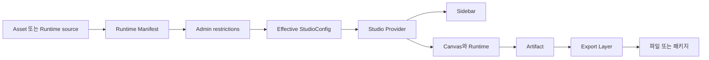

# Studio

이 문서는 Template·Graphic·Image Studio가 같은 계약으로 설정을 만들고, 화면을 조작하며, 파일을 내보내는 흐름을 설명합니다. 새 Runtime이나 출력 형식을 추가할 때 어느 레이어를 수정해야 하는지 판단하는 기준으로 사용합니다.

## 1. 목적

세 Studio는 만드는 대상이 다르지만 아래 원칙을 공유합니다.

- Runtime Manifest가 원본 capability를 정의합니다.
- Admin은 capability를 추가하지 않고 제한합니다.
- Studio UI는 계산이 끝난 Effective Config만 소비합니다.
- Runtime은 파일 형식이 아니라 Artifact를 만듭니다.
- Export Layer가 Artifact를 파일로 변환합니다.

이 구조는 Admin·Sidebar·Canvas·Exporter가 같은 규칙을 다시 구현하지 않게 합니다. 각 레이어는 바로 앞 레이어의 결과만 소비합니다.

## 2. 핵심 계약

### 전체 흐름



데이터는 왼쪽에서 오른쪽으로 흐릅니다. Sidebar와 Canvas는 서로를 import하거나 직접 호출하지 않습니다. 둘은 Studio Provider가 발행한 Context만 소비합니다.

### Runtime Manifest

`StudioRuntimeManifest`는 Admin 제한 전의 원본 계약입니다.

```ts
type StudioRuntimeManifest = {
	artifacts: StudioArtifactCapabilities
	controller: {
		groups: readonly ControllerGroupDefinition[]
	}
}
```

Manifest는 다음 두 가지를 정의합니다.

- Runtime이 만들 수 있는 `raster | vector | video | original` Artifact
- Controller가 표시할 그룹, 컨트롤 종류, 기본값과 허용 범위

Manifest는 파일 형식을 정의하지 않습니다. 같은 입력에서 항상 같은 결과를 내는 직렬화 가능한 값이어야 합니다.

세 Studio는 서로 다른 원본에서 Manifest를 만듭니다.

| Studio | Manifest 원본 | 파생 함수 |
| --- | --- | --- |
| Graphic | Drop-in Graphic Runtime definition | `defineGraphicRuntime()` |
| Image | Generation Model capability | `getImageRuntimeManifest()` |
| Template | published HTML과 `nodeConfigs` | `getTemplateRuntimeManifest()` |

### Admin restrictions

Admin은 Manifest를 읽고 다음 두 공통 정책을 저장합니다(Template은 첫 정책 대신 배경(`backgroundPolicy`)과 레이어별 `overrides[nodeId]`를 저장합니다).

- `controllerRestrictions`: availability, 기본값, 선택지, 길이와 범위를 좁힙니다.
- `exportPolicy`: 파일 형식, 원본 허용 여부, PPI, FPS, 크기와 길이 상한을 좁힙니다.

Image Profile은 이 정책과 함께 Runtime Manifest의 `supportedFeatures`에서 사용할 feature를 선택합니다. Admin은 Manifest에 없는 control, feature, Artifact를 추가할 수 없습니다. 그룹 제목, `collapsible`, `defaultOpen`, label 같은 표현 정보도 바꾸지 않습니다.

```text
Effective capability = Runtime capability ∩ Admin restrictions
```

Draft는 작성 중인 불완전한 값을 허용할 수 있습니다. Publish 경계는 unknown field, 중복 ID, 지원 범위를 넓히는 값을 거부합니다.

### Effective StudioConfig

각 도메인의 derive 함수는 Manifest와 Admin 정책을 결합해 Effective Config를 만듭니다. 이 계산은 순수하고 멱등적이어야 합니다. 같은 입력을 반복해서 넣으면 같은 Config가 나와야 합니다.

```ts
type StudioControllerConfig = StudioRuntimeManifest & {
	studio: 'template' | 'image' | 'graphic'
	id: string | number
	version: 1
	name: string
}
```

각 Studio Config는 이 공통 envelope에 실행용 descriptor를 추가합니다. Template의 slot, Image의 profile feature, Graphic의 runtime ID처럼 도메인마다 다른 정보만 확장합니다. Payload 원본과 Admin policy는 Sidebar나 Canvas에 전달하지 않습니다.

### Provider와 UI

Studio Provider는 공통화하지 않습니다. 각 Provider는 도메인별 세션 값을 소유합니다.

| 레이어 | 소유하는 값 | 소유하지 않는 값 |
| --- | --- | --- |
| Provider | 현재 control 값, runtime binding, 실행 상태, 도메인 action과 결과 | Controller 표현 구조, 파일 인코딩 |
| Controller Renderer | Effective `controller.groups`를 primitive UI로 투영 | 도메인 정책, I/O, 현재 값 변경 |
| Domain Sidebar | Controller 조합과 도메인별 배치 | Admin 제한 해석 |
| Canvas | 현재 세션의 시각 결과와 직접 조작 | Sidebar 상태, 파일 형식, 다운로드 |
| Runtime | Effective 값을 실행해 Artifact 생성 | Admin 정책, 파일 형식 |

`ControllerRenderer`는 일반 그룹을 렌더합니다. Template slot이나 고정 footer처럼 별도 배치가 필요하면 `ControllerControlRenderer`로 같은 단일 control 투영을 재사용합니다.

### Artifact와 Export

Runtime과 Canvas는 파일 형식을 모르고 Artifact만 발행합니다.

| Artifact | 의미 | 현재 공통 변환 |
| --- | --- | --- |
| Raster | 크기를 지정해 canvas 또는 element surface를 제공 | PNG, JPEG, TIFF, PDF, 정지 MP4 |
| Vector | 구조화된 vector scene | SVG |
| Video | 시간에 따라 frame을 렌더하는 source | MP4 |
| Original | 변환하지 않을 원본 Blob loader | 원본 파일 |

`EXPORTER_ARTIFACT_COMPATIBILITY`가 Artifact와 파일 형식의 호환성을 한 곳에서 정의합니다. `resolveStudioOutputCapability()`는 이 호환성과 Admin `exportPolicy`를 교차해 Effective `config.output`을 만듭니다.

현재 형식 선택과 실행 흐름은 다음과 같습니다.

```text
config.output
→ Studio별 Export hook이 만든 ExportRequest
→ useExport.canExport()
→ executeArtifactExport()
→ 형식별 adapter
→ download 또는 ZIP
```

`useExport.canExport()`는 Effective capability, Artifact 가용성, 요청값을 함께 확인합니다. UI는 이 결과만 사용해 버튼을 활성화합니다. `run()`은 클릭 시 같은 조건을 다시 확인해 우회 호출도 막습니다.

`original`은 파일 형식이 아니라 `OriginalArtifact` 요청입니다. ZIP도 파일 형식이 아니라 여러 결과를 묶는 전달 방식입니다.

## 3. 표면

| Surface | 소비 계약 | 역할 |
| --- | --- | --- |
| Worker Studio | Effective StudioConfig와 Provider Context | 사용자가 Controller를 조작하고 결과를 확인 |
| Payload Admin | Runtime Manifest와 sparse restrictions | 원본 capability를 읽고 허용 범위만 축소 |
| Template host | published Image·Graphic Effective Config | 배경 자산을 선택하고 host 범위로 한 번 더 축소 |
| Export UI | Effective output view model | 형식과 옵션을 선택하고 공통 Export Layer 실행 |

Template이 Image나 Graphic을 포함해도 해당 Studio Provider를 중첩하지 않습니다. Template Provider는 published Effective Config와 공개 Runtime adapter만 소비합니다.

## 4. 의존

주요 구현 경계는 다음 위치에 있습니다.

| 경계 | 위치 |
| --- | --- |
| Controller Definition·Restrictions | `src/modules/studio-controller/` |
| Artifact 계약 | `src/modules/studio-artifact/` |
| 공통 출력 capability·request·adapter | `src/features/studio-export/` |
| Graphic Manifest·model·client runtime | `src/features/graphic-generation/graphic-runtimes/` |
| Image Manifest·profile projection·생성 실행 | `src/features/image-generation/` |
| Template Manifest·slot projection·compose | `src/features/template-customization/` |
| Studio 표현 컴포넌트 | `src/components/studio/` |

새 Graphic 자산은 아래 폴더 하나로 추가합니다.

```text
src/features/graphic-generation/graphic-runtimes/<id>/
├─ definition.ts
├─ model.ts
└─ runtime.client.ts
```

`definition.ts`는 Manifest, `model.ts`는 순수 계산, `runtime.client.ts`는 P5/WebGL 같은 브라우저 실행을 소유합니다. 추가한 뒤 `pnpm generate:graphic-runtime-catalogs`를 실행합니다. 기존 Provider·Sidebar·Canvas를 수정하지 않습니다. 새 엔진 host가 필요할 때만 공통 Canvas 경계를 확장합니다.

새 Image model은 `getImageRuntimeManifest()`에 model capability를 추가합니다. Profile은 지원 feature를 선택하고 restrictions로 범위를 좁힙니다. 새 Template slot은 DOM projection부터 initialize, render, update, compose까지 exhaustive하게 연결합니다.

새 출력 형식은 Studio가 아니라 `studio-export`에 추가합니다. 공통 format 어휘, Artifact 호환성, ExportRequest, `executeArtifactExport()`와 adapter를 함께 확장합니다.

## 5. 크로스커팅

다음 불변식을 유지합니다.

- Runtime Manifest는 capability의 유일한 정본입니다. Runtime 구현이 같은 capability를 다시 선언하지 않습니다.
- Admin은 capability를 좁힐 수만 있습니다.
- Effective Config가 만들어진 뒤에는 Payload 원본이나 restrictions를 다시 해석하지 않습니다.
- Renderer는 Config와 session values를 변경하지 않습니다.
- Canvas와 Runtime은 파일 형식이나 다운로드를 처리하지 않습니다.
- Export의 형식 분기는 `executeArtifactExport()` 한 곳에만 둡니다.
- UI의 비활성화와 실행 직전 검증은 같은 `useExport` 판정을 소비합니다.
- 도메인별 Provider는 유지하되 Controller와 Export 계약은 공유합니다.

구현 위치와 의존 방향은 [06. 프로젝트 구조](../06-project-structure.md)를 따릅니다. Controller 컴포넌트 작성 규칙은 [10. 컴포넌트 작성](../10-component-authoring.md)의 `컨트롤러 컨트롤 계약`을 따릅니다. Template 제작과 인쇄의 도메인 규칙은 [Create](create.md), Image 생성 서비스의 실행 규칙은 [Image](image.md)를 참고하세요.
