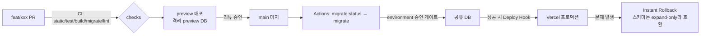

# farnext.md — 이 리포의 DB·환경·협업 구조 심층 진단과 학습 지도

> 2026-08-03~04. 8개 주제를 병렬 조사하고 각 결과를 적대적 검증자가 반박한 뒤, 리포·DB 실측으로 교차 확인한 문서.
> 검증에서 **문제 134건·정정 128건**이 나왔고 완결성 critic이 **누락 26건**을 지적했다. 그 결과를 본문에 반영했다.
>
> 읽는 순서: **§0 요약 → §10 우선순위** 만 읽어도 판단할 수 있다. §1~§9는 근거이고, §11이 학습 자료다.

---

## 0. 30초 요약

**하루에 하나씩 터진 건 우연이 아니라 두 구조에서 나왔다.**

1. **로컬 DB가 마이그레이션 체제 밖에 있다** — 사고 1·오전 저장 장애·드리프트 28컬럼이 전부 여기서 나왔다.
2. **공유 DB 하나가 stage와 실질 프로덕션을 겸한다** — 실수의 여지가 크고, 실제로 조회 명령 하나가 스키마를 바꿨다.

**그런데 조사 과정에서 어제까지의 내 진단 4개가 뒤집혔다.** 이게 이 문서의 가장 중요한 내용이다.

| 어제까지의 진단 | 실제 (소스·실측으로 확인) |
|---|---|
| 로컬 `payload_migrations` 옛 95건이 `payload migrate`를 막는다 | ❌ **95건은 무해한 쓰레기다.** 진짜 원인은 push가 심는 **단일 행 `name='dev', batch=-1`** — `migrate.js`가 이 행을 보면 대화형 confirm을 띄우고, 비대화형에서 그게 **영구 hang**이 된다 |
| 커밋 21건이 전부 `Ran: No`인 건 이상 신호다 | ❌ **정상 동작이다.** 미적용 판정이 `existing.name === migration.name` **문자열 완전 일치뿐**이라, baseline squash로 파일명을 새로 만들면 옛 기록과 하나도 안 맞는 게 당연하다 |
| `pool.max: 2 → 10`이 데드락을 고쳤다 | ⚠️ **`max: 10`은 pg-pool 기본값 복귀일 뿐 튜닝이 아니다.** 실제로 증상을 없앤 건 `connectionTimeoutMillis: 10_000`이다 — 기본값이 `0`(무한 대기)이라 이게 없으면 풀 고갈이 곧 영구 스피너가 된다 |
| `autosave: 2000`은 공격적 설정이다 | ❌ **Payload 3.85.1의 기본값이 정확히 2000이다.** 공격적이라고 한 것은 사실 오류였다 |

**그리고 이번에 확인된 실질 위험 하나** — `scripts/sync-local-db-to-remote.sh`(`pnpm db:sync:local-to-remote`)가 **확인 프롬프트 없이 `pg_restore --clean`으로 공유 DB를 로컬 것으로 전체 교체**한다. 지금은 중간의 `pnpm migrate`가 로컬 dev 마커 때문에 hang해서 파괴적 단계에 도달하지 못하는데, **P0을 고치면 그 우연한 방어가 사라진다.** P0과 이 스크립트의 가드는 같이 처리해야 한다.

---

## 0-1. 실측 확인 (추측과 구분)

조사 주장들을 리포·DB에 직접 대조한 결과. **공유 DB는 읽기만 했다.**

| 항목 | 로컬 DB | 공유(stage=실질 프로덕션) DB |
|---|---|---|
| `payload_migrations` 행 수 | **95** | **21** |
| 커밋된 21건과 이름 교집합 | **0** 🔴 | **21** ✅ |
| `dev` 마커(`batch = -1`) | **1건 존재** 🔴 | **없음** ✅ |
| 스키마 상태 | 상위집합(테이블 +6·enum +2·컬럼 +32, 부족 0) | 코드와 일치 |

**결론: 문제는 로컬 전용이다.** 완결성 critic이 "사고 1의 실질 위험은 공유 DB인데 실측이 0건"이라고 지적했는데, 실측해보니 공유 DB는 정상이었다. 그래서 P0은 **장애 위험이 아니라 개발 생산성 문제**로 격이 내려간다.

`up()`의 파괴적 구문도 확인했다 — 총 13건(`remove_json_templates` 6 · `technical_illustration` 2 · `remove_template_rule_references` 4 · `agent_response_levels` 1). **전부 공유 DB에 이미 적용됐다**(21/21). 즉 지나간 일이고 앞으로의 위험이 아니다. 로컬에만 그 컬럼·테이블이 잔재로 남아 있으며, 이미 코드에서 참조하지 않는다.

---

## 0-2. 검증 결과를 읽는 방법

각 섹션 끝의 `⚠️ 적대적 검증이 잡은 문제`는 **그 섹션 본문에 대한 반박**이다. 본문을 읽을 때 함께 봐야 한다. 검증자에게는 웹·소스 확인을 지시했고 회의적 태도를 기본으로 두게 했다.

**단 검증에도 오판이 있다.** 대표적으로 §2의 검증자는 "근본 원인으로 지목한 코드가 리포에 존재하지 않는다 — 이미 `req`를 넘긴다"며 환각으로 판정했는데, git 이력을 확인하면 `ff03bf1`(2026-07-17) 원본은 `await listGuidelineSearchRules(payload, document)`로 **`req`가 없었다.** 리서치가 지적한 뒤 내가 고쳤고, 검증자는 고쳐진 파일을 보고 "원래 그랬다"고 결론한 것이다. 완결성 critic도 같은 착각을 했다.

즉 **검증도 실행 시점의 코드를 본다.** 반박을 그대로 믿지 말고 한 번 더 확인해야 한다 — 이 문서를 쓰면서 배운 것 중 하나다.

---

## 1. 스키마 마이그레이션 체제와 드리프트 — Payload/drizzle 특유의 함정
### push 모드와 migration 모드의 공식 경계

Payload 공식 문서는 두 모드를 환경별로 나누고, 섞는 것을 명시적으로 금지한다.

- 개발: push가 기본값이며 권장. "Payload uses Drizzle ORM's powerful `push` mode to automatically sync data changes to your database for you while in development mode."
- 경고(원문): "do not mix 'push' and migrations with your local development database."
- 프로덕션: `"ci": "payload migrate && pnpm build"`, 또는 장수 서버라면 어댑터에 `prodMigrations: migrations`.

소스 수준의 실제 게이트는 `@payloadcms/db-postgres/dist/connect.js` 두 블록이다.

```js
// Only push schema if not in production
if (process.env.NODE_ENV !== 'production' && process.env.PAYLOAD_MIGRATING !== 'true' && this.push !== false) {
  await pushDevSchema(this)
}
// ...
if (process.env.NODE_ENV === 'production' && this.prodMigrations) {
  await this.migrate({ migrations: this.prodMigrations })   // ← PAYLOAD_MIGRATING 가드 없음
}
```

여기서 나오는 사실: `NODE_ENV=production`이면 `push: true`여도 push는 무시된다. `PAYLOAD_MIGRATING=true`는 `payload/dist/bin/migrate.js`가 세팅하므로 어떤 `migrate:*` 명령 중에도 push가 끼어들지 않는다. 반대로 아래 블록에는 그 가드가 없다 — 사고 7의 원인이다.

| 환경 | 공식 권장 | 우리 현황 | 평가 |
|---|---|---|---|
| 로컬(disposable) | `push: true` | `PAYLOAD_DB_PUSH=false` 기본 | 공식보다 보수적. 공유 DB 직결 리스크가 있는 우리 상황엔 합리적 |
| 로컬(공유 DB 직결) | 해당 없음(금지) | 존재 | 최대 잔여 리스크. push=false여도 조회 명령이 스키마를 바꿀 수 있다 |
| CI 테스트 | 무관 | `PAYLOAD_DB_PUSH=true` | 문제없음. 단 이 잡은 마이그레이션을 전혀 검증하지 않는다 |
| CI 체인 검증 | `payload migrate` | 전용 `migrate` 잡 | 좋음. 단 "결과 스키마 == 코드"는 안 본다 |
| stage/prod | migration only | `push=false` + `prodMigrations` 3중 조건 | 권장과 일치 |

### 사고 1의 실제 메커니즘: `batch = -1` dev 마커 + 파일명 문자열 매칭

세 가지가 겹쳤다.

**(1) dev 마커.** push가 성공하면 `@payloadcms/drizzle/dist/utilities/pushDevSchema.js`가 `payload_migrations`에 정확히 한 행을 심는다.

```js
const result = await adapter.execute({ drizzle, raw: `SELECT * FROM ${migrationsTable} WHERE batch = '-1'` })
if (!devPush.length) {
  await drizzle.insert(adapter.tables.payload_migrations).values({ name: 'dev', batch: -1 })
} else {
  await adapter.execute({ drizzle, raw: `UPDATE ${migrationsTable} SET updated_at = CURRENT_TIMESTAMP WHERE batch = '-1'` })
}
```

`name='dev', batch=-1`. push할 때마다 `updated_at`만 갱신되므로 행은 항상 1개다.

**(2) 그 마커를 보면 migrate가 대화형 confirm을 띄운다** (`@payloadcms/drizzle/dist/migrate.js`).

```js
if (migrationsInDB.find((m) => m.batch === -1)) {
  const { confirm: runMigrations } = await prompts({
    name: 'confirm', type: 'confirm', initial: false,
    message: "It looks like you've run Payload in dev mode, ... data loss will occur. Would you like to proceed?"
  }, { onCancel: () => { process.exit(0) } })
  if (!runMigrations) { process.exit(0) }
  migrationsInDB = migrationsInDB.filter((m) => m.batch !== -1)
}
```

비대화형(파이프·CI·에이전트 셸)에서 이 프롬프트는 에러가 아니라 **영구 hang**이다. 직접 확인했다: `prompts`를 stdin=/dev/null로 실행하면 promise가 settle되지 않고 Node가 `Detected unsettled top-level await` 경고 후 exit 13을 낸다. 그런데 payload는 이미 pg Pool과 타이머를 열어둔 상태라 이벤트 루프가 절대 비지 않는다 → 프로세스가 무기한 멈춘다. "payload migrate 실행 불가"의 정체가 이것이다.

**(3) 미적용 판정은 파일명 완전 일치뿐이다.**

```js
const alreadyRan = migrationsInDB.find((existing) => existing.name === migration.name)
```

해시도, 순서 번호도, snapshot 체인도 안 본다. `migrate:status`도 같은 로직(`migrateStatus.js`). 그래서 baseline squash로 파일명을 새로 만든 순간 DB의 옛 95건은 어느 파일과도 매칭되지 않고 커밋된 21건이 전부 `Ran: No`가 된다.

정리하면 옛 95건은 **무해한 쓰레기**(무시됨)이고, 진짜 원인은 (a) dev 마커 1행으로 migrate가 hang, (b) hang을 뚫으면 push로 이미 세워진 스키마 위에 21건을 처음부터 재적용 → `type ... already exists` / `relation ... already exists`로 실패, 그 결과가 컬럼 28개·enum 11개 드리프트다.

그리고 마이그레이션은 트랜잭션 안에서 돈다(`initTransaction` → `migration.up` → `commitTransaction`, 실패 시 `killTransaction`). 포트 5432 session mode pooler에서는 커넥션이 재사용되므로 정리되지 않은 트랜잭션이 `idle in transaction`으로 남아 ACCESS EXCLUSIVE 락을 붙든다 → admin 저장 무한로딩. 사고 1과 사고 2가 같은 지점에서 만난다.

### push DB를 마이그레이션 체제로 옮기는 표준 연산 — 생태계 비교와 Payload의 공백

이 문제는 모든 마이그레이션 툴이 갖고 있고 이름이 다 붙어 있다.

| 생태계 | 연산 이름 | 명령/설정 | 이력 테이블 |
|---|---|---|---|
| Flyway | baseline | `flyway baseline`, `-baselineOnMigrate`, `baselineVersion` | `flyway_schema_history` |
| Liquibase | changelog sync | `liquibase changelog-sync`, `changelog-sync-to-tag` | `DATABASECHANGELOG` |
| Prisma | baselining | `prisma migrate diff --from-empty --to-schema-datamodel ... --script` → `prisma migrate resolve --applied 0_init` | `_prisma_migrations` |
| Alembic | stamp | `alembic stamp head` | `alembic_version` |
| Django | fake | `migrate --fake-initial`, `--fake <app> <mig>` | `django_migrations` |
| drizzle-kit 단독 | 없음(수동) | `meta/_journal.json` 편집 + 직접 INSERT | `__drizzle_migrations` |
| **Payload + drizzle** | **없음** | 전용 명령 없음 — 아래 우회 | `payload_migrations` |

Payload에는 대응 명령이 없다. 다만 `payload_migrations`는 **평범한 Payload 컬렉션**이다.

```js
// payload/dist/database/migrations/migrationsCollection.js
{ slug: 'payload-migrations', admin: { hidden: true },
  fields: [{ name: 'name', type: 'text' }, { name: 'batch', type: 'number' }] }
```

즉 raw SQL도, 새 의존성도 필요 없이 Local API로 stamp를 만들 수 있다.

```ts
// .scratch/scripts/stamp-migrations.ts
// 실행: NODE_ENV=development PAYLOAD_RUN_MIGRATIONS_ON_STARTUP=false pnpm payload run .scratch/scripts/stamp-migrations.ts
import config from '@payload-config'
import { getPayload } from 'payload'
import migrations from '../../migrations'

const payload = await getPayload({ config })

// 1) dev 마커 제거 — 남아 있으면 migrate가 무한 대기한다
await payload.delete({ collection: 'payload-migrations', where: { batch: { equals: -1 } } })

// 2) 커밋된 마이그레이션을 '적용됨'으로 기록 (flyway baseline / prisma migrate resolve --applied 대응)
const { docs: existing } = await payload.find({ collection: 'payload-migrations', limit: 0 })
const known = new Set(existing.map((d) => d.name))
for (const m of migrations) {
  if (known.has(m.name)) continue
  await payload.create({ collection: 'payload-migrations', data: { name: m.name, batch: 1 } })
  console.log('stamped', m.name)
}
process.exit(0)
```

**stamp 전 필수 확인**: 그 DB의 실제 스키마가 코드와 일치해야 한다(아래 게이트 B의 pg_dump 비교를 그 DB 대상으로 실행). 불일치 상태에서 stamp하면 드리프트를 영구화한다. 로컬 disposable DB라면 stamp보다 재생성(`payload migrate`로 처음부터)이 항상 더 싸다.

주의 두 가지. 이 스크립트도 `payload run`이라 connect를 부르므로 `NODE_ENV=production` + `PAYLOAD_RUN_MIGRATIONS_ON_STARTUP=true`면 stamp 전에 prodMigrations가 먼저 적용된다(사고 7). 그리고 stamp로 전 건을 batch=1로 만들면 `migrate:down` 한 번이 전 스키마를 되감으려 든다 — 우리는 down을 쓰지 않으니 실무 영향은 없지만 알고 있어야 한다.

한편 drizzle-kit의 baseline 관련 도구(`drizzle-kit check`, `_journal.json`, snapshot `prevId` 체인)는 **Payload에서 쓸 수 없다.** Payload는 drizzle-kit CLI 대신 `drizzle-kit/api`의 `generateDrizzleJson`/`generateMigration`만 직접 호출하고, 스냅샷을 `meta/_journal.json`이 아니라 `migrations/<timestamp>_<name>.json`으로 자체 관리한다. 우리 리포 스냅샷을 직접 확인한 결과:

| 스냅샷 | prevId | tables | enums |
|---|---|---|---|
| `20260722_105137_baseline_v2.json` | `00000000-0000-0000-0000-000000000000` | 177 | 85 |
| `20260803_025030_do_dont_widget.json` | `00000000-0000-0000-0000-000000000000` | 259 | 114 |

전부 origin UUID다. 스냅샷 체인 무결성 검증이 **구조적으로 존재하지 않고**, 순서를 정하는 유일한 신호는 파일명 사전순이다.

### 사고 5: 스냅샷 기반 diff가 정확히 어떻게 동작하는가

`@payloadcms/drizzle/dist/utilities/buildCreateMigration.js` 핵심.

```js
const drizzleJsonAfter = await generateDrizzleJson(this.schema)   // 코드(Payload config)에서 생성
let drizzleJsonBefore = this.defaultDrizzleSnapshot               // 기본값 = 빈 스키마
if (!upSQL) {
  const latestSnapshot = fs.readdirSync(dir).filter((f) => f.endsWith('.json')).sort().reverse()?.[0]
  if (latestSnapshot) {
    drizzleJsonBefore = JSON.parse(fs.readFileSync(`${dir}/${latestSnapshot}`, 'utf8'))
    if (upSnapshot && drizzleJsonBefore.version < drizzleJsonAfter.version) drizzleJsonBefore = upSnapshot(drizzleJsonBefore)
  }
  const sqlStatementsUp = await generateMigration(drizzleJsonBefore, drizzleJsonAfter)
  // ...
  fs.writeFileSync(`${filePath}.json`, JSON.stringify(drizzleJsonAfter, null, 2))
}
```

여기서 나오는 사실 5개가 전부 사고 5의 원인 후보다.

1. **DB를 전혀 안 본다.** `bin/migrate.js`가 `migrate:create`만 `disableDBConnect: true`로 부팅한다. diff는 "직전 `.json` ↔ 코드"이지 "실제 DB ↔ 코드"가 아니다. 로컬 DB가 28컬럼 어긋나 있어도 `migrate:create`는 멀쩡해 보인다.
2. **before의 기본값이 빈 스키마다.** `.json`이 하나도 없으면 `defaultDrizzleSnapshot`에서 diff → 전체 스키마 재생성. 스냅샷이 gitignore되거나 삭제되면 이게 그대로 일어난다(메모의 "baseline_seed.json 커밋으로 수정"이 이 케이스).
3. **before는 "파일명 사전순 마지막 `.json`" 하나다.** 적용 이력도, `.ts`와의 짝도, 실제 시간 순서도 안 본다. `readdirSync`는 비재귀라 `migrations/archive/`는 다행히 무시된다. 하지만 접두사 규칙을 벗어난 파일명 하나로 순서가 깨진다.
4. **predefined 마이그레이션은 스냅샷을 아예 안 남긴다.** `--file`로 만들거나 predefined `upSQL`이 있으면 `if (!upSQL)` 블록 전체가 건너뛰어져 `.json` 쓰기가 실행되지 않는다. **"직전 스냅샷에 테이블 누락"의 가장 유력한 정체가 이것**이다. 정확히는 "누락된 스냅샷"이 아니라 "스냅샷이 없는 `.ts`"이고, 그러면 before가 더 옛 스냅샷으로 후퇴해 그 사이 변경분 전체를 다시 만들려 든다 → 이미 존재하는 테이블 재생성.
5. **`id`/`prevId`를 안 쓴다.** 위 표 참조. 체인 검증 불가.

`drizzle-kit up`에 해당하는 스냅샷 버전 업그레이드는 `upSnapshot(=upPgSnapshot)` 호출로 Payload가 자동 처리하므로 그건 우리가 신경 쓸 게 아니다.

### 사고 4: 대화형 프롬프트의 발동 조건과 비대화형 대응

프롬프트는 두 종류이고 성격이 완전히 다르다.

**(A) `"No schema changes detected. Would you like to create a blank migration file?"`** — Payload 쪽. 공식 플래그로 해결된다: `--skip-empty`(즉시 exit 0), `--force-accept-warning`.

**(B) `"Is <x> enum created or renamed from another enum?"`** — **drizzle-kit 쪽이고 우회 플래그가 없다.** `generateMigration`이 대화형 resolver를 하드코딩해 넘긴다.

```js
// drizzle-kit/api.js
var generateMigration = async (prev, cur) => {
  const { sqlStatements, _meta } = await applyPgSnapshotsDiff2(
    squashedPrev, squashedCur,
    schemasResolver, enumsResolver, sequencesResolver, policyResolver,
    indPolicyResolver, roleResolver, tablesResolver, columnsResolver, viewsResolver,
    validatedPrev, validatedCur)
  return sqlStatements
}
```

resolver 주입 파라미터가 없다. `enumsResolver` → `promptNamedWithSchemasConflict` → hanji `render(new ResolveSelect(...))` = TTY 필수. Payload 이슈 #14941(`--non-interactive` 요청)이 정확히 이 문제다.

결정적으로 중요한 건 **발동 조건**이다.

```js
promptNamedWithSchemasConflict = async (newItems, missingItems, entity) => {
  if (missingItems.length === 0 || newItems.length === 0) {
    return { created: newItems, renamed: [], moved: [], deleted: missingItems }   // 프롬프트 없음
  }
  // ...
```

같은 diff 안에서 같은 종류 엔티티가 **생성 ≥1 AND 삭제 ≥1**일 때만 묻는다(`promptColumnsConflicts`도 동일 가드). 따라서:

- 순수 추가만 있는 정상 diff는 **절대 안 묻는다**.
- 스냅샷이 낡아 diff가 커질수록 생성·삭제가 동시에 잡혀 프롬프트 확률이 올라간다. **사고 5가 사고 4를 만든 것**이고 순서가 그 반대가 아니다.
- 필드/enum/블록 rename, 컬렉션 slug 변경이 대표 유발 케이스다. `block-widget-separation`류 리팩터가 정확히 이 모양이다.

대응은 위에서부터 순서대로.

1. **애초에 안 뜨게 한다.** 스냅샷 갭 없애기 + rename을 expand→contract 두 커밋으로 쪼개기. 한 diff에 create와 delete를 같이 넣지 않으면 프롬프트가 구조적으로 발동하지 않는다.
2. **CI에서 마이그레이션을 *생성*하지 않는다.** `migrate:create`는 로컬 개발자 도구다. CI는 *검증*만 한다.
3. **꼭 자동화해야 하면 pty를 준다.** `expect` 우회는 옳은 선택이었다. 단 스크립트로 커밋해야 재현 가능하고, "항상 첫 항목(create)" 선택이 안전한지는 diff마다 다르다 — enum rename을 create로 답하면 옛 enum이 DB에 남아 나중에 `type ... already exists`(payload #14579/#14580)로 돌아온다.
4. **hang을 hang으로 남기지 않는다.** 비대화형 실행에는 항상 `< /dev/null`과 `timeout`을 씌운다. 위에서 확인한 대로 프롬프트는 실패가 아니라 무한 대기다.

### 사고 7: 조회 명령이 스키마를 바꾸는 이유

`bin/migrate.js`는 `migrate:create`를 제외한 **모든** 서브커맨드에서 `payload.init()`을 부르고, init은 connect를 부른다. 그리고 connect의 `prodMigrations` 블록에는 `PAYLOAD_MIGRATING` 가드가 없다. 따라서 `NODE_ENV=production` + `prodMigrations`가 채워진 상태에서 `payload migrate:status`를 치면, status 표를 그리기 **전에** connect가 미적용 마이그레이션을 전부 적용한다. `migrate:down`, `migrate:reset`, `payload run <script>`, `generate:types` 모두 동일하다.

우리 config가 이미 3중으로 좁혀둔 건 잘한 부분이다.

```ts
const shouldRunProdMigrations =
  env.PAYLOAD_RUN_MIGRATIONS_ON_STARTUP === 'true' &&
  env.NODE_ENV === 'production' &&
  env.NEXT_PHASE !== 'phase-production-build'
```

남은 구멍은 이 조건을 만족하는 셸에서 조회 명령을 치는 것뿐이다. 그리고 `.github/workflows/deploy-migrations.yml`은 공유 DB에 `migrate:status → migrate → migrate:status`를 돌리는데, `NODE_ENV`를 설정하지 않아서 **우연히** 안전하다. 누가 `NODE_ENV: production`을 추가하는 순간 첫 `migrate:status`가 배포를 수행하게 된다.

### CI 스키마 드리프트 게이트

현재 `.github/workflows/ci.yml` 상태와 공백.

| 잡 | 하는 일 | 못 잡는 것 |
|---|---|---|
| static/test/build | `PAYLOAD_DB_PUSH=true`로 빈 컨테이너에 스키마 세움 | 마이그레이션 존재 여부 자체 |
| migrate | push 없이 `pnpm migrate` → `migrate:status` | 체인이 도는지만 봄. **결과 스키마 == 코드**는 안 봄 |

즉 지금은 **"코드 스키마를 바꿨는데 마이그레이션을 안 만든 PR"이 CI 초록으로 통과한다.** 사고 1의 전제조건(코드와 DB의 벌어짐)을 CI가 막지 못하는 상태다.

**게이트 A — 미커밋 마이그레이션 검출 (싸다, DB 불필요).** `migrate:create`는 `disableDBConnect: true`라 DB 시크릿이 전혀 필요 없다. Payload 토론 #10978의 커뮤니티 표준과 동일한 접근.

```yaml
- name: 마이그레이션 누락 검출
  run: |
    timeout 180 pnpm payload migrate:create ci_drift_probe --skip-empty < /dev/null || true
    if [ -n "$(git status --porcelain migrations/)" ]; then
      echo "::error::스키마가 코드에서 바뀌었는데 마이그레이션이 커밋되지 않았습니다."
      git status --porcelain migrations/
      exit 1
    fi
```

`--skip-empty`가 (A) 프롬프트를 처리하고 변경이 없으면 파일을 안 쓴다. 변경이 있으면 `migrations/`가 dirty → 실패. `timeout` + `< /dev/null`이 (B) 프롬프트 hang을 잡는다 — timeout으로 죽으면 그것도 "사람이 봐야 하는 rename diff"라는 유효한 신호다.

**게이트 B — 마이그레이션 결과 == 코드 스키마 (강하다).** 같은 postgres 컨테이너에 DB 둘을 만들어 한쪽은 마이그레이션으로, 한쪽은 push로 세우고 `pg_dump --schema-only`를 비교한다. 이게 드리프트의 정의 그 자체이고, Prisma가 `migrate diff --from-url --to-schema-datamodel`로 네이티브 제공하는 기능을 Payload에서 손으로 만드는 것이다.

```yaml
- run: psql "$BASE/postgres" -c 'CREATE DATABASE db_mig' -c 'CREATE DATABASE db_push'
- run: DATABASE_URL=$BASE/db_mig  PAYLOAD_DB_PUSH=false pnpm payload migrate
- run: DATABASE_URL=$BASE/db_push PAYLOAD_DB_PUSH=true  pnpm payload run scripts/boot-only.ts
- run: |
    for d in db_mig db_push; do
      pg_dump --schema-only --no-owner --no-acl --no-comments \
        --exclude-table=payload_migrations "$BASE/$d" \
        | grep -v '^--' | grep -v '^$' | sort > /tmp/$d.sql
    done
    diff -u /tmp/db_mig.sql /tmp/db_push.sql
```

`sort`는 pg_dump의 객체 출력 순서 차이를 없애려는 것(DDL로는 못 쓰지만 비교용으로 충분). `payload_migrations`는 제외(dev 마커 때문에 데이터가 다름). `boot-only.ts`는 `getPayload({ config })`만 부르는 3줄이면 된다 — push는 connect에서 자동으로 돈다.

**게이트 C — 스냅샷 짝 검증 (한 줄, 사고 5 직격).** 지금 리포는 통과한다(확인함).

```bash
cd migrations
for f in *.ts; do [ "$f" = index.ts ] && continue; [ -f "${f%.ts}.json" ] || { echo "스냅샷 없음: $f"; exit 1; }; done
for f in *.json; do [ -f "${f%.json}.ts" ] || { echo "고아 스냅샷: $f"; exit 1; }; done
```

**게이트 D — 공유 DB 조회 안전장치 (사고 7 직격).** `deploy-migrations.yml`에 못을 박고, 로컬용 조회 전용 스크립트를 둔다.

```yaml
env:
  PAYLOAD_DB_PUSH: 'false'
  PAYLOAD_RUN_MIGRATIONS_ON_STARTUP: 'false'   # migrate:status가 배포를 수행하는 것 방지
```

```json
"migrate:status:safe": "cross-env NODE_ENV=development PAYLOAD_DB_PUSH=false PAYLOAD_RUN_MIGRATIONS_ON_STARTUP=false payload migrate:status"
```

### 적용 후보
- 게이트 A를 `ci.yml`의 `static` 또는 신규 잡에 추가: `timeout 180 pnpm payload migrate:create ci_drift_probe --skip-empty < /dev/null || true` 후 `git status --porcelain migrations/`가 비어 있지 않으면 실패. DB 시크릿 불필요(`migrate:create`는 `disableDBConnect: true`). 사고 1의 전제조건을 PR 단계에서 막는 가장 값싼 조치.
- 게이트 C(스냅샷 짝 검증) 한 줄 셸을 `ci.yml`에 추가. `.ts`마다 같은 basename `.json`이 있는지, 고아 `.json`이 없는지. 현재 리포는 통과하므로 순수 회귀 방지로 동작한다. 사고 5 직격.
- `.github/workflows/deploy-migrations.yml`의 env에 `PAYLOAD_RUN_MIGRATIONS_ON_STARTUP: 'false'`를 명시 추가. 지금은 `NODE_ENV`를 안 넣어서 우연히 안전한 상태다 — 누군가 `NODE_ENV: production`을 추가하면 첫 `migrate:status`가 배포를 수행한다(사고 7).
- `package.json`에 조회 전용 스크립트 추가: `"migrate:status:safe": "cross-env NODE_ENV=development PAYLOAD_DB_PUSH=false PAYLOAD_RUN_MIGRATIONS_ON_STARTUP=false payload migrate:status"`. 공유 DB 조회는 이것만 쓰기로 규칙화하고 CLAUDE.md에 한 줄 추가.
- 게이트 B(pg_dump 이중 DB 비교)를 `migrate` 잡에 확장. 같은 postgres 컨테이너에 `db_mig`/`db_push` 두 DB, 한쪽은 `pnpm payload migrate`, 한쪽은 push 부팅(`scripts/boot-only.ts` 3줄), `pg_dump --schema-only --exclude-table=payload_migrations | sort` 후 `diff -u`. Prisma의 `migrate diff --from-url --to-schema-datamodel`을 손으로 만드는 것.
- `.scratch/scripts/stamp-migrations.ts`(본문 코드)를 복구 도구로 커밋. `payload-migrations` 컬렉션 Local API만 쓰므로 raw SQL·신규 의존성 불필요. 반드시 `NODE_ENV=development PAYLOAD_RUN_MIGRATIONS_ON_STARTUP=false`로 실행. stamp 전 게이트 B로 그 DB의 스키마가 코드와 일치함을 먼저 확인 — 불일치 상태에서 stamp하면 드리프트를 영구화한다.
- CLAUDE.md 마이그레이션 절에 두 줄 추가: (1) rename성 스키마 변경(필드/enum/블록/slug 이름 변경)은 expand→contract 두 커밋으로 쪼갠다 — 한 diff에 create와 delete가 같이 없으면 drizzle-kit 프롬프트가 구조적으로 발동하지 않는다. (2) `--file`/predefined 마이그레이션을 손으로 쓰면 `.json` 스냅샷이 생성되지 않으므로 직전 스냅샷을 같은 basename으로 복사해 짝을 맞춘다.
- 비대화형 셸(에이전트·스크립트·CI)에서 `payload migrate*`를 실행할 때는 항상 `timeout <n> ... < /dev/null`로 감싼다. 프롬프트는 실패가 아니라 무한 대기이므로 timeout 없이는 잡과 셸이 그냥 멈춘다.
- 로컬 disposable DB가 드리프트되면 stamp보다 재생성(`PAYLOAD_DB_PUSH=false pnpm payload migrate`로 빈 DB부터)이 항상 더 싸다. 우리 규칙상 로컬은 disposable이므로 이걸 1순위 복구 경로로 문서화.

<details>
<summary>⚠️ 적대적 검증이 잡은 문제 13건 (펼치기)</summary>

- 게이트 A의 'DB 시크릿 불필요'는 거짓이다. 실측 확인: `src/env.ts`가 @t3-oss/env-nextjs로 `DATABASE_URL: z.string().url()`과 `PAYLOAD_SECRET: z.string().min(1)`을 필수로 잡고, `payload.config.ts`가 그 `env`를 모듈 로드 시점에 import한다. 빈 환경에서 `src/env.ts`를 import하면 `❌ Invalid environment variables ... DATABASE_URL / PAYLOAD_SECRET`로 즉시 throw했다. `disableDBConnect: true`는 '접속'만 막고 '설정 로드'는 막지 않으므로, env 없는 `static` 잡에 게이트 A를 그대로 붙이면 드리프트 판정이 아니라 env 검증 실패로 100% 깨진다.
- 게이트 A 스니펫이 자기가 만든 신호를 스스로 버린다. `timeout 180 ... || true`는 exit 124를 삼키고, 프롬프트 hang은 `generateMigration` 안에서 발생해 `fs.writeFileSync`에 도달하기 전이므로 `migrations/`는 깨끗한 상태로 남는다 → 잡이 초록으로 통과한다. 본문의 'timeout으로 죽으면 그것도 사람이 봐야 하는 rename diff라는 유효한 신호다'와 정면으로 모순되며, 하필 가장 위험한 rename diff에서만 게이트가 침묵한다.
- CI 현황 표가 `ci.yml` 실제 내용과 다르다. 실제로는 `static` 잡에 postgres 서비스도 env도 아예 없고, `build` 잡은 `PAYLOAD_DB_PUSH: 'false'`로 `pnpm run migrate` → `pnpm run build`를 돈다. `PAYLOAD_DB_PUSH=true`인 잡은 `test` 하나뿐이다. 'static/test/build가 push=true로 빈 컨테이너에 스키마를 세운다'는 셋 중 하나에만 맞다.
- 위 오류 때문에 'CI의 가장 큰 공백' 결론이 과장됐다. `build` 잡이 이미 빈 DB에 committed migration만 적용한 뒤 prerender로 Payload를 조회하므로, prerender가 실제로 건드리는 컬럼/테이블의 드리프트는 오늘도 build 실패로 잡힌다. '마이그레이션을 안 만든 PR이 초록으로 통과한다'가 무조건 참은 아니고, 공백은 'prerender가 조회하지 않는 표면'으로 좁다.
- stamp 스크립트에 실행 불가 버그가 있다. `migrations/index.ts`는 23행에서 `export const migrations = [`로 named export만 내보내며 default export가 없다. 제안된 `import migrations from '../../migrations'`는 `undefined`가 되어 `for (const m of migrations)`에서 TypeError로 죽는다.
- stamp 스크립트 실행 명령에 `PAYLOAD_DB_PUSH=false`가 빠졌다. `payload run`은 `PAYLOAD_MIGRATING`을 세팅하지 않고(그건 `bin/migrate.js` 전용), `push: env.PAYLOAD_DB_PUSH === 'true'`이므로 `.env.local`에 `PAYLOAD_DB_PUSH=true`가 있는 머신에서는 `NODE_ENV=development`인 이 스크립트가 connect 단계에서 먼저 스키마를 push한다. 그 뒤 stamp가 push로 세워진 스키마를 '마이그레이션 적용됨'으로 인증해버리는데, 이게 본문이 경고하는 '드리프트 영구화' 그 자체다.
- 이슈 #14941 인용이 오귀속이다. 직접 확인한 실제 제목은 '[Feature Request] Allow non-interactive mode for `payload migrate:create` to support CI/CD and hand-written migrations'(Closed)이고, 내용은 손으로 쓴 마이그레이션의 스냅샷 생성 자동화 — 즉 본문 사고 5의 원인 #4다. drizzle-kit의 enum rename resolver 프롬프트가 아니다. 본문은 이걸 (B) drizzle-kit 절에 '정확히 이 문제다'로 붙여놨다.
- '비대화형 셸에서 항상 `timeout <n> ... < /dev/null`로 감싼다'는 팀 머신에서 실행 불가다. 이 맥락은 개발자 로컬이 macOS(darwin)인데, `which timeout gtimeout` 결과 둘 다 not found였다. macOS는 기본으로 `timeout`을 제공하지 않으므로(coreutils 설치 시 `gtimeout`), 이 규칙은 ubuntu CI 러너에서만 성립한다.
- 마이그레이션 실패가 `idle in transaction`을 남긴다는 연결은 본문이 인용한 소스와 어긋난다. `@payloadcms/drizzle/dist/migrate.js`의 catch는 `await killTransaction(req)` 후 `process.exit(1)`이고, `payload/dist/utilities/killTransaction.js`는 `await payload.db.rollbackTransaction(...)`을 실제로 대기한다. 즉 마이그레이션 실패 경로는 롤백된다. 관측된 idle in transaction은 admin 저장(Local API) 경로 쪽이며, 마이그레이션 경로의 잔여 위험은 `transactionID`가 아직 Promise인 경우와 rollback 에러가 swallow되는 좁은 예외뿐이다.
- 게이트 B가 push 쪽 부팅에서 또 다른 hang 소스를 놓쳤다. `pushDevSchema.js`에도 별도의 대화형 `prompts` confirm(데이터 손실 경고, `initial: false`, `onCancel: process.exit(0)`)이 있다. 빈 DB라면 경고가 안 뜰 가능성이 높지만, 뜨는 순간 CI가 무한 대기하고 거절 경로는 `process.exit(0)` = 성공 종료라 조용히 통과한다. 본문은 이 프롬프트를 언급하지 않고, 게이트 B 스니펫에도 `< /dev/null`/timeout 방어가 없다.
- 게이트 B의 검증 안 된 실패 요인이 하나 더 있다. 본문은 정규화 필터 오탐만 caveat로 적었지만, GitHub 러너의 `pg_dump` 클라이언트 버전이 서비스 컨테이너 `postgres:16`보다 낮으면 pg_dump가 server version mismatch로 아예 거부한다. 러너 이미지의 postgresql-client 버전은 확인하지 못했다.
- 사고 5의 리포 실제 이력은 본문이 원인 #4에 붙인 메커니즘과 다르다. `migrations/archive/20260722/`를 보면 `20260707_082517_baseline.ts`, `20260708_000000_enable_public_table_rls.ts`, `20260708_010000_add_missing_fk_indexes.ts`가 `.json` 없는 `.ts`이고, 수정 커밋 bac3d9c('fix: baseline 스냅샷 추가로 migrate:create 전체 재생성 방지')가 `20260707_082518_baseline_seed.json` 11,428줄을 추가했다. 즉 당시 디렉터리에 `.json`이 아예 없어 before가 '옛 스냅샷으로 후퇴'한 게 아니라 `defaultDrizzleSnapshot`(빈 스키마)까지 떨어진 것 — 원인 #2가 발현이고 #4는 그 상류 이유다.
- 사고 2가 이미 해결된 사실이 안 적혀 있어 열린 위험으로 읽힌다. `src/payload.config.ts`는 이미 `max: 10`, `connectionTimeoutMillis: 10_000`, `idleTimeoutMillis: 30_000`이고 max:2 데드락 경위가 주석으로 남아 있다.

</details>

출처: [Payload Docs — Migrations (mdx 원문)](https://raw.githubusercontent.com/payloadcms/payload/main/docs/database/migrations.mdx) · [Payload Docs — Migrations](https://payloadcms.com/docs/database/migrations) · [payloadcms/payload Discussion #10978 — Check if migrations are up-to-date in CI](https://github.com/payloadcms/payload/discussions/10978) · [payloadcms/payload Issue #14941 — Allow non-interactive mode for `payload migrate:create`](https://github.com/payloadcms/payload/issues/14941) · [Prisma Docs — Baselining an existing database](https://www.prisma.io/docs/orm/prisma-migrate/workflows/baselining) · [Redgate Flyway Docs — Baselines](https://documentation.red-gate.com/fd/baselines-273973441.html) · [Drizzle Docs — drizzle-kit up (snapshots, meta/_journal.json, id/prevId)](https://orm.drizzle.team/docs/drizzle-kit-up) · [Drizzle Docs — Migrations with Drizzle Kit (개요)](https://orm.drizzle.team/docs/kit-overview) · 설치된 패키지 소스 직접 정독: `node_modules/@payloadcms/drizzle/dist/migrate.js`, `.../utilities/pushDevSchema.js`, `.../utilities/buildCreateMigration.js`, `node_modules/@payloadcms/db-postgres/dist/connect.js`, `node_modules/payload/dist/bin/migrate.js`, `.../database/migrations/{getMigrations,migrateStatus,migrationsCollection}.js`, `node_modules/drizzle-kit/api.js`(generateMigration·enumsResolver·promptNamedWithSchemasConflict) · 리포 직접 확인: `/Users/plusx/Documents/GitHub/hd-guideline/migrations/`(21건, .ts/.json 짝 일치, 모든 스냅샷 prevId=origin UUID), `src/payload.config.ts:145-158`, `.github/workflows/ci.yml`, `.github/workflows/deploy-migrations.yml`

---

## 2. 커넥션 풀 고갈과 트랜잭션 자기-데드락 (사고 2)
### 결론 먼저

`max: 2` → `10`은 증상을 지운 것이고, 근본 원인은 아직 코드에 남아 있다. 우리 리포에 **저장 트랜잭션 안에서 `req`를 안 넘기고 새 커넥션을 요구하는 코드가 정확히 한 곳** 있다.

`src/payload.config.ts:240`

```ts
searchText: buildGuidelineSearchText(
  document,
  await listGuidelineSearchRules(payload, document),  // ← payload(전역), req 없음
),
```

`src/features/guideline/repositories/guideline-search-rules.payload.repository.ts:34`

```ts
const { docs } = await payload.find({ collection: 'rules', ... })  // ← req 미전달 = 풀에서 새 커넥션
```

이게 살아있는 동안 "한 저장이 커넥션 2개를 동시에 점유"라는 성질(Cm=2)이 유지되고, max를 얼마로 올려도 동시 저장 수가 늘면 같은 데드락이 재현된다. 반대로 nested-docs·search 플러그인 내부는 이미 전부 `req`를 넘기고 있다(아래에서 확인). 즉 유일한 구멍이 우리 코드다.

### 왜 데드락인가 (자기-데드락 메커니즘)

Payload postgres 어댑터의 트랜잭션은 **요청 전체 수명 동안 풀 클라이언트 1개를 붙잡는다**. `@payloadcms/drizzle/dist/transactions/beginTransaction.js`가 `this.drizzle.transaction(async (tx) => { await new Promise(...) })` 형태로 resolve/reject를 밖으로 들어올려 커밋 시점까지 콜백을 열어두기 때문이다. 즉 `pool.connect()` → `BEGIN` → (모든 훅·플러그인 실행) → `COMMIT`까지 한 커넥션이 체크아웃 상태다.

이 상태에서 훅이 `req` 없이 `payload.find`를 호출하면 `getTransaction()`이 `req.transactionID`를 못 찾고 `adapter.drizzle`(풀 기본 경로)로 빠진다.

```js
// @payloadcms/drizzle/dist/utilities/getTransaction.js
export const getTransaction = async (adapter, req) => {
  if (!req?.transactionID) return adapter.drizzle   // ← 새 커넥션 경로
  return adapter.sessions[await req.transactionID]?.db || adapter.drizzle
}
```

→ 두 번째 커넥션 요청. 풀이 꽉 차 있으면 그 대기는 **자기가 반납해야 할 커넥션을 자기가 기다리는** 상태가 된다.

표준 명칭:

- **connection pool starvation deadlock** / **pool-locking** (HikariCP 위키가 쓰는 용어)
- 애플리케이션 레벨이라 `pg_locks`·`deadlock_timeout`에 안 걸린다. Postgres 입장에서는 그냥 `idle in transaction`으로 보이고 데드락 감지기가 개입하지 않는다 → 그래서 에러가 아니라 무한로딩으로 나타났다.

HikariCP 사이징 공식이 그대로 적용된다.

```
필요한 max = Tn × (Cm − 1) + 1
  Tn = 동시 쓰기 요청 수, Cm = 한 요청이 동시에 쥐는 커넥션 최대 수
```

| 상황 | Tn | Cm | 필요 max | 우리 값 | 결과 |
|---|---|---|---|---|---|
| 사고 당시 (autosave 2초 겹침) | 2 | 2 | 3 | **2** | 데드락 |
| 지금 (max 10, req 미전달 유지) | 2~3 | 2 | 3~4 | 10 | 통과(운) |
| req 미전달 + 자식 resave 동시 다발 | 9↑ | 2 | 19↑ | 10 | 다시 터짐 |
| **req 전달 수정 후** | 아무 값 | **1** | **1** | 10 | 구조적으로 불가 |

`Cm=1`로 만들면 데드락이 사이징 문제에서 사라진다. 그게 진짜 수정이다.

### 무한로딩의 두 번째 원인: 기본 타임아웃 0

`pg-pool@3.14.0/index.js` 기본값을 소스로 확인했다.

- `max = 10` (line 89) — 즉 우리가 올린 10은 **pg 기본값 복귀**일 뿐, 튜닝이 아니다
- `idleTimeoutMillis = 10000` (line 99)
- `connectionTimeoutMillis` 미설정 시 falsy → **큐 대기 타임아웃 없음** (line 206: `if (!this.options.connectionTimeoutMillis)` 분기에서 타이머를 안 건다)

우리 config가 `connectionTimeoutMillis: 10_000`을 명시한 건 정확히 맞는 조치다. 이게 없으면 풀 고갈 = 영구 대기 = 스피너. 있으면 10초 뒤 `timeout exceeded when trying to connect`로 실패하고 트랜잭션이 롤백되며 커넥션이 반납된다. **데드락을 없애진 못하지만 앱 전체 정지로 번지는 걸 막는다.**

### 사고 1과 사고 2가 이어진 지점

두 사고는 별개가 아니다. 순서가 이렇다.

1. 스키마 드리프트로 `INSERT ... _guideline_documents_v` 류 쿼리가 실패
2. 실패한 트랜잭션이 `COMMIT`/`ROLLBACK` 없이 남음 → `idle in transaction` + 행 락 점유
3. 그 커넥션은 풀에 반납되지 않음 → 유효 max가 2 → 1 → 0으로 줄어듦
4. `connectionTimeoutMillis`가 없었으니 다음 요청들이 무한 대기 → 라우트 전체 정지

즉 **드리프트가 총알이고, `max:2` + 타임아웃 0이 방아쇠**였다. 그래서 예방책도 두 층으로 나눠야 한다: 커넥션을 안 새게 만드는 층(코드), 새더라도 스스로 회수되는 층(Postgres 타임아웃).

### 플러그인이 트랜잭션을 이어받는 방식 (실제 소스 확인)

**search 플러그인** — `node_modules/@payloadcms/plugin-search/dist/utilities/syncDocAsSearchIndex.js`

- 모든 내부 호출에 `req`를 넘긴다: `payload.create({ ..., req })`, `payload.find({ ..., req })`, `payload.delete({ ..., req })`
- `req.context.syncedDocsSet`로 같은 요청 내 중복 동기화를 막는다. 주석에 `nested-docs plugin does` 라고 적혀 있는 그 케이스다
- `beforeSync`에 `{ collectionSlug, originalDoc, payload, req, searchDoc }`를 넘긴다 → **`req`가 이미 인자로 온다.** 우리가 안 쓰고 `payload`만 쓴 것

**nested-docs 플러그인** — `dist/hooks/resaveChildren.js`

- 부모 저장 시 자식 draft/published를 각각 `find`하고, 자식마다 `populateBreadcrumbs` 후 `payload.update`를 **순차 루프**로 호출한다. 전부 `req` 전달
- 부모가 draft면 자식 resave를 건너뛴다(`doc._status !== 'published'` 조기 반환) — 그래서 autosave 중에는 자식 resave가 안 돌고, **발행 순간에 저장 폭풍이 몰린다**
- 자식 N개 × (update + version + search sync) 가 한 트랜잭션에 들어간다 → 트랜잭션 길이가 자식 수에 비례. 여기서 우리 `req` 미전달 find가 자식마다 한 번씩 추가 커넥션을 요구한다

우리 검증 훅(`validateGuidelineDocumentDepth`, `validateGuidelineDocumentSlug`)과 그 아래 서비스/리포지토리는 `req`를 제대로 관통시킨다(`req.payload.find({ ..., req })`). 여기는 문제없다.

### 수정 코드 (이게 전부다)

```ts
// src/payload.config.ts
beforeSync: async ({ originalDoc, req, searchDoc }) => {
  const document = originalDoc as GuidelineDocument
  return {
    ...searchDoc,
    searchText: buildGuidelineSearchText(document, await listGuidelineSearchRules(req, document)),
  }
},
```

```ts
// src/features/guideline/repositories/guideline-search-rules.payload.repository.ts
export async function listGuidelineSearchRules(
  req: PayloadRequest,
  document: GuidelineDocument,
): Promise<GuidelineSearchRuleSummary[]> {
  // ...
  const { docs } = await req.payload.find({
    collection: 'rules',
    depth: 0,
    limit: 0,
    overrideAccess: true,
    pagination: false,
    select: { key: true, title: true },
    where: { id: { in: missingIds } },
    req,                                  // ← 추가: 같은 트랜잭션에 참여
  })
}
```

회귀를 막을 최소 체크 하나 (vitest 1개, 픽스처 없음):

```ts
it('트랜잭션 req를 rules 조회에 그대로 넘긴다', async () => {
  const find = vi.fn().mockResolvedValue({ docs: [] })
  const req = { payload: { find } } as unknown as PayloadRequest
  await listGuidelineSearchRules(req, { rules: [7], blocks: [] } as unknown as GuidelineDocument)
  expect(find.mock.calls[0][0].req).toBe(req)
})
```

### pool 설정 판정과 권장값

| 옵션 | 현재 | 권장 | 이유 |
|---|---|---|---|
| `max` | 10 | **10 유지** | pg 기본값. 세션 모드에서 인스턴스마다 10개를 물으니 더 올리면 Supabase Pool Size를 더 빨리 먹는다 |
| `min` | 미설정(0) | **1** | Vercel KB: `max:1`은 금지, 대신 `min:1`로 웜 유지 |
| `connectionTimeoutMillis` | 10_000 | **10_000 유지** | 무한 대기 차단. 이미 맞음 |
| `idleTimeoutMillis` | 30_000 | **5_000** (Vercel) | Vercel KB 권장. 세션 모드에서 pooler 슬롯을 오래 붙잡지 않으려면 짧게 |
| `maxLifetimeSeconds` | 0(무한) | **1800** | 좀비 커넥션·pooler 재시작 후 stale 소켓 회수 |
| `allowExitOnIdle` | false | false | 서버 프로세스라 그대로 |

**max: 10 충분한가 → 조건부 충분.** 현재 Cm=2, 팀 2~3명이면 공식상 필요값이 3~4니까 여유는 있다. 다만 (a) Cm이 2로 남아 있는 한 언제든 다시 걸릴 수 있고, (b) 세션 모드 pooler에서 10 × 인스턴스 수가 Supabase 쪽 상한을 치는 새 병목을 만든다. **max는 건드리지 말고 Cm을 1로 낮추는 게 정답**이다.

### Vercel + Supavisor 조합

현재 접속 URL은 `aws-1-ap-northeast-1.pooler.supabase.com:5432` = **Supavisor 세션 모드**다. Supabase FAQ에 따르면 세션 모드는 "클라이언트가 붙는 즉시 새 직결 커넥션을 만들고 세션 내내 유지"한다. 즉 우리 pg 풀의 커넥션 10개가 곧 서버 커넥션 10개다.

곱셈이 이렇게 된다.

```
서버 커넥션 = Vercel 인스턴스 수 × pool.max
            + 로컬 dev(개발자 수 × 10)
            + payload migrate / seed 스크립트
```

Vercel 인스턴스 3개만 떠도 30개다. 여기에 Fluid Compute는 인스턴스를 서스펜드시키는데, 서스펜드된 인스턴스의 소켓이 정리 안 되면 pooler 슬롯이 계속 쌓인다.

권장 구성:

1. **앱 런타임은 6543(트랜잭션 모드)으로 옮긴다.** 트랜잭션 모드는 "쿼리가 대기 중일 때만 커넥션을 추가"하고 5분 후 정리한다. Payload 트랜잭션은 요청 길이만큼 서버 커넥션을 pin하지만, 트랜잭션 밖 읽기(가이드라인 조회 등)는 문장 사이에 반납되므로 이용률이 훨씬 좋다
2. **마이그레이션·seed는 5432 세션 모드로 분리한다.** `DIRECT_DATABASE_URL`을 `src/env.ts`에 추가하고 `pnpm migrate` / `pnpm payload run scripts/*.ts`가 그걸 쓰게 한다. advisory lock·세션 GUC를 쓰는 경로를 트랜잭션 모드에 태우지 않는다
3. **`attachDatabasePool`을 붙인다.** `instrumentation.ts`에 4줄:

```ts
// instrumentation.ts — Fluid Compute 서스펜드 전에 idle 커넥션을 닫는다
import { attachDatabasePool } from '@vercel/functions'
export async function register() {
  const { getPayload } = await import('payload')
  const config = (await import('@payload-config')).default
  const payload = await getPayload({ config })
  attachDatabasePool(payload.db.pool)
}
```

4. **풀 상태를 로그로 남긴다.** 풀 고갈은 Postgres에 흔적이 없으니 앱에서만 보인다.

```ts
payload.db.pool.on('connect', () => {
  const { totalCount, idleCount, waitingCount } = payload.db.pool
  if (waitingCount > 0) payload.logger.warn({ totalCount, idleCount, waitingCount }, 'db-pool.waiting')
})
```

`waitingCount > 0`이 보이기 시작하면 그게 데드락 직전 신호다.

### Postgres 운영 타임아웃 (권장값 + SQL)

요청 스코프 트랜잭션만 쓰는 앱이므로 일반적인 "15~30분" 권장보다 훨씬 공격적으로 잡아도 된다. 사고 1에서 `idle in transaction`이 락을 붙잡은 게 정확히 이 설정의 부재 때문이다.

| 파라미터 | 권장 | 이유 |
|---|---|---|
| `idle_in_transaction_session_timeout` | **60s** | 웹 요청 트랜잭션이 60초 idle이면 이미 죽은 것. 락·풀 슬롯 회수 |
| `statement_timeout` | **30s** | Vercel 함수 상한보다 짧게. 폭주 쿼리가 커넥션을 무한 점유하는 것 차단 |
| `lock_timeout` | **5s** | 멈춘 락 뒤로 요청이 줄 서는 것(우리가 겪은 무한로딩) 차단 |
| `deadlock_timeout` | 기본 1s | 진짜 DB 데드락 감지. 건드릴 필요 없음 |

역할 단위로 심는 방법:

```sql
-- 앱이 쓰는 역할에만 적용. 새 세션부터 유효
alter role postgres in database postgres set idle_in_transaction_session_timeout = '60s';
alter role postgres in database postgres set statement_timeout = '30s';
alter role postgres in database postgres set lock_timeout = '5s';

-- 확인
select rolname, rolconfig from pg_roles where rolname = 'postgres';
select name, setting from pg_settings
where name in ('statement_timeout','lock_timeout','idle_in_transaction_session_timeout');
```

마이그레이션은 이 상한에 걸리면 안 되므로 스크립트 첫 줄에서 해제한다.

```sql
set local statement_timeout = 0;
set local lock_timeout = 0;
```

`ALTER ROLE`이 부담스러우면 앱 커넥션에만 심는 방법(세션 모드 전용, 트랜잭션 모드에서는 남의 세션에 새므로 금지):

```ts
payload.db.pool.on('connect', (client) => {
  void client.query(
    "set statement_timeout = '30s'; set lock_timeout = '5s'; set idle_in_transaction_session_timeout = '60s'",
  )
})
```

### 진단 SQL (다시 멈췄을 때 이 순서로)

```sql
-- 1) 상태별 세션 수. 풀 고갈인지 DB 문제인지 먼저 가른다
select state, count(*), max(now() - state_change) as longest
from pg_stat_activity
where datname = current_database()
group by state order by count(*) desc;
```

```sql
-- 2) idle in transaction 지목 (사고 1의 범인 찾기)
select pid, usename, application_name,
       now() - xact_start   as xact_age,
       now() - state_change as idle_age,
       wait_event_type, wait_event,
       left(query, 120) as last_query
from pg_stat_activity
where datname = current_database()
  and state = 'idle in transaction'
order by xact_start;
```

```sql
-- 3) 누가 누구를 막는지
select a.pid, a.state, pg_blocking_pids(a.pid) as blocked_by,
       now() - a.xact_start as age, left(a.query, 100) as query
from pg_stat_activity a
where cardinality(pg_blocking_pids(a.pid)) > 0
order by age desc;
```

```sql
-- 4) 응급 회수: 2분 넘게 idle in transaction인 세션만
select pid, pg_terminate_backend(pid)
from pg_stat_activity
where datname = current_database()
  and state = 'idle in transaction'
  and now() - state_change > interval '2 minutes';
```

**판별 규칙**: 2번·3번이 비어 있는데 앱이 멈춰 있으면 DB 락이 아니라 **풀 고갈(자기-데드락)**이다. 이때는 `pool.waitingCount`만이 증거다. 반대로 2번에 오래된 세션이 있으면 사고 1 계열(드리프트/실패 트랜잭션)이다.

### admin autosave 간격

Payload 기본은 800ms이고 우리는 2000ms다. autosave는 버전 행을 새로 쌓지 않고 기존 autosave 버전을 갱신하지만, **한 번의 autosave가 유발하는 쓰기는 한 건이 아니다**: 메인 문서 update → 버전 갱신 → breadcrumb 재계산(부모 체인 조회) → search 문서 동기화(+ 우리의 rules 조회). 게다가 `maxPerDoc: 50` 프루닝도 걸린다.

| 문서 성격 | 권장 interval | 근거 |
|---|---|---|
| 가벼운 문서 | 800~2000ms | Payload 기본 |
| **가이드라인 문서(블록 다수 + 자식 있음)** | **5000~10000ms** | 저장 1회의 쓰기 팬아웃이 크고, 요청이 겹칠 확률을 낮춰야 함 |
| 자식 수십 개 있는 상위 문서 | autosave 끄고 수동 저장 | 발행 시 자식 resave가 한 트랜잭션에 다 들어감 |

트레이드오프는 명확하다. interval을 늘리면 브라우저 크래시 시 손실 창이 그만큼 커진다. 우리는 이미 `showSaveDraftButton: true`가 있으니 5000ms + 수동 저장 버튼 안내가 합리적 타협점이다. `maxPerDoc`도 50 → 20으로 줄이면 저장마다 도는 프루닝 비용이 준다.

수정 위치는 `src/collections/shared.ts`의 `guidelineDraftVersions` 한 곳이다.

### 적용 후보
- `beforeSync`가 `payload` 대신 `req`를 쓰도록 고친다 — `src/payload.config.ts:240` → `listGuidelineSearchRules(req, document)`, `src/features/guideline/repositories/guideline-search-rules.payload.repository.ts`의 첫 인자를 `PayloadRequest`로 바꾸고 `req.payload.find({ ..., req })`로 호출. 이 한 줄이 Cm을 2에서 1로 낮춰 데드락 조건 자체를 제거한다.
- 위 수정에 러너블 체크 하나를 남긴다: `req.payload.find`를 vi.fn()으로 스텁한 가짜 req를 넣고 `expect(find.mock.calls[0][0].req).toBe(req)`를 단정하는 vitest 1개. 다음에 누가 req를 떼면 CI가 잡는다.
- `DIRECT_DATABASE_URL`(5432 세션 모드)을 `src/env.ts`에 추가하고 `pnpm migrate`·`scripts/*.ts` seed는 그걸 쓰게 한다. 앱 런타임 `DATABASE_URL`은 6543 트랜잭션 모드로 전환한다.
- `payload.db.pool.on('connect')` 또는 `ALTER ROLE`로 `statement_timeout=30s`, `lock_timeout=5s`, `idle_in_transaction_session_timeout=60s`를 심는다. 마이그레이션 세션은 첫 줄에서 `set local statement_timeout = 0; set local lock_timeout = 0;`으로 해제한다.
- `pool.waitingCount > 0`일 때 `db-pool.waiting` 경고 로그를 남긴다(totalCount/idleCount 동봉). 풀 고갈은 Postgres에 흔적이 안 남으므로 이게 유일한 증거다.
- Vercel Fluid Compute용으로 `instrumentation.ts`에서 `attachDatabasePool(payload.db.pool)`을 호출한다(`@vercel/functions`). 인스턴스 서스펜드 전에 idle 커넥션을 닫아 Supavisor 슬롯 누적을 막는다.
- `src/collections/shared.ts`의 `guidelineDraftVersions` autosave interval을 2000 → 5000으로 올리고 `maxPerDoc`을 50 → 20으로 줄인다. 저장 팬아웃이 겹치는 확률을 낮춘다.
- pool 설정에 `min: 1`, `maxLifetimeSeconds: 1800`을 추가하고 Vercel 환경에서는 `idleTimeoutMillis`를 30_000 → 5_000으로 줄인다. `max`는 10 유지(올리면 세션 모드에서 Supabase Pool Size를 더 빨리 먹는다).
- Supabase 대시보드에서 실제 Pool Size / Max Client Connections 값을 확인해 `max:10 × 예상 인스턴스 수`와 비교한다. 이 숫자를 모르면 6543 전환 효과도 검증할 수 없다.
- 런북에 진단 SQL 4종(상태별 세션 집계 → idle in transaction 지목 → pg_blocking_pids → 2분 초과 pg_terminate_backend)을 넣고 '2·3번이 비었는데 앱이 멈추면 풀 고갈'이라는 판별 규칙을 함께 적는다.

<details>
<summary>⚠️ 적대적 검증이 잡은 문제 19건 (펼치기)</summary>

- 치명적 환각 — 문서가 근본 원인으로 지목한 코드가 리포에 존재하지 않는다. `src/payload.config.ts:242`의 실제 코드는 `await listGuidelineSearchRules(payload, document, req)`로 **req를 이미 세 번째 인자로 넘긴다**. 문서는 이 인자를 잘라내고 `// ← payload(전역), req 없음` 주석을 붙여 인용했다. 리포지토리도 이미 `payload.find({ ..., req })`로 req를 전달하며, 그 위에 "🔴 req를 반드시 넘긴다 … req 없이 조회하면 커넥션을 하나 더 요구한다"는 경고 주석까지 달려 있다(`src/features/guideline/repositories/guideline-search-rules.payload.repository.ts:29-42`). "유일한 구멍이 우리 코드다"는 거짓이다.
- git 이력이 이를 확정한다. 해당 리포지토리 파일은 `ff03bf1`(2026-07-17) 생성 시점부터 req를 넘겼고, 풀 관련 커밋 `018c0d7`(max:2 추가, 08-03 10:49)과 `c8bcbf0`(max:10 + connectionTimeoutMillis, 08-03 14:10)은 **payload.config.ts의 pool 블록만** 건드렸다(7 insertions, 1 deletion). 사고 2 당시 우리 코드 경로의 Cm은 1이었고, 문서의 Cm=2 전제와 그 위에 세운 표 전체가 근거를 잃는다.
- `payload` 핸들 대신 `req.payload`를 써야 트랜잭션에 참여한다는 전제가 틀렸다. `getTransaction(adapter, req)`는 인자로 받은 **`req.transactionID`만** 본다. 어느 payload 핸들로 호출했는지는 무관하다. 게다가 search 플러그인은 `req: { payload }`로 구조분해해 beforeSync에 넘기므로 그 `payload`는 애초에 `req.payload`와 동일 인스턴스다(전역 싱글턴 아님). 제안된 "수정"은 동작이 완전히 같은 시그니처 변경이며 데드락 조건을 바꾸지 않는다.
- 제안된 vitest가 실제 시그니처와 맞지 않는다. 현재는 `(payload, document, req)` 3인자인데 테스트는 `listGuidelineSearchRules(req, document)` 2인자를 호출하고 `req.payload.find`를 스텁한다. 지금 코드에서는 실행되지 않는다.
- `pool.on('connect')` 감시 코드는 탐지하려는 상황에서 정확히 작동하지 않는다. pg-pool은 `_acquireClient`에서 `if (isNew) this.emit('connect', client)`로 **신규 클라이언트 생성 시에만** 이 이벤트를 낸다(pg-pool@3.14.0 index.js:334-337). 풀이 고갈되면 신규 클라이언트가 생기지 않으므로 `waitingCount > 0`인 순간에는 로그가 절대 찍히지 않는다.
- 같은 이유로 `pool.on('connect', client => client.query('set statement_timeout ...'))`도 취약하다. 이 핸들러는 await되지 않는다. 같은 파일의 `options.onConnect`(index.js:288-303)는 promise를 await한 뒤 클라이언트를 넘기므로, 설치된 pg-pool이 이미 안전한 공식 훅을 제공한다. 문서는 이 옵션의 존재를 놓쳤다.
- "admin autosave interval 2000ms가 요청을 겹치게 해 확률을 높였다", "5000으로 올려 겹칠 확률을 낮춘다"는 소스와 어긋난다. `@payloadcms/ui` Autosave는 `useDebounce(formState, interval)` 뒤 `queueTask`로 저장하고, `useQueue`는 `isProcessing` 가드로 **직렬 실행 + 대기 태스크 폐기**를 한다. 한 편집 탭이 자기 autosave 요청을 겹치게 만들 수 없다. 표의 `Tn=2 (autosave 2초 겹침)`는 근거가 없다.
- "Payload 기본은 800ms이고 우리는 2000ms"는 사실 오류. payload 3.85.1의 `dist/versions/defaults.js`는 `autosaveInterval: 2000`이다. 우리 값 2000이 곧 기본값이며, 이를 공격적 설정처럼 서술한 것은 잘못이다.
- 표의 `req 미전달 + 자식 resave 동시 다발 | Tn 9↑ | Cm 2 | 필요 max 19↑` 행은 성립하지 않는다. `resaveChildren`은 한 요청 안에서 `for (const child of sortedChildren)` **순차 루프**로 `req.payload.update({ ..., req })`를 돌린다. 자식 수는 Tn도 Cm도 늘리지 않고 트랜잭션 **길이**만 늘린다. Tn=9의 출처도 없다.
- "진짜 효과가 있었던 건 connectionTimeoutMillis다"는 근거 없는 인과 배분이다. 두 값은 같은 커밋 `c8bcbf0`에서 함께 들어갔고, 사고는 4시간 전 `018c0d7`이 `max: 2`를 새로 추가한 직후 시작됐다. 타이밍상 결정적 변경은 max 원복이다.
- 6543 트랜잭션 모드 전환 권고는 리포 규칙과 정면 충돌한다. `.env` 2행에 `# ↓ Supabase 새 프로젝트의 session/direct 연결문자열(포트 5432)로 교체. (transaction pooler 6543 금지)`가 박혀 있다. 문서는 이 기존 결정과 근거를 확인하지도 언급하지도 않은 채 정반대를 권한다.
- `DIRECT_DATABASE_URL` 제안이 실행 가능한 수준이 아니다. `src/env.ts`에 변수를 추가해도 아무 일도 안 일어난다. `pnpm migrate`와 `pnpm payload run scripts/*.ts`는 모두 같은 `src/payload.config.ts`를 부팅하고 `pool.connectionString: env.DATABASE_URL` 하나만 읽는다. connectionString 분기라는 필수 수정이 빠졌다.
- `set local statement_timeout = 0`을 "스크립트 첫 줄에서"는 seed에서 무효다. `SET LOCAL`은 트랜잭션 블록 안에서만 효과가 있고 밖에서는 조용히 무시된다. Payload 마이그레이션은 트랜잭션으로 감싸이므로 유효하지만, seed 스크립트는 자체 트랜잭션이 없으면 효과가 없다.
- `min: 1`을 "웜 유지"로 설명한 것은 부정확하다. pg-pool은 min만큼 커넥션을 **미리 만들지 않는다**. `min`은 `_isAboveMin()`(index.js:123)에서 idle 회수를 막는 하한일 뿐이라 콜드스타트 지연은 줄지 않는다.
- `maxPerDoc` 50 → 20을 비용 절감으로만 제시하고 데이터 손실을 언급하지 않았다. 다음 저장 시 20개 초과 버전이 프루닝되어 편집 이력이 되돌릴 수 없이 삭제된다. 콘텐츠가 CMS에만 있고 git으로 이동하지 않는 이 리포에서는 그냥 튜닝이 아니다.
- "실제 소스 확인"이라며 인용한 `getTransaction.js`가 실제 파일과 다르다. 설치된 @payloadcms/drizzle 3.85.1에는 `shouldReadFromPrimary(adapter)` → `adapter.primaryDrizzle` 분기가 있는데 인용본에는 없다. 결론은 안 바뀌지만 verbatim으로 제시된 코드가 verbatim이 아니다.
- `instrumentation.ts`에서 `getPayload()`를 호출하는 스니펫은 미검증이고 부작용이 있다. `register()`는 edge 런타임에서도 실행될 수 있어 `process.env.NEXT_RUNTIME === 'nodejs'` 가드가 필요하고, 부팅 시 Payload를 세우면 `shouldRunProdMigrations` 경로가 함께 당겨진다. 또 `@vercel/functions`는 현재 package.json에 없어 신규 의존성 추가가 전제인데 명시되지 않았다.
- 결론부는 "근본 원인이 아직 코드에 남아 있다"고 단정하는데, 자체 불확실성 목록에는 "사고 당시 정확히 커넥션 2개 요구가 발생했는지는 `missingIds.length > 0` 조건에 달려 간헐적이었을 수 있다"고 적혀 있다. 코드가 req를 넘기므로 이 조건은 애초에 무관하다. 확정 어조와 자체 유보가 모순이다.
- 사고 2의 실제 메커니즘 설명이 비어 있다. req가 이미 전달된 상태에서 `max:2`가 앱을 세운 경로는 자기-데드락이 아니라 (a) 사고 1의 실패 트랜잭션이 `idle in transaction`으로 커넥션을 반납하지 않아 유효 max가 줄어든 것과 (b) 저장 트랜잭션이 요청 수명 내내 1개를 쥔 상태에서 admin UI 병렬 조회가 남은 슬롯을 먹고 `connectionTimeoutMillis` 부재로 무한 대기한 것의 조합이다. 문서는 이 설명 대신 존재하지 않는 코드에 원인을 돌렸다.

</details>

출처: [node-postgres — Pool Sizing 가이드](https://node-postgres.com/guides/pool-sizing) · [Payload — Transactions (훅에서 req 전달 규칙, transactionOptions: false)](https://payloadcms.com/docs/database/transactions) · [Payload — Autosave (기본 800ms, autosave 버전 갱신 방식)](https://payloadcms.com/docs/versions/autosave) · [Vercel KB — Connection Pooling with Vercel Functions (max 1 금지, min 1, idle 5s, attachDatabasePool)](https://vercel.com/kb/guide/connection-pooling-with-functions) · [Vercel — @vercel/functions API Reference (attachDatabasePool)](https://vercel.com/docs/functions/functions-api-reference/vercel-functions-package) · [Supabase Docs — Supavisor FAQ (세션 모드는 클라이언트마다 서버 커넥션 생성, 트랜잭션 모드는 필요할 때만)](https://supabase.com/docs/guides/troubleshooting/supavisor-faq-YyP5tI) · [Supabase Docs — Connect to your database (5432 세션 / 6543 트랜잭션)](https://supabase.com/docs/guides/database/connecting-to-postgres) · [Supabase Changelog — 6543 세션 모드 폐지(2025-02-28)](https://supabase.com/changelog/32755-supabase-connection-pooler-deprecating-session-mode-on-port-6543-on-february-28) · [Supabase Discussion #40671 — Vercel Fluid + attachDatabasePool에서 Supavisor 클라이언트 커넥션 증가(서버측 TLS 버그)](https://github.com/orgs/supabase/discussions/40671) · [HikariCP Wiki — About Pool Sizing (pool size = Tn × (Cm − 1) + 1)](https://github.com/brettwooldridge/HikariCP/wiki/About-Pool-Sizing) · [PostgreSQL Docs — Client Connection Defaults (statement_timeout, lock_timeout, idle_in_transaction_session_timeout)](https://www.postgresql.org/docs/current/runtime-config-client.html) · [payload#7788 — db-postgres + nested-docs breadcrumb 데드락](https://github.com/payloadcms/payload/issues/7788) · [payload#8412 — 동시 업데이트 시 데드락](https://github.com/payloadcms/payload/issues/8412) · [Build with Matija — Payload 훅에서 hang/재귀 없이 데이터 다루기(req.context 가드)](https://www.buildwithmatija.com/blog/payload-cms-hooks-safe-data-manipulation-postgresql)

---

## 3. 환경 분리와 DB 격리: 공유 Supabase 하나에서 벗어나는 경로
### 결론 먼저

우리 코드에 Supabase 의존은 0줄이다. `grep -rn "supabase" package.json`, `grep -rln "supabase" src/` 모두 무출력. Auth는 Payload users 컬렉션, 스토리지는 `@payloadcms/storage-s3`, DB 접근은 `postgresAdapter` → `new pg.Pool` → `drizzle({ client: pool })`.

Supabase는 우리에게 **그냥 매니지드 Postgres**다. 이 사실이 판단 전부를 바꾼다 — Supabase Branching의 최대 강점(Auth·Storage·config까지 브랜치째 재현)을 우리는 하나도 못 받으면서 제약은 전부 받는다.

### per-developer database: 왜 표준인가, 반대 논거는 무엇인가

| | 근거 |
|---|---|
| 찬성 | 스키마 실험이 남을 안 깨뜨림. `push=true`를 마음껏 씀. 파괴적 작업(drop/recreate) 허용. 동시 작업자가 서로의 마이그레이션 순서를 오염 안 시킴 |
| 반대 | (a) "내 로컬에선 됨" 격차 — 확장·버전·pooler 동작이 프로덕션과 다름 (b) 시드 유지 비용 — 로컬 DB가 비면 앱이 반쪽 (c) 초기 세팅 마찰 |

우리 리포는 이미 `PAYLOAD_DB_PUSH=false` 기본 + 개발자별 로컬 Postgres 규칙을 쓴다(`docker-compose.yml`에 postgres:17-alpine도 있음). **per-dev DB는 이미 도입됐고, 사고 1은 per-dev DB가 없어서 난 게 아니다.** 사고 1의 원인은 격리 실패가 아니라 *격리된 DB의 이력 테이블이 코드의 마이그레이션 목록과 어긋난 것*(`payload_migrations` 95건 vs 커밋 21건). per-dev를 더 잘 쪼개도 이 사고는 다시 난다. 그리고 반대 논거 (b)가 정확히 우리 사고 8(챕터 목록 불일치)이다.

**그래서 격리로 풀 문제와 아닌 문제를 분리해야 한다.**

| 사고 | 격리로 해결되나 | 진짜 필요한 것 |
|---|---|---|
| 1. 마이그레이션 이력 드리프트 → 락 점유 | 아니오 | 로컬 재생성 절차 + `payload_migrations` 정합 체크 |
| 2. pool.max:2 데드락 | 아니오 | 이미 `max: 10`으로 고쳐짐. 남은 건 pooler 모드 선택 |
| 3. seed 단방향 → admin 편집 소실 | 아니오 | 왕복(export). `scripts/export-ci-section.ts`가 그 시작 |
| 4. `migrate:create` 대화형 hang | 아니오 | expect 래핑(했음) |
| 5. 스냅샷 갭 | 아니오 | 스냅샷 `.json` 커밋 강제 |
| 6. 파일명 재부여(-01→-2) | 아니오 | seed 조회 키를 filename 말고 다른 필드로 |
| 7. 조회 명령이 공유 DB 스키마 변경 | **예(부분)** | 이미 게이트 있음(아래) |
| 8. 팀원 간 콘텐츠 불일치 | **예** | stage DB를 공용 콘텐츠 upstream으로 승격 |

사고 7은 코드를 다시 보면 이미 3중으로 막혀 있다:

```ts
// src/payload.config.ts:57
const shouldRunProdMigrations =
  env.PAYLOAD_RUN_MIGRATIONS_ON_STARTUP === 'true' &&
  env.NODE_ENV === 'production' &&
  env.NEXT_PHASE !== 'phase-production-build'
```

`deploy-migrations.yml`은 이 변수를 주입하지 않으니 CI에서 `migrate:status`는 이제 안전하다. 위험이 남은 곳은 **로컬 `.env`에 `PAYLOAD_RUN_MIGRATIONS_ON_STARTUP=true`가 있고 DATABASE_URL이 공유 DB를 향할 때**다. 여기가 아직 안 잠긴 구멍.

### Supabase Branching: 실제 스펙과 우리에게 치명적인 미스매치

| 항목 | 사실 |
|---|---|
| 플랜 | **Pro 이상만.** Free 불가. Pro $25/월/조직(+$10 compute credit 포함) |
| 브랜치 과금 | 고정비 없음, 사용량만. 기본 Micro **시간당 $0.01344** (24×30 상시면 ≈ $9.7/월). Disk·Egress·Storage는 본 프로젝트와 동일 과금 |
| 과금 함정 | **Spend Cap 미적용**, **Compute Credit 미적용.** 인보이스에 `Branching Compute Hours`로 별도 표기 |
| 데이터 | **부모 데이터 복사 안 함.** 의도된 설계("sensitive production data 보호"). 스키마는 마이그레이션 재실행 + `seed` 파일로만 채움 |
| 라이프사이클 | Preview branch = 비활성 시 자동 pause, PR merge/close 시 삭제. Persistent branch = staging/QA용, 자동 pause·삭제 없음 |
| 마이그레이션 연동 | 🔴 **GitHub 통합은 `./supabase/migrations/*.sql`을 Supabase CLI로 돌린다.** `supabase/config.toml`도 필요하고, 통합 설정에 working directory를 지정해야 함 |

**🔴 미스매치 정리.** 우리 마이그레이션은 `/migrations/*.ts` + `migrations/index.ts`(Payload/drizzle)다. `supabase/migrations/*.sql`이 아니다. 따라서 Supabase의 자동 브랜치 배포 워크플로는 우리 스키마를 **한 줄도 세우지 못한다** — 빈 Postgres가 생길 뿐이다. 우회는 둘:

1. Supabase의 마이그레이션 스텝을 안 쓰고, GH Actions에서 `supabase branches get <name>`으로 브랜치 접속 정보를 얻어 우리 `pnpm migrate`를 돌린다. (권장)
2. Payload 마이그레이션을 SQL로 미러링해 `supabase/migrations/`에 둔다. → 이중 진실 소스. **하지 말 것.**

**Vercel 연동.** Supabase Vercel 통합은 브랜치 env를 Vercel preview에 동기화하는데, 동기화 시점이 **브랜치 생성이 아니라 PR open**이고, race condition이 알려져 있어 Supabase가 최신 배포를 자동 재배포하는 방식으로 우회한다. 커뮤니티에는 "preview가 프로덕션 커넥션 문자열을 받았다"는 리포트가 있다. 우리 사고 유형(공유 DB 오염)과 정확히 같은 실패 모드라 그대로 신뢰하기 어렵다.

### Neon: 실질 차이는 "데이터가 따라오는가"

| | Supabase Branching | Neon Branching |
|---|---|---|
| 데이터 | 안 따라옴(시드 필요) | **copy-on-write로 부모 데이터 전부 포함**, 즉시 생성, 부모 부하 0 |
| 마이그레이션 툴 | Supabase CLI 디렉터리 구조 요구 | 툴 중립(그냥 Postgres) → 우리 `pnpm migrate` 그대로 |
| 브랜치 비용 | Micro $0.01344/h, Spend Cap 밖 | Free 10 branch/0.5GB, Launch $0.106/CU-h + $0.35/GB·월, 10 branch 포함(초과 $1.50/branch·월), Scale 25 branch |
| Vercel 연동 | 마켓플레이스 통합, PR open 시 동기화 | Vercel-managed / Neon-managed 둘. 둘 다 preview 배포마다 브랜치 생성 + DATABASE_URL 자동 주입 |
| 정리 시점 | PR merge/close | Vercel-managed는 Vercel 배포 보존 정책 따라 **수개월 지연 가능**, Neon-managed는 git 브랜치 삭제 시 |

우리 관점의 결론: **Neon이 우리 문제(사고 8 = 콘텐츠 불일치)를 직접 푼다.** 프로덕션 콘텐츠가 담긴 브랜치를 즉석에서 떠서 개발자 로컬을 붙일 수 있으니 seed 왕복 노동이 사라진다. Supabase Branching은 그걸 못 한다(데이터 미포함). 그리고 우리는 Supabase 고유 기능을 하나도 안 쓰므로 이전 장벽이 커넥션 문자열 교체 수준이다.

### Vercel preview에 DB를 붙이는 표준 패턴

지금 우리 Ignored Build Step:

```bash
if [ "$VERCEL_GIT_COMMIT_REF" = "stage" ]; then exit 1; else exit 0; fi
```

공식 문서 기준 **exit 1 = 빌드 계속, exit 0 = 즉시 중단(CANCELED)**. 즉 stage만 빌드, 나머지 전부 스킵 — 의도대로다. 다만 **preview 배포가 아예 없으니 브랜치 DB를 붙일 대상도 없다.** 브랜치 DB 도입은 이 스크립트를 푸는 것과 한 세트여야 의미가 있다. (취소된 빌드도 배포 쿼터·동시 빌드 슬롯을 소모한다는 점은 참고.)

환경변수 주입 방식은 세 층:

| 방법 | 특징 |
|---|---|
| Preview env var(브랜치 지정) | Preview 변수에 특정 브랜치를 지정 가능. **브랜치 지정 변수가 일반 preview 변수를 override**한다 → 전체를 복제할 필요 없이 `DATABASE_URL`만 덮으면 됨 |
| Custom Environment | stage를 Preview가 아닌 독립 환경으로 매핑. 기본 상태에선 stage 브랜치도 그냥 Preview로 취급됨 |
| Integration 주입 | Supabase/Neon 통합이 프로젝트 설정에 변수를 자동 추가(출처 표시됨) |

우리에게 가장 싼 1단계는 **stage를 Vercel Custom Environment로 올리고 stage 전용 `DATABASE_URL`을 그 환경에만 매는 것**이다. 브랜칭 도입 없이 "stage와 prod가 같은 DB"를 즉시 끊는다.

### pooler: 5432(session) vs 6543(transaction)

| | transaction(6543) | session(5432) |
|---|---|---|
| prepared statement | **미지원** | 지원 |
| 커넥션 보유 | 쿼리 단위 반납 | 클라이언트가 끊을 때까지 |
| 적합 | 서버리스·엣지, 짧은 커넥션 대량 | 마이그레이션, PS 필요, IPv4 |
| 대기 | 최소 | 최대 1분 큐잉 |
| idle 정리 | 5분 | 즉시 종료 |

Supavisor 1.0이 named prepared statement를 도입했지만 transaction mode는 여전히 제약/버그가 남아 공식 안내는 "PS 필요하면 session mode"다.

**우리 스택이 transaction mode를 쓸 수 있는가 — 코드로 확인함.** `@payloadcms/drizzle`, `@payloadcms/db-postgres`에서 `.prepare(`, `search_path`, `pg_advisory`, `LISTEN` 사용 흔적이 없다. `pg.Pool`은 기본적으로 unnamed extended-protocol을 쓴다. 즉 **런타임을 6543으로 옮기는 게 이론상 호환**이고, Vercel 서버리스에서는 그게 맞는 선택이다. 지금 5432를 쓰면서 `pool.max: 10`이라는 건, 람다 인스턴스 수 × 10 만큼 session 커넥션을 물고 있다는 뜻 — 사고 2의 재발 지점이 앱 풀에서 pooler 풀로 옮겨간 것에 가깝다.

단 **마이그레이션 잡(`deploy-migrations.yml`)은 5432(session) 또는 direct connection을 유지**해야 한다. DDL·트랜잭션 덩어리는 세션 고정이 안전하다.

### stage와 production DB를 분리할 때 데이터는 어떻게 채우나

세 방식, 우리 맥락 기준 평가:

| 방식 | 우리에게 |
|---|---|
| 빈 DB + seed | 이미 자산 있음(`scripts/seed-*.ts` 10여 개 + `export-ci-section.ts`). 문제는 커버리지 — 전체 가이드라인 콘텐츠를 seed로 다 만들 생각은 비현실적 |
| prod dump → 익명화 → restore | **우리에게 가장 현실적.** 콘텐츠가 브랜드 가이드라인이라 PII가 거의 없다. 마스킹 대상은 사실상 `users`의 email·hash·salt와 API 키 계열뿐 |
| copy-on-write 브랜치 | Neon이면 명령 한 번. Supabase는 불가(데이터 미포함) |

즉 우리 케이스에서 "익명화"는 큰 프로젝트가 아니다. `users` 몇 컬럼 UPDATE + 테스트 계정 재생성 스크립트 하나면 끝난다. 이미 `scripts/sync-local-db-to-remote.sh`가 있으니 방향만 뒤집은 `sync-remote-to-local` + 마스킹 스텝이 자연스러운 다음 조각이다.

### 우리에게 맞는 순서

1. **stage/prod DB 분리** (Vercel Custom Environment + 별도 Supabase 프로젝트 or persistent branch). 가장 큰 위험을 가장 싸게 제거.
2. **prod → stage/local 덤프 + users 마스킹 스크립트**. 사고 3·8을 seed 왕복 노동 없이 끝냄.
3. **런타임만 6543으로**, 마이그레이션 잡은 5432 유지.
4. PR별 DB는 **보류**. 팀 2~3명에 preview 배포가 아예 꺼져 있는 상태에서 PR마다 브랜치는 과잉이다. 도입한다면 Supabase Branching이 아니라 Neon 쪽이 우리 구조에 맞다.

### 적용 후보
- 1단계(가장 싸고 효과 큼): stage를 Vercel Custom Environment로 올리고 stage 전용 `DATABASE_URL`을 그 환경에만 맨다. 브랜칭 도입 없이 'stage와 prod가 같은 DB'를 즉시 끊는다. Preview 변수는 브랜치 지정 override가 되므로 `DATABASE_URL` 하나만 덮으면 된다.
- `src/env.ts`에 이미 있는 `PAYLOAD_RUN_MIGRATIONS_ON_STARTUP`이 로컬 `.env`에서 true로 남아 공유 DB를 향하는 조합을 막는다. 로컬 `.env.local` 템플릿과 문서에 `PAYLOAD_RUN_MIGRATIONS_ON_STARTUP=false`를 명시(사고 7의 남은 구멍은 CI가 아니라 로컬이다).
- `scripts/sync-local-db-to-remote.sh`의 역방향(`sync-remote-to-local`)을 만들고, restore 후 `users`의 email/hash/salt만 UPDATE로 마스킹 + 테스트 계정(verify@local.test) 재생성. 우리 콘텐츠는 PII가 거의 없으니 익명화는 이 한 스텝으로 끝난다. 사고 3·8이 seed 왕복 노동 없이 해결된다.
- 런타임 `DATABASE_URL`을 Supavisor transaction mode(6543)로 옮기고, `.github/workflows/deploy-migrations.yml`의 `DATABASE_URL` 시크릿은 session mode(5432) 또는 direct connection으로 분리한다. 서버리스 인스턴스 수 × `pool.max: 10`이 session pooler를 곱셈으로 먹는 구조를 끊는 게 목적.
- Supabase Branching을 쓸 경우 GitHub 통합의 마이그레이션 스텝을 절대 신뢰하지 말고, GH Actions에서 `supabase branches get`으로 브랜치 접속정보를 받아 `pnpm migrate`를 돌린다. Payload 마이그레이션을 `supabase/migrations/*.sql`로 미러링하는 건 이중 진실 소스라 금지.
- PR별 브랜치 DB는 지금 보류. 도입하려면 Vercel Ignored Build Step 스크립트를 먼저 풀어야 preview 배포가 생긴다(exit 0=취소). 그리고 도입 대상은 Supabase Branching이 아니라 Neon(Neon-managed 통합: git 브랜치 삭제 시 정리, Vercel-managed는 보존 정책 때문에 수개월 지연 가능).

<details>
<summary>⚠️ 적대적 검증이 잡은 문제 13건 (펼치기)</summary>

- 1단계(stage를 Vercel Custom Environment로) 실행 전제가 빠졌다. Custom Environment는 Pro·Enterprise 전용이고 Pro는 1개만 허용된다(공식). 팀이 Hobby면 1단계 자체가 불가인데 문서엔 플랜 제약이 한 줄도 없다.
- 더 큰 논리 구멍: Ignored Build Step이 stage만 통과시키므로 Vercel에 실제 배포되는 브랜치는 stage 하나뿐이다. 즉 'stage 배포 = 실질 프로덕션'인데, 그 stage를 Custom Environment로 옮기면 프로덕션 배포가 새 DB로 따라가거나(아무것도 안 끊김) 프로덕션 배포가 사라진다. Vercel Production Branch 설정값(main인지 stage인지) 확인과 'main을 프로덕션 배포로 세우기'가 DB 분리보다 먼저인데 문서에 없다. 프로덕션 브랜치는 커스텀 환경에 붙일 수 없다는 제약도 미검토.
- 사고 7의 '남은 구멍' 진단이 실측과 다르다. .env/.env.local 어디에도 PAYLOAD_RUN_MIGRATIONS_ON_STARTUP이 없고, 게이트가 NODE_ENV === 'production'을 함께 요구하므로 pnpm dev로는 절대 발화하지 않는다. 실제로 열려 있는 구멍은 `.env`의 DATABASE_URL이 공유 Supabase pooler(aws-1-ap-northeast-1.pooler.supabase.com:5432)를 직결하고 `.env.local`만 그것을 덮는 구조다 — .env.local 없는 새 머신이나 .env만 읽는 로더·스크립트는 즉시 공유 DB를 잡는다. 문서는 이 구멍을 안 짚었다.
- 제목이 '환경 분리'인데 업로드 저장소가 분리 대상에서 완전히 빠졌다. 리포엔 S3 버킷 세트가 하나뿐이고(.env.local의 S3_* 4개, s3Storage에 endpoint 오버라이드 없음) 로컬·stage·프로덕션이 같은 버킷을 쓴다. DB만 쪼개면 로컬/stage 업로드가 프로덕션 버킷을 계속 오염시키고, pg_dump는 S3 객체를 안 옮기므로 2단계(prod→로컬 덤프)는 업로드 참조가 깨진 로컬을 만든다.
- '익명화는 users 몇 컬럼 UPDATE + 테스트 계정 재생성 하나로 끝난다'는 과소평가다. 실제 범위에 reset_password_token, users_sessions 행, MCP API 키 컬렉션의 apiKey(payload.config.ts의 overrideApiKeyCollection), AgentChatSessions·CheckSessions의 사용자 입력·검수 이미지가 더 있다. 결정적으로 .env와 .env.local의 PAYLOAD_SECRET이 서로 다르므로 prod 덤프를 로컬에 부으면 secret에 묶인 암호화 값은 복호화 자체가 안 된다.
- 'Neon이 사고 8을 직접 푼다'는 과장. copy-on-write 브랜치는 시드 재작성 노동을 없애지만, 브랜치는 뜬 시점의 스냅샷이라 개발자가 각자 편집하면 콘텐츠 불일치는 그대로 재발한다. 사고 8을 실제로 푸는 건 문서 자기 표에 이미 적힌 '콘텐츠 upstream 하나'이고, 브랜칭은 그 upstream을 싸게 복제하는 수단일 뿐이다. 업로드(S3)는 Neon 브랜칭 범위 밖이라는 점도 누락.
- 'Neon 이전 장벽이 커넥션 문자열 교체 수준'도 과장이다. 확장 의존은 실제로 없지만(마이그레이션에 CREATE EXTENSION 0건), 실데이터 pg_dump/restore, 전환 다운타임, DATABASE_URL·시크릿 로테이션이 남는다.
- pooler 표와 본문이 모순된다. 표는 transaction mode 'prepared statement 미지원', 본문은 'Supavisor 1.0이 named PS 도입'이라고 쓴다. 둘 다 출처는 있으나(1.0 블로그는 도입, 현행 connect 문서는 여전히 '지원 안 함, 클라이언트에서 끄라') 병기하면 독자가 판단 못 한다.
- 6543 전환의 효과를 잘못 계산했다. transaction mode로 옮겨도 인스턴스당 pool.max:10은 그대로 pooler 클라이언트 커넥션을 10개씩 요구하므로 '인스턴스 수 × 10' 곱셈은 끊기지 않는다. 6543은 클라이언트 상한을 올릴 뿐이다(session mode 상한은 대시보드 Pool Size 값). 서버리스면 pool.max를 1~2로 내리는 조치가 같이 있어야 한다.
- pooler 표의 '대기 최대 1분 큐잉', 'idle 정리 5분 / 즉시 종료' 수치는 공식 connect/pooler 문서에서 확인되지 않는다. 근거 없이 표로 제시됐다.
- per-dev DB 찬성 칸의 'push=true를 마음껏 씀'이 프로젝트 규칙과 정면 충돌한다. 팀 기본은 PAYLOAD_DB_PUSH=false이고(.env.local에도 false), push는 slug rename에서 hang한 이력이 있다. 격리의 이점을 push=true로 파는 건 방향이 반대다.
- 조치 순서 3번(6543 전환)에 훅 트랜잭션 실측이 선행 조건으로 안 걸려 있다. 작성자는 불확실 항목으로 따로 적었지만, 실행 순서에는 그 검증 없이 전환이 들어가 있어 사고 2의 재발 경로를 그대로 밟을 수 있다.
- 'race condition을 Supabase가 최신 배포를 자동 재배포하는 방식으로 우회한다'는 공식 문서에서 확인되지 않았다(레이스 컨디션 존재, PR open 시점 동기화, 프리뷰가 프로덕션 변수를 받는 리포트는 확인됨). 우회 메커니즘 서술만 근거가 약하다.

</details>

출처: [Branching | Supabase Docs](https://supabase.com/docs/guides/deployment/branching) · [Manage Branching usage | Supabase Docs](https://supabase.com/docs/guides/platform/manage-your-usage/branching) · [Supabase Pricing](https://supabase.com/pricing.md) · [GitHub integration | Supabase Docs](https://supabase.com/docs/guides/deployment/branching/github-integration) · [Branching Integrations (Vercel) | Supabase Docs](https://supabase.com/docs/guides/deployment/branching/integrations) · [Supavisor FAQ | Supabase Docs](https://supabase.com/docs/guides/troubleshooting/supavisor-faq-YyP5tI) · [Supavisor 1.0: a scalable connection pooler for Postgres](https://supabase.com/blog/supavisor-postgres-connection-pooler) · [supabase branches get | Supabase CLI Reference](https://supabase.com/docs/reference/cli/supabase-branches-get) · [Vercel integration: environment variables explained | Supabase Docs](https://supabase.com/docs/guides/troubleshooting/vercel-integration-environment-variables-not-syncing-for-persistent-git-branches-b9191e) · [Branching | Neon Docs](https://neon.com/docs/introduction/branching) · [Neon and Vercel overview | Neon Docs](https://neon.com/docs/guides/vercel-overview) · [Neon Pricing](https://neon.com/pricing) · [Environment variables | Vercel Docs](https://vercel.com/docs/environment-variables) · [Project settings: Ignored Build Step | Vercel Docs](https://vercel.com/docs/project-configuration/project-settings)

---

## 4. CMS 콘텐츠를 환경 간에 옮기는 방법 — 표준 관행과 우리 export/seed의 격차
### 결론부터

콘텐츠(레코드) 이동에는 스키마 마이그레이션 같은 업계 표준이 없다. Payload 커뮤니티는 ① DB dump/restore ② 마이그레이션 파일 안의 데이터 시드 ③ API 기반 export/import 세 갈래로 갈려 있고, 공식 단일 경로는 없다. 우리가 만든 `scripts/export-ci-section.ts` + `scripts/seed-ci-section.ts` 짝은 ③이고, 방향성은 성숙한 제품들(Sanity, contentful-merge, directus-sync)이 간 길과 같다. 부족한 건 방향이 아니라 **세 가지 안전장치**다: (a) DB id와 분리된 안정 식별자, (b) delete를 포함한 diff·dry-run, (c) 원자성과 라운드트립 검증.

---

### 1. `@payloadcms/plugin-import-export`는 우리 문제를 못 푼다

공식 문서와 소스(`packages/plugin-import-export/src/`)로 확인한 사실:

| 항목 | 실제 |
| --- | --- |
| 범위 | **컬렉션 단위**, 컬렉션별 옵션 |
| 포맷 | CSV(플랫, 언더스코어) / JSON(중첩 구조 보존) |
| import | 있음. `create`/`update`/`upsert` + `matchField`(id 아닌 필드로 문서 매칭) |
| 중첩 blocks | 표현됨. CSV는 `blocks_0_<blockSlug>_blockType` 형태로 평탄화 |
| relation | **id 값으로** 저장. polymorphic은 `relationTo` + `id` 두 컬럼 |
| localized | export는 `title_en`/`title_es`, import는 기본 locale 먼저 쓰고 나머지 locale을 추가 update로 반영 |
| 업로드 바이너리 | **안 옮김**. 업로드 레코드의 필드만 다룬다 |
| 기타 | virtual field는 export만 되고 import 불가, Jobs Queue `jobs.autoRun` 필요, `exportLimit`/`batchSize` |

CI 섹션에 못 쓰는 이유는 셋이다.

1. **relation을 id로 쓴다.** 우리는 Postgres serial 정수 id다. 로컬 `brand-logos.id=41`이 stage에서 같은 로고일 확률은 0이다. `matchField`는 *import 대상 문서*를 찾는 키일 뿐, **문서 안쪽 relation 값을 다시 매핑해 주지 않는다.**
2. **업로드 바이너리를 안 옮긴다.** CI 섹션 콘텐츠의 실체는 `scripts/assets/ci/*.svg`, `scripts/assets/do-dont/*.webp`다. 레코드만 가도 의미 없다.
3. **문서 계층을 모른다.** 컬렉션 단위 일괄 import라 `parent` 순서(chapter→section→page)와 nested-docs breadcrumb 갱신 순서를 보장하지 않는다.

즉 전용 스크립트를 쓴 판단 자체는 맞다. 차용할 건 개념 하나: **id가 아닌 안정 키로 문서를 식별한다(`matchField`)**.

### 2. Payload 커뮤니티의 실제 관행

| 방식 | 내용 | 문제 |
| --- | --- | --- |
| DB dump/restore | `pg_dump`/`mongodump`를 npm 스크립트로 감싸 prod→dev 복제. 커뮤니티 표현은 "heavy handed approach" | 전체 복제만 가능, 부분 승격 불가, 대상 데이터 파괴 |
| 마이그레이션 안의 데이터 시드 | 컬렉션 문서를 nested blocks·relation까지 **재귀적으로 JSON 추출**해 migrations 폴더에 두고 부팅 시 insert/update | 관계·미디어 처리를 직접 다 짜야 함 |
| 환경별 DB + prod에서 draft/version으로 릴리스 | "No DB imports/exports to run + no file upload management shenanigans" | 스키마 차이는 안 풀림 |

여기서 중요한 공식 사실 하나. **Payload는 데이터 마이그레이션도 마이그레이션 파일로 하라고 문서화한다.** 마이그레이션마다 새 트랜잭션이 열리고, `req`를 Local API/`payload.db.*`에 넘기면 그 트랜잭션 안에서 실행된다. 즉 "1회만 실행 + `payload_migrations`에 기록 + 트랜잭션"이 공짜로 붙는다. 우리 사고 3·8의 표준 해법 후보가 여기 있다.

업로드는 별개로 취급된다. 커뮤니티 합의는 **환경 공유 스토리지/CDN**(우리는 이미 S3)이고, 파일만 복사하면 안 된다 — Payload는 대응하는 DB 레코드가 있어야 인식한다. 우리 seed가 `payload.create({ file })`로 업로드하는 건 이 조건을 맞추는 정석이다.

### 3. 다른 헤드리스 CMS의 콘텐츠 승격

| CMS | 승격 수단 | 식별자 | 에셋 | 한계 |
| --- | --- | --- | --- | --- |
| **Strapi** | `export`/`import`/`transfer` CLI, transfer는 인스턴스→인스턴스 스트리밍 | 미공개 | 콘텐츠·미디어·설정 포함, SHA-256 체크섬 검증 | "strict schema matching" — 두 인스턴스가 데이터 빼고 완전히 동일해야 함. transfer는 **대상 에셋과 DB를 전부 삭제**. 전체 복제 전용 |
| **Sanity** | `sanity dataset export/import`(NDJSON) + 별도 `sanity migrations` CLI | 문서 `_id`가 **클라이언트가 정하는 문자열** → 원천적으로 이식 가능 | `--allow-failing-assets`로 누락 에셋 허용 | import 플래그로 충돌 정책 선택(`--replace`/`--skip`/`--missing`), 마이그레이션은 **기본 dry-run**, `--no-dry-run`으로만 실제 적용 |
| **Contentful** | 환경 + alias로 승격, Merge App = 콘텐츠 모델, `contentful-merge` CLI = **엔트리** | 문자열 id | 미포함 | changeset JSON(add=전체 payload, update=patch, delete=id). Assets·Tags·Comments 미비교, **published만**, locale 동일 필수, 1만 건 제한 |
| **Directus** | `/schema` snapshot·diff·apply | — | — | **스키마 전용, 데이터 미포함**. 데이터는 Import/Export API로 따로 |
| **directus-sync**(커뮤니티) | pull → diff → push, JSON을 리포에 커밋 | **SyncID**: relation을 실제 DB id 대신 SyncID로 치환해 저장 | — | 순환 의존까지 처리, 일부 컬렉션은 원본 id 보존 옵션 |
| **Keystone** | 없음 | — | — | Prisma + 직접 스크립트 |

읽어야 할 교훈은 셋이다. **(1) 콘텐츠 식별자를 DB id에서 분리한다**(Sanity는 아예 문자열 id, directus-sync는 SyncID 맵). **(2) 승격은 diff/changeset이고 dry-run이 기본이다.** **(3) 에셋은 항상 별도 파이프라인이다.**

### 4. 파일(JSON)로 정본화할 때의 함정

| 함정 | 표준 대응 |
| --- | --- |
| relation을 무엇으로 식별? | ① 클라이언트 생성 문자열/UUID를 스키마에 둔다(Sanity) ② 로컬 id ↔ 포터블 id 맵 테이블(directus-sync SyncID) ③ 자연키(slug/filename/hex). ③은 가장 싸지만 **사람이 값을 바꾸면 즉시 깨진다** |
| 업로드 바이너리 | 레코드와 파일을 분리, 체크섬으로 동일성 판정(Strapi SHA-256), 누락 허용 플래그(Sanity) |
| 순환 참조 | 2패스 — 껍데기 먼저 create, relation은 나중에 patch |
| 순서/의존 | 부모 먼저. 우리 chapter→section→page 순서는 이미 맞다 |
| 삭제·충돌 | changeset을 add/update/**delete** 3종으로 정의. "파일에 없는 레코드"의 처리를 명시해야 한다 |
| draft/published | published만 정본으로 삼는 게 표준(contentful-merge도 동일). 우리 `draft: false`는 잘한 선택 |
| localized | locale별로 따로 써야 한다. 우리 export는 `locale: 'ko'` 고정이라 정본이 반쪽이다 |

### 5. 우리 사고 3·6·8이 왜 났고 표준은 뭐라고 하나

**사고 3 — seed가 단방향이라 admin 편집이 재실행마다 소실.**
원인은 스크립트가 아니라 **정본(source of truth)이 정의되지 않은 것**이다. seed만 있으면 코드가 정본, admin은 스크래치패드다. export를 추가해 절반은 풀렸다. 남은 절반: "누가 언제 export를 돌리는가"가 코드에 없어서, 팀원이 admin에서 편집하고 export를 안 돌린 상태에서 누가 seed를 돌리면 그대로 소실된다. 표준은 여기서 **dry-run**을 쓴다 — Sanity 마이그레이션이 기본 dry-run인 이유가 정확히 이거다.

**사고 6 — `payload.update(file)`이 파일명을 재부여(-01 → -2).**
자연키(filename)를 식별자로 쓴 대가다. 파일명은 Payload가 소유한 값이고 언제든 바꿀 수 있다. 표준은 파일을 **내용으로 식별**한다(Strapi의 SHA-256). 최소 수정판: 업로드 레코드에 불변 `sourceKey`(예: `ci/ci-incorrect-01.webp`) 필드를 하나 두고 그걸로 upsert한다. 이게 SyncID 패턴의 축소판이고, Payload가 파일명을 바꿔도 안 깨진다.

**사고 8 — 팀원과 챕터 목록 불일치.**
이건 Payload 결함이 아니라 모든 헤드리스 CMS 공통 상태다(Directus 스냅샷도 스키마만, Contentful Merge App도 모델만). git이 옮기는 건 코드와 스키마뿐이고, 콘텐츠는 각자 DB에만 있다. 해법은 두 개뿐이다: 콘텐츠를 파일로 정본화하거나(우리 방향), 모두가 하나의 DB를 본다(지금 공유 Supabase가 사실상 이것 — 그래서 로컬만 비어 보였다). 지금은 둘이 섞여 있어서 "어느 쪽이 맞는가"에 답이 없는 상태다.

### 6. 우리 export/seed의 구체적 결함

1. **이식 키 변환이 heuristic이다.** `export-ci-section.ts:22` `toPortable`은 객체에 `filename`/`hex` 속성이 있는지로 타입을 추론한다. 필드 스키마를 안 보기 때문에 (a) 이름이 겹치는 다른 필드를 오인할 수 있고, (b) **업로드·brand-colors가 아닌 relation은 populate된 객체를 통째로 JSON에 박는다.** `DROP_KEYS`에 `id`가 없어서 **다른 환경의 id가 정본에 그대로 들어간다.** 지금은 CI 섹션에 그런 relation이 없어서 안 터지는 것뿐이고, 위젯이 `brand-icons`나 다른 컬렉션을 참조하는 순간 조용히 깨진다. → 필드 스키마 기반 변환(또는 최소한 화이트리스트 경로 지정) + `depth: 0` 기반으로 바꿔야 한다.
2. **삭제가 없다.** JSON에서 페이지를 지워도 대상 DB에는 남는다. `upsert`만 있고 delete가 없으니, seed를 돌린 뒤에도 사고 8의 목록 불일치가 남을 수 있다. contentful-merge가 changeset에 delete를 넣는 이유다.
3. **부분 적용을 성공으로 처리한다.** `seed-ci-section.ts:77` `resolveColor`는 brand-colors가 없으면 warn만 찍고 배경색을 생략한다. "성공했는데 결과가 다르다"를 만드는 전형이고, 표준(contentful-merge, Strapi)은 여기서 실패시킨다.
4. **원자성이 없다.** 페이지별 upsert 루프라 중간 실패 시 절반만 적용된다. Payload는 마이그레이션 안에서 `req`를 넘기면 트랜잭션을 공짜로 주는데 우리는 안 쓴다. 사고 1·2(드리프트·풀 고갈)와 겹치면 절반 적용 상태로 락이 남는다.
5. **dry-run이 없다.** 사고 3의 재발 방지 장치가 바로 이것.
6. **검증이 없다.** `seed → export → git diff 비어야 통과`라는 라운드트립 테스트가 가장 값싼 정합성 게이트인데 없다.
7. **locale 하드코딩.** `locale: 'ko'` 고정.
8. **도구가 아니라 사본이 늘고 있다.** `seed-brand-icons`, `seed-color-*`, `seed-ci-section`… 섹션마다 스크립트가 복제된다. 표준은 **범용 도구 하나 + 데이터 파일 N개**다(directus-sync의 dump 디렉터리 구조).
9. **블록 `id` 재전송(확인 필요).** export가 블록 배열의 `id`를 그대로 남기는데, 다른 DB에서 그 id가 어떻게 해석되는지(무시/신규생성/중복) 확인이 필요하다. `DROP_KEYS`에 `id`를 넣고 한 번 돌려 비교해 보는 게 빠르다.

### 적용 후보
- export-ci-section.ts의 toPortable을 heuristic(filename/hex 속성 존재)에서 벗어나게 한다: depth 0으로 조회하고 블록 필드 스키마를 따라가며 upload/relationship 필드만 포터블 키로 치환. 최소한 DROP_KEYS에 'id'를 추가해 다른 환경의 id가 정본 JSON에 섞이는 걸 막는다.
- 업로드 컬렉션(brand-logos, application-images)에 불변 sourceKey 텍스트 필드(예: 'ci/ci-incorrect-01.webp')를 추가하고 seed의 uploadAsset upsert 키와 export의 포터블 키를 filename → sourceKey로 교체한다. payload.update(file)의 파일명 재부여(사고 6)가 원천 차단된다.
- seed-ci-section.ts에 --dry-run을 붙인다(기본값을 dry-run으로 두는 Sanity 방식이 더 좋다): 대상 DB 현재 상태를 export와 같은 포터블 형태로 만들어 JSON과 diff를 출력하고, 차이가 있으면 --force 없이는 중단. admin 편집 소실(사고 3)이 사고가 아니라 선택이 된다.
- JSON에 없는 페이지 처리를 명시한다. 최소한 seed 로그에 '대상 DB에만 있는 페이지' 목록을 경고로 찍고, --prune 플래그로만 실제 삭제. 팀원 간 목록 불일치(사고 8)가 seed 후에도 남는 문제를 닫는다.
- seed-ci-section.ts:77 resolveColor의 조용한 생략을 제거한다. brand-colors 누락은 실패로 처리하거나, seed 앞단에서 필요한 hex 전체를 먼저 검사해 한 번에 리포트하고 중단. 부분 적용된 '성공'을 만들지 않는다.
- seed 전체를 하나의 트랜잭션에서 돌린다: payload.db.beginTransaction으로 req를 만들어 모든 create/update에 넘기거나, 콘텐츠 시드를 마이그레이션 파일 안으로 옮겨 Payload가 주는 트랜잭션·1회 실행·payload_migrations 기록을 그대로 활용한다.
- CI에 라운드트립 게이트를 추가한다: 빈 DB에 migrate → seed-ci-section → export-ci-section → git diff --exit-code scripts/data/ci-section.json. 변환 함수 한 쌍(toPortable/fromPortable)의 정합성이 깨지면 여기서 잡힌다.
- 섹션마다 seed 스크립트를 복제하는 걸 멈추고 scripts/data/*.json + 범용 seed 러너 하나로 수렴시킨다(directus-sync의 dump 디렉터리 + push 구조). 다음 섹션을 추가할 때가 분기점이다.
- export의 locale 'ko' 하드코딩을 payload.config의 locales 순회로 바꾼다(또는 지금은 ko 전용임을 스크립트 주석과 docs에 못박아 둔다).
- 블록 배열의 id를 정본에서 제거했을 때 대상 DB에서 중복 블록이 생기는지 실제로 한 번 확인한다(빈 로컬 DB에 seed 2회 실행 후 위젯 테이블 카운트 비교).

<details>
<summary>⚠️ 적대적 검증이 잡은 문제 14건 (펼치기)</summary>

- Sanity `--skip` 플래그는 존재하지 않는다. 확인한 실제 옵션은 `--replace`, `--missing`, `--allow-failing-assets`, `--allow-assets-in-different-dataset`, `--skip-cross-dataset-references`이고, 기본 동작은 operation `create`(= 같은 `_id`가 있으면 에러로 중단)다. 문서의 "import 플래그로 충돌 정책 선택(`--replace`/`--skip`/`--missing`)"은 3개 중 1개가 환각이다.
- 조치 "최소한 DROP_KEYS에 'id'를 추가"는 역효과다. migrations/20260722_105137_baseline_v2.json을 전수 확인한 결과 `guideline_docs_blocks_*` / 배열 테이블의 PK는 전부 `varchar`(클라이언트 생성 hex)이고, scripts/data/ci-section.json의 블록 id(`6a7025c735ce6ba99d9d61fd`)도 환경 독립적이다. id를 떼면 seed마다 블록 행이 새 id로 재생성되고 `_locales`·버전 자식 행까지 갈린다. 실제 id 오염 위험은 `depth: 1`로 populate된 **문서 relation**(serial int)에 한정된다.
- 불확실 항목 2("블록 배열 id가 다른 DB에서 무시/신규생성/중복되는지 실측 안 했다")는 실험 없이 이미 결론이 난다. 블록 행 PK가 varchar이고 Payload가 전달된 id를 그대로 쓰기 때문에(export가 admin에서 만든 hex id를 DB에서 되읽은 것이 증거) 같은 id 재전송은 같은 행을 갱신한다. "버전별로 다를 수 있다"는 유보는 근거 없이 불확실성을 부풀린 것이다.
- 불확실 항목 1(plugin-import-export 버전 확인 필요)이 오진이다. package.json·pnpm-lock.yaml에 `@payloadcms/plugin-import-export`가 아예 없다(미설치). 그리고 import는 Payload v3.85.0에서 out of beta로 정식화됐고 리포는 3.85.1이므로, "우리 버전에 import가 포함됐는지"는 이미 답이 나와 있다.
- 결함 4의 "사고 1·2(드리프트·풀 고갈)와 겹치면 절반 적용 상태로 락이 남는다"는 기전이 거꾸로다. 트랜잭션이 없으면 각 write가 즉시 커밋되므로 잔존 락 자체가 생기지 않는다. 사고 1·2의 락은 **열린 채 남은 트랜잭션**(idle in transaction)에서 왔다. 오히려 조치의 "seed 전체를 하나의 트랜잭션으로"가 pool.max 2 + session mode pooler 환경에서 락 점유 시간을 늘리는 쪽이다.
- 결함 7·조치의 locale 판단이 payload.config와 충돌한다. src/payload.config.ts:290-295는 `filterAvailableLocales`로 admin 편집 locale을 `ko`로 고정한다. en은 사람이 편집할 수 없으므로 `locale: 'ko'` export는 결함이 아니라 현 정책과 일치하는 선택이고, "정본이 반쪽이다"는 과장이다. `locales` 순회로 바꾸면 편집 불가한 레거시 en revision이 정본 JSON에 섞인다.
- "표준은 파일을 내용으로 식별한다(Strapi의 SHA-256)"는 과장이다. Strapi transfer의 SHA-256은 전송 중 에셋 **무결성 검증**이고(`--no-checksums`로 끌 수 있다) 동일성 판정·중복 제거 키가 아니다. sourceKey 제안의 근거로 쓰기엔 사례가 어긋난다.
- sourceKey 제안이 비용과 이미 존재하는 방어를 누락했다. brand-logos·application-images에 필드 추가는 커밋 마이그레이션 + 기존 레코드 백필 + 공유 Supabase 적용을 요구하는 스키마 변경이다. 반면 scripts/seed-ci-section.ts:45는 이미 filename 존재 시 skip이고 36-38행 주석에 "교체는 레코드 삭제 후 재실행"이라는 우회가 명시돼 있어 사고 6은 이미 봉인돼 있다. 2~3명·섹션 1개 규모에서 SyncID 축소판을 도입할 근거가 약하다.
- CI 라운드트립 게이트가 현재 구성에서 그대로는 실행 불가다. src/payload.config.ts:265-273의 `s3Storage`가 brand-logos·application-images에 무조건 적용되므로, CI에서 seed를 돌리면 실제 S3 버킷에 업로드하거나 크레덴셜 없이 실패한다. 조치에 CI 전용 로컬 디스크 스토리지 분기라는 선행 조건이 빠져 있다.
- "콘텐츠 시드를 마이그레이션 파일 안으로 옮긴다"를 트랜잭션 확보 수단으로 본문·조치에 병렬 제시한 건 사고 7과 정면 충돌한다. 부팅 시 prodMigrations 자동 적용이라 공유 Supabase에서는 조회 의도의 명령만으로도 콘텐츠가 변경되고, 마이그레이션은 1회 실행이라 재실행 가능한 승격 도구가 될 수 없다(문서가 스스로 목표로 둔 dry-run·멱등성과 배타적이다). 불확실 항목으로 뒤에 적어둔 것으로는 부족하다.
- 결함 1의 relation 위험 트리거를 "위젯이 brand-icons나 다른 컬렉션을 참조하는 순간"으로 미래형으로 잡았는데, 실제로는 이미 붙어 있다. src/features/guideline/blocks/shared/fields.ts:4-17의 `guidelineRulesField()`가 **모든** 가이드라인 블록에 `relationTo: 'rules'`, `hasMany: true`를 달고 있고 현재 JSON에도 `"rules": []`로 직렬화된다. CI 블록에 규칙 하나만 연결하면 `depth: 1` populate로 rule 문서 전체가 정본 JSON에 박힌다.
- "로컬 brand-logos.id=41이 stage에서 같은 로고일 확률은 0이다"는 사실과 반대 방향의 과장이다. seed가 파일명 정렬 순서로 create하므로 빈 DB끼리는 serial id가 우연히 일치하기 쉽고, 그게 0%보다 위험하다(테스트는 통과하고 나중에 조용히 깨진다).
- 출처를 확인할 수 없는 인용·부재 주장이 있다. 커뮤니티 표현 "heavy handed approach"와 "No DB imports/exports to run + no file upload management shenanigans"는 링크가 없어 검증하지 못했고, Keystone "승격 수단 없음"도 부재 증명이 없다.
- plugin-import-export 표의 두 칸은 공식 문서에서 명시 문장을 찾지 못했다: (a) "업로드 바이너리 안 옮김", (b) "virtual field는 export만 되고 import 불가". 문서는 virtual field가 export에 포함된다고만 말하고 미디어 바이너리는 언급하지 않는다. 결론 자체는 타당해 보이지만 **볼드 처리된 확정 사실**로 쓸 근거는 부족하다.

</details>

출처: [Import/Export Plugin | Payload Docs](https://payloadcms.com/docs/plugins/import-export) · [payloadcms/payload packages/plugin-import-export/src (import/batchProcessor.ts, utilities/polymorphicRel.ts)](https://github.com/payloadcms/payload/tree/main/packages/plugin-import-export) · [Migrations | Payload Docs](https://payloadcms.com/docs/database/migrations) · [How people solve syncing from 'dev' to 'live'? · payloadcms/payload Discussion #1317](https://github.com/payloadcms/payload/discussions/1317) · [Suggestions for syncing local prod databases | Payload Community Help](https://payloadcms.com/community-help/discord/suggestions-for-syncing-local-prod-databases) · [How does one handle syncing uploads between environments | Payload Community Help](https://payloadcms.com/community-help/discord/how-does-one-handle-syncing-uploads-between-environments) · [Data Management | Strapi Docs](https://docs.strapi.io/cms/data-management) · [strapi transfer | Strapi Docs](https://docs.strapi.io/cms/data-management/transfer) · [Migrations CLI command reference | Sanity Docs](https://www.sanity.io/docs/cli-reference/cli-migrations) · [Migrating your schema and content | Sanity Docs](https://www.sanity.io/docs/content-lake/schema-and-content-migrations) · [Diff and merge content with contentful-merge | Contentful Docs](https://www.contentful.com/developers/docs/tutorials/general/diff-and-merge-content-with-contentful-merge/) · [contentful/contentful-merge](https://github.com/contentful/contentful-merge) · [Multiple environments | Contentful Docs](https://www.contentful.com/developers/docs/concepts/multiple-environments/) · [Promoting Changes Between Environments in Directus](https://directus.com/docs/tutorials/migration/promoting-changes-between-environments-in-directus)

---

## 5. 브랜치 전략과 배포 파이프라인: stage는 무엇을 하고 있는가
### 지금 파이프라인의 실제 모양

문서상 모델은 `feature → stage → main`이고 main이 "프로덕션 타깃"이다. 그런데 Vercel Ignored Build Step이 이렇게 걸려 있다.

```bash
if [ "$VERCEL_GIT_COMMIT_REF" = "stage" ]; then exit 1; else exit 0; fi
```

Vercel은 **exit 0 = 빌드 스킵, non-zero = 빌드**다. 즉 배포되는 브랜치는 `stage` 하나고, `main`은 어떤 배포도 트리거하지 않는다. 여기서 나오는 결론 하나:

> **`stage`가 프로덕션이다. `main`은 배포 경로에 없는 북마크다.**

그래서 `chore: stage를 main으로 승격` PR은 게이트가 아니다. 배포는 이미 stage 머지 시점에 끝났고, main 머지는 사후 기록이다. 게이트로 기능할 수 있는 지점은 stage 머지 **이전**뿐인데, 그 지점의 검증은 CI(`pull_request → stage`)가 이미 다 하고 있다. 남은 stage→main 단계는 순수 오버헤드 + "승격했으니 안전하다"는 착각 생산기다.

동시에 `.github/workflows/deploy-migrations.yml`은 `push: branches [stage]`에 걸려 있다. 그러니까 stage에 머지하면 **두 개가 동시에 출발한다**:

| 트리거 | 실행 주체 | 하는 일 | 순서 보장 |
| --- | --- | --- | --- |
| push to stage | Vercel | 빌드 → 프로덕션 도메인 교체 | 없음 |
| push to stage (`migrations/**`) | GitHub Actions | 공유 DB에 `payload migrate` | 없음 |

레이스다. 새 컬럼을 요구하는 코드가 마이그레이션보다 먼저 라이브될 수 있다. 게다가 Vercel 빌드는 prerender에서 Payload를 조회하는데(그래서 CI `build` 잡은 `pnpm run migrate`를 먼저 돌린다) Vercel 빌드에는 그 단계가 없다 — 구 스키마로 prerender될 여지.

### environment branch가 안티패턴인 이유, 그리고 2~3명 팀의 정답

브랜치로 환경을 표현하면 (1) 승격이 merge conflict 문제로 변하고, (2) "어디에 무엇이 떠 있나"의 가시성이 떨어지고, (3) 환경별 코드/설정 드리프트 유혹이 생기고, (4) 환경 수만큼 유지비가 곱해진다. GitOps 쪽에서 이건 이미 오래된 정론이고([Octopus](https://octopus.com/blog/stop-using-branches-deploying-different-gitops-environments)), trunk-based development의 답은 **하나의 trunk + 하나의 아티팩트 + 파이프라인 스테이지로 승격**이다. 릴리스 브랜치조차 "필요할 때만, 늦게, 짧게"이며 trunk로 되머지하지 않는다([trunkbaseddevelopment.com](https://trunkbaseddevelopment.com/branch-for-release/)).

핵심 구분은 **rebuild-per-branch vs build-once-promote**다. 지금 구조는 stage에서 빌드한 아티팩트를 main으로 승격하는 게 아니라, main 머지 때 아무 일도 안 하는(=승격 자체가 없는) 형태다. Vercel에서 build-once-promote는 브랜치가 아니라 `vercel promote` / Instant Rollback으로 표현된다. 즉 브랜치 두 개가 하던 역할을 Vercel 배포 목록이 이미 더 정확하게 하고 있다.

2~3명 팀 권고:

```
main (trunk, = 배포 대상)
 └─ feat/xxx  ← 짧게, PR 1개, preview 1개
```

- `stage` 삭제, `main`을 Vercel Production Branch로. Ignored Build Step은 `main`만 통과.
- 정말 리허설이 필요하면 브랜치가 아니라 **환경**으로 만든다(별도 DB + 별도 Vercel 환경).
- 브랜치를 지우기 싫다면 최소한 이름과 실체를 맞춘다: 지금은 `stage`가 프로덕션이므로 문서·CLAUDE.md의 "main = 프로덕션 타깃"이 거짓이다. 사고 조사에서 이런 거짓 지도가 제일 비싸다.

### stage와 main이 동일할 때 stage가 하는 일

정직하게: **DB를 공유하는 순간 아무것도 안 한다.** 스테이징이 잡아줄 수 있는 결함은 "프로덕션 데이터/스키마와 만났을 때만 나는 것"인데, 같은 Supabase 인스턴스를 쓰면 stage에서 그걸 만나는 순간 그게 곧 프로덕션 장애다. 안전망이 아니라 지연된 장애 통보다.

의미 있는 스테이징의 조건 5개 — 하나라도 빠지면 지우는 게 낫다:

1. **데이터 격리**: 별도 DB 인스턴스. 실패해도 사용자 영향 0.
2. **동일한 스키마 경로**: 마이그레이션이 prod보다 **먼저** 여기 적용된다. 순서가 뒤바뀌면 검증 가치 0.
3. **대표성 있는 데이터**: prod 스키마 덤프 + 마스킹된 데이터, 또는 방금 만든 export(DB→JSON) + seed로 재현.
4. **같은 아티팩트**: stage에서 검증한 빌드를 그대로 승격(재빌드 금지).
5. **누군가 실제로 본다**: 아무도 열어보지 않는 환경은 비용일 뿐.

현재 1·2·4·5가 다 안 되어 있다. 그래서 권고는 "stage를 잘 만들자"가 아니라 **stage를 없애고 그 예산을 PR preview + 격리 DB에 쓰자**다. 2~3명 팀에게 스테이징보다 preview가 압도적으로 이득이다(리뷰 대상이 CMS 콘텐츠·UI라서 눈으로 봐야 함).

### Ignored Build Step: 쓰는 법과 지금 쓰는 법의 문제

문제 두 개.

1. **레포에 없다.** 대시보드 설정이라 diff에도, 리뷰에도, git blame에도 안 나온다. "무엇이 프로덕션인가"를 정의하는 한 줄이 코드 리뷰 밖에 있다.
2. **PR preview를 통째로 죽였다.** 브랜치 기준으로 막았기 때문에 경로/변경 기반 최적화 여지가 없다.

옮길 곳은 `vercel.json`의 `ignoreCommand` 또는 레포의 스크립트다.

```jsonc
// vercel.json
{ "ignoreCommand": "bash scripts/vercel-ignore.sh" }
```

```bash
#!/usr/bin/env bash
# exit 0 = 빌드 스킵, exit 1 = 빌드
set -euo pipefail

# 프로덕션 브랜치는 항상 빌드
[ "$VERCEL_GIT_COMMIT_REF" = "main" ] && exit 1

# preview: 문서/스크래치만 바뀐 PR은 스킵 (비용 통제)
# 주의: Vercel은 --depth=10 shallow clone이라 HEAD^ 가 없을 수 있음
git diff HEAD^ HEAD --quiet -- src app public package.json pnpm-lock.yaml migrations \
  && exit 0 || exit 1
```

preview를 켜면서 비용/리스크를 통제하는 조합:

| 수단 | 효과 |
| --- | --- |
| `ignoreCommand` 경로 필터 | docs-only PR 빌드 스킵 |
| Vercel Deployment Protection (Vercel Authentication) | preview URL 공개 방지 |
| preview 전용 DB (Supabase branch 등) | 공유 DB 오염 방지 — **preview의 전제조건** |
| draft PR은 스킵(`$VERCEL_GIT_PULL_REQUEST_ID` 활용) | 빌드 큐 절약 |

preview를 못 켠 실질적 이유는 비용이 아니라 **DB가 하나뿐이라서**일 것이다. preview 인스턴스가 공유 DB에 붙으면 스키마가 앞서간 코드가 prod 데이터를 만진다. 그래서 순서는 `격리 DB 확보 → preview 켜기`다. 순서 바꾸면 사고 1번의 재발판이 된다.

### Vercel 배포와 마이그레이션의 순서

먼저 못 박을 사실: **Instant Rollback은 DB를 되돌리지 않는다.** Vercel 문서가 명시적으로 "외부 API·DB·CMS의 동작 변화"를 경고하고, 환경변수도 되돌리지 않으며, 롤백 후에는 프로덕션 도메인 자동 할당이 꺼진다([docs](https://vercel.com/docs/instant-rollback)). 즉 롤백 버튼은 **코드만** 되돌린다. 스키마가 앞서 있으면 구 코드가 새 스키마를 못 읽고 그대로 500이다.

선택지 비교:

| 방식 | 장점 | 함정 |
| --- | --- | --- |
| build 커맨드에 migrate 합치기 (`next build && payload migrate`) | 배포=마이그레이션 원자성 착각이 편함 | 빌드 실패 시 스키마만 앞서감. 빌드가 여러 번/병렬로 돌 수 있음. preview 빌드가 prod DB를 건드림. **금지** |
| 부팅 시 자동 적용 (`prodMigrations`) | 설정 0 | 서버리스 콜드스타트마다 여러 인스턴스가 동시 시도. 적용 주체가 둘(Actions + 런타임)이 되면 경쟁. 조회 의도 명령이 스키마를 바꾼 사고 7번의 원인 |
| **CI 잡에서 migrate → 성공 후 배포 트리거** | 적용 주체 1개, 로그 1곳, 승인 게이트 부착 가능 | 순서를 명시적으로 엮어야 함 |

권고 순서(expand-only 규율 전제):

```
PR 머지 → Actions: migrate:status → migrate → migrate:status
                                        │ 성공
                                        └→ curl Vercel Deploy Hook → 빌드/배포
```

Vercel 자동 배포를 끄고(`ignoreCommand`가 항상 exit 0) Deploy Hook만 남기면 순서가 한 줄로 해결된다. 그리고 `PAYLOAD_RUN_MIGRATIONS_ON_STARTUP`은 Vercel에서 **꺼둔다**(적용 주체는 하나여야 한다). 지금 `shouldRunProdMigrations`가 플래그+`NODE_ENV=production`+빌드 페이즈 제외로 3중 게이트인 건 사고 7번에 대한 올바른 수정인데, 그 플래그가 Vercel에 `true`로 남아 있으면 Actions와 런타임이 둘 다 적용자가 된다.

롤백 시 스키마: **down 마이그레이션에 기대지 말고 roll forward.** 되돌리기 위한 새 expand 마이그레이션을 앞으로 적용한다. 이 레포에 `migrate:down`이 없는 건 결함이 아니라, 그걸 없다고 전제한 설계를 강제하는 조건이다.

### expand-migrate-contract: 실제 절차

패턴 자체는 Parallel Change다 — expand(추가만) → migrate(백필 + 이중 쓰기/읽기 폴백) → contract(구 형태 제거). 각 단계가 독립 배포 가능하고 각각 롤백 가능하다는 게 전부의 이유다([Fowler](https://martinfowler.com/bliki/ParallelChange.html)).

Payload/drizzle 맥락의 구체 예시:

| 변경 | expand (배포 N) | migrate (배포 N+1) | contract (배포 N+2) |
| --- | --- | --- | --- |
| 필드 rename `title`→`heading` | `heading` 필드 추가(optional) | 백필 스크립트 + 읽기 `heading ?? title` | `title` 필드 삭제 → 컬럼 DROP |
| NOT NULL 추가 | nullable 컬럼 추가 | 백필 + 앱에서 항상 쓰기 | `SET NOT NULL` |
| enum 값 교체 | 새 값 추가(추가는 안전) | 데이터 치환 | 구 값 제거 |
| 관계 정규화 | 새 조인 테이블 + dual write | 백필 | 구 컬럼 DROP |
| 인덱스 추가 | 별도 마이그레이션 1개로만 | — | — |

여기서 사고 4번(`enum created or renamed?` 프롬프트로 hang)과 연결되는 포인트: **그 프롬프트는 rename을 하려 할 때만 뜬다.** expand-only 규율을 지키면 diff가 항상 "추가"라서 drizzle이 물어볼 게 없다. `expect` 래퍼는 없애지 말고 남겨두되, 프롬프트가 뜨는 순간을 "이 마이그레이션은 contract 단계다, 정말 지금 할 일인가"의 신호로 읽는 게 맞다.

락 사고(1번: 실패 쿼리 → idle in transaction → 락 점유 → 무한로딩) 재발 방지로 마이그레이션 앞단에 타임아웃을 박는 건 값싸고 효과가 크다.

```sql
SET lock_timeout = '5s';
SET statement_timeout = '60s';
```

`CREATE INDEX CONCURRENTLY`는 트랜잭션 안에서 못 돈다. Payload 마이그레이션이 기본적으로 트랜잭션으로 감싸므로 동시 인덱스는 별도 처리가 필요하다(검증 필요 항목).

**2~3명 팀도 지켜야 하나?** 지켜야 한다. 근거는 "무중단"이 아니라 이 둘이다.

1. Instant Rollback이 DB를 안 되돌린다 → 파괴적 마이그레이션을 한 번 하면 **롤백 버튼이 거짓말이 된다**. 팀 크기와 무관.
2. Vercel 배포 전환 중 구·신 인스턴스가 잠깐 공존하고, 로컬 개발자 코드까지 같은 공유 DB를 본다 → 사실상 상시 카나리 상태.

다만 전 과정을 다 할 필요는 없다. 소규모 팀 버전은 **"expand는 언제든, contract는 다음 PR에서, 백필은 스크립트로"** 세 줄이면 충분하다. 트래픽 퍼센트 롤아웃, 피처 플래그 단계적 개방은 여기 규모에서 과잉이다.

### GitHub Actions에서 마이그레이션을 안전하게 적용하는 관행

`deploy-migrations.yml`이 이미 `environment: name: stage`를 쓰고 있는데, 이건 절반만 쓴 상태다. environment 자체는 껍데기고, **protection rule은 GitHub 설정에서 켜야 실제 게이트가 된다**: required reviewers(최대 6, 1명 승인으로 통과, self-review 금지 옵션), wait timer, deployment branch policy, 그리고 environment secret은 protection rule 통과 전에는 잡이 접근할 수 없다([GitHub Docs](https://docs.github.com/en/actions/how-tos/deploy/configure-and-manage-deployments/manage-environments)). 공유 DB = 실질 프로덕션에 DDL을 치는 잡이므로 최소한 required reviewer 1명은 붙어야 한다. 2~3명이면 "본인 승인 금지"까지는 과할 수 있지만, 승인 클릭이 있으면 최소한 무의식 배포는 막힌다.

그 밖의 표준 관행:

- **마이그레이션 린트**: Postgres DDL의 위험 패턴(테이블 rewrite, ACCESS EXCLUSIVE 락, 컬럼/테이블 DROP, NOT NULL 즉시 추가)을 PR에서 정적으로 잡는다. [squawk-action](https://github.com/sbdchd/squawk-action), [Atlas migrate lint](https://atlasgo.io/versioned/lint) 계열. drizzle이 생성한 SQL을 사람이 읽지 않는 구조라면 이게 유일한 방어선이다.
- **드라이런/프리뷰**: 적용 전 `migrate:status`로 pending 목록을 PR 코멘트나 Actions summary에 노출. 지금 잡은 migrate 전후로 status를 찍고 있어서 절반은 되어 있다 — 다만 PR 시점이 아니라 적용 시점이라 사람이 개입할 여지가 없다.
- **concurrency: cancel-in-progress: false** — 이미 되어 있다. 마이그레이션 잡에서 이건 필수고 정확히 맞게 잡혔다.
- **마이그레이션용 커넥션 분리**: DDL은 session mode(5432)로. 트랜잭션 풀러(6543)에서는 advisory lock/prepared statement가 깨진다. 현재 5432 직결이라 마이그레이션엔 맞고, 대신 런타임이 같은 5432를 쓰는 게 커넥션 압박(사고 2번 배경)의 구조적 원인이다.

### 우리 CI의 업계 대비 수준

`.github/workflows/ci.yml`은 솔직히 이 규모에서 상위권이다. 특히 세 가지가 좋다.

1. **빈 DB 체인 검증 잡(`migrate`)**: `push=false`로 committed 체인만 돌려 order 0 no-op, 코어 테이블 누락 같은 재현 불가 결함을 PR에서 잡는다. 이 잡을 가진 팀이 많지 않다.
2. **`checks` 집계 게이트**: required status check 이름을 고정해 잡을 쪼개도 브랜치 보호가 안 깨진다. 정석이다.
3. **`check:block-catalogs`**: 생성물 드리프트 게이트. 이 사고 유형(스냅샷 갭 = 사고 5번)에 대한 올바른 형태의 방어다 — 단, 마이그레이션 스냅샷에는 같은 게 없다.

빠진 게이트, 심각한 순서대로:

| # | 빠진 게이트 | 왜 필요한가 (매핑되는 사고) | 비용 |
| --- | --- | --- | --- |
| 1 | **실제 프로덕션 스키마 위에서의 적용 검증** | 빈 DB 체인 통과는 "0에서 세워진다"만 증명한다. 프로덕션은 **데이터가 있는 스키마**에 tail만 적용한다. NOT NULL/unique/enum cast 실패는 빈 DB에서 절대 안 난다 | prod 스키마+샘플 덤프 restore → migrate → 스모크 |
| 2 | **배포와 마이그레이션의 순서 보장** | 현재 Vercel 빌드와 migrate 잡이 병렬 출발 | Deploy Hook 1줄 |
| 3 | **마이그레이션 스냅샷 정합성 체크** | 사고 5번(스냅샷 갭 → 과잉 diff). 스냅샷이 코드와 어긋나도 CI가 침묵한다 | 빈 DB migrate 후 `migrate:create` 재생성 → 빈 diff 단정 |
| 4 | **migrate 재실행 idempotency** | 재적용/부분 실패 복구 시 안전 확인 | `pnpm run migrate`를 한 번 더 (1줄) |
| 5 | **destructive DDL 린트** | 파괴적 마이그레이션이 롤백 버튼을 무효화 | squawk-action |
| 6 | **environment protection rule 실제 활성화** | 공유 DB DDL에 승인자 없음 | 설정만 |
| 7 | **머지 후(push) CI 미실행** | CI는 `pull_request`만. semantic conflict가 stage에 그대로 라이브 | `push: [main]` 추가 또는 merge queue |
| 8 | **payload-types / importmap 드리프트 체크** | 생성물 불일치가 런타임에서 터짐 | `generate:types && git diff --exit-code` |
| 9 | **e2e 미실행** | `test:e2e` 스크립트는 있는데 CI에 없음 | 별도 잡 |

1번이 압도적으로 중요하다. 사고 1번(드리프트 → 저장 실패 → 락)이 실제로 터진 곳은 "빈 DB"가 아니라 "기존 데이터가 있는 DB"였다. 빈 DB 체인 잡은 그 사고를 구조적으로 못 잡는다. 업계 기준선은 **ephemeral clone against production schema**(Neon/Supabase branch, 또는 nightly schema dump restore)이고, 이게 없으면 CI는 "새 개발자 온보딩은 된다"만 보증한다.

### 정리된 목표 상태



`stage` 브랜치는 이 그림에 없다. 그 역할은 preview 환경과 Actions 승인 게이트가 나눠 갖고, 둘 다 브랜치보다 정직하다.

### 적용 후보
- Ignored Build Step을 Vercel 대시보드에서 레포로 옮긴다: `vercel.json`에 `"ignoreCommand": "bash scripts/vercel-ignore.sh"`, 스크립트에 브랜치 조건 + 경로 필터(docs-only PR 스킵). shallow clone(--depth=10)이라 HEAD^ 부재 케이스를 `|| exit 1`로 처리.
- Vercel 자동 배포를 끄고(ignoreCommand 항상 exit 0) deploy-migrations.yml 마지막 스텝에서 Vercel Deploy Hook을 curl로 호출한다. 이 한 줄로 migrate → deploy 순서가 확정된다.
- Vercel 환경변수에서 PAYLOAD_RUN_MIGRATIONS_ON_STARTUP을 제거(또는 false)해 마이그레이션 적용 주체를 Actions 잡 하나로 고정한다.
- GitHub 저장소 Settings > Environments의 `stage` environment에 required reviewers 1명과 deployment branch policy를 실제로 켠다(현재 yml의 `environment: name: stage`는 껍데기, DATABASE_URL secret이 승인 없이 잡에 노출됨).
- ci.yml `migrate` 잡에 `pnpm run migrate`를 한 번 더 실행하는 스텝을 추가해 재실행 idempotency를 검증한다(1줄).
- ci.yml에 스냅샷 정합성 게이트 추가: 빈 DB에 migrate 후 `migrate:create ci-drift`를 비대화형(expect 래퍼)으로 돌려 생성된 up()이 비어 있지 않으면 실패시킨다 — 사고 5번(스냅샷 갭) 직접 방어.
- 프로덕션 스키마 클론 위 적용 검증 잡을 추가한다: 공유 DB의 schema-only `pg_dump`를 주기적으로 커밋/아티팩트화하고, PR에서 그 스키마 위에 pending 마이그레이션만 적용 → admin 저장 스모크 1건. 빈 DB 잡의 사각을 메우는 최우선 게이트.
- squawk-action을 `migrations/**` 변경 PR에 붙여 DROP COLUMN/TABLE, 즉시 NOT NULL, 테이블 rewrite, ACCESS EXCLUSIVE 락 패턴을 PR 코멘트로 차단한다.
- 모든 마이그레이션 앞에 `SET lock_timeout = '5s'; SET statement_timeout = '60s';`를 넣어 사고 1번의 idle in transaction 락 점유가 무한 대기로 번지지 않게 한다.
- ci.yml에 `push: branches: [stage]`(또는 목표 상태에서 [main])를 추가해 머지 후에도 CI가 돌게 한다. 현재는 pull_request 전용이라 semantic conflict가 그대로 라이브된다.
- payload 생성물 드리프트 게이트 추가: `pnpm generate:types && pnpm generate:importmap && git diff --exit-code`. check:block-catalogs와 같은 형태를 payload-types에도 적용.
- 브랜치 전략을 stage 삭제 + main 단일 trunk로 정리하고, CLAUDE.md의 'main = 프로덕션 타깃 / stage = 관문' 서술을 실제 배포 트리거와 일치시킨다. 삭제 전이라면 최소한 '현재 배포되는 브랜치는 stage'라고 문서를 정정한다.
- PR preview는 격리 DB 확보 후에 켠다(Supabase branch 또는 별도 preview Postgres + 방금 만든 export JSON seed). 순서를 반대로 하면 preview 인스턴스가 공유 프로덕션 DB를 만진다. 켤 때 Vercel Deployment Protection도 함께 활성화.
- expand-only 규율을 CLAUDE.md의 DB 섹션에 3줄로 명시한다: expand는 언제든, contract는 별도 PR에서, 백필은 scripts/ 스크립트로. rename/DROP이 diff에 보이면 리뷰에서 반려.

<details>
<summary>⚠️ 적대적 검증이 잡은 문제 20건 (펼치기)</summary>

- 치명적 실행 불가: 'Vercel 자동 배포를 끄고(ignoreCommand가 항상 exit 0) Deploy Hook만 남기면 순서가 한 줄로 해결된다'는 작동하지 않는다. Ignored Build Step / ignoreCommand는 Deploy Hook으로 만들어진 배포에도 실행되며, exit 0이면 그 배포도 즉시 취소된다(Vercel 커뮤니티 34210, vercel/vercel#10812의 실제 증상: '훅으로 빌드가 시작되지만 Ignored Build Step 때문에 즉시 취소'). 즉 제안대로 하면 migrate 성공 후에도 아무것도 배포되지 않는다. git 자동 배포를 끄는 문서화된 수단은 vercel.json의 git.deploymentEnabled다.
- 사고 매핑 오류: '모든 마이그레이션 앞에 SET lock_timeout/statement_timeout을 넣어 사고 1번의 idle in transaction 락 점유가 무한 대기로 번지지 않게 한다'는 사고 1번을 막지 못한다. 사고 1번의 idle in transaction 세션은 마이그레이션이 아니라 admin 저장 요청(앱 런타임)이 만든 것이므로, 마이그레이션 파일 안의 SET은 그 세션에 전혀 적용되지 않는다(SET은 세션 스코프). 해당 사고의 레버는 앱 롤/DB 레벨 idle_in_transaction_session_timeout과 statement_timeout, 그리고 이미 반영된 pool connectionTimeoutMillis다.
- statement_timeout = '60s'를 모든 마이그레이션에 무조건 넣으라는 지시는 위험하다. 같은 문서가 권고하는 백필과 대형 인덱스 생성이 60초를 넘기면 마이그레이션이 중간에 abort되고, Payload는 실패 시 process.exit(1)로 죽는다(@payloadcms/drizzle/dist/migrate.js runMigrationFile). 타임아웃은 DDL 전용 마이그레이션에만 스코프해야 한다.
- 효과 없는 게이트: 'ci.yml migrate 잡에 pnpm run migrate를 한 번 더 실행해 재실행 idempotency를 검증한다'는 아무것도 검증하지 않는다. @payloadcms/drizzle migrate()는 payload_migrations에 기록된 마이그레이션을 alreadyRan으로 건너뛰므로(migrate.js: `if (alreadyRan) continue`), 두 번째 실행은 구조적으로 항상 no-op이다. '재적용/부분 실패 복구 시 안전 확인'이라는 효용 설명은 사실이 아니다.
- 실행 불가한 조치: squawk-action은 SQL 파일을 린트한다(action.yml의 pattern 예시가 'migrations/*.sql'). 이 리포의 migrations/에는 .sql 파일이 0개이고, 22개 전부 .ts 안의 sql`...` 템플릿 리터럴이다. SQL을 추출해 임시 .sql로 떨어뜨리는 단계 없이는 붙일 수 없는데 문서에 그 단계가 없다.
- 핵심 결론의 근거 부족: 'stage가 프로덕션이다', 'main은 배포 경로에 없는 북마크'를 본문·소제목·mermaid·CLAUDE.md 정정 요구까지 단정으로 밀고 나가면서, 같은 문서의 불확실 목록에서 'Vercel Production Branch가 무엇인지 확인 필요'라고 스스로 부정한다. Production Branch가 기본값인 main이면 stage 빌드는 preview로 나가고 '프로덕션에는 아무것도 배포된 적 없다'는 정반대 결론이 되며, 그때 stage→main 승격 PR도 '사후 기록'이 아니다. Ignored Build Step 스크립트만으로는 '빌드가 도는지'만 알 수 있다는 걸 문서 스스로 인정하고 있다.
- 출처 왜곡: CLAUDE.md의 '거짓 지도'라는 비판이 원문을 잘못 인용한다. CLAUDE.md 182행은 'main: the effective production target — the deployable, production-ready state, though nothing is deployed yet.'로 '아직 아무것도 배포되지 않았다'를 명시하고 있다. 'main = 프로덕션 타깃'이 배포 사실 주장이라는 전제 자체가 원문에 없다.
- 이미 수정된 사항을 현재 문제로 서술: 'sortie 2번 배경 = 런타임이 같은 5432를 쓰는 게 커넥션 압박의 구조적 원인'은 오귀인이다. src/payload.config.ts:146-155는 pool.max가 이미 10이고, max:2 데드락과 2초 autosave 경위가 주석으로 남아 있다. 사고 2번의 원인은 포트가 아니라 앱 풀 상한이고 그 수정은 이미 커밋돼 있다.
- '현재 5432 직결이라 마이그레이션엔 맞고'는 사실과 다르다. 대상 프로젝트 사실은 5432가 session mode pooler(Supavisor)라고 명시한다. 직결이 아니라 풀러 경유이므로 풀러 자체의 클라이언트 상한이 별도로 존재하고, 커넥션 압박 논의의 전제가 달라진다.
- '트랜잭션 풀러(6543)에서는 advisory lock/prepared statement가 깨진다'는 절반이 낡았다. Supavisor는 named prepared statement를 지원한다(PREPARE를 파싱해 모든 커넥션에 브로드캐스트, supabase/supavisor#69 해결). 세션 스코프 advisory lock·SET이 신뢰할 수 없다는 부분만 유효하다.
- 불확실 표시 1번은 이 리포에서 즉시 확인 가능한데 미해결로 남겼다. @payloadcms/drizzle/dist/migrate.js runMigrationFile은 각 마이그레이션 up()을 initTransaction → commitTransaction으로 감싸고 트랜잭션 db를 주입한다. 개별 마이그레이션 단위로 끄는 옵션은 없고, postgresAdapter의 transactionOptions: false는 전역 스위치다. 따라서 결론은 '확인 필요'가 아니라 '주입된 db로는 CREATE INDEX CONCURRENTLY 불가'다.
- 불확실 표시 2번도 확인 가능하다. @payloadcms/drizzle의 migrate 경로 전체에 advisory lock 호출이 없다(pg_advisory 그렙 0건). 즉 payload migrate는 동시 적용을 막지 않으므로 '적용 주체 1개 고정' 권고의 근거는 추정이 아니라 확정 사실로 쓸 수 있다.
- 불확실 표시 3번은 틀렸다. payload migrate:create에는 --skipEmpty 플래그가 존재한다(payload/dist/bin/migrate.js가 skipEmpty를 파싱해 createMigration에 전달, @payloadcms/drizzle buildCreateMigration은 upSQL/downSQL이 모두 비면 skipEmpty일 때 process.exit(0)). 따라서 스냅샷 정합성 게이트를 'up() 본문 grep'으로 만들 필요가 없다.
- 누락된 실제 함정: deploy-migrations.yml의 pnpm migrate는 payload_migrations에 batch = -1 레코드(dev push 흔적)가 있으면 prompts로 대화형 확인을 띄우고, 취소 시 process.exit(0)으로 끝난다(@payloadcms/drizzle migrate.js). TTY 없는 Actions에서는 아무 마이그레이션도 적용하지 않은 채 잡이 성공으로 보고될 수 있다. 사고 1번(ledger 오염)과 공유 DB의 push=true 이력을 감안하면 이게 문서의 '빠진 게이트' 표에 1번급으로 들어가야 하는데 언급이 없다.
- 제안된 vercel-ignore.sh에 두 가지 실무 결함이 있다. (a) 경로 목록의 app이 리포 루트에 없다(실제는 src/app이며 src에 포함됨). (b) git diff HEAD^ HEAD는 마지막 커밋만 본다. 여러 커밋으로 쌓인 PR의 마지막 커밋이 문서만 고친 경우 그 PR의 preview 빌드가 스킵되며, 이는 문서가 켜려는 preview 자체를 무력화한다.
- '이 레포에 migrate:down이 없는 건 결함이 아니라, 그걸 없다고 전제한 설계를 강제하는 조건이다'의 전제가 사실과 다르다. payload CLI의 availableCommands에 migrate:down / migrate:refresh / migrate:reset / migrate:fresh가 있고 pnpm payload 패스스루로 바로 호출 가능하며, 커밋된 마이그레이션 22개 전부 실제 SQL이 든 down()을 갖고 있다(예: 20260730_080926_remove_template_rule_references.ts의 down이 4개 테이블을 CREATE로 복원). roll forward 권고 자체는 타당하지만 근거가 틀렸다.
- Atlas migrate lint를 병렬 선택지로 제시하면서 라이선스 변경을 누락했다. atlas migrate lint는 v0.38부터 Atlas Pro 전용이다.
- Octopus 글은 존재하지만(URL 유효) 논지는 Kubernetes GitOps 설정 리포에 대한 것이고 근거 중 하나가 'Helm/Kustomize가 브랜치가 아니라 파일 오버레이를 쓴다'는 도구 정합성이다. Vercel 위의 단일 Next.js 앱 리포에 그 5개 근거가 그대로 전이된다고 쓴 것은 출처의 스코프를 넘는다.
- 'DATABASE_URL secret이 승인 없이 잡에 노출됨'과 'environment protection rule이 안 켜져 있다'는 리포 파일로 확인할 수 없는 GitHub 설정 주장이다. 게다가 secrets.DATABASE_URL이 environment secret인지 repository secret인지도 미확인이며, repository secret이라면 environment protection rule을 켜도 노출 통제 효과가 없다(environment secret만 rule 통과 후 접근 가능).
- 'Vercel 빌드에는 migrate 단계가 없다'는 package.json build 스크립트만 근거로 한 추정이다. 같은 문서가 'Ignored Build Step은 대시보드에 있어 리뷰 밖'이라고 지적하면서 buildCommand 역시 대시보드에서 덮어쓸 수 있다는 동일한 불가시성은 적용하지 않았다. 확인 못 한 항목으로 표시해야 한다.

</details>

출처: [Vercel — How do I use the Ignored Build Step field?](https://vercel.com/kb/guide/how-do-i-use-the-ignored-build-step-field-on-vercel) · [Vercel — Performing an Instant Rollback on a Deployment](https://vercel.com/docs/instant-rollback) · [GitHub Docs — Managing environments for deployment](https://docs.github.com/en/actions/how-tos/deploy/configure-and-manage-deployments/manage-environments) · [Martin Fowler — ParallelChange](https://martinfowler.com/bliki/ParallelChange.html) · [Trunk Based Development — Branch for Release](https://trunkbaseddevelopment.com/branch-for-release/) · [Octopus — Stop Using Branches For Deploying To Different GitOps Environments](https://octopus.com/blog/stop-using-branches-deploying-different-gitops-environments) · [Thoughtworks — Enabling Trunk Based Development with Deployment Pipelines](https://www.thoughtworks.com/en-us/insights/blog/enabling-trunk-based-development-deployment-pipelines) · [Atlas — Verifying Migration Safety (migrate lint)](https://atlasgo.io/versioned/lint) · [squawk-action — GitHub Action for linting Postgres migrations](https://github.com/sbdchd/squawk-action) · [vercel/next.js discussion — How to manage database migrations in a Next.js app?](https://github.com/vercel/next.js/discussions/59164)

---

## 6. 사고를 사전에 잡는 관측·자동화: 드리프트 게이트, DB 런타임 관측, 로컬 preflight
### 결론 먼저

8건 중 6건은 **DB에 이미 남아 있는 흔적 한두 줄만 읽으면 사고 전에 잡힌다.** 리포에서 직접 측정해 확인한 것:

| 사고 | 사전 탐지 신호 | 비용 | 측정 확인 |
|---|---|---|---|
| ①원장 95건 orphan | `payload_migrations`의 코드에 없는 name / `name='dev', batch=-1` 행 | SQL 1회 | ✅ 로컬 DB에서 orphan 95 / `dev,-1` 1행 검출 |
| ①컬럼28·enum11 드리프트 | `pushSchema().statementsToExecute` − 노이즈 | ~40초 | ✅ 노이즈 제외 후 clean=0, 드리프트 DB=10 |
| ②풀 고갈·데드락 | `pool.waitingCount>0`, `pg_stat_activity` idle in transaction | 상시 | ✅ 쿼리 동작 확인 |
| ⑤스냅샷 갭 | `generateMigration(최신 .json, 코드 스키마)` ≠ 빈 배열 | ~30초, **DB 불필요** | ✅ 현재 HEAD 0건(green) |
| ⑥파일명 재부여 | `filename ~ '-\d+\.'` 이면서 `scripts/assets`에 없음 | SQL 1회 | ⚠️ 미측정 |
| ⑦읽기 명령이 스키마 변경 | payload 부팅 자체가 원인 → 부팅 안 하는 조회 경로 | - | ✅ `connect.js` 코드로 확인 |

---

### 1. 스키마 드리프트 4층 게이트

`.scratch/scripts/`에 이미 프로토타입 3개(`check-schema-drift.ts`, `check-migration-snapshots.sh`, `schema-fingerprint.ts`)가 있다. 실제로 돌려보니 **둘은 지금 상태로는 못 쓴다.**

- 🔴 `check-schema-drift.ts`: 노이즈 필터가 없어서 **정상 DB에서도 항상 실패**한다. 빈 DB에 커밋 마이그레이션 21개를 그대로 적용한 뒤 돌린 결과 `statementsToExecute = 305`였다. 내역:

  ```
  173  ALTER TABLE X DISABLE ROW LEVEL SECURITY
   42  ALTER TABLE X ALTER COLUMN X SET DEFAULT   ← Payload 마이그레이션은 default를 안 넣는다
   40  ALTER TABLE X DROP CONSTRAINT             ← FK 이름 63자 절단 때문에 매번 재생성
   40  ALTER TABLE X ADD CONSTRAINT
    5  DROP INDEX / 5 CREATE INDEX
  ```
  이 5종을 걸러내면 정상 DB는 **정확히 0**, 드리프트 있는 로컬 DB는 10건(`DROP TABLE spk`, `DROP COLUMN output_size_preset`, `DROP TYPE enum_...`)이 남는다. 즉 노이즈 필터가 이 게이트의 존재 이유다.
- 🔴 `schema-fingerprint.ts`: `import { Client } from 'pg'` — `pg`가 **선언된 의존성이 아니라** `ERR_MODULE_NOT_FOUND`로 실행 자체가 안 된다(`@payloadcms/db-postgres`의 전이 의존성일 뿐). `pnpm add -D pg @types/pg` 필요(락파일에 이미 8.20.0 있어서 새 다운로드 없음).

#### L0+L1 — 원장 정합성 (payload 부팅 없음, ~1초)

`scripts/db-status.ts`:

```ts
import { Client } from 'pg'
import { migrations } from '../migrations/index.js' // 디렉터리 import는 tsx에서 실패한다

const client = new Client({ connectionString: process.env.DATABASE_URL })
await client.connect()
const { rows: ledger } = await client.query<{ name: string; batch: number }>(
  `select name, batch from payload_migrations order by name`,
)
const { rows: pool } = await client.query(
  `select count(*) filter (where state='active') as active,
          count(*) filter (where state='idle in transaction') as idle_in_tx,
          count(*) as total, current_setting('max_connections')::int as max_conn
     from pg_stat_activity where datname = current_database()`,
)
await client.end()

const committed = new Set(migrations.map((m) => m.name))
const applied = new Set(ledger.map((r) => r.name))
const pushed = ledger.some((r) => r.batch < 0)          // batch=-1, name='dev' = 이 DB는 dev push된 DB
const orphans = [...applied].filter((n) => !committed.has(n))
const pending = migrations.filter((m) => !applied.has(m.name)).map((m) => m.name)

console.log(`ledger=${applied.size} committed=${committed.size} pushed=${pushed}`)
console.log(`pending: ${pending.length ? pending.join(', ') : '없음'}`)
if (orphans.length) console.log(`🔴 orphan ${orphans.length}건 (${orphans[0]} …) — 이 DB는 baseline 이전 원장이라 migrate 불가`)
console.log(`pg: total=${pool[0].total} active=${pool[0].active} idle_in_tx=${pool[0].idle_in_tx} max=${pool[0].max_conn}`)
process.exit(orphans.length ? 1 : 0)
```

실제 로컬 DB 출력 = `ledger=95 committed=21 / pending 21건 전부 / 🔴 orphan 95건`. **사고 ①이 발생한 그 상태를 1초에 진단한다.** `name='dev', batch=-1` 행은 push된 DB의 지문이라, 공유 Supabase에 이 행이 뜨면 누가 push를 쐈다는 뜻 → 별도 알림 가치가 있다.

#### L2 — 실제 드리프트 (노이즈 필터 필수)

`scripts/check-schema-drift.ts` 수정 포인트만:

```ts
// 기존 프로토타입의 두 줄은 그대로 유지 — 이게 사고 ⑦(읽기 명령이 스키마를 바꿈)의 방어막이다.
process.env.PAYLOAD_MIGRATING = 'true'              // connect()의 pushDevSchema 차단
process.env.PAYLOAD_RUN_MIGRATIONS_ON_STARTUP = 'false' // prodMigrations 자동 적용 차단

// 정상 DB에서도 항상 나오는 문장. 측정으로 확정(clean DB 305건 전부 이 5종).
const NOISE = [
  /DISABLE ROW LEVEL SECURITY/,
  /ALTER COLUMN .* SET DEFAULT/,
  /(DROP|ADD) CONSTRAINT/,
  /^(DROP|CREATE) INDEX/,
]
const drift = statementsToExecute.filter((s: string) => !NOISE.some((re) => re.test(s)))
console.log(`drift=${drift.length} (noise ${statementsToExecute.length - drift.length} 제외)`)
process.exit(drift.length ? 1 : 0)
```

`apply()`는 절대 호출하지 않으므로 읽기 전용이다. `pushSchema`는 DB introspection을 하므로 40초쯤 걸린다.

#### L3 — 스냅샷 갭 (사고 ⑤, DB 없이도 논리 검증 가능)

`buildCreateMigration.js`를 읽어 확인한 사실: `migrate:create`는 **`migrations/` 안의 `.json`을 파일명 역순 정렬해 첫 번째를** 직전 스냅샷으로 쓰고, `generateDrizzleJson(this.schema)`를 목표로 삼아 diff한다. 그러면 같은 입력으로 diff를 미리 계산해 0인지 보면 된다:

```ts
const { generateDrizzleJson, generateMigration } = adapter.requireDrizzleKit()
const latest = fs.readdirSync(adapter.migrationDir).filter(f => f.endsWith('.json')).sort().reverse()[0]
const before = JSON.parse(fs.readFileSync(path.join(adapter.migrationDir, latest), 'utf8'))
const after = await generateDrizzleJson(adapter.schema)
const statements: string[] = await generateMigration(before, after)
process.exit(statements.length ? 1 : 0)  // >0 이면 다음 migrate:create가 과잉 diff를 낸다
```

현재 HEAD에서 `latest=20260803_025030_do_dont_widget.json`, `pending statements: 0` → **지금 넣으면 바로 green**. 참고로 스냅샷 테이블 수 추이가 `253 → 243 → 259`처럼 꺼졌다 뛰는 구간이 사고 ⑤의 흔적이다(`prevId`는 Payload가 항상 `00000000…`으로 써서 체인 검증엔 못 쓴다 — 확인함).

#### CI 스텝 (기존 워크플로에 추가)

```yaml
# .github/workflows/ci.yml — static 잡 (DB 불필요, 즉시 끝남)
      - run: bash scripts/check-migration-snapshots.sh

# migrate 잡 — pnpm run migrate 다음에
      - run: pnpm payload run scripts/check-schema-drift.ts   # 체인 결과 == 코드 스키마
      - run: pnpm payload run scripts/check-snapshot-gap.ts   # 다음 migrate:create가 깨끗한가
```

`migrate` 잡은 이미 빈 postgres + `push` 없이 체인만 돌리므로 두 스텝을 붙일 최적의 자리다(추가 ~1분).

```yaml
# deploy-migrations.yml — 첫 migrate:status를 부팅 없는 조회로 교체
      - run: pnpm tsx scripts/db-status.ts        # payload 부팅 안 함 = prodMigrations 위험 0
      - run: pnpm migrate
      - env: { PAYLOAD_RUN_MIGRATIONS_ON_STARTUP: 'false' }
        run: pnpm payload run scripts/check-schema-drift.ts   # 공유 DB 사후 검증(읽기)
```

---

### 2. Postgres 런타임 관측 (사고 ②)

#### 예방: 풀 옵션에 타임아웃 3종

`max: 10`은 고쳤지만 **무한 대기 자체를 못 막는다.** `pg` 8.20이 지원하는 옵션을 확인했다(`connection-parameters.js:109-112`):

```ts
// src/payload.config.ts
pool: {
  connectionString: env.DATABASE_URL,
  max: 10,
  connectionTimeoutMillis: 10_000,
  idleTimeoutMillis: 30_000,
  // 아래 3개 추가: 무한로딩 대신 실패시켜 커넥션을 반납시킨다.
  statement_timeout: 30_000,                    // 폭주 쿼리 상한
  lock_timeout: 5_000,                          // 락 대기 상한 (사고 ①의 저장 무한로딩)
  idle_in_transaction_session_timeout: 60_000,  // 좌초된 트랜잭션이 락을 쥐고 있는 것 강제 해제
}
```
`idle_in_transaction_session_timeout`이 사고 ①의 후반부(트랜잭션이 idle로 남아 락 점유)를 서버가 스스로 끊게 만든다.

#### 탐지: 위험 세션 쿼리 (로컬에서 실행 확인)

```sql
-- scripts/db-watch.sql : psql "$DATABASE_URL" -f scripts/db-watch.sql
select pid, state, application_name,
       now() - xact_start   as tx_age,
       now() - state_change as state_age,
       wait_event_type || ':' || wait_event as waiting_on,
       pg_blocking_pids(pid) as blocked_by,
       left(query, 80) as query
  from pg_stat_activity
 where datname = current_database() and pid <> pg_backend_pid()
   and (state = 'idle in transaction'
        or (state = 'active' and now() - xact_start > interval '5 seconds')
        or cardinality(pg_blocking_pids(pid)) > 0)
 order by xact_start;
```

`pg_blocking_pids(pid)`가 `pg_locks` 셀프조인(PostgreSQL wiki의 고전 쿼리)보다 짧고 정확하다. Supabase는 세션 모드 pooler(5432)라 `pg_stat_activity`가 그대로 보인다. 서버 쪽에선 `log_lock_waits = on`을 켜두면 `deadlock_timeout`(기본 1s) 초과 락 대기가 로그로 남는다.

#### 상시: 풀 포화 헬스 엔드포인트

`payload.db.pool`은 그냥 `pg.Pool`이다(`adapter.pool.query`로 확인). 3필드가 사고 ②의 조기경보다:

```ts
// src/app/api/health/db/route.ts
import config from '@payload-config'
import { getPayload } from 'payload'
import { migrations } from '../../../../../migrations'

export async function GET() {
  const payload = await getPayload({ config })
  // biome-ignore lint/suspicious/noExplicitAny: 어댑터 내부 pool 접근
  const pool = (payload.db as any).pool
  const { rows } = await pool.query(
    `select count(*) as applied, count(*) filter (where batch < 0) as pushed from payload_migrations`,
  )
  const body = {
    pool: { total: pool.totalCount, idle: pool.idleCount, waiting: pool.waitingCount },
    migrations: { applied: Number(rows[0].applied), committed: migrations.length, pushed: Number(rows[0].pushed) > 0 },
  }
  const healthy = body.pool.waiting === 0 && body.migrations.applied >= body.migrations.committed
  return Response.json(body, { status: healthy ? 200 : 503 })
}
```
`waiting > 0`이 지속되면 그게 바로 사고 ②다. 503을 뱉으니 Vercel/외부 uptime 모니터 하나만 걸어도 알림이 된다. 인증은 `authenticated`로 감싸거나 `?token=` 대신 헤더로 받을 것(URL 파라미터에 비밀 넣지 말기).

---

### 3. DB 오류가 "결과 없음"으로 흐르는 것 차단 (사고 ⑥)

지금 리포에서 catch가 빈 값을 반환하는 곳은 6군데고, 그중 DB 경로는 `src/features/agent-chat/repositories/agent-chat-session.payload.repository.ts:81` 하나다(여긴 `logger.warn`을 남기므로 최소 요건은 충족).

문제는 **시드의 존재 확인 패턴**이다. `scripts/seed-ci-section.ts`의

```ts
if (await findId(collection, { filename: { equals: file } })) return   // 실패와 부재를 구분 못 함
```

`findId`가 `number | null`을 돌려주므로 "조회 실패"가 "없음"으로 축약된다. 최소 수정:

```ts
async function findId(collection: CollectionSlug, where: AnyData): Promise<number | null> {
  try {
    const { docs } = await payload.find({ collection, where, limit: 1, depth: 0, overrideAccess: true })
    return (docs[0]?.id as number) ?? null
  } catch (error) {
    // 🔴 스키마 드리프트로 쿼리가 깨진 상태에서 "없음"으로 흘리면 중복 업로드가 된다. 시드는 즉시 중단한다.
    throw new Error(`${collection} 조회 실패 — 스키마 드리프트 여부를 확인하세요(pnpm doctor:db)`, { cause: error })
  }
}
```

그리고 시드 맨 앞에 preflight 한 줄(아래 4절)을 걸면 애초에 깨진 DB에 시드를 쏘지 않는다. 파일명 재부여 잔재 탐지도 SQL 한 줄:

```sql
select filename from application_images
 where filename ~ '-[0-9]+\.(webp|png|svg)$'
union all select filename from brand_logos where filename ~ '-[0-9]+\.(webp|png|svg)$';
```

앱 레벨에선 `instrumentation.ts`의 `onRequestError`로 서버 오류를 한곳에서 받아 `DrizzleQueryError`만 따로 태깅해두면, 조용히 500으로 사라지던 DB 오류가 눈에 보인다.

---

### 4. 로컬 preflight (`pnpm doctor:db`)

```json
{
  "doctor:db": "pnpm tsx scripts/db-status.ts && bash scripts/check-migration-snapshots.sh",
  "dev": "pnpm tsx scripts/db-status.ts && cross-env NODE_OPTIONS=--no-deprecation next dev"
}
```

⚠️ `predev` 훅으로 만들지 말 것 — 이 리포 `.npmrc`에 `enable-pre-post-scripts` 설정이 없어서 pnpm이 `pre*` 스크립트를 **자동으로 안 돌린다**(확인함). `dev` 스크립트 안에 `&&`로 직렬 연결해야 실제로 실행된다. `db-status.ts`는 payload를 부팅하지 않으니 1초 안에 끝나고, orphan이 있으면 dev 자체를 막는다 — 사고 ①은 여기서 끝난다.

체크 항목 우선순위(비용 대비):

1. **원장 orphan/pending + `dev,-1` 마커** — 1초, payload 부팅 없음 → `dev`에 상시
2. **`migrations/` 불변식**(`.ts`↔`.json` 쌍, `index.ts` 등록, 최신 스냅샷 == index 마지막) — 0초 → CI static
3. **스냅샷 갭** — 30초, `migrate:create` 직전 + CI migrate 잡
4. **실제 드리프트** — 40초, `migrate:create` 직전 + CI migrate 잡 + 공유 DB 배포 후
5. **콘텐츠 divergence**(사고 ③⑧) — `pnpm payload run scripts/export-ci-section.ts && git diff --exit-code scripts/data/ci-section.json`. exit≠0이면 admin 편집이 JSON 정본과 갈라졌다는 뜻이니, 시드 재실행 전에 이걸 돌리면 편집 소실을 막는다. `check:block-catalogs`의 `--check` 관용구와 같은 모양.

---

### 5. 2~3명이 실제로 유지 가능한 최소 세트

늘리지 말고 딱 이 4개만:

| # | 무엇 | 어디 | 유지비 |
|---|---|---|---|
| 1 | `db-status.ts` | `pnpm dev` 앞 + deploy-migrations 첫 스텝 | 0 (실패할 때만 본다) |
| 2 | `check-migration-snapshots.sh` | CI `static` 잡 | 0 |
| 3 | 드리프트 + 스냅샷 갭 2스텝 | CI `migrate` 잡 | CI +1분 |
| 4 | `/api/health/db` + uptime 모니터 1개 | Vercel | 알림 1개 |

대시보드·메트릭 파이프라인·APM은 지금 규모에 과하다. `db-watch.sql`은 자동화하지 말고 "느려지면 붙여넣는 파일"로 리포에 두는 게 맞다.

#### 사고 ④(migrate:create 대화형 hang)

`buildCreateMigration.js`를 읽어보니 `forceAcceptWarning`·`skipEmpty` 옵션이 있어 "No schema changes detected" 프롬프트는 CLI 플래그로 막을 수 있다. 다만 `enum created or renamed?`는 drizzle-kit `generateMigration` 내부 resolver 프롬프트라 Payload 쪽 플래그로는 못 막는다 — expect 우회는 유지하되, 스냅샷 갭 게이트(L3)를 상시 green으로 유지하면 애매한 rename 후보가 생기지 않아 프롬프트 자체가 거의 안 뜬다.

#### 검증에 쓴 명령

```bash
createdb hd_drift_probe
DATABASE_URL=…/hd_drift_probe PAYLOAD_DB_PUSH=false pnpm run migrate          # 21건 적용
DATABASE_URL=…/hd_drift_probe PAYLOAD_DB_PUSH=false pnpm payload run <drift>  # 305 → 노이즈 제외 0
DATABASE_URL=…/hd_cms_prototype … pnpm payload run <drift>                    # orphan 95, drift 10
DATABASE_URL=… npx tsx <db-status>                                            # ledger=95 committed=21
psql … -c "select batch,count(*) from payload_migrations group by batch"      # -1(dev) 1행
dropdb hd_drift_probe
```
프로토타입은 `/Users/plusx/Documents/GitHub/hd-guideline/.scratch/scripts/`(`check-db-state.ts`, `check-snapshot-gap.ts`, `db-status.ts`, `db-watch.sql`)에 남겨뒀다.

### 적용 후보
- scripts/db-status.ts 추가(pure pg, payload 부팅 없음): 원장 orphan/pending + `batch<0` dev 마커 + pg_stat_activity 요약을 1초에 출력하고 orphan이면 exit 1. `pnpm dev`와 deploy-migrations.yml 첫 스텝에 `&&`로 직렬 연결(predev 훅은 pnpm이 안 돌리므로 금지).
- `pnpm add -D pg @types/pg` — 락파일에 8.20.0이 이미 있어 새 다운로드 없음. 없으면 db-status.ts와 schema-fingerprint.ts 둘 다 실행 불가.
- `.scratch/scripts/check-schema-drift.ts`를 `scripts/`로 승격하면서 NOISE 필터 4정규식(DISABLE ROW LEVEL SECURITY / ALTER COLUMN .* SET DEFAULT / (DROP|ADD) CONSTRAINT / ^(DROP|CREATE) INDEX) 추가. 기존 `PAYLOAD_MIGRATING=true` + `PAYLOAD_RUN_MIGRATIONS_ON_STARTUP=false` 두 줄은 반드시 유지.
- scripts/check-snapshot-gap.ts 추가: `generateMigration(migrations/ 최신 .json, generateDrizzleJson(payload.db.schema))`가 빈 배열인지 검사. migrate:create 직전 로컬 실행 + CI migrate 잡.
- ci.yml `static` 잡에 `bash scripts/check-migration-snapshots.sh`, `migrate` 잡의 `pnpm run migrate` 뒤에 드리프트 체크와 스냅샷 갭 체크 2스텝 추가(빈 postgres + push 없이 체인만 도는 유일한 잡이라 최적의 자리).
- deploy-migrations.yml의 첫 `pnpm migrate:status`를 `pnpm tsx scripts/db-status.ts`로 교체하고, `pnpm migrate` 뒤에 `PAYLOAD_RUN_MIGRATIONS_ON_STARTUP=false`를 명시한 드리프트 체크를 붙인다.
- src/payload.config.ts 풀 옵션에 `statement_timeout: 30_000`, `lock_timeout: 5_000`, `idle_in_transaction_session_timeout: 60_000` 추가 — 무한로딩 대신 실패시켜 커넥션을 반납시킨다.
- src/app/api/health/db/route.ts 추가: `payload.db.pool`의 totalCount/idleCount/waitingCount + 원장 카운트 + dev 마커를 JSON으로 내고 `waiting>0`이면 503. uptime 모니터 1개만 연결.
- scripts/seed-ci-section.ts의 `findId`가 조회 실패를 null로 삼키지 않게 throw로 바꾸고, 시드 시작 시 db-status 체크를 선행한다(사고 ⑥ 중복 업로드 차단).
- scripts/db-watch.sql 커밋: pg_blocking_pids 기반 위험 세션 쿼리. 자동화하지 말고 '느려지면 붙여넣는 파일'로 둔다.
- 콘텐츠 divergence 확인 관용구를 문서화: `pnpm payload run scripts/export-ci-section.ts && git diff --exit-code scripts/data/ci-section.json` — 시드 재실행 전에 admin 편집 소실 여부를 판정한다.

<details>
<summary>⚠️ 적대적 검증이 잡은 문제 18건 (펼치기)</summary>

- [가장 큰 사실 오류] §3의 전제가 코드와 다르다. scripts/seed-ci-section.ts:23-32의 findId에는 try/catch가 아예 없다(payload.find 결과를 그대로 반환). 즉 '조회 실패를 없음으로 축약한다 / 실패와 부재를 구분 못 함'은 존재하지 않는 결함이고, 제안된 '최소 수정'은 이미 throw되는 에러를 메시지만 바꿔 다시 throw하는 것에 불과하다.
- 사고 ⑥의 원인 매핑이 틀렸다. 주어진 사고는 'payload.update(file)이 파일명을 -01 → -2로 재부여해서 다음 seed가 못 찾음'인데, §3은 이를 '삼켜진 DB 오류'로 설명한다. 파일명 재부여는 조회 실패가 아니라 조회 키(filename)가 바뀌는 문제라서, catch 개조로는 사고 ⑥이 재발한다(중복 업로드 방어는 update 시 filename 고정 또는 재부여된 이름 재조회로 해결해야 함).
- 핵심 제안인 `pnpm dev` 앞 db-status 게이트는 현재 형태로 동작하지 않는다. 순수 tsx 스크립트는 .env/.env.local을 로드하지 않으므로 프로토타입의 `DATABASE_URL 없음` throw로 dev 자체가 뜨지 않는다. 게다가 손쉬운 우회책인 `import 'dotenv/config'`는 .env만 읽는데, 이 리포의 .env DATABASE_URL은 공유 Supabase pooler(aws-1-ap-northeast-1.pooler.supabase.com)이고 로컬은 .env.local(127.0.0.1)이다 — 즉 로컬 게이트가 공유 DB를 진단하고 그 결과로 dev를 막는 정반대 사고를 만든다. Next의 .env.local > .env 우선순위를 스크립트가 직접 재현해야 한다.
- `import { migrations } from '../migrations/index.js' // 디렉터리 import는 tsx에서 실패한다` 주석은 사실이 아니다. 리포 안에서 실측하면 `../../migrations`(디렉터리) 와 `../../migrations/index.js` 둘 다 tsx로 정상 동작한다(둘 다 21 출력). 실제 제약은 다른 것이다: migrations/*.ts가 `sql`을 런타임 import하므로 이 한 줄이 @payloadcms/db-postgres → payload 전체 그래프를 끌어온다. 리포 밖/CJS 컨텍스트에서는 payload/dist/bin/loadEnv.js의 next interop 때문에 TypeError로 죽는다. '순수 pg, payload 부팅 없음, 1초'라는 성격 규정이 과장이다.
- check-schema-drift.ts의 두 줄 중 `process.env.PAYLOAD_RUN_MIGRATIONS_ON_STARTUP = 'false'`는 효과가 없다. src/payload.config.ts는 모듈 최상단에서 shouldRunProdMigrations를 계산하고(ESM import는 스크립트 본문보다 먼저 평가됨), 스크립트 본문의 대입은 그 뒤에 실행된다. prodMigrations를 실제로 막는 건 프로세스 시작 전 워크플로/셸 레벨 env뿐이다. PAYLOAD_MIGRATING은 connect() 런타임에 읽히므로 유효하다 — 두 줄의 성질이 다른데 문서는 '두 줄이 방어막'이라고 묶어 놓았다.
- CI에 pushSchema 기반 드리프트 체크를 넣는 제안 자체가 사고 ④와 같은 hang 위험을 갖는다. Payload pushDevSchema 소스에 `// This will prompt if clarifications are needed for Drizzle to push new schema` 주석이 그대로 있고, pushSchema는 warnings/모호한 rename에서 prompts를 띄운다. '대화형 프롬프트는 migrate:create만의 문제'라는 문서 서술은 부정확하며, CI 스텝에 stdin 차단(`< /dev/null`)과 timeout-minutes 없이 붙이면 CI가 멈춘다.
- /api/health/db는 사고 ②를 잡기 어렵고, 오히려 사고 ② 상황에서 스스로 hang한다. 라우트가 고갈된 그 pool로 `pool.query`를 던지므로 waiting>0인 순간에는 503이 아니라 무응답(또는 connectionTimeoutMillis 10초 뒤 500)이 된다. 또 Vercel 서버리스는 인스턴스별 풀이라 모니터 요청은 대개 waiting=0인 새 인스턴스에 닿는다(작성자가 절반만 언급). 신호를 살리려면 DB 쿼리 없이 pool 카운터만 반환해야 한다.
- '인증은 `authenticated`로 감싸거나'는 실행 불가능한 조언이다. src/lib/auth.ts의 authenticated는 Payload Access 함수(`({ req }) => ...`)여서 Next route handler를 감쌀 수 없다. 리포 관용구는 src/lib/request-auth.ts의 authenticateRequest()다. 다만 그걸 쓰면 쿠키 세션이 필요해 외부 uptime 모니터가 폴링할 수 없다 — '인증' 요구와 '모니터 1개로 알림' 요구가 서로 모순인데 문서는 미해결로 넘어간다.
- 결론부의 '8건 중 6건'은 부풀려졌다. 표는 사고 ①(두 줄)·②·⑤·⑥·⑦ = 5건만 다루고, 그중 ⑥은 미측정, ⑦의 '사전 탐지 신호' 칸은 신호가 아니라 회피책('부팅 안 하는 경로')이며, ⑤는 DB 흔적이 아니라 리포 파일로 잡는다. ③④⑧은 사전 탐지 대상이 아니다. 실제로 'DB에 남은 흔적'으로 사전 탐지되는 건 ①과 ②뿐이다.
- '사고 ①은 여기서 끝난다'도 과장이다. L0 게이트는 payload_migrations의 orphan/pending만 본다. orphan 없이도(예: push된 DB에서 코드만 앞서간 경우) 컬럼/enum 드리프트는 생기고, 그건 40초짜리 L2에서만 잡힌다.
- 문서에 실린 db-status.ts 코드와 '실제 로컬 DB 출력 = ledger=95 committed=21'을 낸 프로토타입이 다르다. .scratch/scripts/db-status.ts는 `import pgLib from '../../node_modules/.pnpm/pg@8.20.0/node_modules/pg/lib/index.js'`라는 하드코딩 스토어 경로를 쓴다(pg가 선언 의존성이 아니라 그 우회를 한 것). 즉 문서의 `import { Client } from 'pg'` 버전은 실행 검증된 코드가 아니다.
- `pnpm add -D pg @types/pg`가 '새 다운로드 없음'을 보장하지 않는다. 락파일에 있는 건 전이 의존성으로 들어온 pg 8.20.0 / @types/pg 8.20.0이고, 무버전 add는 최신을 새로 해석·설치한다. 재해석 없이 가려면 버전을 핀해야 한다.
- 사고 ⑥ 탐지 SQL이 §표(‘scripts/assets에 없음’ 조건 포함)와 §3 본문(조건 없음)에서 서로 다르다. §3에 실린 그대로면 `-[0-9]+\.(webp|png|svg)$`가 원본 파일명이 이미 `-01.svg`인 정상 에셋을 전부 잡는다 — 사고의 원본 이름이 바로 `-01`이었다는 점에서 오탐률이 100%에 가깝다.
- CI 추가 비용 '~1분'은 과소 추정이다. pushSchema introspection 40초 + 스냅샷 갭 30초에 `pnpm payload run` 2회 부팅(Next/Payload 트랜스파일) 비용이 더해져 실측 전에는 2분 이상으로 봐야 한다.
- db-status가 출력하는 `current_setting('max_connections')`는 공유 Supabase 진단에서는 오해를 부른다. 세션 모드 pooler를 경유하면 실질 상한은 Postgres max_connections가 아니라 pooler의 pool size / max clients다. 로컬에서만 의미 있는 숫자를 공유 DB 출력에 그대로 찍는다.
- check-snapshot-gap이 buildCreateMigration의 upSnapshot 처리를 생략했다. 실제 createMigration은 `upSnapshot && before.version < after.version`이면 before를 upSnapshot()으로 올린 뒤 diff한다. 현재 HEAD가 0건이라 지금은 결과가 같지만, drizzle-kit 스냅샷 version이 올라가는 업그레이드 시점부터 게이트와 실제 migrate:create 결과가 갈린다.
- 핵심 측정치(clean DB statementsToExecute 305건, 노이즈 5종 분해 173/42/40/40/10, 필터 후 clean=0·drift=10)는 이번 검증에서 재현하지 못했다. 이 리포의 기본 .env DATABASE_URL이 공유 Supabase여서 로컬 재실행이 위험해 의도적으로 돌리지 않았다. 노이즈 목록의 일반화 가능성(컬렉션 추가 시 새 상시 노이즈)에 대한 작성자 유보는 타당하다.
- §1의 '프로토타입 3개'와 문서 끝 '§검증에 쓴 명령'의 목록(check-db-state.ts, check-snapshot-gap.ts, db-status.ts, db-watch.sql)이 서로 다르다. 실제 .scratch/scripts/에는 check-db-state.ts, db-drift-check.ts, db-drift-check2.ts, schema-fingerprint.sql 등 관련 프로토타입이 더 있다. 어느 파일을 승격 대상으로 삼는지 문서만 보고는 확정할 수 없다.

</details>

출처: [drizzle-kit push (dry-run/--explain, push의 위험 범위)](https://orm.drizzle.team/docs/drizzle-kit-push) · [PostgreSQL Wiki — Lock Monitoring (blocking/blocked 쿼리, log_lock_waits, deadlock_timeout)](https://wiki.postgresql.org/wiki/Lock_Monitoring) · [Next.js — instrumentation.js (register는 서버 인스턴스당 1회, 요청 처리 전 완료, async 가능; onRequestError)](https://nextjs.org/docs/app/api-reference/file-conventions/instrumentation) · [Mastering pg_stat_activity for real-time monitoring (idle in transaction, wait_event 필터링 레시피)](https://www.instaclustr.com/blog/mastering-pg-stat-activity-for-real-time-monitoring-in-postgresql/) · [drizzle-orm #4531 — pushSchema가 비대화형에서도 입력을 요구하는 케이스](https://github.com/drizzle-team/drizzle-orm/issues/4531)

---

## 7. Payload CMS 3.x 운영 지식: 우리가 모르고 밟은 것들
### 0. 이 섹션의 전제

아래 내용은 `payloadcms/payload` 공식 문서와 **리포에 설치된 3.85.1 소스**(`node_modules/payload`, `@payloadcms/drizzle`, `@payloadcms/db-postgres`, `@payloadcms/plugin-cloud-storage`, `@payloadcms/plugin-nested-docs`, `drizzle-kit@0.31.7`)를 직접 읽고 확인한 사실이다. 문서에 없고 소스에만 있는 동작이 사고 1·4·5·6·7의 실제 원인이었다.

---

### 1. `payload_migrations`는 이름 문자열 대조가 전부다 (사고 1의 근본)

`payload_migrations` 테이블 스키마는 `{ name: text, batch: number }` 두 칼럼뿐이다(`payload/dist/database/migrations/migrationsCollection.js`). 체크섬도, 순서 보장도, 스키마 지문도 없다.

`payload migrate`의 판정 로직은 정확히 이것 하나다(`payload/dist/database/migrations/migrate.js`):

```js
const existingMigration = existingMigrations.find((existing) => existing.name === migration.name)
if (existingMigration) { continue }   // 이름이 같은 행이 있으면 스킵, 없으면 실행
```

여기서 파생되는 사실:

| 사실 | 결과 |
|---|---|
| 파일명 = 유일한 키 | baseline squash로 파일명이 바뀌면 **옛 95건은 고아 행, 신규 21건은 전부 "미적용"** 판정 |
| 스키마 실물을 보지 않음 | DB에 테이블이 이미 다 있어도 `up()`을 실행한다. `CREATE TABLE`이 그대로 있으면 `already exists`로 실패 |
| `batch = -1`은 예약 | `getMigrations`가 `batch != -1`로 필터한다. `-1`은 dev push 마커(`pushDevSchema`가 `name:'dev', batch:-1` 행을 심는다) |
| `latestBatch = MAX(batch)` | 고아 행의 높은 batch 번호는 신규 batch 값만 올린다(무해) |
| 실패 시 롤백 범위 | 마이그레이션 **1건당 1 트랜잭션**. 3번째에서 터지면 1·2번은 커밋된 채 남는다 |

**핵심: Payload에는 `migrate:stamp`(Django `--fake`, Rails `schema_migrations` 삽입)에 해당하는 명령이 없다.** 그래서 squash 후 공유 DB를 맞추는 유일한 정공법은 `payload_migrations`에 행을 직접 넣어 "적용된 것으로 표시"하는 것이다. 우리 `migrations/20260722_105137_baseline_v2.ts`가 `to_regclass` 가드 + `latestMigrations` 조회로 하고 있는 게 정확히 손으로 만든 stamp다. 이 패턴을 규칙으로 승격해야 한다.

로컬 사고 1의 사슬 전체:

```
옛 95건 잔존 → 커밋된 21건이 전부 미적용 판정 → migrate 실행 시 already exists로 실패
  → 스키마 드리프트(컬럼 28 / enum 11) 유지 → admin 저장 쿼리 실패
  → 트랜잭션이 rollback 안 되고 idle in transaction으로 남아 락 점유 → 저장 무한로딩
```

마지막 단계는 Payload 탓만이 아니다. `pool.connectionTimeoutMillis` 기본값이 `0`(무한 대기)이라, 락을 쥔 커넥션이 안 죽고 후속 요청이 전부 그 앞에 줄을 선다. 현재 config는 `10_000`으로 바꿔놨다(`src/payload.config.ts`).

---

### 2. `migrate:create`는 DB를 보지 않는다 — 스냅샷 `.json`이 유일한 before (사고 5의 근본)

두 가지 사실이 겹쳐서 사고 5가 났다.

**(a) `migrate:create`는 DB에 접속조차 안 한다.** CLI에서 `disableDBConnect: args[0] === 'migrate:create'`(`payload/dist/bin/migrate.js`). 그래서 "실물 스키마와 비교"라는 직관이 처음부터 틀렸다.

**(b) before 스냅샷은 파일명 문자열 정렬로 고른다.** `@payloadcms/drizzle/dist/utilities/buildCreateMigration.js`:

```js
const latestSnapshot = fs.readdirSync(dir)
  .filter((file) => file.endsWith('.json'))
  .sort().reverse()?.[0]                      // ← 문자열 정렬 마지막 1개
drizzleJsonBefore = JSON.parse(fs.readFileSync(`${dir}/${latestSnapshot}`, 'utf8'))
// 없으면
let drizzleJsonBefore = this.defaultDrizzleSnapshot   // ← 빈 스키마 = 전체 재생성
```

따라서:

- 직전 `.json`에 테이블이 빠져 있으면 → 그 테이블을 **다시 CREATE**하는 과잉 diff. 우리 사고 5 그대로.
- `.json`을 지우면 → `defaultDrizzleSnapshot`(빈 스키마)과 비교 → **전체 스키마 재생성**. 메모리에 남아있는 그 함정이 이 한 줄이다.
- `migrations/`에 실제 마이그레이션과 무관한 `.json`이 하나라도 섞이면(`zz-notes.json`, `snapshot.json` 등) 그게 baseline이 된다. `readdirSync`는 재귀가 아니라서 `migrations/archive/`는 안전하다.
- **브랜치 병렬 작업이 이걸 확률적으로 터뜨린다.** 타임스탬프 15:00짜리 A와 15:10짜리 B를 각자 만들고 B가 먼저 머지·적용되면, 이후 `migrate:create`는 B의 스냅샷과 비교해서 A의 변경을 중복 생성한다. 이건 업스트림 오픈 이슈([#14415](https://github.com/payloadcms/payload/issues/14415))이고, 제안된 해법이 "`payload_migrations.batch`를 읽어서 진짜 적용된 최신 스냅샷을 고르라"다. 우리는 2~3명이라 정확히 이 조건에 들어간다.

또한 `pushSchema`는 정반대로 동작한다 — `pgPushIntrospect`로 **실제 DB를 introspect해서 before를 만든다**(`drizzle-kit/api.js`). 즉 `push`는 현실과 비교, `migrate:create`는 파일과 비교. 이 비대칭이 "로컬에선 되는데 CI에선 다르다"의 구조적 원인이다.

---

### 3. 대화형 프롬프트의 정체와 Payload 자체 우회법 (사고 4)

`enum created or renamed?` 프롬프트는 drizzle-kit의 `ResolveSelectNamed` / `ResolveSelect`다. 발생 조건이 명확하다(`drizzle-kit/api.js`, `promptNamedConflict`):

```js
if (missingItems.length === 0 || newItems.length === 0) { return {...} }  // 프롬프트 없음
const promptData = [created, ...renames]   // selectedIdx = 0 → 기본 선택은 "create"
```

**즉 프롬프트가 뜬다는 건 "이번 diff에서 무언가가 사라지고 무언가가 생겼다"는 신호다.** 그냥 새 테이블/enum 추가면 프롬프트가 아예 안 뜬다.

그리고 기본 선택이 `create`이므로 **Enter 자동 입력은 항상 "새로 만들고 옛것은 DROP"을 고른다.** 진짜 rename이었으면 그 칼럼/테이블 데이터가 날아간다. `expect` 우회는 맞지만 무조건 안전하지는 않다.

재미있는 건 Payload가 내부적으로 똑같은 트릭을 쓴다는 점이다(`@payloadcms/drizzle/dist/utilities/blocksToJsonMigrator.js:13`):

```js
const acceptDrizzlePrompts = async (callPrompt, { silenceLogs = false } = {}) => {
  const promise = callPrompt()
  const interval = setInterval(
    () => process.stdin.emit('keypress', '\n', { name: 'return', ctrl: false }), 25)
  const res = await promise
  clearInterval(interval)
  return res
}
```

25ms마다 가짜 Enter를 stdin에 emit한다. 다만 이 helper는 `blocks-as-json` 경로에만 쓰이고 일반 `buildCreateMigration`에는 연결돼 있지 않다. `--force-accept-warning`과 `--skip-empty`는 **Payload 쪽 프롬프트**("빈 마이그레이션 만들까?", "데이터 손실 경고 수락?")만 커버하고 drizzle-kit의 rename 프롬프트는 커버하지 않는다([#14941](https://github.com/payloadcms/payload/issues/14941)).

---

### 4. `prodMigrations`는 `connect()` 안에서 돌고, 조회 명령도 막지 못한다 (사고 7의 근본)

`@payloadcms/db-postgres/dist/connect.js` 마지막 두 블록이 전부다:

```js
// push
if (process.env.NODE_ENV !== 'production'
 && process.env.PAYLOAD_MIGRATING !== 'true'
 && this.push !== false) {
  await pushDevSchema(this)
}
// prodMigrations
if (process.env.NODE_ENV === 'production' && this.prodMigrations) {
  await this.migrate({ migrations: this.prodMigrations })
}
```

읽어야 할 사실 세 개:

1. **`push` 기본값은 켜짐이다.** 조건이 `this.push !== false`라서, `push`를 아예 지정하지 않으면 `undefined !== false` → **push 실행**. 우리는 `push: env.PAYLOAD_DB_PUSH === 'true'`로 항상 boolean을 넣어서 막았다. 이건 유지해야 한다.
2. **`PAYLOAD_MIGRATING` 가드는 push에만 있다.** `prodMigrations`에는 없다. 모든 `migrate*` CLI가 `process.env.PAYLOAD_MIGRATING='true'`를 세팅하지만(`payload/dist/bin/migrate.js`), 그건 push만 막는다.
3. 따라서 **`NODE_ENV=production` + `prodMigrations` 설정 상태에서 `payload migrate:status`를 실행하면, 상태 표를 출력하기 전에 `connect()`가 마이그레이션을 전부 적용한다.** `migrateStatus()` 자체는 순수 읽기(`readMigrationFiles` + `getMigrations` + 표 출력)인데, 거기 도달하기 위한 부팅이 쓰기를 한다. 사고 7 그대로다.

우리 config는 `PAYLOAD_RUN_MIGRATIONS_ON_STARTUP === 'true' && NODE_ENV === 'production' && NEXT_PHASE !== 'phase-production-build'`로 3중 게이트를 걸어놨다(`src/payload.config.ts`). 이 게이트가 **사고 7의 유일한 방어선**이므로, 게이트를 우회하는 방식으로 env를 임시 조정하는 습관이 생기면 그대로 재발한다.

`pushDevSchema`도 부작용이 있다. 매 push마다 `payload_migrations`에 `name:'dev', batch:-1` 행을 만들거나 `updated_at`을 갱신한다. 그리고 경고/데이터 손실이 감지되면 `prompts`로 **대기한다** — 메모리에 있는 "push는 slug rename에서 무한 hang"이 이것이다.

---

### 5. versions / drafts / autosave가 만드는 것과 실제로 도는 쿼리

**테이블.** 컬렉션 `guideline-documents`(dbName `guideline_docs`)에 대해 라이브 트리 전체가 `_` prefix + `_v` suffix로 **1:1 복제**된다. 우리 마이그레이션 전체를 세보면:

| 구분 | 개수 |
|---|---|
| `guideline_docs*` (라이브) | 63 |
| `_guideline_docs_v*` (버전) | 63 |
| 그중 `_locales` | 52 |
| 전체 유니크 테이블 | 263 |
| 전체 유니크 enum | 117 |

버전 테이블의 필드 칼럼에는 `version_` prefix가 붙는다(`version_slug`, `version__status`, `version_display_order`). 여기에 버전 메타 칼럼이 추가된다: `latest`, `autosave`, `snapshot`, `published_locale`, `parent_id`.

**저장 시 도는 쿼리.** 핵심은 `shouldUseOptimizedUpsertRow`(`@payloadcms/drizzle/dist/upsertRow/shouldUseOptimizedUpsertRow.js`)다. `blocks` / `array` / `localized` / `hasMany` / 다중 `relationTo` 중 하나라도 있으면 **최적화 경로를 포기하고 full upsertRow**를 탄다. `guideline_docs`는 `blocks` + `localized`가 다 있으므로 **항상** full 경로다. full 경로는 update 시:

- `deleteWhere(_parentID = ...)` → 해당 `_locales` 테이블 전체 삭제 후 재삽입
- `deleteExistingRowsByPath(...)` → `_rels` 삭제 후 재삽입
- 블록 테이블은 `blocksToInsert`로 모아 테이블별 삭제+삽입

즉 **한 번 저장 = 그 문서가 쓰는 모든 블록/로케일/rels 테이블에 DELETE+INSERT 왕복**. 한 트랜잭션 안에서 수십 회다.

**autosave는 새 버전을 무한히 쌓지 않는다.** `saveVersion.js`:

```js
if (unpublish || autosave) {
  result = await updateLatestVersion({ ..., shouldUpdate: autosave ? (v) => v.autosave === true : undefined })
}
if (!result) { createdNewVersion = true; ... await payload.db.createVersion(...) }
```

최신 버전이 autosave 버전이면 **그 행을 덮어쓴다**. 그래서 2초 간격 autosave가 행 수를 폭증시키진 않는다. 대신 매 틱마다 위의 full upsertRow(DELETE+INSERT 수십 회)가 버전 테이블 트리에 돈다. `interval: 2000`은 그 무게 대비 짧다.

**`maxPerDoc` 비용.** `enforceMaxVersions`는 `createdNewVersion === true`일 때만 돈다. 비용은 두 쿼리:

```js
payload.db.findVersions({ limit: 1, page: max + 1, sort: '-updatedAt', where: { parent: { equals: id } } })
// → OFFSET 50 LIMIT 1, 그리고 findVersions는 전체 문서 read(중첩 조인 포함)
payload.db.deleteVersions({ where: { updatedAt: { less_than_equal: oldest.updatedAt }, parent: ... } })
```

기본값은 100인데 우리는 50으로 낮춰놨다(`src/collections/shared.ts`). 이건 잘한 선택이다. `0`은 무제한이다.

**`createVersion`은 추가로 UPDATE 한 방을 더 쏜다** — `latest = false`를 형제 버전에 세팅. 이 UPDATE와 breadcrumb 배열 INSERT가 서로 `ShareLock`을 물어 데드락을 만든 사례가 업스트림에 있다([#7788](https://github.com/payloadcms/payload/issues/7788), nested-docs + db-postgres 조합, 우리 스택과 동일).

**`schedulePublish: true`는 지금 죽은 코드다.** `config/sanitize.js`가 `schedulePublish`를 보고 `schedulePublish` task를 등록하고 `jobs.enabled = true`로 만든다(그래서 `payload_jobs`, `payload_jobs_log` 테이블이 baseline에 있다). 그런데 공식 문서가 못 박는다 — "This feature works by creating a Job in the background... If you do not have any mechanism in place to run jobs, your scheduled publish / unpublish jobs will never be executed." 우리 리포에는 `jobs.autoRun`도, `vercel.json` cron도, `jobs:run` 호출 경로도 **없다**. admin에 "발행 예약" UI가 보이지만 예약은 영원히 실행되지 않는다.

---

### 6. localized 필드와 `_locales` 테이블

`guideline_docs_locales` 실제 DDL:

```sql
CREATE TABLE "guideline_docs_locales" (
  "title" varchar, "label" varchar, "generate_slug" boolean DEFAULT true,
  "slug" varchar, "description" jsonb,
  "id" serial PRIMARY KEY NOT NULL,
  "_locale" "_locales" NOT NULL,
  "_parent_id" integer NOT NULL
);
CREATE INDEX "guideline_docs_slug_idx" ON "guideline_docs_locales" USING btree ("slug","_locale");
CREATE UNIQUE INDEX "guideline_docs_locales_locale_parent_id_unique"
  ON "guideline_docs_locales" USING btree ("_locale","_parent_id");
```

함정 목록:

- **부모 테이블에는 `slug`, `title`이 없다.** `SELECT slug FROM guideline_docs`는 그냥 실패한다. 메모리의 "slug는 localized라 raw SQL 불가"의 정확한 근거다. 조회하려면 `JOIN guideline_docs_locales ON _parent_id = id AND _locale = 'ko'`.
- **인덱스 이름이 소속 테이블과 다르다.** `guideline_docs_slug_idx`가 `guideline_docs_locales`에 붙어 있다. DBA 관점 혼란 + `migrate:create` diff 읽을 때 오독 유발.
- **`_locale`은 전역 enum `"_locales"`다.** 로케일 추가는 enum ALTER이고, enum은 전역 네임스페이스를 공유한다.
- **`unique: true`가 로케일별 유일성을 뜻하지 않는다.** 우리는 `disableUnique: true`로 두고 `validateGuidelineDocumentSlug` 훅으로 (parent, locale, slug) 유일성을 검증한다(`src/features/guideline/checks/validate-guideline-document-slug.ts`). 저장 트랜잭션 안에서 조회 1회. 동시 쓰기가 있으면 TOCTOU가 열리지만 2~3명 admin 편집에서는 실용적 선택이다.
- 버전 쪽은 칼럼명이 또 다르다: `_guideline_docs_v_locales.version_slug`. 라이브용 raw SQL을 버전에 그대로 못 쓴다.

---

### 7. blocks가 테이블을 폭발시키는 구조와 완화책

`@payloadcms/drizzle/dist/schema/traverseFields.js`가 `blocks` 필드마다 도는 로직:

```js
prefix: `${rootTableName}_blocks_`      // rootTableName = guideline_docs 또는 _guideline_docs_v
```

블록 타입 1개당 최소 1테이블, 로컬라이즈 필드가 있으면 `+_locales`, 배열 서브필드가 있으면 `+ 배열 테이블(+그것의 _locales)`, relationship이 있으면 `+_rels`, 그리고 **전부 `_v` 버전 세트로 한 번 더**. 곱셈이다.

**우리의 63자 상황.** `createTableName`은 초과 시 잘라주지 않고 부팅 시 `APIError`를 던진다:

```js
if (result.length > 63) {
  throw new APIError(`Exceeded max identifier length for table or enum name of 63 characters. Invalid name: ${result}.
Tip: You can use the dbName property to reduce the table name length.`)
}
```

현재 최장 테이블명:

| 길이 | 이름 |
|---|---|
| **62** | `_guideline_docs_v_blocks_signature_showcase_signatures_locales` |
| 61 | `_guideline_docs_v_blocks_color_pairing_recommendation_locales` |
| 59 | `guideline_docs_blocks_signature_showcase_signatures_locales` |
| 57 | `_guideline_docs_v_blocks_logo_group_viewer_topics_locales` |

**여유가 1글자다.** `signatureShowcase` 블록에 배열 하나만 더 중첩하거나 이름을 한 글자 늘리면 부팅이 안 된다.

**우리 `dbName` 축약에 숨은 부작용.** `createTableName`은 `const result = customTableNameResult || defaultTableName`이고, prefix는 `defaultTableName`에만 들어간다. 즉 `dbName: 'ddw'`는 `guideline_docs_blocks_ddw`가 아니라 **최상위 테이블 `ddw`**를 만든다. 실측:

```
blk, blk_locales, img, imw, iug, cso, car, tsc, cpr, cprr, cpw,
lgo, ddw, ddw_examples, ddw_examples_locales, lcv, lgw, msw, icw,
ldp, tsp, glw, scs, lgv  (+ 각각의 _*_v)  → 54개 테이블
```

즉 축약한 블록들은 `guideline_docs_blocks_*` 네임스페이스를 벗어나 **DB 전역 최상위 이름**이 됐다. 63자는 확실히 방어되지만 두 가지 대가가 있다.

1. **전역 충돌 위험이 이미 근접했다.** `ImageProfiles` 컬렉션이 `dbName: 'img_profile_prompt'`, `'img_prompt_norm'`, `'img_prompt_choices'`를 쓰고 있다(`src/collections/ImageProfiles.ts:152,171,185`). 동시에 guideline image leaf는 `dbName: 'img'`다(`src/features/guideline/leaves/image/schema.ts:8`). `img` 블록에 `profilePrompt`라는 배열 필드를 추가하는 순간 `img_profile_prompt` 충돌이다. 지금은 우연히 안 겹쳤을 뿐이다.
2. **enum도 같이 끌려간다.** `createTableName`에 `if (!customNameDefinition && target === 'enumName') customNameDefinition = config['dbName']`가 있어서, `enumName`을 명시하지 않으면 enum 이름도 `ddw_*` 계열이 된다. do-dont 위젯이 `enumName: 'enum_guideline_docs_blocks_do_dont_image_ratio'`를 명시한 이유가 이것이다. 나머지 위젯들이 이걸 다 하고 있는지는 확인이 필요하다.

**공식 완화책: `blocksAsJSON`.** postgres 어댑터 옵션이다 — "Store blocks as a JSON column instead of using the relational structure which can improve performance with a large amount of blocks." `traverseFields.js`가 이 플래그를 보면 블록 트리 전체를 만들지 않고 `jsonb` 칼럼 하나로 끝낸다:

```js
case 'blocks': {
  if (adapter.blocksAsJSON) {
    targetTable[fieldName] = withDefault({ name: columnName, type: 'jsonb' }, field)
    break
  }
  ...
}
```

그리고 **문서에는 없지만 공식 마이그레이션 경로가 실제로 존재한다**:

```bash
pnpm payload migrate:create --file @payloadcms/db-postgres/blocks-as-json
```

`@payloadcms/drizzle/dist/utilities/blocksToJsonMigrator.js:553`이 하는 일:

1. `collectAndSaveEntitiesToBatches(req, { batchSize: 100 })` — 관계형 블록 데이터를 디스크 temp 폴더에 배치 파일로 덤프
2. `getMigrationStatements()` — `blocksAsJSON` on/off 두 스키마를 만들어 diff, drizzle 프롬프트는 `acceptDrizzlePrompts`로 자동 수락, 스냅샷 `.json`도 같이 기록
3. `updatePayloadConfigFile()` — **TypeScript AST를 조작해서 `payload.config.ts`의 `db: postgresAdapter({...})`에 `blocksAsJSON: true`를 직접 써넣는다**
4. `migrateEntitiesFromTempFolder(req, { clearBatches: true })` — temp에서 jsonb로 재삽입

주의: **기존 데이터가 있는 컬렉션에 `blocksAsJSON: true`만 켜면 마이그레이션이 자동으로 안 된다.** 관계형 테이블은 DB에 남고 Payload 쿼리 계층에서만 안 보이게 된다. 그리고 jsonb로 가면 블록 내부 필드로 필터/sort하는 능력이 사실상 사라진다(`convertPathToJSONTraversal` 경로로 일부만 가능). 우리 블록은 rule/checker 파이프라인이 참조하므로 **전면 전환은 위험하고, 검색·필터 대상이 아닌 위젯 계열만 후보다.**

부수 사실: `payload_locked_documents_rels`는 **컬렉션 1개당 칼럼 1개** 구조다. 현재 24칼럼(컬렉션 19 + search + mcp keys 등)이고 각각 FK+인덱스가 붙는다. 컬렉션 100개 근처에서 postgres 에러가 난 보고가 있다([#13097](https://github.com/payloadcms/payload/issues/13097)). `guideline_docs_rels`, `payload_preferences_rels`도 같은 구조다.

---

### 8. upload 파일명 재부여 규칙 (사고 6의 근본)

`payload/dist/uploads/getSafeFilename.js`:

```js
export const incrementName = (name) => {
  const extension = name.split('.').pop()
  const baseFilename = sanitize(name.substring(0, name.lastIndexOf('.')) || name)
  let incrementedName = baseFilename
  const regex = /(.*)-(\d+)$/
  const found = baseFilename.match(regex)
  if (found === null) { incrementedName += '-1' }
  else {
    const matchedName = found[1]
    const incremented = Number(found[2]) + 1     // '01' → 1 → 2
    incrementedName = `${matchedName}-${incremented}`
  }
  return `${incrementedName}.${extension}`
}
```

**`-01` → `-2`가 되는 이유가 정확히 이 세 줄이다.** 정규식이 기존 숫자 접미사를 파싱해서 `Number()`로 증가시키므로 zero-padding이 소멸한다. `-1`을 붙이는 게 아니라 `01`을 `2`로 만든다.

충돌 판정은 `docWithFilenameExists`(`payload/dist/uploads/docWithFilenameExists.js`):

```js
const where = { filename: { equals: filename } }
if (prefix) { where.prefix = { equals: prefix } }
const doc = await req.payload.db.findOne({ collection: collectionSlug, req, where })
return !!doc
```

**현재 수정 중인 문서 자신을 제외하지 않는다.** 그래서 같은 파일을 재업로드하면 자기 자신과 충돌 판정 → 무조건 rename. 그리고 while 루프이므로 충돌 N회 = 쿼리 N회(저장 트랜잭션 안에서).

**한 줄 해결책이 존재한다.** `overwriteExistingFiles`는 컬렉션 옵션이 아니라 **operation 인자**이고 기본값이 `false`다(`payload/dist/collections/operations/updateByID.js:34`, `create.js:46`, `generateFileData.js:187`):

```ts
await payload.update({ collection, id, data, file, overwriteExistingFiles: true })
```

`true`면 `getSafeFileName` 호출을 아예 건너뛰어 파일명이 유지된다. 참고로 Payload 자체도 uploadEdits(crop/focal) 재업로드 시엔 내부적으로 `overwriteExistingFiles = true`로 강제한다.

---

### 9. S3 스토리지에서 파일명 변경·삭제가 어떻게 전파되는가

`@payloadcms/plugin-cloud-storage/dist/hooks/afterChange.js`가 핵심이고, 세 가지가 중요하다.

1. **S3 업로드는 DB 행이 써진 뒤 `afterChange`에서 일어난다.** 그리고 메타데이터가 반환되면 `req.payload.update(...)`를 **한 번 더** 호출한다(`req.context.skipCloudStorage`로 재귀 차단). 업로드 1건 = DB 쓰기 2회.
2. **update 시 이전 파일명은 S3에서 삭제된다.**
   ```js
   if (previousDoc && operation === 'update') {
     // previousDoc.filename + sizes → filesToDelete
     // newFilenames에 없는 것만 adapter.handleDelete(...)
   }
   ```
   즉 사고 6은 단순 중복 업로드가 아니었다. `logo-01.svg` → `logo-2.svg` 재부여가 일어나면 **`logo-01.svg` 객체가 S3에서 실제로 삭제된다.** 그 키를 하드코딩한 곳, 캐시된 URL, 외부 참조는 전부 404가 된다.
3. **`afterDelete`는 실패를 삼킨다.** try/catch로 로그만 남기고 `doc`을 반환한다. S3 삭제가 실패해도 DB 행은 사라지므로 조용히 orphan 객체가 남는다.

여기에 우리 설정이 위험을 하나 더 얹는다. `draftVersions`(drafts + versions)가 **upload 컬렉션에도 붙어 있다** — `BrandLogos`, `BrandIcons`, `BrandTypefaces`, `ApplicationImages`, `GeneratedImages`, `TemplateAssets`. 버전 행은 옛 `filename`/`url`을 그대로 보존하지만 S3 객체는 지워졌으므로, **옛 버전을 restore하면 깨진 URL이 복원된다.**

---

### 10. 데이터 마이그레이션(레코드 변형)의 공식 방법

공식 문서: 마이그레이션 안에서 `payload`를 통해 Local API를 쓰고, **"all you need to do is pass the `req` object to any Local API or direct database calls... to make database changes inside the transaction."**

실무적으로 세 층을 구분해야 한다.

| 방법 | hooks | versions | 트랜잭션 | 쓸 곳 |
|---|---|---|---|---|
| `db.execute(sql\`...\`)` | ✗ | ✗ | `req` 세션 | 순수 스키마, 대량 UPDATE |
| `payload.db.updateOne({ ..., req })` | ✗ | ✗ | ✓ | 레코드 변형 (권장) |
| `payload.update({ ..., req })` | ✓ | ✓ | ✓ | 훅 재실행이 목적일 때만 |

**우리 컬렉션에서 마이그레이션 안에 `payload.update()`를 쓰면 안 된다.** `guideline-documents`는 `payload.update` 한 번에 (a) slug 검증 쿼리, (b) nested-docs `resaveChildren` — 자식 전체를 재귀 재저장, (c) search 플러그인 동기화, (d) 버전 생성 + `latest=false` UPDATE + `enforceMaxVersions`, (e) 60여 개 블록/로케일 테이블 DELETE+INSERT가 전부 딸려 온다. 트리 전체를 한 트랜잭션에 밀어넣는 셈이다.

참고로 `resaveChildren`은 `doc._status !== 'published'`면 조기 리턴하므로 **draft 저장에서는 안 돈다**. 폭발은 publish 시점에만 일어난다. 그리고 nested-docs·search 둘 다 `req`를 성실히 전달하므로 커넥션을 추가로 잡지는 않는다(사고 2의 원인은 커넥션 추가 획득보다, `max: 2`에서 autosave 요청이 겹쳐 풀 자체가 즉시 고갈되고 `connectionTimeoutMillis: 0`으로 무한 대기한 쪽이 크다).

---

### 11. 알려진 이슈 / 함정 모음

| 이슈 | 내용 | 우리 관련도 |
|---|---|---|
| [#14415](https://github.com/payloadcms/payload/issues/14415) | `migrate:create`가 파일명 정렬로 스냅샷을 골라 중복 마이그레이션 생성. open | **사고 5의 일반형. 2~3명 병렬 작업이라 재발 확률 높음** |
| [#14941](https://github.com/payloadcms/payload/issues/14941) | `migrate:create` 비대화형 모드 요청. `--skip-empty`/`--force-accept-warning`은 drizzle rename 프롬프트를 못 막음 | **사고 4** |
| [#6630](https://github.com/payloadcms/payload/issues/6630) | predefined migration이 스냅샷 `.json`을 안 남겨서 이후 diff가 전부 깨짐 | 사고 5와 동일 메커니즘 |
| [#7788](https://github.com/payloadcms/payload/issues/7788) | db-postgres + nested-docs breadcrumb 데드락. `_pages_v_version_breadcrumbs` INSERT ↔ `_pages_v` `latest=false` UPDATE가 ShareLock 순환 | **우리 스택 그대로. 사고 2 인접** |
| [#8092](https://github.com/payloadcms/payload/issues/8092) | 동시 요청 20건에 DB freeze, CMS 무응답. `pg_locks` 누적 + idle 트랜잭션이 수 시간 잔존 | **사고 1·2** |
| [#8412](https://github.com/payloadcms/payload/issues/8412) | 동시 업데이트 시 데드락 | 사고 2 |
| [#14477](https://github.com/payloadcms/payload/issues/14477), [#11604](https://github.com/payloadcms/payload/issues/11604) | **autosave가 켜지면 document locking이 동작하지 않는다.** 두 편집자가 같은 문서를 동시 편집해 데이터 손실 | **우리는 `guideline-documents`에 autosave 2초. 잠금은 사실상 무효** |
| [#13097](https://github.com/payloadcms/payload/issues/13097) | `payload_locked_documents_rels`가 컬렉션당 1칼럼 → 100개 근처에서 postgres 에러 | 현재 24칼럼, 성장 상한으로 인지 |
| [#15674](https://github.com/payloadcms/payload/issues/15674) | `payload.destroy()`가 pg client 1개를 반납하지 않아 `pool.end()` 타임아웃 | seed/export 스크립트가 안 끝나는 증상 |
| [#7312](https://github.com/payloadcms/payload/issues/7312) | SSG 중 커넥션 폭증 | Vercel 빌드 시 주의 |

Supabase 관련 추가 사실: 우리 DATABASE_URL은 **5432 = session mode pooler**다. transaction mode(6543)로 바꾸면 Payload가 의존하는 세션 상태·PREPARE·`SET`이 깨져서 조용히 오동작한다. 또 baseline 마이그레이션이 `public` 스키마 전체 테이블에 RLS를 켜는데, 현재는 접속 롤이 테이블 owner라서 RLS를 우회한다. **비-owner 롤로 접속을 바꾸는 순간 모든 쿼리가 0행을 반환한다**(에러가 아니라 빈 결과라서 진단이 오래 걸린다).

---

### 12. 사고별 인과 정리 (한 줄씩)

| 사고 | Payload 쪽 정확한 원인 | 소스 위치 |
|---|---|---|
| 1 | `migrate`는 `payload_migrations.name` 문자열 일치만 본다. squash로 파일명이 바뀌면 옛 행이 고아가 되고 신규는 전부 미적용 판정. stamp 명령이 없다 | `payload/dist/database/migrations/migrate.js`, `getMigrations.js` |
| 5 | `migrate:create`는 DB 미접속(`disableDBConnect: true`)이고 before를 `migrations/*.json` 문자열 정렬 마지막 파일에서만 읽는다 | `@payloadcms/drizzle/dist/utilities/buildCreateMigration.js` |
| 6 | `docWithFilenameExists`가 자기 문서를 제외하지 않고, `incrementName`이 `-01`을 `Number()+1`로 처리해 `-2`가 된다. `overwriteExistingFiles` 기본값이 `false` | `payload/dist/uploads/getSafeFilename.js`, `docWithFilenameExists.js`, `collections/operations/updateByID.js:34` |
| 7 | `prodMigrations`는 `connect()` 안에서 돌고 `PAYLOAD_MIGRATING` 가드가 없다. 모든 `migrate*` 명령이 부팅을 거치므로 `migrate:status`도 쓰기를 유발 | `@payloadcms/db-postgres/dist/connect.js`, `payload/dist/bin/migrate.js` |
| 4 | drizzle-kit `promptNamedConflict`. 기본 선택은 index 0 = "create". Payload 자체 우회 helper는 blocks-as-json 경로에만 연결됨 | `drizzle-kit/api.js:42409`, `@payloadcms/drizzle/.../blocksToJsonMigrator.js:13` |
| 2 | `blocks`+`localized` 컬렉션은 항상 full upsertRow(테이블별 DELETE+INSERT). `pool.connectionTimeoutMillis` 기본 `0` = 무한 대기 | `@payloadcms/drizzle/dist/upsertRow/shouldUseOptimizedUpsertRow.js` |
| 3·8 | Payload 문제가 아니다. 스키마만 마이그레이션으로 이동한다는 설계상 콘텐츠는 git으로 안 간다 | — |

### 적용 후보
- `migrations/`에 마이그레이션 산출물 외 `.json`이 절대 섞이지 않도록 CI 체크를 추가한다. `buildCreateMigration`이 `readdirSync().filter(.json).sort().reverse()[0]`을 before 스냅샷으로 쓰므로, 이름이 뒤로 정렬되는 잡 `.json` 하나가 전체 diff를 오염시킨다. 동시에 `pnpm migrate:create` 직후 생성된 `.ts`의 `CREATE TABLE` 목록을 직전 스냅샷과 대조해 '이미 존재하는 테이블 재생성'이 있으면 실패시키는 스크립트를 넣는다(사고 5 재발 방지).
- `migrate:create`는 반드시 stage 머지가 전부 끝난 뒤 한 대에서만 실행한다는 규칙을 CLAUDE.md에 이미 있는 문장보다 강하게 못 박는다 — 근거는 upstream #14415(파일명 정렬로 스냅샷 선택). 2~3명이 각자 브랜치에서 만들면 타임스탬프 역순 머지로 중복 마이그레이션이 확정적으로 생긴다.
- `pnpm migrate:status`를 공유 DB에 쓰는 것을 금지하고, 읽기 전용 확인은 `psql`로 `SELECT name, batch FROM payload_migrations WHERE batch != -1 ORDER BY batch, name`을 직접 조회하게 바꾼다. `migrate:status`는 부팅을 거치므로 `prodMigrations`를 적용해버린다(사고 7).
- `scripts/seed-*.ts`에서 파일을 재업로드하는 모든 `payload.update`/`payload.create` 호출에 `overwriteExistingFiles: true`를 추가한다. 그리고 seed는 `filename`이 아니라 안정적인 도메인 키(예: `name`/`slug`) 로 기존 문서를 찾도록 바꾼다. 지금 구조에서는 rename 한 번으로 S3 객체가 삭제된다(사고 6).
- `_guideline_docs_v_blocks_signature_showcase_signatures_locales`가 62자다(한계 63). `signatureShowcase` 블록에 `dbName`을 부여해 즉시 여유를 만든다. 부팅 시 APIError로 앱이 안 뜨는 방식이라 런타임에 발견하면 늦다.
- `dbName` 축약값에 소유자 prefix를 붙이는 규칙을 세운다(예: `gw_ddw`, `gl_img`). 현재 `img`(guideline image leaf)와 `img_profile_prompt`(src/collections/ImageProfiles.ts:152)가 같은 전역 네임스페이스에 있어 `img` 블록에 `profilePrompt` 배열을 추가하면 충돌한다. 겸사겸사 `dbName`을 쓴 모든 블록의 select 필드에 `enumName`이 명시됐는지 확인한다(미명시 시 enum 이름도 dbName 파생, 전역 충돌).
- `src/collections/shared.ts`의 두 프리셋에서 `schedulePublish: true`를 제거하거나, jobs runner를 실제로 붙인다(Vercel cron → `/api/payload-jobs/run` 또는 `payload jobs:run --cron`). 현재는 admin에 예약 UI만 보이고 절대 실행되지 않는 상태다.
- `guidelineDraftVersions`의 `autosave.interval: 2000`을 최소 5000ms로 올린다. blocks+localized 때문에 매 틱이 full upsertRow(테이블별 DELETE+INSERT)를 돌리고, 추가로 autosave가 켜져 있으면 document locking이 무효(#14477)라 동시 편집 손실 위험까지 겹친다.
- `payload.config.ts`의 `pool` 설정에 `statement_timeout`(또는 postgres 롤 레벨 `SET statement_timeout`)과 `idle_in_transaction_session_timeout`을 추가한다. `connectionTimeoutMillis: 10_000`은 대기만 끊고, 사고 1에서 락을 쥔 채 남은 idle in transaction 자체는 못 끊는다.
- 마이그레이션 안에서 레코드를 변형할 때는 `payload.update()`를 쓰지 않고 `payload.db.updateOne({ ..., req })` 또는 `db.execute(sql)`을 쓴다는 규칙을 docs에 적는다. `guideline-documents`에서 `payload.update`는 slug 검증 + nested-docs 자식 재귀 재저장 + search 동기화 + 버전 생성/pruning + 60여 테이블 DELETE·INSERT를 한 트랜잭션에 끌고 온다.
- `blocksAsJSON` 전환은 검색·필터 대상이 아닌 위젯 계열 한정으로 별도 spike 브랜치에서 평가한다. 경로는 `pnpm payload migrate:create --file @payloadcms/db-postgres/blocks-as-json`이며, 이 명령은 `payload.config.ts`를 AST로 직접 수정하므로 실행 전 diff 확인이 필수다. rule/checker가 참조하는 블록은 제외한다.
- `expect` 우회 대신, drizzle rename 프롬프트가 **뜨는 것 자체를 이상 신호로 취급**하는 절차를 만든다. 기본 선택이 index 0 = 'create'라서 자동 Enter는 항상 '새로 만들고 옛것 DROP'을 고르고, 진짜 rename이면 데이터가 날아간다. 프롬프트가 떴다는 로그가 남으면 생성된 SQL의 DROP 문을 사람이 검토한다.

<details>
<summary>⚠️ 적대적 검증이 잡은 문제 17건 (펼치기)</summary>

- 【치명】 autosave↔document locking 주장이 stale이다. #14477은 2025-11-05, #11604는 2025-03-10에 모두 `closed / state_reason: completed`로 닫혔고, 우리가 쓰는 payload 3.85.1은 2026-06-09 릴리스다(npm registry). 즉 두 수정은 이미 우리 버전에 들어있다. 실제로 `@payloadcms/ui@3.85.1` `dist/views/Edit/index.js:168`은 `const isLockingEnabled = lockDocumentsProp !== false`이고, 락/테이크오버 경로(228, 446, 472, 498행)는 `autosaveEnabled`를 조건에 넣지 않는다. `autosaveEnabled`가 영향을 주는 곳은 stale-data 체크(380행)와 `preventLeaveWithoutSaving`(184행) 두 군데뿐이다. 따라서 "잠금이 사실상 무효 = 동시 편집 데이터 손실 경로가 열려 있다"는 근거 없는 주장이고, autosave interval 인상 조치의 두 근거 중 하나가 사라진다.
- 【치명】 이슈 state를 전반적으로 틀리게 제시했다. API 확인 결과 open은 #14415, #13097, #15674, #7312 넷뿐이다. #7788은 2025-01-23 completed, #8092는 2024-09-09 completed, #6630은 completed, #8412는 2025-02-20 **not_planned**, #14941은 2026-01-26 **completed**로 전부 닫혀 있다. 전부 3.85.1(2026-06-09) 이전이다. 그런데 문서는 #7788을 "우리 스택 그대로", #8092를 "사고 1·2"의 살아있는 근거로 제시하고 #14941을 section 3의 현행 제약 근거로 인용한다. 특히 #8412는 not_planned(수정 안 함)라 "알려진 이슈"로 병기하기엔 성격이 다르다.
- 【치명】 "업로드 1건 = DB 쓰기 2회"는 우리 스택에서 사실이 아니다. `@payloadcms/storage-s3@3.85.1` `dist/adapter.js:25`의 `handleUpload`는 `await uploadFile({...})`만 하고 아무것도 return하지 않는다(`dist/uploadFile.js`도 `return;` / `await parallelUploadS3.done()`로 끝난다). 그래서 `plugin-cloud-storage/dist/hooks/afterChange.js`의 `uploadMetadata`가 `{}`가 되고 `Object.keys(uploadMetadata).length > 0` 가드에 걸려 두 번째 `req.payload.update(...)`는 애초에 호출되지 않는다.
- 【중대】 "`guideline_docs`는 blocks + localized가 다 있으므로 **항상** full 경로다"가 틀렸다. `shouldUseOptimizedUpsertRow`는 `for (const key in data)`로 **이번에 쓰는 data의 키**만 순회하고, 컬렉션 필드 전체를 보지 않는다(`fields.find(each => each.name === key)`, 매칭 안 되면 `continue`). 게다가 호출부(`upsertRow/index.js:28`)는 `if (id && shouldUseOptimizedUpsertRow(...))`로 update에만 적용된다. localized/blocks 필드가 이번 payload에 포함되지 않은 부분 업데이트는 최적화 경로를 탄다. admin 저장이 문서 전체를 보내서 실질적으로 full인 것은 맞지만, '컬렉션 속성'으로 단정한 건 과장이다.
- 【중대】 RLS 실패 모드 설명이 틀렸다. "비-owner 롤로 접속을 바꾸는 순간 **모든** 쿼리가 0행을 반환한다"는 성립하지 않는다. `migrations/20260722_105137_baseline_v2.ts`의 `enablePublicTableRls`는 `pg_tables` 루프를 baseline 적용 시점에 **한 번만** 돈다. 그 이후 마이그레이션이 만든 테이블은 RLS가 켜진 적이 없고, 오히려 `20260731_085028_add_ci_widget_blocks.ts`와 `20260803_025030_do_dont_widget.ts`가 `ALTER TABLE ... DISABLE ROW LEVEL SECURITY`를 총 16개 명시적으로 emit한다(cso, cvw, iug, lcv, ddw 등). 실제 상태는 혼재이고, 진짜 실패 모드는 '전부 0행'이 아니라 '일부 테이블만 0행'이라 오히려 진단이 더 어렵다.
- 【중대】 `payload jobs:run --cron`을 Vercel cron의 동등한 대안으로 제시한 게 실행 불가다. `payload/dist/bin/index.js:28`은 `if (args.cron) { new Cron(args.cron, async () => {...}) }`로 croner를 띄운다. 즉 (a) cron 표현식을 값으로 받아야 하고(`--cron "*/5 * * * *"`), (b) 프로세스를 상주시킨다. Vercel 서버리스에는 상주 프로세스가 없으므로 우리 배포 환경에서는 선택지가 아니다.
- 【중대·보안】 jobs runner 조치가 인증 공백을 빠뜨렸다. `payload/dist/queues/endpoints/run.js`는 `const accessFn = jobsConfig.access?.run ?? (() => true)`다. 즉 `GET /api/payload-jobs/run`은 기본이 **공개**다. `jobs.access.run` 없이 Vercel cron만 붙이면 누구나 job 실행을 트리거할 수 있다.
- 【사실 오류】 테이블/enum 개수가 틀렸다. 최신 스냅샷 `migrations/20260803_025030_do_dont_widget.json`을 파싱하면 tables 259, enums 114다(문서는 263 / 117). `payload_locked_documents_rels`도 25칼럼이고 그중 컬렉션별 `*_id`는 21개다(문서는 "24칼럼(컬렉션 19 + search + mcp keys 등)").
- 【사실 오류】 축약 `dbName` 테이블 인벤토리가 누락됐다. 문서 목록에 `cvw`와 `lvw`(및 `_cvw_v`, `_lvw_v`)가 빠져 있고, 실제 블록 파생 축약 테이블은 54개가 아니라 52개다(ImageProfiles의 `img_profile_prompt`/`img_prompt_norm`/`img_prompt_choices`와 그 `_v` 6개를 더하면 58개). 문서가 요구하는 '전수 감사' 조치의 근거 목록 자체가 불완전하다.
- 【사실 오류】 blocks-as-json 절차의 실행 시점이 뒤섞였다. `buildDynamicPredefinedBlocksToJsonMigration`이 `migrate:create` 시점에 실제로 실행하는 것은 `getMigrationStatements()` → `migrationStatements.writeDrizzleSnapshot(filePath)` → `updatePayloadConfigFile()` 셋뿐이다. `collectAndSaveEntitiesToBatches(req, ...)`와 `migrateEntitiesFromTempFolder(req, ...)`는 생성되는 마이그레이션 `up()`의 **소스 문자열**로만 박히고 `payload migrate` 때 실행된다. 문서의 1→2→3→4 번호 나열은 config 재작성(create 시점)과 데이터 이동(apply 시점)이 두 단계로 갈린다는 핵심을 감춘다. `migrate:create`는 `disableDBConnect: true`라 create 시점 데이터 덤프는 애초에 불가능하다는 문서 자신의 §2와도 어긋난다.
- 【부정확】 "`payload_migrations` 테이블 스키마는 `{ name: text, batch: number }` 두 칼럼뿐" — 그 둘은 `migrationsCollection.js`의 **선언 필드**이고, Payload가 `id`/`created_at`/`updated_at`을 붙인다. 실제 baseline DDL도 5칼럼이다. 문서 §4가 뒤에서 "pushDevSchema가 `updated_at`을 갱신한다"고 쓰는 것과 자기모순이다.
- 【조치 실행성】 "이 패턴을 규칙으로 승격해야 한다"가 실행 가능하지 않고 위험하다. `baseline_v2.ts`의 up()은 `to_regclass` 가드 + 하드코딩된 5개 마이그레이션 이름 카운트 검사를 통과하면 `DELETE FROM payload_migrations`로 **전체 이력을 지우고** return한다(그 뒤 `migrate.js`가 baseline_v2 행 1건만 기록). 특정 squash 1회용 adopt이지 재사용 가능한 stamp 절차가 아니다. 이걸 '규칙'으로 못 박으면 공유 DB에서 이력 전체 삭제를 정당화하는 근거로 오용될 수 있다.
- 【불확실 항목이 이미 해소 가능】 `enumName` 전수 확인은 지금 바로 끝난다. `src/features/guideline/{widgets,leaves,blocks}` 아래에서 `dbName`과 `type: 'select'`를 동시에 가진 파일은 `widgets/do-dont/schema.ts`(select 3 / enumName 4)와 `blocks/block/schema.ts`(select 3 / enumName 3) 둘뿐이고 양쪽 다 명시돼 있다. "나머지 위젯들이 이걸 다 하고 있는지는 확인이 필요하다"를 열어둘 이유가 없다.
- 【불확실 항목이 이미 해소 가능】 `payload-jobs-stats` global도 소스로 확정된다. `payload/dist/versions/schedule/job.js`의 `getSchedulePublishTask`는 `slug: 'schedulePublish'`만 있고 `schedule` 속성이 없다. `config/sanitize.js`의 `hasScheduleProperty`가 false가 되어 `getJobStatsGlobal`이 등록되지 않고 `config.jobs.stats`도 세팅되지 않는다. 실제로 우리 마이그레이션·스냅샷 전체에 `payload_jobs_stats` 문자열이 0건이다.
- 【미검증 주장을 사실로 제시】 "transaction mode(6543)로 바꾸면 Payload가 의존하는 세션 상태·PREPARE·`SET`이 깨져서 조용히 오동작한다"는 소스·문서로 확인되지 않았고 문서의 불확실 목록에도 없다. drizzle의 node-postgres 드라이버는 기본적으로 named prepared statement를 쓰지 않는다(`.prepare()`가 opt-in). 실제로 무엇이 깨지는지 특정하지 않은 채 결론만 단정했다.
- 【조치 실행성·부분】 `pool`에 `statement_timeout`/`idle_in_transaction_session_timeout`을 넣는 조치는 pg 8.20.0에서 지원되지만(`lib/connection-parameters.js:109,111`) `lib/client.js:509 getStartupConf()`가 이 값을 **startup packet 파라미터**로 보낸다. Supavisor(Supabase pooler)를 경유하면 화이트리스트 밖 startup 파라미터가 거부·무시될 수 있다. 문서는 pool 옵션과 롤 레벨 `SET`을 동등한 대안으로 나열했지만, 우리 접속 경로에서는 롤 레벨이 1순위이고 pool 옵션은 실제 적용 여부를 확인해야 한다.
- 【부정확·경미】 "`--force-accept-warning`과 `--skip-empty`는 Payload 쪽 프롬프트(\"빈 마이그레이션 만들까?\", \"데이터 손실 경고 수락?\")만 커버" — `buildCreateMigration`에서 이 두 플래그가 막는 프롬프트는 '빈 마이그레이션' 하나뿐이다. '데이터 손실 경고 수락'은 `migrateFresh`(전체 drop) 쪽 프롬프트이고, `pushDevSchema`의 경고 프롬프트(`pushDevSchema.js:45`)는 `forceAcceptWarning`을 받지 않아 어느 플래그로도 막히지 않는다.

</details>

출처: [Payload Docs — Migrations](https://payloadcms.com/docs/database/migrations) · [Payload Docs — Postgres adapter](https://payloadcms.com/docs/database/postgres) · [Payload Docs — Versions overview](https://payloadcms.com/docs/versions/overview) · [Payload Docs — Drafts / schedulePublish](https://payloadcms.com/docs/versions/drafts) · [Payload Docs — Uploads overview](https://payloadcms.com/docs/upload/overview) · [Payload Docs — Localization](https://payloadcms.com/docs/configuration/localization) · [payload/docs/database/postgres.mdx (raw, main)](https://raw.githubusercontent.com/payloadcms/payload/main/docs/database/postgres.mdx) · [#14415 migrate:create creates repeated migration content](https://github.com/payloadcms/payload/issues/14415) · [#14941 Allow non-interactive mode for payload migrate:create](https://github.com/payloadcms/payload/issues/14941) · [#6630 Postgres v2 to v3 migration script issues](https://github.com/payloadcms/payload/issues/6630) · [#7788 db-postgres and nested-docs-plugin can lead to deadlocks generating the breadcrumb](https://github.com/payloadcms/payload/issues/7788) · [#8092 Concurrent requests causes the database to freeze](https://github.com/payloadcms/payload/issues/8092) · [#8412 Potential deadlock on concurrent updates](https://github.com/payloadcms/payload/issues/8412) · [#14477 Document locking not working when autosave is enabled](https://github.com/payloadcms/payload/issues/14477)

---

## 8. 학습 로드맵 — git·DB·협업 삼박자를 처음 배우는 순서
솔로 개발에서 팀+공유DB+배포로 넘어올 때 부족한 지식은 "git 명령어"가 아니다. **여러 사람의 변경을 하나의 지속되는 상태(DB)에 안전하게 합치는 방법**이다. 우리가 겪은 8건의 사고는 전부 이 한 문장의 하위 항목이라, 자료도 그 순서로 배열한다.

### 사고 → 배워야 할 개념 → 자료 매핑

| 우리 사고 | 실제 개념 | 정석 자료 |
|---|---|---|
| 1. 옛 migration 기록 95건 잔존 → 드리프트 28컬럼/11enum | migration ledger는 코드가 아니라 **DB 안의 상태**다 | Fowler `evodb`, Refactoring Databases 1~4장 |
| 1. idle in transaction이 락 점유 → 저장 무한로딩 | 실패한 트랜잭션은 스스로 안 죽는다 → timeout 3종 | PG Lock Monitoring wiki, `runtime-config-client` |
| 2. pool.max 2 + 훅 2커넥션 → self-deadlock | 풀 사이징은 감이 아니라 **공식**이다 | HikariCP *About Pool Sizing* |
| 2. autosave 2000ms가 확률 증폭 | Blocked Threads 안티패턴 | Release It! 2nd ed |
| 3·8. seed 단방향 → admin 편집 소실, 챕터 불일치 | 스키마=코드, 콘텐츠=데이터. 이동 경로가 다르다 | Refactoring Databases의 refactoring vs data migration 구분 |
| 4. 대화형 프롬프트로 CI hang | 자동화는 non-interactive가 계약 | Fowler *Continuous Integration*, Grokking CD |
| 5. 스냅샷 갭 → 과잉 diff | 이전 상태 없으면 diff가 아니라 재생성 | Payload/drizzle 공식문서 |
| 7. `migrate:status`가 공유DB 스키마 변경 | **build/release/run 분리**와 admin process 격리 | 12-Factor V, XII |
| 전체. stage와 main이 동일 | Maturity Branch는 격리를 주지 않는다 | Fowler *Branching Patterns* |

---

### 0단계 — 솔로→팀 전환 (합계 8~10시간)

**1. The Missing README: A Guide for the New Software Engineer** — Chris Riccomini, Dmitriy Ryaboy (No Starch, 2021, 288p)
- 6~8시간. 3·5·9·10·11장(코드리뷰·의존성·배포·설계진화·온콜) 우선.
- 왜: 팀 전환에서 "학교에서 안 가르치는 것"만 모은 책. 솔로 경험만 있는 사람의 공백을 정확히 겨냥한다. 우리 사고 대부분의 상위 원인 — "혼자면 안전했던 관행이 둘이 되면 사고가 된다" — 를 먼저 프레이밍해준다.

**2. git 기초 재정비** — 셋 중 하나만
- Pro Git 2nd ed(Scott Chacon, Ben Straub) 1~3·5·7장, 무료·한국어판 존재. 3~4시간.
- 시각적으로 배우고 싶으면 **Learning Git: A Hands-On and Visual Guide** — Anna Skoulikari (O'Reilly, 2023, 317p). 5~6시간.
- 손으로 익히려면 learngitbranching.js.org(한국어 지원). 2시간.
- 왜: 7장 rewriting history는 우리가 이미 밟은 `amend` 후 force-push 함정의 원리다. `git pull`이 옛 커밋을 되살리는 이유가 여기 있다.

---

### 1단계 — 환경·릴리스의 정석 (합계 6~8시간)

**3. The Twelve-Factor App** — Adam Wiggins (2011), 한국어판 `12factor.net/ko`
- 2시간. 전체 읽되 **III(Config), V(Build/release/run), IV(Backing services), X(Dev/prod parity), XII(Admin processes)** 를 정독.
- 왜: 사고 7의 교과서적 설명이다. `migrate:status`가 부팅해서 prodMigrations를 자동 적용한 건 **release 단계가 run 단계에 섞인 것**이고, 조회용 admin process가 격리되지 않은 것(XII)이다. 또 stage와 프로덕션이 Supabase 하나를 공유하는 구조는 IV·X 정면 위반이라, 왜 stage가 안전망 역할을 못 하는지가 원문 두 문단으로 설명된다.
- 주의: 2025년부터 `twelve-factor/twelve-factor`로 오픈소스 거버넌스 이관·개정 중. 원문의 VI(Processes)·VIII(Concurrency)는 Heroku dyno 전제라 Vercel 서버리스에는 그대로 안 맞는다. 개념만 취하고 실행 모델은 무시.

**4. Continuous Integration** — Martin Fowler (2024 전면 개정판)
- 1시간. 왜: "브랜치를 며칠 이상 열어두면 통합 비용이 지수로 늘어난다"의 근거. 2~3명 팀에 CI가 왜 사치가 아닌지, 그리고 CI 잡이 사람 개입 없이 끝까지 돌아야 하는 이유(사고 4)를 정의로 못 박는다.

**5. Trunk Based Development** — trunkbaseddevelopment.com (Paul Hammant)
- 1~2시간. *Short-Lived Feature Branches*, *Branch for Release*, *Alternative Branching Models*.
- 왜: 우리 `feature → stage → main`이 어느 모델인지 이름을 붙일 수 있게 된다. 2~3명 규모에서 3계층은 과하고, 짧은 수명 브랜치 + trunk가 정답에 가깝다는 판단 근거.

**6. Patterns for Managing Source Code Branches** — Martin Fowler (2020)
- 2시간. *Mainline*, *Release Branch*, *Maturity Branch*, *Integration Frequency*.
- 왜: **stage와 main이 내용상 동일한 상태는 Maturity Branch**이고, Maturity Branch는 코드 성숙도 표식일 뿐 **환경 격리를 제공하지 않는다.** "stage에서 검증하면 안전하다"는 우리 멘탈 모델이 실제로는 공유 DB 때문에 깨진다는 걸 여기서 스스로 반박할 수 있게 된다.

---

### 2단계 — 스키마 진화와 무중단 배포 (합계 20~25시간)

**7. Evolutionary Database Design** — Martin Fowler & Pramod Sadalage, martinfowler.com/articles/evodb.html
- 1.5시간. 왜: "DB 스키마는 애플리케이션 코드와 같은 리듬으로 버전 관리된다"의 원전. migration 파일 + 스냅샷을 반드시 함께 커밋해야 하는 이유(사고 5)와, 각 개발자가 자기 DB를 갖는 이유(우리 규칙의 출처)가 여기서 나온다.

**8. ParallelChange (expand / migrate / contract)** — Danilo Sato, martinfowler.com/bliki/ParallelChange.html
- 30분. 왜: 우리 `CLAUDE.md`에 이미 적혀 있는 "expand, migrate, contract" 규칙의 **원전**이다. 규칙을 외우는 상태에서 이유를 아는 상태로 넘어가는 데 30분이면 된다. 무중단 배포의 최소 단위 개념.

**9. Refactoring Databases: Evolutionary Database Design** — Scott Ambler, Pramod Sadalage (Addison-Wesley, 2006, 384p, Fowler Signature Series)
- 8~10시간, 발췌 권장. 1~4장(개념·프로세스·배포) 정독, 5~11장 70개 리팩터링 카탈로그는 **인덱스로만** 쓰기.
- 왜: 이 영역의 정본. "스키마 리팩터링"과 "데이터 마이그레이션"을 처음부터 다른 작업으로 갈라놓는데, 우리 사고 3·8(콘텐츠는 git으로 안 옮겨진다)의 정확한 개념 구분이 그것이다.
- 주의: 2006년 책이라 예제가 Oracle·트리거·스토어드프로시저 전제. 코드는 넘기고 **분류 체계와 배포 절차만** 가져와라.

**10. strong_migrations README** — Andrew Kane, github.com/ankane/strong_migrations
- 2시간. Ruby 젬이지만 README가 사실상 **"Postgres에서 위험한 DDL 카탈로그"** 무료 문서다. 각 항목이 "왜 위험한지 + 안전한 3단계 대안"으로 되어 있다.
- 왜: 우리 migration 리뷰 체크리스트로 그대로 이식 가능. 컬럼 타입 변경, NOT NULL 추가, 인덱스 생성, 컬럼 rename이 각각 어떤 락을 얼마나 잡는지 표로 준다.
- 주의: 저자가 직접 "작은 프로젝트엔 이 젬이 필요 없다"고 씀. 우리 테이블 규모에선 대부분 안전하다 — 그래도 **어떤 것이 위험한지 아는 것** 자체가 목적.

**11. Zero-downtime Postgres migrations — the hard parts** + **a little help** — GoCardless 엔지니어링 블로그
- 1.5시간. 왜: 조심했는데도 15초 다운된 실화. 결론 세 줄이 우리에게 바로 적용된다 — (a) migration 스크립트에 `lock_timeout`을 걸어라, 앱을 죽이는 것보다 배포를 중단시키는 게 낫다, (b) 스키마 변경을 쪼개 DDL 트랜잭션을 짧게 유지하라, (c) Postgres 버전을 올려라(락 코드가 매 릴리스 개선됨). 사고 1의 "락 점유로 무한로딩"과 직결.

**12. Payload 공식 Migrations 문서 + drizzle-kit 문서**
- 2시간. payloadcms.com/docs/database/migrations 및 리포 내 `.agents/skills/payload/`.
- 왜: 우리 스택 특유의 사고 4·5·7은 정평 있는 책이 다루지 않는다. push 모드가 왜 로컬 전용인지, `migrate:create`가 무엇을 diff하는지(= 스냅샷 `.json` 없으면 전체 재생성)를 1차 출처로 확인해야 한다.

**13. 무중단 배포 기법 2편** — Fowler, `BlueGreenDeployment` + Pete Hodgson, `Feature Toggles`
- 2시간. 왜: 우리는 Vercel Ignored Build Step으로 stage만 배포하고 PR preview가 없다. 그 제약 아래서 "코드와 스키마를 다른 시점에 내보내는" 유일한 수단이 토글과 expand-contract 조합이라는 걸 이해하게 된다.

---

### 3단계 — 커넥션·락·DB 신뢰성 (합계 15~20시간)

**14. About Pool Sizing** — HikariCP wiki, github.com/brettwooldridge/HikariCP/wiki/About-Pool-Sizing
- 40분. **사고 2의 정확한 답이 여기 한 줄로 있다.**
- 공식: `pool size = Tn × (Cm − 1) + 1` (Tn = 동시 스레드 수, Cm = 한 스레드가 동시에 잡는 최대 커넥션 수)
- 우리 경우 훅(breadcrumb 갱신 + search 동기화 + slug 검증)이 Cm ≥ 2를 만든다. 동시 요청 2건(autosave 겹침)이면 필요 최소가 `2 × (2−1) + 1 = 3`인데 `pool.max: 2`였다. **수식상 데드락이 보장된 설정이었다.**

**15. PostgreSQL 공식문서 + wiki 락 편**
- 1.5시간. `runtime-config-client`(= `lock_timeout`, `statement_timeout`, `idle_in_transaction_session_timeout`) + wiki `Lock_Monitoring`(blocked/blocking PID 조인 쿼리, `log_lock_waits`, `deadlock_timeout`) + wiki `Don't Do This`.
- 왜: 사고 1의 "저장 무한로딩"을 **DB가 스스로 끊게** 만드는 설정 3개가 여기 있다. 사후 진단 쿼리도 복붙 가능.

**16. PostgreSQL 14 Internals** — Egor Rogov (Postgres Professional, 무료 PDF, 한국어 번역판 존재)
- 6~8시간, 발췌. **Part I MVCC/Isolation(약 108p)** 과 **Part III Locks(약 42p)** 만.
- 왜: "왜 idle in transaction이 락을 계속 쥐고 있는가"의 밑바닥 설명. heavyweight lock, row lock, predicate lock의 차이를 알면 우리 사고 1·2가 같은 원인의 두 얼굴이라는 게 보인다. 나머지 파트(인덱스·쿼리 실행 300p+)는 지금 필요 없다.

**17. Supabase Connection Pooler(Supavisor) 문서**
- 1시간. `docs/guides/database/connecting-to-postgres` + Supavisor 용어 troubleshooting.
- 왜: 우리 DATABASE_URL이 **포트 5432 = session mode**다. session mode는 클라이언트 커넥션 1개가 실제 커넥션 1개를 독점하므로 서버리스에서 커넥션이 빨리 마른다. transaction mode(6543)는 prepared statement를 지원하지 않아 드리즐/Payload와의 궁합을 따져야 한다. 이 트레이드오프를 알아야 pool 설정이 감이 아닌 계산이 된다.

**18. Release It! Design and Deploy Production-Ready Software, 2nd ed** — Michael Nygard (Pragmatic Bookshelf, 2018)
- 6~8시간. Stability Antipatterns / Stability Patterns 파트 우선(Blocked Threads, Connection Pool, Bulkhead, Circuit Breaker, Timeouts).
- 왜: 사고 2의 "앱 전체 라우트 정지"가 Blocked Threads 안티패턴의 교과서적 사례. 그리고 왜 모든 원격 호출에 timeout이 있어야 하는지, 왜 한 리소스 고갈이 전 시스템을 멈추는지에 대한 사고 프레임을 준다.

**19. Database Reliability Engineering: Designing and Operating Resilient Database Systems** — Laine Campbell, Charity Majors (O'Reilly, 2017)
- 8~10시간, 발췌. 릴리스 관리·데이터 마이그레이션·백업/복구 장 우선.
- 왜: "DBA 없는 팀이 DB를 운영한다"는 우리 상황 그대로를 전제로 쓴 유일한 정본. 개발자가 DB 운영 책임을 갖는다는 전제에서 무엇을 자동화하고 무엇을 사람이 승인해야 하는지 선을 그어준다.

**20. CI/CD 정본 — 둘 중 하나**
- 초·중급이면 **Grokking Continuous Delivery** — Christie Wilson (Manning, 2022). 도구 비의존, 그림 위주. 8~10시간.
- 이론까지 원하면 **Continuous Delivery** — Jez Humble, David Farley (Addison-Wesley, 2010). 1~3부만. 12~15시간. 도구 파트(Ant/Maven/CVS)는 유물이니 건너뛸 것.
- 보조로 **Accelerate** — Nicole Forsgren, Jez Humble, Gene Kim (IT Revolution, 2018) 1부. 4시간. 배포 빈도·리드타임·MTTR·변경실패율 4지표가 왜 2~3명 팀에서도 유효한지.

**21. Postgres.fm 팟캐스트** — 특정 에피소드만 (`zero-downtime-migrations`, `dont-do-this`)
- 각 40분. 왜: 계속 갱신되는 현업 감각 보충. 통근 시간용.

---

### 읽지 말 것 / 함정

| 자료 | 왜 피하거나 조심할지 |
|---|---|
| **Git Flow** (nvie, 2010) | 릴리스 주기가 긴 패키지 소프트웨어 전제. develop/release/hotfix 5계층은 2~3명 + 지속배포에 순수한 오버헤드다. 저자 본인도 2020년에 "CD를 한다면 다른 모델을 써라"는 주의문을 원글 상단에 붙였다. |
| **Google SRE Book** | 무료·훌륭하지만 수백~수천 명·전담 SRE 조직 전제. SLO/에러버짓 개념 장만 발췌하고, 나머지는 지금 조직 규모에 오해만 심는다. |
| **Team Topologies류 조직 설계서** | 팀이 여러 개일 때의 문제를 다룬다. 2~3명에는 적용 대상이 없다. |
| **Kubernetes/Terraform/ArgoCD 기반 CD 자료** | Vercel + Supabase를 쓰는 동안 전부 무관. "CI/CD 배우기"로 검색하면 이쪽이 압도적으로 많이 나오는데 시간 낭비다. |
| **MySQL 무중단 스키마 변경 자료** (`gh-ost`, `pt-online-schema-change`) | MySQL의 DDL 락 모델 전제. Postgres는 트랜잭셔널 DDL이라 문제와 해법이 다르다. |
| **Refactoring Databases의 코드 예제** | 2006년 Oracle/트리거 기반. 개념·카탈로그만 취하고 구현은 버려라. |
| **12-Factor의 Processes/Concurrency 항목** | Heroku dyno 모델 전제. 서버리스에는 그대로 안 맞는다. |
| **"Payload는 push: true로 쓰세요"라고 쓴 블로그·LLM 답변** | 공식문서의 권장은 **로컬 개발 한정**이다. 공유 DB에 push는 사고 1의 재생산이다. 우리 팀 기본값 `PAYLOAD_DB_PUSH=false`가 맞다. |
| **일반 "DB 튜닝" 자료** | 우리 문제는 성능이 아니라 **동시성·락·릴리스 절차**다. 인덱스 튜닝·쿼리 최적화 자료로 새지 마라. |

---

### 검색 키워드 사전

알고 나면 자료가 쏟아지는 정확한 영문 용어. 한국어로 검색하면 거의 안 나온다.

**스키마 마이그레이션**
`evolutionary database design` · `expand and contract migration` · `parallel change pattern` · `backward compatible schema change` · `migration ledger` / `schema_migrations table` · `schema drift` · `migration squash` / `baseline migration` · `idempotent migration` · `additive-only migration` · `online schema change` · `DDL lock` · `ACCESS EXCLUSIVE lock` · `CREATE INDEX CONCURRENTLY` · `NOT VALID constraint` / `VALIDATE CONSTRAINT`

**무중단 배포**
`zero-downtime deployment` · `blue-green deployment` · `canary release` · `rolling deployment` · `dark launching` · `feature toggle` / `feature flag` · `backward and forward compatibility` · `dual write` · `read-repair backfill` · `graceful shutdown` / `connection draining`

**환경 관리 / 12-factor**
`build release run separation` · `config in environment` · `dev/prod parity` · `backing service` · `one-off admin process` · `environment promotion` · `secret management` · `ephemeral environment` / `preview environment` · `database branching`

**DB 신뢰성 / 커넥션·락**
`connection pool exhaustion` · `pool-locking` / `pool starvation deadlock` · `blocked threads antipattern` · `bulkhead pattern` · `lock_timeout` · `statement_timeout` · `idle_in_transaction_session_timeout` · `idle in transaction (aborted)` · `long-running transaction` · `lock queue` / `lock waiter chain` · `advisory lock` · `MVCC bloat` · `transaction pooling` vs `session pooling` · `PgBouncer` / `Supavisor` · `prepared statement incompatibility`

**CI/CD**
`continuous integration` (≠ "CI 툴") · `pipeline as code` · `non-interactive` / `unattended execution` · `--yes` / `--force` / `CI=true` · `migration gate` / `schema check job` · `ephemeral database in CI` · `build once deploy many` · `deployment pipeline` · `DORA metrics` (deployment frequency, lead time for changes, change failure rate, MTTR)

**트렁크 기반 개발 / 브랜치**
`trunk based development` · `short-lived feature branch` · `mainline` · `release branch` vs `maturity branch` · `integration frequency` · `branch by abstraction` · `stacked pull requests` · `rewriting history` / `force-with-lease`

**콘텐츠·데이터 프로비저닝**
`seed data` vs `reference data` vs `user-generated content` · `data migration` (≠ schema migration) · `content promotion pipeline` · `bidirectional sync` / `content drift` · `upsert by natural key` / `stable slug` · `idempotency key`

### 적용 후보
- `docs/README.md`에 '학습 경로' 섹션을 만들어 이 로드맵의 0~3단계 링크를 넣고, 신규 합류자 온보딩의 첫 항목으로 지정한다. 2~3명 팀이라 문서가 곧 온보딩 전부다.
- `CLAUDE.md`의 'expand, migrate, contract' 규칙 줄에 출처 URL(martinfowler.com/bliki/ParallelChange.html)을 주석으로 붙인다. 규칙만 있으면 다음 사람이 왜인지 몰라 우회한다.
- `pool.max`를 HikariCP 공식 `Tn × (Cm − 1) + 1`로 재산정하고, 계산 근거(훅이 요구하는 Cm, 예상 동시 요청 Tn)를 코드 주석으로 남긴다. 숫자만 바꾸면 다음 사람이 또 줄인다.
- 공유 DB 접속 role에 `lock_timeout`, `statement_timeout`, `idle_in_transaction_session_timeout`을 설정한다. 사고 1의 '저장 무한로딩'이 사람 개입 없이 자동으로 끊긴다 — 이건 학습 이전에 지금 걸어야 하는 방어선이다.
- `strong_migrations` README의 Postgres 항목만 추려 `docs/`에 'migration 리뷰 체크리스트'로 이식한다(위험한 DDL + 안전한 3단계 대안 표). PR 리뷰에서 체크리스트로 쓴다.
- migration을 자동 적용하지 않고 조회만 하는 경로를 분리한다(예: `prodMigrations` 자동 적용을 env로 게이트). 12-Factor XII의 admin process 격리를 우리 부팅 경로에 적용하는 최소 변경.
- Supabase 접속 URL의 포트(5432 = session mode)와 그 선택 이유를 `docs/`에 한 단락으로 명시한다. transaction mode(6543)는 prepared statement 미지원이라 못 쓰는 것인지, 안 쓰는 것인지 팀이 답할 수 있어야 한다.
- 격주로 1개 항목을 읽고 30분 공유하는 리츄얼을 둔다. 2~3명 규모에서 지속 가능한 최소 단위이고, 0단계+1단계(합계 15시간)를 두 달에 끝낼 수 있다.

<details>
<summary>⚠️ 적대적 검증이 잡은 문제 20건 (펼치기)</summary>

- [확정 오류] 'The Missing README' 장 번호가 틀렸다. 실제 TOC는 3장 Working with Code, 5장 Managing Dependencies, 7장 Code Reviews, 8장 Delivering Software, 9장 Going On-Call, 10장 Technical Design Process, 11장 Creating Evolvable Architectures다. 문서가 쓴 '3·5·9·10·11장(코드리뷰·의존성·배포·설계진화·온콜)' 매핑에서 코드리뷰(7장)와 배포(8장)가 빠져 있고 3장이 코드리뷰로 잘못 지목됐다. 또 11장 제목은 'Evolutionary'가 아니라 'Creating Evolvable Architectures'다.
- [확정 과장] '수식상 데드락이 보장된 설정이었다'는 HikariCP 원문과 반대다. wiki는 그 값을 'not necessarily the optimal pool size, but the minimum required to avoid deadlock'라고 명시한다. 즉 최소값 미달은 데드락을 '가능'하게 만들 뿐 '보장'하지 않는다. Tn=2, Cm=2에서도 두 요청이 각자 1개를 잡은 채 동시에 두 번째를 요구하는 인터리빙이 실제로 발생해야 걸린다 — 그래서 이 사고가 매번이 아니라 autosave가 겹칠 때만 났던 것이다. '보장'이라고 쓰면 사고 재현 조건을 오해하게 만든다.
- [핵심 누락 — 가장 큰 분석 공백] HikariCP 공식은 '스레드 수가 고정된 하나의 장수(long-lived) JVM 프로세스' 전제다. 우리는 Vercel 서버리스로, 인스턴스마다 자기 pool을 따로 갖는다. 따라서 실제 제약은 `Tn × (Cm − 1) + 1`이 아니라 `동시 인스턴스 수 × pool.max ≤ Supabase session-mode 커넥션 상한`이다. 문서는 이 항을 한 번도 언급하지 않고 '필요 최소 3'을 정답처럼 제시하는데, 이 숫자를 그대로 믿고 pool.max를 3으로 내리면 사고 2를 다시 만든다. session mode(5432)에서 커넥션 1:1 독점이라는 점(17번 항목)과 pool 사이징(14번 항목)이 서로 연결되지 않은 채 따로 서 있다.
- [조치 실효성 — 이미 반영됨] '`pool.max`를 재산정하고 계산 근거를 코드 주석으로 남긴다'는 조치는 이미 완료된 상태다. `/Users/plusx/Documents/GitHub/hd-guideline/src/payload.config.ts:144-155`에 `max: 10`, `connectionTimeoutMillis: 10_000`, `idleTimeoutMillis: 30_000`이 들어가 있고, max:2 데드락 경위와 2초 autosave까지 주석으로 남아 있다. 더 나쁜 건 문서의 공식이 내놓는 '3'이 이미 배포된 '10'과 충돌한다는 점 — 조치를 문자 그대로 실행하면 회귀다.
- [조치 실효성 — 이미 반영됨] 'migration을 자동 적용하지 않고 조회만 하는 경로를 분리한다(prodMigrations를 env로 게이트)'도 이미 있다. `src/payload.config.ts:57-60`의 `shouldRunProdMigrations`가 `PAYLOAD_RUN_MIGRATIONS_ON_STARTUP === 'true' && NODE_ENV === 'production' && NEXT_PHASE !== 'phase-production-build'` 3중 조건으로 게이트하고, `.scratch/scripts/db-status.ts`·`check-schema-drift.ts`·`schema-fingerprint.ts`가 payload를 부팅하지 않는 읽기 전용 경로로 이미 존재한다(각 파일 상단 주석에 그 의도가 적혀 있다). '최소 변경'으로 제안할 게 아니라 '이미 한 조치를 docs에 기록한다'로 바꿔야 한다.
- [확정 오류 — 존재하지 않는 자료 주장] strong_migrations README가 '컬럼 타입 변경, NOT NULL 추가, 인덱스 생성, 컬럼 rename이 각각 어떤 락을 얼마나 잡는지 표로 준다'는 서술은 사실이 아니다. README에는 그런 락 대조표가 없다. 각 체크 항목 안에서 Bad/Good 코드와 개별 설명을 줄 뿐이다. 락 종류별 충돌 표를 원하면 PostgreSQL 공식문서 `explicit-locking`(Table-Level Lock Modes 충돌 매트릭스)을 봐야 한다. 또 '각 항목이 안전한 3단계 대안으로 되어 있다'도 일반화 오류로, 단계 수는 항목마다 다르다. (다만 '작은 프로젝트엔 이 젬이 필요 없다'는 저자 언급은 실재한다 — 확인됨.)
- [확정 오류] strong_migrations를 'Ruby 젬이지만 사실상 Postgres 전용 위험 DDL 카탈로그'로 소개한 건 부정확하다. README는 PostgreSQL·MySQL·MariaDB를 모두 지원하고 엔진별 섹션이 나뉘어 있다. 우리 체크리스트로 이식할 때 Postgres 섹션만 골라내야 한다는 점을 명시하지 않으면 MySQL 전제 항목이 섞여 들어온다 — 문서가 뒤쪽 '읽지 말 것' 표에서 MySQL 자료를 배제하라고 한 것과 자기모순이 된다.
- [확정 오류 — 자기모순] Continuous Delivery(Humble/Farley)는 전체가 딱 3부(Part I Foundations / Part II The Deployment Pipeline / Part III The Delivery Ecosystem)다. 따라서 '1~3부만 읽어라'는 '책 전체를 읽어라'와 같은 말이고, 바로 뒤의 '도구 파트(Ant/Maven/CVS)는 건너뛸 것'과 충돌한다. 건너뛰라는 장은 Part I·III 안에 흩어져 있으므로 부 단위가 아니라 장 단위로 지정해야 한다.
- [확정 오류 — 최신성] 'transaction mode(6543)는 prepared statement를 지원하지 않아'는 지금 사실이 아니다. Supavisor 1.0부터 named prepared statement를 지원한다(PREPARE를 모든 백엔드 커넥션에 브로드캐스트하는 방식, supabase/supavisor#69). 게다가 Payload의 `@payloadcms/db-postgres`는 node-postgres(`pg`) 기반이고 `pg`는 쿼리에 `name`을 명시하지 않으면 named prepared statement를 만들지 않는다. 즉 '6543을 못 쓴다'는 근거로 prepared statement를 드는 건 이 스택에서 성립하지 않는다. 오히려 Supabase 공식 권장은 서버리스(Vercel)에서 transaction mode 쪽이므로, 문서는 팀에게 반대 방향의 확신을 심는다.
- [근거 과장] Fowler evodb 항목의 '왜: migration 파일 + 스냅샷을 반드시 함께 커밋해야 하는 이유(사고 5)가 여기서 나온다'는 사실과 다르다. evodb(2003)는 drizzle-kit의 `.json` 스냅샷 같은 도구 산출물을 다루지 않는다. 사고 5의 1차 출처는 drizzle-kit/Payload 문서뿐이다. (evodb가 '개발자마다 자기 DB 인스턴스를 갖는다'를 다룬다는 부분은 맞다.)
- [논리 오류] '사고 4(대화형 프롬프트 hang)는 CI 게이트로 봉쇄할 대상'이라는 결론이 성립하지 않는다. `migrate:create`는 CI가 실행하지 않고 로컬에서 사람이 돌리는 명령이다. CI 게이트는 커밋된 마이그레이션 체인을 빈 DB에 적용하는 것이므로 대화형 프롬프트를 만날 일이 없다. 실제 방어선은 (a) 이미 쓴 `expect` 래핑을 `package.json` 스크립트로 고정하는 것, (b) enum rename 프롬프트가 뜨는 스키마 변경 유형을 리뷰 체크리스트에 넣는 것이다. 사고 5는 CI 게이트가 실제로 잡아준다(이미 존재하는 테이블을 재생성하는 과잉 diff는 빈 DB 체인에서 'already exists'로 실패) — 사고 4와 5를 한 묶음으로 처리한 게 오류다.
- [불확실 항목 해소 가능 — 문서 서술이 뒤처짐] 작성자가 '확인 못 했다'고 표시한 PostgreSQL Internals 최신판 문제는 확인된다. PostgreSQL 17 Internals 무료 PDF가 실재한다(edu.postgrespro.ru/postgresql_internals-17.pdf). 또 14판 한국어 번역판도 실재하며 역자는 MyoungSig Youn이다. 페이지 배분(Part I MVCC/Isolation 108p, Part III Locks 42p, 나머지 300p+)은 실제 구성과 일치한다(전체 548p, Part IV 154p + Part V 127p). 즉 '14판만 확인됨'이라는 불확실 표시는 이제 틀렸고, 17판을 우선 권해야 한다.
- [사소한 오류] Refactoring Databases의 리팩터링 카탈로그는 6~11장이다(6 Structural, 7 Data Quality, 8 Referential Integrity, 9 Architectural, 10 Method/code refactoring, 11 Transformations). 5장은 'Database Refactoring Strategies'로 카탈로그가 아니라 개념·전략 장이다. 문서의 '1~4장 정독 / 5~11장은 인덱스로만'은 5장을 잘못 버리게 만든다. (70개 operation, 384p, Fowler Signature Series는 확인됨.)
- [미확인 날짜] '2025년부터 twelve-factor/twelve-factor로 오픈소스 거버넌스 이관·개정 중'에서 저장소 존재와 개정 진행(`next` 브랜치에서 작업, GOVERNANCE.md 보유, 최종적으로 12factor.net을 대체 예정)은 확인했지만 '2025년부터'라는 시점은 확인하지 못했다. 또 12factor.net 원문 페이지에는 이관 공지가 전혀 없고 'Last updated 2017'만 표시된다 — 팀원이 원문만 열면 개정 사실을 알 수 없다는 점을 문서가 짚어줘야 한다.
- [개념 오귀속] 'stage가 안전망이 못 되는 이유'를 Fowler의 Maturity Branch로 설명하는 건 초점이 어긋난다. Maturity Branch 정의('A branch whose head marks the latest version of a level of maturity of the code base')와 우리 문제는 층이 다르다. 우리 stage가 안전망이 아닌 실제 원인은 브랜치 모델이 아니라 stage와 프로덕션이 같은 Supabase를 backing service로 공유하기 때문이다. 브랜치를 어떻게 배열해도 이건 안 고쳐진다. 참고로 Fowler가 '환경 격리를 브랜치로 하지 말라'고 못 박은 대상은 Maturity Branch가 아니라 별개 패턴인 Environment Branch(그가 anti-pattern이라 부름)다 — 표 마지막 행은 이 이름으로 바꿔야 정확하다.
- [누락 — 사고 1의 정확한 개념이 읽을 항목에 없음] 사고 1의 핵심은 'baseline squash 이후 기존 ledger를 어떻게 정합화하는가'다. 이건 업계 공통 개념으로 'baseline / stamp'라는 이름이 붙어 있고 Flyway `baseline`, Alembic `stamp`, Rails의 schema_migrations 직접 삽입이 1차 자료다. 문서는 이 용어를 맨 뒤 검색 키워드 사전에만 한 줄 넣어두고, 정작 0~3단계 읽을 항목에는 넣지 않았다. Payload에 stamp 명령이 없다는 사실(= 우리가 직접 payload_migrations를 정리해야 하는 이유)이 이 로드맵에서 가장 재발 위험 높은 지점인데 학습 항목이 비어 있다.
- [조치 위험] '공유 DB 접속 role에 lock_timeout, statement_timeout, idle_in_transaction_session_timeout을 설정한다'를 그대로 실행하면 `pnpm payload migrate`의 장시간 DDL이 statement_timeout에 걸려 중간에 끊길 수 있다(부팅 시 prodMigrations 자동 적용 경로도 동일). 앱 런타임 role과 마이그레이션 실행 role을 나누거나, 마이그레이션 세션에서 `SET LOCAL statement_timeout = 0`으로 예외를 두는 단계가 조치에 빠져 있다. 세 GUC가 모두 runtime-config-client(Statement Behavior)에 있다는 서술 자체는 정확하다.
- [조치 부정확] 'CLAUDE.md의 expand, migrate, contract 규칙 줄에 출처 URL을 붙인다'는 대상 파일이 하나 빠졌다. 해당 문장은 `/Users/plusx/Documents/GitHub/hd-guideline/CLAUDE.md:40`과 `/Users/plusx/Documents/GitHub/hd-guideline/AGENTS.md:40`에 동일하게 중복돼 있다. 한쪽만 고치면 두 파일이 갈린다.
- [사소] Git Flow를 'develop/release/hotfix 5계층'이라 쓴 건 부정확하다. 5개는 계층이 아니라 브랜치 종류(main, develop, feature, release, hotfix)다. 또 nvie 원글 상단의 2020년 주의문은 나도 원문을 열어 확인하지 않았다 — 작성자의 불확실 표시가 유효하다.
- [사소 — 소요시간 추정 과대] ParallelChange는 약 1,500~2,000단어(예제 코드와 다이어그램 포함)다. '30분'은 읽기 시간으로는 과대 추정이며, 실제로는 10분 안팎 + 우리 사례 대입 시간이다. 시간 추정 전반이 '읽기 시간'인지 '이해·적용 시간'인지 문서에 정의돼 있지 않아 격주 리츄얼 일정(0+1단계 15시간, 두 달) 계산의 신뢰도가 낮다.

</details>

출처: [The Missing README — No Starch Press](https://nostarch.com/missing-readme) · [Learning Git: A Hands-On and Visual Guide to the Basics of Git — Anna Skoulikari](https://www.amazon.com/Learning-Git-Hands-Visual-Basics/dp/1098133919) · [Pro Git 2nd ed (무료)](https://git-scm.com/book/en/v2) · [Learn Git Branching (인터랙티브)](https://learngitbranching.js.org/) · [The Twelve-Factor App](https://12factor.net/) · [The Twelve-Factor App 오픈소스화 발표](https://12factor.net/blog/open-source-announcement) · [twelve-factor/twelve-factor (개정 저장소)](https://github.com/twelve-factor/twelve-factor) · [Continuous Integration — Martin Fowler](https://martinfowler.com/articles/continuousIntegration.html) · [Trunk Based Development](https://trunkbaseddevelopment.com/) · [Short-Lived Feature Branches — Trunk Based Development](https://trunkbaseddevelopment.com/short-lived-feature-branches/) · [Patterns for Managing Source Code Branches — Martin Fowler](https://martinfowler.com/articles/branching-patterns.html) · [ParallelChange (expand/migrate/contract) — Danilo Sato](https://www.martinfowler.com/bliki/ParallelChange.html) · [Refactoring Databases: Evolutionary Database Design — Ambler & Sadalage](https://www.oreilly.com/library/view/refactoring-databases-evolutionary/0321293533/) · [ankane/strong_migrations README](https://github.com/ankane/strong_migrations)

---

## 9. hd-guideline 리포 DB·마이그레이션·환경 실측 진단

### 0. 한 줄 결론

**로컬 DB는 지금 "읽기는 멀쩡한데 마이그레이션은 영구히 못 받는" 상태다.** `payload_migrations` 95건 vs 커밋된 21건의 **이름 교집합이 0**이고, 체인 첫 줄 `baseline_v2`가 어댑션 가드로 스스로 `throw`하도록 설계돼 있어서 `pnpm migrate`는 **첫 마이그레이션에서 확정 실패**한다. 현재 스키마 드리프트는 다행히 *로컬이 상위집합*(테이블 +6 / enum +2 / 컬럼 +32, 부족한 건 0)이라 무해하지만, 팀원이 다음 스키마 변경을 머지하는 순간 "부족한 컬럼" 드리프트로 뒤집히고 사고 #1이 그대로 재발한다.

한편 사고 #2(pool 데드락)와 #7(조회 명령이 스키마 변경)은 **코드 레벨에서 이미 막혔다** — 아래에 근거를 적었다.

---

### 1. `payload_migrations` 실태 vs `migrations/` (전부 실측)

| 항목 | 값 |
| --- | --- |
| 로컬 `payload_migrations` 행 수 | **95** (named 94 + `dev` 1) |
| batch 범위 | `-1`(=`dev` 1건), `1`~`30` |
| 커밋된 `migrations/*.ts` (index.ts 제외) | **21** |
| 이름 교집합 (양쪽 다 있는 것) | **0** |
| 커밋됐지만 DB에 없음 = migrate가 실행하려는 것 | **21 (전부)** |
| DB에 있지만 파일 없음 = 고아 기록 | **95 (전부)** |
| `migrations/archive/20260722/` 보관 파일 | 151개 (`.ts` 77 / `.json` 71) |

**어긋나는 방식이 "버전 밀림"이 아니라 "세대 단절"이다.**

- 로컬에 기록된 마지막 이름은 `20260721_041541_image_prompt_profiles` (batch 30, 2026-07-21 13:46).
- 커밋된 첫 이름은 `20260722_105137_baseline_v2`.
- 즉 baseline squash 경계(07-22)를 기준으로 **위/아래가 완전히 다른 이름 공간**이다. 로컬 95건은 전부 `migrations/archive/20260722/` 로 옮겨진 옛 이름들이다.
- `batch=-1`, `name='dev'` 행(created_at `2026-07-22 12:05`)은 Payload dev-push가 남기는 마커다. **이 DB는 마이그레이션이 아니라 push로 자라왔다는 물증.**

#### `pnpm migrate`가 정확히 어디서 죽는가 (실측)

`migrations/20260722_105137_baseline_v2.ts:23-57` 의 어댑션 가드:

```ts
// payload_migrations 테이블이 이미 있으면 = 기존 DB 인수 경로
if (existing?.migration_table != null) {
  const hasCurrentSchema = icon_grid && brand_icons && image_grid && image_grid_cells
  const { rows } = await db.execute(sql`
    SELECT count(*)::integer AS count FROM payload_migrations
    WHERE name IN ('20260722_030718_add_icon_grid_block','20260722_055051_add_brand_icons',
                   '20260722_060704_add_icon_colorway','20260722_063702_drop_icon_colorway',
                   '20260722_083333_add_image_grid_block')`)
  if (!hasCurrentSchema || rows?.[0]?.count !== 5) {
    throw new Error('기존 DB가 baseline v2 전환 조건을 충족하지 않습니다. 20260722 마이그레이션 5개를 먼저 적용하세요.')
  }
  ...
}
```

가드 조건 로컬 실측:

| 조건 | 실측 | 판정 |
| --- | --- | --- |
| `payload_migrations` 존재 | `t` | 인수 경로로 진입 |
| `guideline_docs_blocks_icon_grid` | `t` | OK |
| `brand_icons` | `t` | OK |
| `guideline_docs_blocks_image_grid` | `t` | OK |
| `guideline_docs_blocks_image_grid_cells` | `t` | OK |
| 요구 `20260722_*` 5건 중 보유 | **0 / 5** | 🔴 **throw** |

DDL 실행 전 `SELECT` 두 방만 하고 던지므로 DB는 안 망가진다. 대신 **21건이 영구 pending**으로 고정된다. 필요한 5개 파일은 `migrations/archive/20260722/`에 그대로 있으므로 복구 경로는 존재한다(§10 레시피).

---

### 2. 로컬 스키마 vs 커밋 체인이 만들 스키마

두 방향으로 교차검증했다.

**(a) 최신 스냅샷 대조 — 실측**: `migrations/20260803_025030_do_dont_widget.json`(체인 끝 상태) vs 로컬 `information_schema`

| 축 | 로컬 | 최신 스냅샷 | 차이 |
| --- | --- | --- | --- |
| 테이블 | 265 | 259 | **로컬에만 6** / 스냅샷에만 0 |
| enum 타입 | 116 | 114 | **로컬에만 2** / 스냅샷에만 0 |
| 컬럼 | 1,902 | 1,870 | **로컬에만 32** / 스냅샷에만 0 |

**(b) `.ts` DDL 파싱 — 실측**: 21개 `up()` 블록만 파싱 → `CREATE TABLE` 고유 **263**, `DROP TABLE` **4** → 순 **259**. 스냅샷 259와 정확히 일치, `CREATE TABLE` 중복 0. **체인 자체는 빈 DB에서 무결하다**(CI `migrate` 잡이 통과하는 이유).

#### 로컬 초과분 32컬럼의 출처 (실측 + 소스 추적)

| 초과 객체 | 테이블/컬럼 | 원인 | 행 수 |
| --- | --- | --- | --- |
| `templates_template_checks`, `_locales`, `_templates_v_version_template_checks`, `_locales` | 4테이블 / 17컬럼 | `20260730_080926_remove_template_rule_references`가 DROP — **로컬 미적용** | 0 |
| `spk`, `_spk_v` | 2테이블 / 13컬럼 | 제거된 스파이크(`2a5ea5a refactor: block-widget-separation 스파이크 제거`) 잔재. **어떤 마이그레이션에도 등장하지 않음 = 순수 push 잔재** | 0 |
| `image_profiles.output_size_preset`, `_image_profiles_v.version_output_size_preset` + enum 2 | 2컬럼 | `20260729_082630_technical_illustration_image_output_contract`가 DROP — **로컬 미적용** | — |

세 그룹 모두 **행 0 / 소스 코드에 참조 0**(`grep -rn "outputSizePreset\|templateChecks\|spk" src/` → 전부 히트 없음). 그래서 오늘은 무해하다.

> 🔎 **추정(근거 강함)**: 로컬 265테이블 = 커밋 체인 259 + push 잔재 6. 최신 마이그레이션 `20260803_025030_do_dont_widget`이 만드는 `ddw*` 6테이블이 로컬에 이미 있는데 **로컬은 그 마이그레이션을 적용한 적이 없다**. 즉 `.env.local`의 `PAYLOAD_DB_PUSH=false`는 현재 값일 뿐이고, 실제로는 **드리프트가 날 때마다 push=true로 켜서 땜질**해 온 것으로 보인다(MEMORY의 "임시 push=true 재시작으로 fix"와 일치). 이게 §1의 세대 단절을 계속 유지시키는 엔진이다.

---

### 3. `guideline_docs` FK 폭발 (전부 실측)

| 지표 | 값 | 비율 |
| --- | --- | --- |
| public 전체 테이블 | 265 | 100% |
| `guideline_docs*` / `_guideline_docs_v*` 이름 | **126** | 47.5% |
| `guideline_docs` / `_guideline_docs_v` 를 **직접** 참조하는 FK | **99** (live 53 + version 46) | — |
| `guideline_docs` 루트의 **FK 후손 전체**(재귀) | **182** | **68.7%** |
| `guideline_docs_blocks_*` | 59 | — |
| `_guideline_docs_v_blocks_*` | 59 | — |
| 짧은 dbName 위젯 계열(`blk/ddw/cso/cvw/…`) | **60** | — |
| 전체 FK 제약 / 인덱스 | 353 / 1,068 | — |
| 행이 0인 테이블 | **127 / 265** | **47.9%** |
| `guideline_docs` 실제 행 | 88 (버전 908) | — |

#### 블록 타입별 테이블·컬럼 (실측, live+version 합산)

| 블록 타입 | 테이블 | 컬럼 |
| --- | --- | --- |
| **`logo_group_viewer`** | **12** | **65** |
| **`do_dont`** | **12** | **61** |
| `logo_viewer` | 8 | 50 |
| `image_grid` | 8 | 48 |
| `color_pairing`(+`_recommendation` 4개 포함) | 8 | 42 |
| `spec_list` | 8 | 37 |
| `callout` | 8 | 36 |
| `content_columns` / `type_scale` | 6 | 36 |
| `layout_grid` | 6 | 34 |
| `signature_showcase` / `carousel` | 6 | 30 |
| `stem_clear_space` / `icon_grid` | 4 | 27 |
| `media_showcase` | 4 | 26 |
| `type_specimen` | 4 | 25 |
| `glyph_grid` | 4 | 21 |
| `color_palette` | 4 | 19 |

**가장 큰 블록 타입 = `logo_group_viewer`(12테이블/65컬럼)와 `do_dont`(12테이블/61컬럼)**. 둘 다 `blocks → 중첩 array → _locales`의 3단이라 `1블록 × (배열수+1) × (locales) × (live+version) = 12`로 곱해진다.

#### 곱셈이 이미 Postgres 한계를 긁고 있다 (실측)

| 지표 | 값 |
| --- | --- |
| 가장 긴 테이블명 | **62자** (`_guideline_docs_v_blocks_signature_showcase_signatures_locales`) |
| **정확히 63자**(=잘렸을 가능성) 인덱스명 | **11** |
| **정확히 63자** 제약명 | **45** |

`_guideline_docs_v_blocks_color_pairing_recommendation_loca_pkey`, `_guideline_docs_v_version_header_image_id_application_images_id`(← `_fk` 접미사가 잘려나간 흔적)처럼 **이미 절단된 이름이 56개**다. 이게 위젯 `dbName`을 `blk/ddw/cso/cvw/lcv`로 줄인 이유고, 앞으로 블록 하나만 더 깊어지면 **서로 다른 논리명이 같은 63자로 절단돼 "이미 존재한다" 충돌**이 난다. 지금은 우연히 안 겹친 상태.

---

### 4. `.env` / `.env.local` 키 구성과 위험 (값 미출력)

| 키 | `.env` | `.env.local` |
| --- | --- | --- |
| `DATABASE_URL` | ✅ (**공유 Supabase** `aws-1-ap-northeast-1.pooler.supabase.com:5432/postgres`) | ✅ (`127.0.0.1:5432/hd_cms_prototype`) |
| `PAYLOAD_SECRET` | ✅ | ✅ |
| `PAYLOAD_DB_PUSH` | ❌ | ✅ (`false`) |
| `ANTHROPIC_API_KEY` / `ANTHROPIC_MODEL` | ❌ | ✅ |
| `S3_*` (4개) | ❌ | ✅ |
| `RESEND_API_KEY` / `EMAIL_FROM_*` | ❌ | ✅ |
| `FIGMA_API_TOKEN` | ❌ | ✅ |
| `PAYLOAD_RUN_MIGRATIONS_ON_STARTUP` | ❌ | ❌ (리포 어디에도 없음) |

두 파일 다 git 미추적(`.gitignore`: `.env`, `.env*.local`).

#### 우선순위 실측 (`@next/env`로 직접 로드)

```
로드 순서: .env.local -> .env
최종 DATABASE_URL host: 127.0.0.1
최종 PAYLOAD_DB_PUSH: false
NODE_ENV=production 일 때도: .env.local -> .env / host 127.0.0.1
인라인 지정 시: inline-wins.example  (인라인 > dotenv)
```

Payload CLI는 `payload/dist/bin/loadEnv.js`에서 `@next/env`의 `loadEnvConfig`를 쓴다. 즉 **`pnpm payload …`도 `.env.local`을 먼저 먹는다 → 지금은 공유 DB로 안 간다.**

#### 그래서 진짜 위험은 "우선순위"가 아니라 **폴백**

- `.env`는 **공유 프로덕션 DB 자격증명을 담은 상시 폴백**이다. `.env.local`이 없거나 이름만 바뀌는 순간(새 worktree, 파일 정리, `mv .env.local .env.local.bak`) **모든 명령이 조용히 공유 Supabase를 향한다.** 에러도 안 난다 — `DATABASE_URL`/`PAYLOAD_SECRET` 둘 다 `.env`에 있어서 `src/env.ts`의 zod 검증도 통과한다.
- 그때 `PAYLOAD_DB_PUSH`는 `.env` 에 없으므로 `undefined → push:false`다. **push로 공유 스키마를 갈아엎는 최악은 막히지만**, seed/export/삭제성 스크립트는 전부 공유 DB에 꽂힌다.
- `docker-compose.yml`의 `payload` 서비스는 `env_file: .env` → 컨테이너가 공유 `PAYLOAD_SECRET`을 그대로 물고 뜬다.
- 포트 `5432` = Supabase **session mode** 풀러. `pool.max: 10`(§7)이 프로세스마다 실제 Postgres 백엔드 10개를 잡는다.

---

### 5. `.github/workflows/` 게이트 평가 (파일 전문 확인)

#### `ci.yml` — PR to `stage`/`main`, `concurrency: cancel-in-progress`

| 잡 | DB | `PAYLOAD_DB_PUSH` | 실행 |
| --- | --- | --- | --- |
| `static` | 없음 | — | `check:block-catalogs` → `check`(biome ci) → `typecheck` |
| `test` | postgres:16 빈 컨테이너 | **`true`** | `test:int` |
| `build` | postgres:16 빈 컨테이너 | `false` | `migrate` → `build` (`.next/cache` 복원) |
| `migrate` | postgres:16 빈 컨테이너 | (미설정→false) | `migrate` → `migrate:status` |
| `checks` | — | — | 위 4개 집계(required status check 이름 고정) |

#### 잡는 실패 ✅

| 실패 유형 | 잡는 잡 | 근거 |
| --- | --- | --- |
| 빈 DB에서 체인이 안 도는 것(사고 #5 계열 과잉 diff → `already exists`) | `migrate` | 실제로 이 리포 체인은 `CREATE TABLE` 중복 0으로 무결 |
| 체인 순서 꼬임 / order 0 no-op | `migrate` | |
| 마이그레이션 후 prerender 쿼리가 참조하는 컬럼 누락 | `build` | `migrate`→`build` 순서 |
| 블록 카탈로그 미생성(수동 편집 드리프트) | `static` | `check:block-catalogs --check` |
| lint / 타입 | `static` | |
| 대화형 프롬프트 hang(#4) | — | 애초에 CI는 `migrate:create`를 안 돌림 |

#### **못 잡는** 실패 🔴

| 못 잡는 것 | 왜 |
| --- | --- |
| **① 스냅샷 회귀(사고 #5의 원인)** | 스냅샷 `.json`을 읽는 잡이 하나도 없다. `migrate` 잡은 `.ts`만 실행한다. 아래 §8의 4건이 CI를 다 통과했다. |
| **② config ↔ 마이그레이션 스키마 드리프트** | 어디서도 "체인이 만든 스키마 == payload config가 원하는 스키마"를 비교하지 않는다. `build`는 **prerender가 실제로 조회하는 컬럼**만 우연히 검증한다. 아무 페이지도 안 읽는 컬럼이 빠지면 green으로 머지된다. 사고 #1의 씨앗이 여기로 들어온다. |
| **③ `test:int`가 push=true** | 통합테스트는 **마이그레이션된 스키마를 한 번도 안 만진다.** 게다가 `tests/int/baseline-migration.int.spec.ts`는 `db.execute`를 `vi.fn()`으로 목킹한 **순수 유닛테스트**(4번 호출 카운트 검증)라 실 DB 검증이 아니다. |
| **④ 로컬 `payload_migrations` 상태** | CI는 항상 빈 DB. "기존 DB 인수 경로"(baseline_v2의 `throw` 분기)는 **CI에서 절대 실행되지 않는다.** 사고 #1은 구조적으로 CI 사각지대. |
| **⑤ seed 재현성** | `seed-ci-section.ts`를 돌리는 잡이 없다. §9의 미추적 에셋 문제가 CI를 통과한다. |
| **⑥ PR preview 부재** | Vercel Ignored Build Step이 `stage` 외 전부 스킵 → 머지 전 실제 런타임 검증은 CI `build`(prerender)뿐. |

#### `deploy-migrations.yml` — 별도 위험

```yaml
on: push: branches: [stage], paths: ['migrations/**']
env: DATABASE_URL: ${{ secrets.DATABASE_URL }}   # = 공유 Supabase
     PAYLOAD_DB_PUSH: 'false'
steps: migrate:status → migrate → migrate:status
```

| 문제 | 설명 |
| --- | --- |
| **백업 스텝 없음** | 공유 DB에 `migrate`를 걸기 전 dump가 없다. `migrate:down`은 docs가 "신뢰하지 않는다"고 명시 → 롤백 수단 0. |
| **Vercel 배포와 순서 보장 없음** | 같은 `stage` push가 이 워크플로와 Vercel 빌드를 **동시에** 트리거한다. `concurrency` 그룹은 서로 다르다. 새 코드가 마이그레이션 전 스키마에 붙어 서빙될 수 있다. |
| **`paths` 필터의 사각** | 마이그레이션 파일 없이 스키마가 필요한 소스만 머지되면(=미완성 PR) 이 워크플로는 **아예 안 돌고** 앱만 갱신된다. |
| 조회 명령 안전성 | `migrate:status`가 payload를 부팅하지만 `PAYLOAD_RUN_MIGRATIONS_ON_STARTUP`이 세팅돼 있지 않아 `prodMigrations: undefined` → 사고 #7은 **여기선 재현 안 됨**. |

---

### 6. 사고 #2·#7은 이미 코드로 봉합됨 (실측)

`src/payload.config.ts` — 사고가 주석으로 박제돼 있다:

```ts
pool: {
  connectionString: env.DATABASE_URL,
  // max가 너무 작으면 트랜잭션 안에서 추가 커넥션을 얻지 못해 자기를 기다리는 데드락이 난다.
  // admin의 2초 autosave(guidelineDraftVersions)로 저장이 겹치면 max:2에선 풀이 즉시 고갈돼
  // 무한로딩 + 앱 전체 라우트 정지로 번졌다.
  max: 10,
  connectionTimeoutMillis: 10_000,   // 무한 대기 대신 빠른 실패
  idleTimeoutMillis: 30_000,
},
prodMigrations: shouldRunProdMigrations ? migrations : undefined,
push: env.PAYLOAD_DB_PUSH === 'true',
```

```ts
const shouldRunProdMigrations =
  env.PAYLOAD_RUN_MIGRATIONS_ON_STARTUP === 'true' &&
  env.NODE_ENV === 'production' &&
  env.NEXT_PHASE !== 'phase-production-build'
```

| 사고 | 현재 상태 | 남은 리스크 |
| --- | --- | --- |
| #2 pool 데드락 | `max: 2 → 10` + timeout 2종 → **해소** | Vercel 서버리스 인스턴스마다 최대 10 커넥션 × session-mode 풀러. Supabase 플랜 상한을 못 봐서 **여유 폭은 미검증(추정)** |
| #7 조회가 스키마 변경 | 3중 게이트(`PAYLOAD_RUN_MIGRATIONS_ON_STARTUP` + `NODE_ENV=production` + build phase 제외) → **해소**. 로컬은 `NODE_ENV` 미설정이라 절대 발동 안 함 | `PAYLOAD_RUN_MIGRATIONS_ON_STARTUP`이 **리포 어디에도 없다**. Vercel 프로젝트 env에만 있을 것으로 **추정** — 값이 뭔지 미확인이고, 이게 `true`면 배포 컨테이너가 뜰 때마다 공유 DB에 마이그레이션이 자동 적용된다(=`deploy-migrations.yml`과 이중 경로) |

---

### 7. `package.json` DB 관련 스크립트 위험도

| 스크립트 | 실제 동작 | 대상 DB | 위험 |
| --- | --- | --- | --- |
| `migrate` | `payload migrate` — `.env.local` 우선(실측) | 로컬 | 🟡 **현재 로컬에선 baseline_v2 가드로 확정 실패** |
| `migrate:status` | payload 부팅 후 상태 출력 | 로컬 | 🟢 `prodMigrations` 게이트로 안전(§6) |
| `migrate:create` | 현재 config vs **최신 `.json` 스냅샷** diff | DB 미접속 | 🔴 **enum rename 대화형 프롬프트로 비대화형 hang(사고 #4)** + 최신 스냅샷이 낡으면 **과잉 diff**(사고 #5). 방어장치 0 |
| `payload` | 임의 payload CLI 패스스루 | 로컬 | 🟡 `.env.local` 없으면 공유 DB |
| **`db:sync:local-to-remote`** | `scripts/sync-local-db-to-remote.sh`: 원격 백업 → 로컬 `pnpm migrate`+`status` → 로컬 dump → **`pg_restore --clean --if-exists` 로 원격 전체 교체** → 원격 `migrate`+`status` | **공유 프로덕션** | 🔴🔴 **가장 위험.** `CONFIRM_REMOTE_REPLACE=replace-remote` + local≠remote 검사는 있지만, 성공하면 **공유 DB의 모든 콘텐츠가 한 로컬 스냅샷으로 대체**된다. 팀원 편집 전멸 경로 |
| `ci` | `check:block-catalogs → check → typecheck → test:int → build` | 로컬(`test:int`, `build`) | 🟡 로컬에서 돌리면 **본인 로컬 DB에 붙는다** (`test:int`는 push=false → 스키마 없으면 실패). CI YAML의 `PAYLOAD_DB_PUSH=true`가 없음 |
| `doctor` | `generate:block-catalogs → generate:types → check:write → check → typecheck` | DB 미접속 | 🟢 |

`db:sync:local-to-remote`가 하는 `pnpm migrate`는 인라인 `DATABASE_URL=$LOCAL_DATABASE_URL`로 덮어쓰는데, **인라인이 dotenv를 이기는 건 실측 확인**했다(§4). 이 부분은 의도대로 동작한다.

---

### 8. 스냅샷 `.json` 갭 실태 (전부 실측)

`prevId`가 **21개 전부 `00000000-0000-0000-0000-000000000000`** → 스냅샷끼리 링크가 안 걸려 있다. 순서 검증 수단이 파일명 정렬뿐이다.

| 스냅샷 | 테이블 | enum | 컬럼 | 전 파일 대비 Δ테이블 |
| --- | --- | --- | --- | --- |
| `20260722_105137_baseline_v2` | 177 | 85 | 1294 | — |
| `…074435_add_stem_clearspace_and_logo_viewer_blocks` | 185 | 85 | 1346 | +8 |
| `…082743_logo_viewer_topics` | 189 | 87 | 1369 | +4 |
| `…085557_logo_viewer_real_height` | 189 | 87 | 1371 | 0 |
| `…005136_logo_group_viewer` | 201 | 89 | 1436 | +12 |
| `…074150_add_color_pairing_block` | 205 | 90 | 1457 | +4 |
| `…023011_add_color_pairing_recommendation_block` | 209 | 91 | 1478 | +4 |
| **`…052054_studio_image_profile_routes`** | **205** | 90 | 1463 | 🔴 **−4** |
| `…060029_add_image_grid_description` | 209 | 91 | 1480 | +4 |
| `…013432_add_template_print_ppi` | 209 | 93 | 1488 | 0 |
| `…024631_remove_json_templates` | 209 | 93 | 1482 | 0 |
| `…070436_technical_illustration_profile` | 209 | 95 | 1484 | 0 |
| `…082630_technical_illustration_image_output_contract` | 209 | 99 | 1488 | 0 |
| `…020827_block_widget_separation` | 245 | 98 | 1691 | +36 |
| `…080926_remove_template_rule_references` | 241 | 98 | 1674 | −4 (**정당**) |
| `…083726_agent_chat_triage_persistence` | 241 | 102 | 1688 | 0 |
| `…023412_generated_images_collection` | 243 | 113 | 1741 | +2 |
| **`…024329_agent_response_levels`** | **241** | **107** | 1694 | 🔴 **−2 (enum −6)** |
| `…085028_add_ci_widget_blocks` | 253 | 113 | 1828 | +12 |
| **`…094017_mcp_feature_tools`** | **243** | 113 | 1747 | 🔴 **−10** |
| `20260803_025030_do_dont_widget` | 259 | 114 | 1870 | +16 |

#### 회귀 4건 — 무엇이 사라졌나 (실측)

| 경계 | 스냅샷에서 사라진 테이블 | 해당 `.ts`가 DROP 하는가? | 판정 |
| --- | --- | --- | --- |
| `…023011` → **`…052054_studio_image_profile_routes`** | `guideline_docs_blocks_color_pairing_recommendation`, `…_locales`, `_guideline_docs_v_…`, `…_locales` (4) | ❌ (`.ts`는 `image_profiles` ADD COLUMN 6개뿐) | 🔴 **회귀** |
| `…020827` → `…080926_remove_template_rule_references` | `templates_template_checks` 계열 (4) | ✅ `.ts`가 실제로 DROP | 🟢 정당 |
| `…023412` → **`…024329_agent_response_levels`** | `generated_images`, `_generated_images_v` (2) + enum 6 | ❌ (`.ts`는 `agent_chat_sessions` 컬럼 3개) | 🔴 **회귀** |
| `…085028` → **`…094017_mcp_feature_tools`** | `cso`, `cvw`, `iug`, `lcv`, `ldp`, `_cso_v`, `_cvw_v`, `_iug_v`, `_lcv_v`, `_ldp_v` (10) | ❌ (`.ts`는 `payload_mcp_api_keys` ADD COLUMN 6개) | 🔴 **회귀, 최대 규모** |

**원인(추정, 근거 강함)**: 세 회귀 모두 "직전 마이그레이션과 **같은 날 수십 분 차이**"이고(`023412`→`024329`가 9분, `085028`→`094017`가 50분), 잃은 게 딱 그 직전 마이그레이션이 추가한 것들이다. → **평행 브랜치에서 각자 `migrate:create`를 돌린 뒤 시간순으로 나란히 커밋**한 결과다. 나중에 생성된 쪽의 스냅샷이 상대 브랜치의 스키마를 모른다.

**왜 아직 터지지 않았나**: `20260803_025030_do_dont_widget.ts`는 `ddw*` 6테이블만 `CREATE TABLE`한다. 그런데 그 스냅샷은 243→259(=6+**10**). 즉 CI 위젯 10테이블이 **DDL 없이 스냅샷에만 되살아났다**. → 생성된 SQL에서 중복 `CREATE TABLE`을 **손으로 걷어냈다**고 보는 게 가장 개연성 높다(추정). 결과적으로 최신 스냅샷 259는 **완전한 상태로 복구**돼 있어서, *다음* `migrate:create`는 정상 증분을 낸다.

**남은 폭탄**: 이 "손으로 정리"가 다음에도 필요한데, **CI에 감지 장치가 없다**(§5 ①). 그리고 `.json` 21개 = **15MB**, `migrations/` 전체 52MB(archive 37MB), git pack 36MB. 마이그레이션 1건마다 스냅샷 ~900KB가 붙는다.

---

### 9. 콘텐츠 프로비저닝 — 사고 #3·#6·#8 현황

`scripts/export-ci-section.ts` + `scripts/seed-ci-section.ts`로 **DB↔코드 양방향**이 생겼다. 사고 #3(seed 단방향)·#6(파일명 재부여)은 **CI 섹션 범위에서 해결**됐고, 주석에 재발방지 규칙까지 박혀 있다:

```ts
// 🔴 파일 내용만 갱신할 때 payload.update(file)을 쓰면 안 된다 — Payload가 파일명을 재부여해서
//    ci-incorrect-01.webp가 ci-incorrect-2.webp로 바뀌고, 다음 실행에서 못 찾아 중복이 생긴다.
//    이미지를 교체하려면 해당 레코드를 먼저 삭제하고 이 시드를 다시 실행한다.
```
업로드 참조를 id가 아니라 `filename`으로, brand-colors를 `hex`로 이식하는 것도 옳다.

#### 그런데 실측으로 구멍 2개

| 문제 | 실측 |
| --- | --- |
| **커버리지 8%** | `scripts/data/ci-section.json` = 챕터1 + 섹션1 + 페이지5 = **7문서 / 로컬 88문서**. 블록 인스턴스 15개(`block` 7, `clearspaceViewerWidget` 3, `logoColorVariantWidget` 3, `logoDisplayWidget` 1, `doDont` 1). **나머지 81문서는 여전히 로컬 DB에만 존재 → 사고 #8(챕터 목록 불일치) 미해결** |
| **🔴 seed가 참조하는 에셋 1개가 git에 없음** | `.gitignore`에 `scripts/assets/`가 있다. 70개는 force-add로 추적 중인데 **`scripts/assets/ci/en-vertical-default-clearSpace.svg` 만 미추적**(`git status --ignored` → `!!`). 그리고 `ci-section.json`이 이 파일을 참조한다 → **팀원 clone에서 `seed-ci-section.ts`가 `throw new Error('에셋 없음: en-vertical-default-clearSpace.svg')`로 죽는다** |

---

### 10. docs / AGENTS.md 규칙 vs 실제 괴리

| # | 문서 규칙 | 실제 | 심각도 |
| --- | --- | --- | --- |
| 1 | AGENTS.md §Required Default Workflow 1: "로컬 스키마 개발은 `PAYLOAD_DB_PUSH=true`로" | `.env.local` = `false`. MEMORY도 "false가 기본". **같은 리포 안에서 지시가 충돌** | 🔴 이 충돌이 §2의 push 땜질을 정당화해 준다 |
| 2 | docs/06 §16: "`.json` 스냅샷을 삭제하지 않습니다" | 삭제는 아무도 안 했다. **실제 사고는 "낡은 스냅샷 커밋(회귀)"** 이고 docs에 이 실패 모드가 **아예 없다** | 🔴 |
| 3 | AGENTS.md: "모든 스키마 브랜치를 머지한 뒤 **한 대에서** 최종 마이그레이션 생성" | §8 회귀 4건이 그 반대로 생성됨 | 🔴 규칙은 맞는데 강제 수단이 없음 |
| 4 | docs/06 §16 절차 4: "빈 DB에서 `pnpm migrate` 통과 확인. CI `migrate` 잡이 동일하게 검증" | 사실. **다만 "config == 체인 결과"는 아무도 안 봄** | 🟡 |
| 5 | AGENTS.md: "마이그레이션 DB에선 pull 후 `payload migrate` 먼저" | 이 로컬에선 **그게 불가능**(§1). 규칙이 실행 불가 | 🔴 |
| 6 | README §1: `DATABASE_URL=…/living-brand-system` | 실제 DB명 `hd_cms_prototype` (로컬·docker-compose·CI 전부) | 🟡 그대로 따르면 빈 DB가 생김 |
| 7 | README Prerequisites: "Docker", `docker compose up -d postgres` | 로컬은 **Homebrew Postgres 17.10**. 게다가 `docker-compose.yml`의 `payload` 서비스는 `node:20-alpine`인데 `engines.node = 22.x` + `.npmrc engine-strict=true` → **컨테이너 안 `pnpm install`이 실패한다** | 🟡 죽은 온보딩 경로 |
| 8 | docs/06 §16: "`migrate:down`은 롤백 수단으로 신뢰하지 않는다. 운영 DB 롤백은 백업으로" | `deploy-migrations.yml`에 **백업 스텝이 없다**. 명시한 유일한 롤백 수단이 파이프라인에 없음 | 🔴 |
| 9 | AGENTS.md: `stage`는 `main`의 리허설, `main`이 프로덕션 타깃 | Vercel Ignored Build Step이 `stage` **외 전부 스킵** → `main`은 배포되지 않는다. `deploy-migrations`도 `stage`만. **살아있는 환경은 stage 하나 = stage가 곧 프로덕션** | 🔴 안전망이 존재하지 않는데 존재한다고 적혀 있음 |
| 10 | AGENTS.md: "각 물리 머신마다 자기 `DATABASE_URL`. 데스크톱·랩톱이 같은 push DB를 보지 말 것" | 지켜짐(로컬 127.0.0.1). **단 `.env`가 공유 프로덕션 URL을 상시 폴백으로 들고 있다**(§4) — 이 위험은 문서에 없음 | 🔴 |
| 11 | AGENTS.md: worktree 기본 | MEMORY: "worktree 만들지 말 것(GH Desktop이 publish 못 함)". 충돌 | 🟡 |
| 12 | AGENTS.md Content Provisioning: "공유 DB를 admin으로 직접 편집해 콘텐츠를 만들지 않는다" | 검증 불가(공유 DB 미접속). 다만 §9대로 88문서 중 81개가 코드에 정본이 없어 **원칙이 사실상 지켜질 수 없는 구조** | 🟡 |
| 13 | 로컬 RLS | `20260708_000000_enable_public_table_rls`가 로컬에 **적용됨(batch 9)**인데 실측 `relrowsecurity=true` **0/265**, policy **0**. baseline_v2 인수 경로도 `enablePublicTableRls`를 호출하는데 로컬은 그 경로를 못 탔다. 최신 스냅샷도 `isRLSEnabled: false` 259/259 → **드리즐 스냅샷이 RLS를 추적하지 않는다** | 🟡 공유 DB의 RLS 실태는 미확인(추정: Supabase advisor 때문에 켜져 있고 policy 0, 소유자 연결이라 우회) |

---

### 11. 그 외 발견한 구조적 문제

1. **드리프트 감지가 "우연"에 의존한다.** `build` 잡의 prerender가 조회하는 컬럼만 검증된다. `guideline_docs` 후손 182테이블 중 **127개(47.9%)가 행 0** — 즉 절반은 어떤 페이지도 렌더하지 않아 검증 커버리지 밖이다.
2. **`test:int`가 스키마 검증에 기여하지 않는다.** `PAYLOAD_DB_PUSH=true`로 돌아서 마이그레이션 결과를 안 만지고, 마이그레이션 테스트 2개(`baseline-migration`, `guideline-backfill-migration`)는 `vi.fn()` 목 / 문자열 `toContain` 검사다.
3. **63자 절단이 이미 56건.** 인덱스 11 + 제약 45가 정확히 63자. 블록 중첩이 한 단만 깊어지면 절단 충돌로 `migrate`가 죽는다. `dbName` 단축(`blk/ddw/cso/…`)은 임시 방편이지 규칙이 아니다 — 신규 위젯 추가 시 강제하는 장치가 없다.
4. **동일 이름 두 세계.** `guideline_docs_blocks_do_dont`(레거시 블록)와 `ddw`(신 위젯)가 **동시에 존재**하고, `ddw`가 레거시 enum(`enum_guideline_docs_blocks_do_dont_groups_kind`, `…_image_ratio`, `…_example_columns`)을 그대로 참조한다. 레거시 블록을 나중에 제거하면 enum 소유권이 꼬인다.
5. **`spk`/`_spk_v` 고아 테이블**이 소스·마이그레이션 어디에도 없이 로컬에 남아 있다(0행). 정리 마이그레이션이 없으므로 push 쓰는 모든 로컬에 계속 남는다.
6. **`migrations/` 52MB / archive 37MB / git pack 36MB.** 스냅샷당 ~900KB. clone·CI checkout 비용이 마이그레이션 수에 선형 비례.
7. **`payload_migrations`에 orphan 95건이 남는 걸 아무도 검사하지 않는다.** baseline squash를 또 하면 같은 사고가 반복된다.

---

### 12. 로컬 복구 레시피 (참고용 — 이 진단에서는 실행하지 않음)

로컬 스키마는 이미 체인 결과의 **상위집합**이라 DDL을 다시 돌릴 필요가 없다. `baseline_v2`의 인수 조건만 충족시켜 주면 된다.

```
# 개념: 로컬 payload_migrations에 요구되는 20260722 5건 기록을 채운다
#  → pnpm migrate 실행 시 baseline_v2가 가드를 통과하고
#    DELETE FROM payload_migrations 후 새 baseline 기록을 남긴다
#  → 이어서 나머지 20건이 순서대로 적용된다
#    (spk/_spk_v/templates_template_checks/output_size_preset은
#     DROP 대상이 이미 없거나 남아 있어도 무해 — 사전에 확인 필요)
```

리스크: 20건 중 `ALTER TABLE … ADD COLUMN`이 **로컬에 이미 있는 컬럼**을 추가하려 하면 `already exists`로 죽는다. §2 실측에서 "스냅샷에만 있는 컬럼 0"이므로 **로컬이 부족한 건 없고**, 반대로 이미 있는 걸 또 추가하는 충돌은 가능하다. → 실행 전에 21건의 `up()` DDL을 로컬 `information_schema`에 대해 dry-run 검증해야 한다. 안전한 대안은 **로컬 DB를 버리고 빈 DB에 체인을 처음부터 돌린 뒤 seed로 콘텐츠 복원**인데, 지금은 88문서 중 7개만 정본이 있어서 **81문서가 소실**된다 → §9 export 커버리지를 먼저 올려야 한다.

---

## 10. 우선순위 — 할 것과 버릴 것

조사·검증·실측을 거친 뒤의 판단. **비용 대비 이득이 안 나오는 건 버렸다.**

### 해야 한다

**P0. 로컬을 마이그레이션 체제로 (방법이 확정됐다)**

어제까지 "옛 95건 정리 + 스탬프"라고 알았지만, 실제로 필요한 건 이것이다:

1. `payload_migrations`에서 **`batch = -1` 한 행 삭제** ← 이게 hang의 원인
2. 커밋된 21건을 `batch = 1`로 **stamp**(Flyway `baseline` / Prisma `migrate resolve --applied` / Alembic `stamp` / Django `--fake` 대응)
3. 옛 95건은 **건드릴 필요 없다** — 파일명 매칭에 안 걸려 무시된다

`payload_migrations`는 평범한 Payload 컬렉션(`slug: 'payload-migrations'`, 필드 `name`·`batch`)이라 raw SQL이나 새 의존성 없이 Local API로 처리된다.

🔴 **stamp 전 필수**: 그 DB의 실제 스키마가 코드와 일치해야 한다. 불일치 상태로 stamp하면 드리프트가 영구화된다. 로컬 실측은 "상위집합, 부족 0"이라 stamp 가능하지만, **disposable DB라면 stamp보다 재생성(`payload migrate`로 처음부터)이 항상 더 싸다.**

⚠️ 조사가 제시한 stamp 스크립트에는 검증이 잡은 버그가 두 개 있다 — `migrations/index.ts`는 named export만 하므로 `import migrations from` 이 아니라 `import { migrations } from`이어야 하고, 실행 시 `PAYLOAD_DB_PUSH=false`를 명시해야 한다(`payload run`은 `PAYLOAD_MIGRATING`을 세팅하지 않으므로 push가 끼어들 수 있다).

**P0-b. `db:sync:local-to-remote` 가드 (P0과 함께)**

지금은 로컬 `pnpm migrate`가 hang해서 파괴적 단계에 도달하지 못한다. **P0을 고치면 그 방어가 사라진다.** 최소한 실행 전 확인 프롬프트와 대상 DB 표시가 필요하고, 정말 필요한 스크립트인지부터 재검토할 만하다.

**P1. `.env`에서 공유 DB URL 제거 (5분)**

실제로 이 함정에 빠졌다 — `migrate:status`를 조회라고 생각해 실행했는데 payload 부팅 과정에서 `prodMigrations`가 공유 DB에 적용됐다. 소스에서 확정된 원인이다: `connect.js`의 push 블록에는 `PAYLOAD_MIGRATING` 가드가 있는데 **`prodMigrations` 블록에는 없다.**

현재 안전장치는 "`.env.local`이 존재한다"에만 걸려 있다. 그 파일을 지우거나 키를 오타 내면 기본값이 공유 DB다.

**P2. Wooseong에게 `pool` 건 전달 (메시지 하나)**

`max: 10`이 그쪽 의도(`max: 2`, 공유 커넥션 절약)를 뒤집은 변경이라 이유를 모르면 다시 낮춰진다. 그리고 조사가 더 정확한 답을 줬다 — **진짜 필요한 건 `connectionTimeoutMillis`이고, `max` 숫자는 부차적이다.** 접속 URL이 포트 5432 = Supavisor **세션 모드**라 pg 풀 커넥션이 서버 커넥션과 1:1이므로, 절약이 목적이면 **포트 6543(transaction mode)** 이 정답이다.

### 버린다

| 항목 | 버리는 이유 |
|---|---|
| **Supabase Branching** | Branching의 GitHub 통합은 `supabase/migrations/*.sql` + Supabase CLI를 쓰는데 우리는 Payload 마이그레이션이라 형식이 맞지 않는다. 코드에 Supabase 의존이 0줄이라 매니지드 Postgres로만 쓰는 셈이고, 강점은 못 받고 제약만 받는다 |
| **Vercel PR preview 켜기** | 실제 손실은 "preview가 없다는 사실을 몰랐던 것"이었다. 정보 부재는 문서 한 줄로 해결되는데 빌드 비용은 실재한다 |
| **스냅샷 갭 정리** | 우회법(생성된 diff에서 목표 구문만 남기고 빈 DB로 검증)이 통했고, CI에 빈 DB 체인 검증 job이 있어 실수가 PR에서 잡힌다. 스냅샷 재생성은 위험한 작업인데 발생 빈도는 위젯 추가 시뿐이다 |
| **stage 챕터 목록 동기화** | stage에 남은 건 `design-elements`·`applications` = **essenherb 레거시**다. HD현대로 교체되며 사라질 것에 일을 쓸 이유가 없다 |
| **`autosave` 간격 조정** | **Payload 기본값이 2000이다**(내 사실 오류였다). 그리고 이건 데이터 손실을 막는 기능이라, 근본 원인도 아닌데 안전 기능을 깎는 건 방향이 거꾸로다 |

---

## 11. 남은 공백 — 완결성 critic이 지적한 것

이 문서가 **다루지 못한** 것들. 다음에 채울 거리다.

- **콘텐츠 정본의 위치가 정해지지 않았다.** 사고 8(팀원과 챕터 목록 불일치)의 해법으로 DB 브랜칭을 제시했지만, 정본이 각자 로컬에 있는 한(로컬 88문서 vs JSON 정본 7문서) **어떤 도구도 이를 풀지 못한다.** 빠진 것은 도구가 아니라 규칙이다.
- **사고 3(seed 재실행이 admin 편집을 덮음)의 해결 모델이 없다.** export/seed 결함 목록만 있고, 정본 위치·왕복 시 충돌 해소 규칙·"DB가 새것일 때 seed가 덮지 않는다"는 판정 기준이 없다. 도구를 고쳐도 규칙이 없으면 재발한다.
- **백업·복구가 전 섹션에서 누락됐다.** Supabase 플랜의 PITR 유무·보존기간, 복구 리허설, 파괴적 마이그레이션 전 스냅샷 절차가 없다.
- **`pool.max` 최종 권고 숫자와 계산식이 없다.** 세 곳에서 갈린다(HikariCP 공식 최소 3 / "10은 기본값 복귀" / "세션 모드에서 10은 pooler 고갈 위험"). `동시 인스턴스 수 × max + 로컬 dev + 마이그레이션 ≤ 서버 커넥션 한도`를 실제 숫자로 채워야 한다.
- **배포 순서 경합의 해법이 없다.** `deploy-migrations.yml`은 `paths: migrations/**`에서만 돌고 Vercel 빌드는 push 즉시 시작한다. "마이그레이션 성공을 배포의 선행 조건으로 만드는 방법"이 필요하다.
- **드리프트 게이트의 노이즈 필터가 진짜 드리프트를 삼킬 수 있다.** `ALTER COLUMN SET DEFAULT`·`DROP/ADD CONSTRAINT`를 필터에 넣으면 NOT NULL·기본값·FK 누락이 통과한다. false negative 검증이 없다.
- **중간 스냅샷 회귀 3건**(`studio_image_profile_routes`·`agent_response_levels`·`mcp_feature_tools`)이 잠복 중이다. 백필로 정리할지 다음 squash까지 안고 갈지 결정이 없다.

---

## 12. 관점 하나 — 왜 솔로 때는 안 겪었나

실력 차이가 아니라 **진실이 몇 곳에 있느냐**의 문제다.

- **솔로**: 내 컴퓨터의 상태가 곧 진실이다. 하나뿐이니 맞출 게 없다.
- **팀 + 배포**: 코드는 git이 완벽하게 동기화하는데 **DB 스키마와 콘텐츠는 git이 옮겨주지 않는다.** 그래서 그것들을 위한 별도 동기화 장치(마이그레이션, seed, stamp)가 필요해지고, 각 장치가 어긋날 수 있는 지점이 된다.

이번에 겪은 사고 8개가 거의 전부 **"git이 옮기지 않는 것을 사람이 손으로 맞추다 생긴 어긋남"** 이었다. 업계 해법의 방향도 하나다 — **손으로 맞추는 구간을 자동화하거나, 애초에 어긋날 수 없게 격리한다.**

그리고 오늘 겪은 것 중 상당수는 모르고 있어서가 아니라 **이 리포에 아직 안 갖춰진 것**이었다. stage/prod DB 분리가 없고, 로컬이 마이그레이션 체제 밖이고, 콘텐츠 이동이 단방향이었다. 하나씩 채우면 된다.
